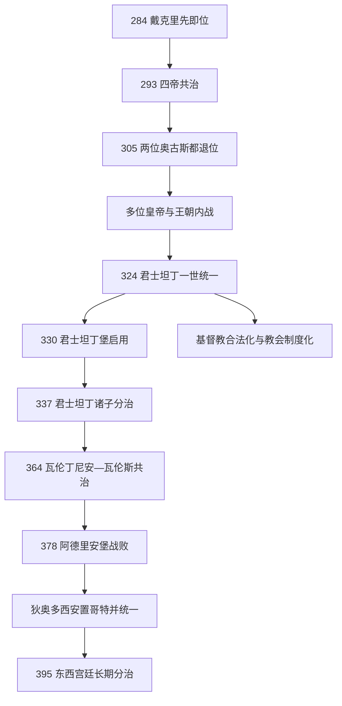

# 罗马帝国晚期

## 时间

284年—395年。以戴克里先即位为起点，以狄奥多西一世去世、阿卡狄乌斯与霍诺里乌斯分别继承东、西宫廷为终点。晚期帝国并非简单由“元首制”在某日改名“君主制”，而是三世纪改革、四帝共治内战、君士坦丁重组和四世纪宗教—边疆危机累积形成的新秩序。

## 概括

戴克里先把皇帝人数、行政分区、税收评估和宫廷礼仪制度化，试图让多位皇帝同时负责不同前线。305年退位后，制度指定继承与君士坦丁、马克森提乌斯等人的血缘和军队拥立冲突，引发近二十年内战。君士坦丁一世在324年重新统一，建立君士坦丁堡、稳定金币并支持基督教会。其子分治和内战后，瓦伦丁尼安一世再次采用东西共治。

376年跨越多瑙的哥特难民遭官员剥削并反叛，378年阿德里安堡战役中瓦伦斯阵亡。狄奥多西一世以条约安置部分哥特军团，依靠多民族军队击败西部竞争者，并把尼西亚基督教确立为帝国正统。395年后东西宫廷仍属于同一罗马法统，却拥有各自官僚、军队和财政，长期分离由此固定。

完整皇帝、共治者与竞争者逐人见[罗马帝国皇帝世系表](/%E4%BA%BA%E6%96%87%E7%A7%91%E5%AD%A6/%E5%8E%86%E5%8F%B2/%E6%AC%A7%E6%B4%B2/_%E9%80%9A%E5%8F%B2/%E5%8F%A4%E7%BD%97%E9%A9%AC/%E7%BD%97%E9%A9%AC%E5%B8%9D%E5%9B%BD%E7%9A%87%E5%B8%9D%E4%B8%96%E7%B3%BB%E8%A1%A8.md)。

## 演进图

## 戴克里先改革与四帝共治

### 皇帝覆盖问题

戴克里先先提升马克西米安为共治奥古斯都，293年再任命君士坦提乌斯和伽列里乌斯为凯撒。每位统治者拥有宫廷、军队和责任区，却以戴克里先为资深中心；他们不是四个独立国家元首。共治使皇帝能同时应对高卢叛乱、莱茵、多瑙、波斯和埃及，但“凯撒升奥古斯都”与皇帝亲子期待之间没有真正消除矛盾。

| 统治者 | 初始地位与区域 | 主要任务 | 继承问题 |
|---|---|---|---|
| 戴克里先 | 东方奥古斯都 | 波斯、巴尔干、埃及与全局协调 | 305年按制度退位，未让亲族直接继承 |
| 马克西米安 | 西方奥古斯都 | 意大利、非洲及高卢早期危机 | 退位后多次复出支持或反对儿子马克森提乌斯 |
| 伽列里乌斯 | 东方凯撒，305年升奥古斯都 | 多瑙与萨珊战争 | 试图控制305年继承名单，却不能压服君士坦丁与马克森提乌斯 |
| 君士坦提乌斯一世 | 西方凯撒，305年升奥古斯都 | 高卢、不列颠与篡位政权 | 306年死后军队拥立儿子君士坦丁，血缘打破制度安排 |

### 行政、税制与军队

帝国把行省拆小，若干行省组成管区，上设近卫大区的成熟形式主要在君士坦丁时期形成。缩小总督辖区降低地方官一次掌握过多军队和税源的风险，也增加官僚层级。税制以土地和人口 / 劳动力单位周期评估，按地区征收货币或实物，为军队提供粮秣；具体单位和执行随地区变化。

边疆驻军与机动野战军的分化在本期逐步发展，不是戴克里先一次完整创建“边防军、野战军”两套。皇帝随行部队和区域机动军增强，以应对突破边界的敌军和内战。

### 货币与价格法令

戴克里先发行新币并在301年颁布最高价格敕令，试图限制通胀和军需价格。法令列出大量商品、工资和最高价，执行范围与持续时间有限，不能视为成功的全国计划经济。君士坦丁后来发行高纯度金币苏勒德斯，为政府、军队和长途贸易提供稳定高值货币；铜币与地方交易仍经历变化。

### 大迫害

303年起，四帝政府下令摧毁教堂、交出经书、剥夺基督徒法律地位，后扩大到要求献祭。执行强度在各统治区不同，西方君士坦提乌斯较温和，伽列里乌斯等地更严。311年伽列里乌斯临终发布宽容敕令，迫害失败也显示基督教已深入城市、军队和官僚社会。

## 君士坦丁内战与新秩序

305年后同时存在塞维鲁二世、伽列里乌斯、戴亚、君士坦丁、马克森提乌斯、马克西米安和李锡尼等权力中心。308年卡农图姆会议试图重新排序仍失败。312年君士坦丁在米尔维安桥击败马克森提乌斯；313年他与李锡尼共同确认宗教宽容与返还教会财产。两人关系破裂，324年君士坦丁在阿德里安堡和克里索波利斯获胜，成为唯一皇帝。

### 君士坦丁堡

原拜占庭城在战略上连接巴尔干、黑海和小亚细亚，靠近多瑙与东方前线。330年新都启用后，设元老院、宫殿、赛马场、教堂、粮食供应和行政机构。罗马城仍保留宗教、元老贵族和象征中心地位；“迁都”是多中心帝国增加新首都，而非旧罗马一日被废。

### 基督教与皇权

君士坦丁资助教会、授予司法和财产特权，召集325年尼西亚会议解决阿里乌争议。他临终才受洗，仍保留传统最高祭司等帝国遗产。皇帝并未简单成为教会内部神职领袖，而是以维护公共宗教统一者身份参与教义与主教任免争端。异教祭祀、哲学学派和地方神庙继续存在，变化跨越数代。

### 王朝继承

君士坦丁让多名儿子、侄子先任凯撒，死后军队清洗王族旁支，君士坦丁二世、君士坦斯和君士坦提乌斯二世分区统治。340年长兄战死，350年君士坦斯被马格嫩提乌斯推翻；353年君士坦提乌斯二世击败竞争者后统一。其堂弟尤利安在高卢获军队拥立，前帝病死避免内战。尤利安恢复传统祭祀并限制基督徒优势，363年波斯远征阵亡，政策随即逆转。

## 瓦伦丁尼安共治与哥特危机

364年瓦伦丁尼安一世选择弟弟瓦伦斯主治东方，自己负责西部。两人拥有各自宫廷，却颁法仍常以共同皇帝名义。西部强化莱茵防御，东方处理哥特与萨珊亚美尼亚竞争。瓦伦丁尼安死后，格拉提安与幼弟瓦伦丁尼安二世共同继承西部。

375年前后匈人扩张扰动黑海北岸，部分哥特集团请求越过多瑙进入帝国。瓦伦斯允许接纳，计划将其作为农民和士兵安置；地方官员贪污、扣粮和贩卖人口引发武装反抗。378年阿德里安堡战役中，罗马军未等西部援军即交战，东帝瓦伦斯和大量军官阵亡。失败严重但没有“一战摧毁全部罗马军队”。

## 狄奥多西一世与395年分治

格拉提安任命狄奥多西为东方皇帝。因难以彻底击败哥特，382年达成安置安排，使部分集团在帝国内拥有土地 / 供给并承担军事义务。条约细节并未完整保存，不能把后世“联盟军”制度全部倒推到这一年。哥特军队既为帝国作战，也保持自身领导层，显示中央对兵源的依赖。

狄奥多西先后击败马格努斯·马克西穆斯和欧根尼乌斯，394年短暂成为全帝国唯一皇帝。380年塞萨洛尼基敕令支持尼西亚基督教，381年君士坦丁堡会议加强其正统地位；392年前后对公共传统祭祀的限制加深，但地方实践并未立即消失。

395年狄奥多西去世，阿卡狄乌斯和霍诺里乌斯分别主治东、西。两人都很年轻，东部由鲁菲努斯等官员、西部由斯提里科等军政强人掌权。两宫廷争夺伊利里库姆、军队和对哥特首领阿拉里克的政策。法律上帝国仍统一，实际财政与军令分开，后续不再出现可长期统治全境的单一皇帝。

## 晚期国家与社会

| 领域 | 变化 | 不能简单化之处 |
|---|---|---|
| 皇权 | 宫廷礼仪、神圣称号与接近控制增强 | 皇帝仍需军队、官僚、城市和教会支持，并非绝对专制 |
| 官僚 | 行省缩小、管区与近卫大区层级发展 | 区划多次调整，东、西和边区并不完全一致 |
| 军队 | 边境驻军、机动野战军与皇帝护卫体系分化 | 单位名称、待遇和战斗力随时期变化，“边防军皆低劣”不准确 |
| 税收 | 土地与人口评估、实物军需和金币支付结合 | 地区生态、城市特权与征收能力造成差异 |
| 社会等级 | 法律更明确区分“尊贵者”与“卑微者” | 身份并非不可流动，军队、教会和官僚提供上升路径 |
| 农村 | 佃农同土地和税务登记联系加强 | 不是所有佃农都等同中世纪农奴，法律状态和地区差异很大 |
| 宗教 | 基督教从合法宗教变为皇帝支持的正统 | 犹太教、传统祭祀和不同基督教派仍长期存在 |

## 重要事件

- 284/285年，戴克里先取得唯一最高地位，三世纪危机收束。
- 293年，四帝共治正式建立。
- 301年，最高价格敕令公布。
- 303年，大迫害开始。
- 305年，戴克里先与马克西米安退位，继承危机爆发。
- 312年，米尔维安桥战役，君士坦丁控制西部。
- 313年，宗教宽容与教产返还政策确立。
- 324年，君士坦丁击败李锡尼统一帝国。
- 325年，尼西亚会议。
- 330年，君士坦丁堡启用为帝国首都。
- 337年，君士坦丁死后诸子分治并发生王族清洗。
- 351年，穆尔萨大战，君士坦提乌斯二世与马格嫩提乌斯争夺西部。
- 363年，尤利安波斯远征中阵亡。
- 364年，瓦伦丁尼安一世与瓦伦斯分治。
- 376年，哥特集团获准渡过多瑙后反叛。
- 378年，阿德里安堡战役，瓦伦斯阵亡。
- 380—381年，尼西亚基督教获帝国正统支持。
- 382年，狄奥多西与部分哥特达成安置。
- 394年，冷河战役，狄奥多西击败欧根尼乌斯。
- 395年，狄奥多西死，东西宫廷长期分治。

## 鼎盛、压力与转型

| 类型 | 因素 | 说明 |
|---|---|---|
| 恢复机制 | 多皇帝覆盖、行政层级和稳定金币 | 提高边疆响应与国家征收能力 |
| 恢复机制 | 宫廷、教会和官僚的新精英联盟 | 为皇权提供超越旧罗马元老贵族的支持 |
| 结构风险 | 共治者各有军队和宫廷 | 继承不一致即转化为内战，四帝制首次交接失败 |
| 外部压力 | 萨珊、哥特、匈人引发的迁徙链 | 需要同时军事防御、接纳人口与外交安置 |
| 财政压力 | 官僚、野战军和多首都开支 | 税负与地方逃避相互推动，西部税源尤其脆弱 |
| 直接转折 | 378年东方野战军重创、395年幼帝分治 | 强人将领和区域宫廷掌握实际军令，统一恢复更困难 |

## 演变关系

- 前一节点：[三世纪危机](/%E4%BA%BA%E6%96%87%E7%A7%91%E5%AD%A6/%E5%8E%86%E5%8F%B2/%E6%AC%A7%E6%B4%B2/_%E9%80%9A%E5%8F%B2/%E5%8F%A4%E7%BD%97%E9%A9%AC/%E4%B8%89%E4%B8%96%E7%BA%AA%E5%8D%B1%E6%9C%BA.md)。
- 后续分化：[西罗马帝国](/%E4%BA%BA%E6%96%87%E7%A7%91%E5%AD%A6/%E5%8E%86%E5%8F%B2/%E6%AC%A7%E6%B4%B2/_%E9%80%9A%E5%8F%B2/%E5%8F%A4%E7%BD%97%E9%A9%AC/%E8%A5%BF%E7%BD%97%E9%A9%AC%E5%B8%9D%E5%9B%BD.md)与[东罗马帝国与拜占庭帝国](/%E4%BA%BA%E6%96%87%E7%A7%91%E5%AD%A6/%E5%8E%86%E5%8F%B2/%E6%AC%A7%E6%B4%B2/_%E9%80%9A%E5%8F%B2/%E5%8F%A4%E7%BD%97%E9%A9%AC/%E4%B8%9C%E7%BD%97%E9%A9%AC%E5%B8%9D%E5%9B%BD%E4%B8%8E%E6%8B%9C%E5%8D%A0%E5%BA%AD%E5%B8%9D%E5%9B%BD.md)。
- 完整世系：[罗马帝国皇帝世系表](/%E4%BA%BA%E6%96%87%E7%A7%91%E5%AD%A6/%E5%8E%86%E5%8F%B2/%E6%AC%A7%E6%B4%B2/_%E9%80%9A%E5%8F%B2/%E5%8F%A4%E7%BD%97%E9%A9%AC/%E7%BD%97%E9%A9%AC%E5%B8%9D%E5%9B%BD%E7%9A%87%E5%B8%9D%E4%B8%96%E7%B3%BB%E8%A1%A8.md)。
- 所属综合页：[罗马帝国](/%E4%BA%BA%E6%96%87%E7%A7%91%E5%AD%A6/%E5%8E%86%E5%8F%B2/%E6%AC%A7%E6%B4%B2/_%E9%80%9A%E5%8F%B2/%E5%8F%A4%E7%BD%97%E9%A9%AC/%E7%BD%97%E9%A9%AC%E5%B8%9D%E5%9B%BD.md)。
- 所属总览：[古罗马](/%E4%BA%BA%E6%96%87%E7%A7%91%E5%AD%A6/%E5%8E%86%E5%8F%B2/%E6%AC%A7%E6%B4%B2/_%E9%80%9A%E5%8F%B2/%E5%8F%A4%E7%BD%97%E9%A9%AC/README.md)。
