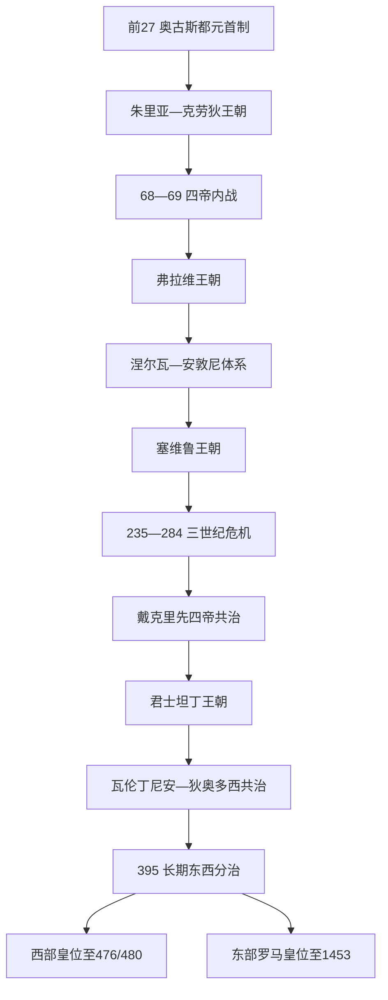

# 罗马帝国皇帝世系表

## 范围与编排原则

本表从前27年奥古斯都建立元首制列至395年帝国长期东西分治，并续列西部皇位至476年被废及480年朱利乌斯·尼波斯死亡。395年以后的东部皇位另见[东罗马帝国皇帝世系表](/%E4%BA%BA%E6%96%87%E7%A7%91%E5%AD%A6/%E5%8E%86%E5%8F%B2/%E6%AC%A7%E6%B4%B2/_%E9%80%9A%E5%8F%B2/%E5%8F%A4%E7%BD%97%E9%A9%AC/%E4%B8%9C%E7%BD%97%E9%A9%AC%E5%B8%9D%E5%9B%BD%E7%9A%87%E5%B8%9D%E4%B8%96%E7%B3%BB%E8%A1%A8.md)。

罗马没有一部始终有效的皇位继承法。血缘、收养、婚姻、前帝指定、元老院承认、军队拥立、首都控制和内战胜利都可能构成合法性。表中将正式共治者、在大片领土获得军队与行政承认的竞争皇帝分别列出；仅见于敌对史家的传闻人物不当作确定在位者。三世纪所有有实证的地方称帝者及争议人物集中见[三世纪危机](/%E4%BA%BA%E6%96%87%E7%A7%91%E5%AD%A6/%E5%8E%86%E5%8F%B2/%E6%AC%A7%E6%B4%B2/_%E9%80%9A%E5%8F%B2/%E5%8F%A4%E7%BD%97%E9%A9%AC/%E4%B8%89%E4%B8%96%E7%BA%AA%E5%8D%B1%E6%9C%BA.md)。

## 世系与分治图

## 元首制前期：前27年—235年

| 顺序 | 皇帝 | 在位时间 | 王室 / 与前任关系 | 共治、复位与关键事件 |
|---:|---|---|---|---|
| 1 | **奥古斯都** | 前27—14 | 凯撒养子与遗嘱继承人，朱里亚—克劳狄体系开创者 | 汇集统帅权、保民官权和行省控制，保留共和国官职外观 |
| 2 | 提比略 | 14—37 | 奥古斯都继子兼养子 | 久经军旅；晚年离开罗马，近卫长官塞扬一度扩大实际权力 |
| 3 | 盖乌斯“卡利古拉” | 37—41 | 日耳曼尼库斯之子、提比略养孙 | 近卫军刺杀；无成熟继承安排 |
| 4 | 克劳狄乌斯 | 41—54 | 卡利古拉叔父，由近卫军拥立 | 征服不列颠，扩大皇帝自由民官僚；收养尼禄 |
| 5 | 尼禄 | 54—68 | 克劳狄乌斯继子兼养子 | 行省军队反叛后自杀，王朝结束 |
| 6 | 加尔巴 | 68—69 | 西班牙总督，获元老院承认 | 拒绝军队赏赐并选定皮索继承，遭近卫军杀害 |
| 7 | 奥托 | 69 | 加尔巴旧盟友，由近卫军拥立 | 贝德里亚库姆战败后自杀 |
| 8 | 维特里乌斯 | 69 | 莱茵军团拥立 | 控制罗马后败于东方军团，遭杀 |
| 9 | **韦斯巴芗** | 69—79 | 犹太战争统帅，弗拉维王朝建立者 | 由东方和多瑙军团拥立，平定内战并整顿财政 |
| 10 | 提图斯 | 79—81 | 韦斯巴芗长子，生前共享军政权 | 继承顺利；在位经历维苏威喷发与罗马火灾 |
| 11 | 图密善 | 81—96 | 韦斯巴芗次子、提图斯之弟 | 强化宫廷君主权威；遇刺后元老院抹除名誉 |
| 12 | 涅尔瓦 | 96—98 | 元老院推举的资深贵族 | 面对近卫军压力收养图拉真，建立收养继承链 |
| 13 | **图拉真** | 98—117 | 涅尔瓦养子 | 达契亚战争与东方远征使帝国疆域达到最大 |
| 14 | 哈德良 | 117—138 | 图拉真亲族与养子，收养手续细节有争议 | 放弃部分东方新领，强化边疆和巡行治理 |
| 15 | 安敦尼·庇护 | 138—161 | 哈德良养子 | 依哈德良安排同时收养马可·奥勒留与卢基乌斯·维鲁斯 |
| 16 | **马可·奥勒留** | 161—180 | 安敦尼养子 | 161年起与卢基乌斯共治；后对多瑙边境长期作战 |
| 17 | 卢基乌斯·维鲁斯 | 161—169 | 安敦尼养子，马可养弟兼女婿 | 正式同等奥古斯都，共同处理安息战争；病死 |
| 18 | 康茂德 | 177—192；180前为共治 | 马可·奥勒留亲子 | 血缘继承恢复；宫廷政变中被杀 |
| 19 | 佩蒂纳克斯 | 193 | 城市长官，元老院和近卫军拥立 | 改革军纪触怒近卫军，在位86天被杀 |
| 20 | 迪迪乌斯·尤利安努斯 | 193 | 以巨额赏赐获近卫军拥立 | 被元老院宣布为公敌并处死 |
| 21 | **塞普蒂米乌斯·塞维鲁** | 193—211 | 潘诺尼亚军团拥立，塞维鲁王朝建立者 | 击败尼格尔和阿尔比努斯；军队薪饷与皇权军事化上升 |
| 22 | 佩斯切尼乌斯·尼格尔 | 193—194 | 叙利亚军团拥立的东方竞争皇帝 | 控制东方多省，败于塞维鲁后被杀 |
| 23 | 克洛狄乌斯·阿尔比努斯 | 193—197 | 不列颠军团支持；先被塞维鲁承认为凯撒，后称奥古斯都 | 卢格杜努姆战败自杀，西部竞争结束 |
| 24 | 卡拉卡拉 | 198—217；211前与父共治 | 塞维鲁长子 | 211年与盖塔共治后杀弟；212年敕令普授帝国自由民公民权 |
| 25 | 盖塔 | 209—211；211与兄共治 | 塞维鲁次子 | 被卡拉卡拉在母亲面前杀害，并遭记忆抹除 |
| 26 | 马克里努斯 | 217—218 | 近卫长官，涉嫌策划杀卡拉卡拉 | 首位出身骑士阶层的皇帝；败于塞维鲁王室女性集团 |
| 27 | 迪亚杜米尼安 | 218 | 马克里努斯之子，先凯撒后共治奥古斯都 | 随父败亡，未形成独立统治 |
| 28 | 埃拉伽巴路斯 | 218—222 | 卡拉卡拉表亲，军队在王室女性策划下拥立 | 宗教与宫廷冲突后被近卫军杀害 |
| 29 | 亚历山大·塞维鲁 | 222—235 | 埃拉伽巴路斯表弟兼养子 | 由母亲尤利娅·玛麦亚等主导宫廷；莱茵军队兵变中被杀 |

## 三世纪危机中央皇位：235年—284年

本节只列获得罗马中央或相当广泛承认的皇帝；高卢帝国、帕尔米拉王权和各地称帝者在[三世纪危机](/%E4%BA%BA%E6%96%87%E7%A7%91%E5%AD%A6/%E5%8E%86%E5%8F%B2/%E6%AC%A7%E6%B4%B2/_%E9%80%9A%E5%8F%B2/%E5%8F%A4%E7%BD%97%E9%A9%AC/%E4%B8%89%E4%B8%96%E7%BA%AA%E5%8D%B1%E6%9C%BA.md)中逐人列全。

| 顺序 | 皇帝 | 在位时间 | 权力基础 / 与前任关系 | 共治、争位与关键事件 |
|---:|---|---|---|---|
| 30 | 马克西米努斯·色雷克斯 | 235—238 | 莱茵军队拥立，非塞维鲁王族 | 未入罗马，因严苛征发引发非洲与元老院反抗 |
| 31 | 戈尔迪安一世 | 238 | 非洲行省反抗者，由元老院承认 | 与子共治约三周；子战死后自杀 |
| 32 | 戈尔迪安二世 | 238 | 戈尔迪安一世之子与共治者 | 在迦太基附近战败身亡 |
| 33 | 普皮恩努斯 | 238 | 元老院推举的共治奥古斯都 | 负责军事，后与巴尔比努斯一同被近卫军杀害 |
| 34 | 巴尔比努斯 | 238 | 元老院推举的共治奥古斯都 | 留守罗马；与普皮恩努斯互疑，被近卫军杀害 |
| 35 | 戈尔迪安三世 | 238—244 | 戈尔迪安一世外孙，先为凯撒后独掌 | 幼年皇帝，东方战争中死因有争议 |
| 36 | 阿拉伯人腓力 | 244—249 | 近卫长官，取代戈尔迪安三世 | 举行罗马建城千年庆典；败于德基乌斯 |
| 37 | 腓力二世 | 247—249 | 阿拉伯人腓力之子，共治奥古斯都 | 父败后在罗马被杀 |
| 38 | 德基乌斯 | 249—251 | 多瑙军队拥立，击败腓力 | 强制祭祀政策；阿布里图斯对哥特作战阵亡 |
| 39 | 赫伦尼乌斯·厄特鲁斯库斯 | 251 | 德基乌斯长子，共治奥古斯都 | 与父同在阿布里图斯战死 |
| 40 | 霍斯蒂利安 | 251 | 德基乌斯次子，获加卢斯承认为共治者 | 疫病中死亡，是否自然死亡有争议 |
| 41 | 特雷博尼亚努斯·加卢斯 | 251—253 | 多瑙军队拥立 | 与霍斯蒂利安、后与子沃鲁西安共治；被本军杀害 |
| 42 | 沃鲁西安 | 251—253 | 加卢斯之子，共治奥古斯都 | 与父同时被杀 |
| 43 | 埃米利安 | 253 | 多瑙军击败哥特后拥立 | 控制意大利数月，面对瓦勒良军队时被部下杀害 |
| 44 | 瓦勒良 | 253—260 | 莱茵军团与元老院承认 | 与子加里恩努斯分管东西；260年被萨珊俘虏 |
| 45 | 加里恩努斯 | 253—268；260后独掌中央 | 瓦勒良之子 | 面对东西割据，改革骑兵和高级军职；围攻奥勒奥鲁斯时遇刺 |
| 46 | 萨洛尼努斯 | 260 | 加里恩努斯之子，科隆被拥为奥古斯都 | 被波斯图穆斯围攻后杀害，在位数周 |
| 47 | 克劳狄二世“哥特征服者” | 268—270 | 伊利里亚军官集团拥立 | 击败哥特军，死于瘟疫 |
| 48 | 昆提卢斯 | 270 | 克劳狄二世之弟，获元老院和部分军队承认 | 与奥勒良竞争数周后死，死因有自杀与被杀两说 |
| 49 | **奥勒良** | 270—275 | 多瑙军队拥立 | 消灭帕尔米拉与高卢帝国，获“世界复兴者”称号；被军官误杀 |
| 50 | 塔西佗 | 275—276 | 军队与元老院承认 | 小亚细亚作战后死亡，死因有争议 |
| 51 | 弗洛里安 | 276 | 塔西佗异母弟，西部军队拥立 | 与普罗布斯竞争约两月，被部下杀害 |
| 52 | 普罗布斯 | 276—282 | 东方军队拥立 | 稳定边境并安置俘虏，因军纪与劳役问题被兵变杀害 |
| 53 | 卡鲁斯 | 282—283 | 近卫长官，多瑙军队拥立 | 立两子为凯撒；远征波斯途中猝死 |
| 54 | 努梅里安 | 283—284 | 卡鲁斯幼子，东方共治者 | 撤军途中死于车驾，阿佩尔被指谋杀 |
| 55 | 卡里努斯 | 283—285 | 卡鲁斯长子，西方共治者 | 先击败萨比努斯·尤利安努斯，后同戴克里先决战时死亡 |

## 四帝共治与君士坦丁王朝：284年—364年

四帝制把“共治”制度化：两位奥古斯都各配一位凯撒，但305年首次退位后，血缘、军队与制度指定相冲突，立即引发多方内战。下表逐人列出正式共治者和控制重要地区的竞争者。

| 顺序 | 皇帝 | 在位 / 称帝时间 | 身份与管辖 | 共治、复位与关键事件 |
|---:|---|---|---|---|
| 56 | **戴克里先** | 284—305 | 东方奥古斯都，四帝制创设者 | 285年提升马克西米安；293年增设两位凯撒；305年主动退位 |
| 57 | 马克西米安 | 286—305；306—308复位；310再争位 | 西方奥古斯都 | 两次退位后再夺权，最终被女婿君士坦丁迫死 |
| 58 | 君士坦提乌斯一世 | 293—305为凯撒；305—306为西方奥古斯都 | 马克西米安属下，君士坦丁一世之父 | 在不列颠约克去世，军队拥立其子 |
| 59 | 伽列里乌斯 | 293—305为凯撒；305—311为东方奥古斯都 | 戴克里先属下 | 主导305年继承安排；临终停止大规模迫害基督徒 |
| 60 | 塞维鲁二世 | 305—306为凯撒；306—307为西方奥古斯都 | 伽列里乌斯旧将 | 讨伐马克森提乌斯时军队倒戈，被俘后死亡 |
| 61 | 马克西米努斯·戴亚 | 305—310为凯撒；310—313为奥古斯都 | 伽列里乌斯外甥，控制东方部分 | 败于李锡尼后死亡 |
| 62 | **君士坦丁一世** | 306—337；324后独掌 | 君士坦提乌斯之子，由不列颠军队拥立 | 312年击败马克森提乌斯，324年击败李锡尼；支持基督教并建君士坦丁堡 |
| 63 | 马克森提乌斯 | 306—312 | 马克西米安之子，控制意大利与北非 | 未获四帝会议承认但在罗马实际称帝；米尔维安桥战败 |
| 64 | 李锡尼 | 308—324 | 卡农图姆会议任命的奥古斯都，后控制东方 | 313年击败戴亚；与君士坦丁两度内战后被废杀 |
| 65 | 瓦莱里乌斯·瓦伦斯 | 316—317 | 李锡尼任命的共治奥古斯都 | 和议后被处死，在位极短 |
| 66 | 马提尼安 | 324 | 李锡尼任命的共治奥古斯都 | 克里索波利斯战败后被杀 |
| 67 | 君士坦丁二世 | 337—340；317起为凯撒 | 君士坦丁一世长子，控制高卢、不列颠、西班牙 | 入侵弟弟君士坦斯领地时战死 |
| 68 | 君士坦斯 | 337—350；333起为凯撒 | 君士坦丁一世幼子，后控制大部分西部 | 被马格嫩提乌斯兵变推翻并杀害 |
| 69 | 君士坦提乌斯二世 | 337—361；324起为凯撒 | 君士坦丁一世之子，先管东方，353后独掌 | 击败马格嫩提乌斯；与堂弟尤利安关系破裂 |
| 70 | 韦特拉尼奥 | 350 | 多瑙军队拥立，获君士坦娜支持 | 与君士坦提乌斯二世会面后和平退位，承认性质介于共治与竞争 |
| 71 | 马格嫩提乌斯 | 350—353 | 西部军队拥立的竞争皇帝 | 穆尔萨大战后失势，自杀 |
| 72 | 尼波提安 | 350 | 君士坦丁王族，在罗马反马格嫩提乌斯 | 约28天后败亡 |
| 73 | **尤利安** | 360—363；355起为凯撒 | 君士坦提乌斯二世堂弟，高卢军队拥为奥古斯都 | 前帝病死避免内战；恢复传统祭祀，波斯远征中阵亡 |
| 74 | 约维安 | 363—364 | 近卫军官，远征军拥立 | 同萨珊议和撤军，恢复基督教优位；途中猝死 |

## 瓦伦丁尼安与狄奥多西共治：364年—395年

| 顺序 | 皇帝 | 在位时间 | 身份与管辖 | 共治、争位与关键事件 |
|---:|---|---|---|---|
| 75 | **瓦伦丁尼安一世** | 364—375 | 军队推举，主治西部 | 立弟瓦伦斯为东方奥古斯都；强化莱茵与多瑙防务 |
| 76 | 瓦伦斯 | 364—378 | 瓦伦丁尼安一世之弟，主治东方 | 378年阿德里安堡战败阵亡 |
| 77 | 格拉提安 | 367—383 | 瓦伦丁尼安一世之子，幼年共治，375后主治西部 | 任命狄奥多西统治东方；被马格努斯·马克西穆斯击败 |
| 78 | 瓦伦丁尼安二世 | 375—392 | 瓦伦丁尼安一世幼子，控制意大利等地 | 长期受母后、将领阿波加斯特等影响；死亡可能自杀亦可能被杀 |
| 79 | **狄奥多西一世** | 379—395；394后短暂独掌全帝国 | 格拉提安任命的东方奥古斯都 | 处理哥特安置，确立尼西亚基督教，击败两次西部竞争政权 |
| 80 | 马格努斯·马克西穆斯 | 383—388 | 不列颠军队拥立，控制高卢、西班牙并一度获承认 | 入侵意大利后被狄奥多西击败处死 |
| 81 | 弗拉维乌斯·维克托 | 384/387—388 | 马格努斯·马克西穆斯之子，共治奥古斯都 | 父败后被处死 |
| 82 | 欧根尼乌斯 | 392—394 | 阿波加斯特扶植的西部皇帝 | 冷河战役败于狄奥多西，遭处死 |
| 83 | 阿卡狄乌斯 | 383—408；395后主治东部 | 狄奥多西长子，幼年共治 | 395年后成为东部皇帝，详见东罗马专表 |
| 84 | 霍诺里乌斯 | 393—423；395后主治西部 | 狄奥多西次子，幼年共治 | 395年后成为西部皇帝，宫廷长期受将领与官僚主导 |

## 西部皇位与主要竞争者：395年—480年

“西罗马灭亡于476年”指意大利的西部皇帝职位被取消。东部宫廷承认的朱利乌斯·尼波斯在达尔马提亚保留皇号至480年，因此政治法统与意大利实际控制有两个终点。

| 顺序 | 皇帝 / 竞争者 | 在位或称帝时间 | 法律承认与实际控制 | 关键事件 / 备注 |
|---:|---|---|---|---|
| 1 | 霍诺里乌斯 | 395—423 | 狄奥多西王朝合法西帝；宫廷在米兰、后迁拉文纳 | 斯提里科、君士坦提乌斯等将领实际掌军；410年罗马被洗劫 |
| — | 君士坦丁三世 | 407—411 | 不列颠军队拥立，控制高卢并一度获霍诺里乌斯有限承认 | 抽走不列颠野战军；败于君士坦提乌斯后被处死 |
| — | 君士坦斯二世 | 409—411 | 君士坦丁三世之子，先凯撒后奥古斯都 | 在西班牙、高卢行动，败于格隆提乌斯部将 |
| — | 普里斯库斯·阿塔卢斯 | 409—410；414—415 | 西哥特王阿拉里克及后继者两度扶植 | 在罗马称帝，受西哥特军力制约；最终被霍诺里乌斯羞辱性处置 |
| — | 马克西穆斯 | 409—411；约420—422再现 | 将领格隆提乌斯在西班牙拥立 | 统治范围有限，第二次被俘处死 |
| — | 约维努斯 | 411—413 | 莱茵地区贵族与勃艮第、阿兰力量支持 | 西哥特转而支持霍诺里乌斯，约维努斯被杀 |
| — | 塞巴斯蒂安努斯 | 412—413 | 约维努斯之弟兼共治者 | 同兄败亡 |
| — | 赫拉克利安 | 413 | 非洲军政长官，控制粮源后称帝 | 进攻意大利失败，在迦太基被杀 |
| 2 | 君士坦提乌斯三世 | 421 | 霍诺里乌斯妹夫与首席将领，获西部共治 | 东帝对其承认迟疑；在位约七个月病死 |
| — | 约翰尼斯 | 423—425 | 霍诺里乌斯死后由拉文纳官僚与军队拥立 | 未获东部承认；败于东军并被处死 |
| 3 | 瓦伦丁尼安三世 | 425—455 | 狄奥多西王朝，东帝支持；幼年由母后加拉·普拉西狄娅摄政 | 埃提乌斯长期掌军；皇帝杀埃提乌斯后旋遭报复刺杀 |
| 4 | 佩特罗尼乌斯·马克西穆斯 | 455 | 元老贵族，在瓦伦丁尼安遇刺后夺位 | 汪达尔舰队逼近时逃亡，被民众或士兵杀死 |
| 5 | 阿维图斯 | 455—456 | 高卢贵族与西哥特支持，获元老院承认有限 | 被里西默和马约里安击败，退位后死亡 |
| 6 | **马约里安** | 457—461 | 将领里西默拥立，后获东部承认 | 整顿税制军队，舰队被毁后遭里西默废杀 |
| 7 | 利比乌斯·塞维鲁 | 461—465 | 里西默拥立 | 东部不承认；实际权力受里西默控制 |
| 8 | 安特米乌斯 | 467—472 | 东帝利奥一世任命，娶狄奥多西王室公主 | 联合远征汪达尔失败；同里西默内战，被杀 |
| 9 | 奥利布里乌斯 | 472 | 与狄奥多西王室通婚，里西默拥立 | 在安特米乌斯围城期间称帝；在位数月病死 |
| 10 | 格利凯里乌斯 | 473—474 | 勃艮第将领贡多巴德拥立 | 未获东部承认；面对尼波斯退位，后任主教 |
| 11 | **朱利乌斯·尼波斯** | 474—475在意大利；475—480在达尔马提亚 | 东帝芝诺承认的合法西帝 | 被奥瑞斯特斯逐出拉文纳后仍保皇号；480年遇刺 |
| 12 | **罗慕路斯·奥古斯都** | 475—476 | 奥瑞斯特斯幼子，控制意大利；东部不承认 | 奥多亚克击败奥瑞斯特斯后将其废黜，未另立西帝 |

## 继承模式与实际权力辨析

| 模式 | 例子 | 政治含义 |
|---|---|---|
| 收养与指定 | 涅尔瓦—图拉真—哈德良—安敦尼 | 不是抽象“择贤制”，收养往往结合亲缘、军队声望和宫廷妥协 |
| 生前共治 | 马可与维鲁斯、塞维鲁诸子、四帝制 | 可训练继承并分担边防，也可能把兄弟竞争合法化 |
| 军队拥立 | 69年、193年、三世纪军人皇帝 | 不同边区军团可同时拥立皇帝，必须以战争决定承认范围 |
| 元老院承认 | 加尔巴、戈尔迪安诸帝、塔西佗 | 仍有法律与象征意义，但不能替代军队和财政 |
| 宫廷与近卫政变 | 卡利古拉、康茂德、佩蒂纳克斯等 | 首都控制可瞬间更换皇帝，却常引发外省军团反击 |
| 地域共治 | 四帝制、瓦伦丁尼安兄弟、狄奥多西诸子 | 不是395年才第一次“分裂”；关键在于395年后东、西宫廷不再恢复稳定单一中心 |
| 强人摄政 / 军政控制 | 斯提里科、埃提乌斯、里西默、奥瑞斯特斯 | 西部末期皇帝名义仍重要，但兵源、财政和对外条约常掌握在将领手中 |

## 连续性结论

- 凯撒在前44年任终身独裁官，但没有以罗马皇帝身份建立持续帝制；本表从奥古斯都前27年的宪制安排起算。
- 三世纪“僭位者”并非同一性质：高卢帝国拥有完整行政和数位继承皇帝，帕尔米拉先以保卫东方名义行事，短命地方称帝者则可能只控制一支军队。
- 395年是两个宫廷长期并行的标志，不是法律上创建两个互不相关的国家。东西皇帝仍宣称共属一个罗马帝国。
- 476年后奥多亚克把西部帝号标志送往君士坦丁堡并以意大利国王 / 军政首领执政；东部皇帝继续使用“罗马人的皇帝”法统至1453年。

## 相关笔记

- [罗马帝国](/%E4%BA%BA%E6%96%87%E7%A7%91%E5%AD%A6/%E5%8E%86%E5%8F%B2/%E6%AC%A7%E6%B4%B2/_%E9%80%9A%E5%8F%B2/%E5%8F%A4%E7%BD%97%E9%A9%AC/%E7%BD%97%E9%A9%AC%E5%B8%9D%E5%9B%BD.md)
- [罗马帝国元首制前期](/%E4%BA%BA%E6%96%87%E7%A7%91%E5%AD%A6/%E5%8E%86%E5%8F%B2/%E6%AC%A7%E6%B4%B2/_%E9%80%9A%E5%8F%B2/%E5%8F%A4%E7%BD%97%E9%A9%AC/%E7%BD%97%E9%A9%AC%E5%B8%9D%E5%9B%BD%E5%85%83%E9%A6%96%E5%88%B6%E5%89%8D%E6%9C%9F.md)
- [三世纪危机](/%E4%BA%BA%E6%96%87%E7%A7%91%E5%AD%A6/%E5%8E%86%E5%8F%B2/%E6%AC%A7%E6%B4%B2/_%E9%80%9A%E5%8F%B2/%E5%8F%A4%E7%BD%97%E9%A9%AC/%E4%B8%89%E4%B8%96%E7%BA%AA%E5%8D%B1%E6%9C%BA.md)
- [罗马帝国晚期](/%E4%BA%BA%E6%96%87%E7%A7%91%E5%AD%A6/%E5%8E%86%E5%8F%B2/%E6%AC%A7%E6%B4%B2/_%E9%80%9A%E5%8F%B2/%E5%8F%A4%E7%BD%97%E9%A9%AC/%E7%BD%97%E9%A9%AC%E5%B8%9D%E5%9B%BD%E6%99%9A%E6%9C%9F.md)
- [西罗马帝国](/%E4%BA%BA%E6%96%87%E7%A7%91%E5%AD%A6/%E5%8E%86%E5%8F%B2/%E6%AC%A7%E6%B4%B2/_%E9%80%9A%E5%8F%B2/%E5%8F%A4%E7%BD%97%E9%A9%AC/%E8%A5%BF%E7%BD%97%E9%A9%AC%E5%B8%9D%E5%9B%BD.md)
- [东罗马帝国皇帝世系表](/%E4%BA%BA%E6%96%87%E7%A7%91%E5%AD%A6/%E5%8E%86%E5%8F%B2/%E6%AC%A7%E6%B4%B2/_%E9%80%9A%E5%8F%B2/%E5%8F%A4%E7%BD%97%E9%A9%AC/%E4%B8%9C%E7%BD%97%E9%A9%AC%E5%B8%9D%E5%9B%BD%E7%9A%87%E5%B8%9D%E4%B8%96%E7%B3%BB%E8%A1%A8.md)
