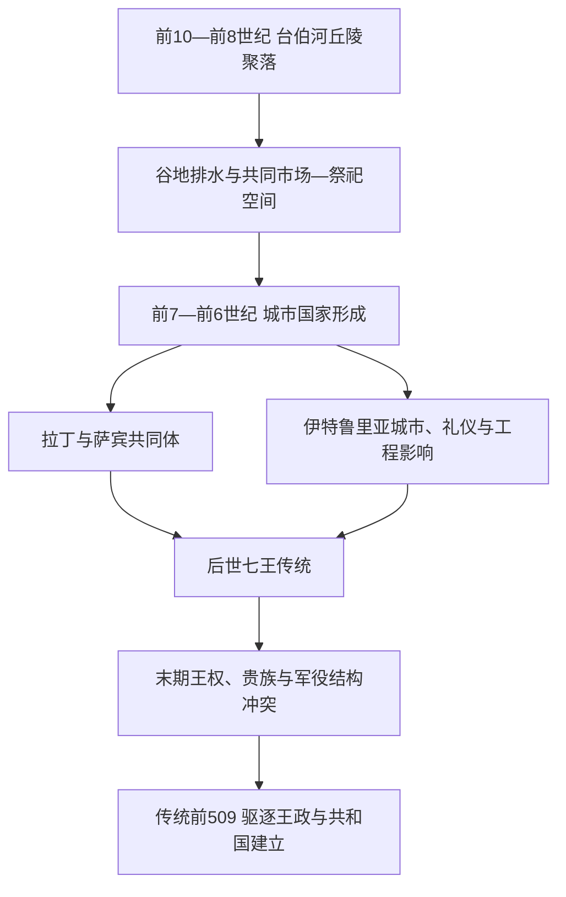

# 罗马王政时期

## 时间

传统纪年为前753年—前509年。考古材料显示台伯河诸丘聚落在前10—前8世纪逐渐整合，前7—前6世纪才形成具备大型公共建筑和区域影响力的城市国家；“建城日”和七王精确年表属于后世罗马的政治记忆，不能视为同时代档案。

## 概括

王政时期是拉丁、萨宾、伊特鲁里亚和希腊殖民世界交汇下的罗马城市化阶段。后世传统把约两个半世纪压缩为七位国王：前四王代表建城、宗教与对拉丁邻邦的征服，后三王突出伊特鲁里亚式城市工程、军事组织和强王权。国王不是简单世袭君主；传统叙事称元老院在王位空缺时安排“间王”，公民库里亚大会确认新王，国王兼掌军事、审判和祭祀。这个图景很可能掺入共和国时代对早期制度的重构。

## 演进图

## 史料与传说辨析

罗马王政没有连续的同时代叙事史。李维、哈利卡纳苏斯的狄奥尼修斯等作者写作时距王政结束已数百年，并利用家族传说、祭司记录、地名解释和共和国制度追溯。考古能验证聚落、墓葬、城墙、神庙和贸易变化，却不能证明罗穆卢斯某年颁布某项制度。

| 传统叙事 | 可较稳妥理解的历史层面 | 不确定性 |
|---|---|---|
| 前753年罗穆卢斯建城 | 前8世纪帕拉蒂尼等丘陵聚落趋向共同身份，城市纪念传统形成 | 精确日期由后世历法计算；罗穆卢斯历史性无法证实 |
| 萨宾妇女与两族合并 | 罗马确有拉丁、萨宾等多来源人口和婚姻网络 | 事件细节具有起源神话结构 |
| 伊特鲁里亚三王统治 | 前7—前6世纪罗马受到强烈伊特鲁里亚技术、艺术和政治影响 | “罗马被伊特鲁里亚征服多久”没有一致结论 |
| 塞尔维乌斯改革 | 财产、军役和城市领土组织在晚王政至早共和发生变化 | 百人队体系的成熟形态可能是共和国时期逐步形成 |
| 卢克蕾提娅受辱导致革命 | 末王被逐的道德化家族叙事 | 可能压缩了贵族竞争、地区战争和制度渐变 |

## 王位与传统七王完整表

| 顺序 | 国王 | 传统在位 | 出身 / 与前任关系 | 传统事迹与史实判断 |
|---:|---|---|---|---|
| 1 | 罗穆卢斯 | 前753—前716 | 建城英雄；雷穆斯之兄 | 建立元老院、库里亚和庇护所，联结萨宾人；属于起源神话，不能核实个人统治 |
| 2 | 努马·庞皮利乌斯 | 前715—前673 | 萨宾人，传统由元老院与人民选出 | 设祭司、宗教历法和和平秩序；可能把多项祭祀制度归于理想立法者 |
| 3 | 图卢斯·霍斯提利乌斯 | 前673—前642 | 罗马贵族，非努马之子 | 毁阿尔巴隆加、迁其精英入罗马；代表拉丁中心整合的战争记忆 |
| 4 | 安库斯·马尔基乌斯 | 前642—前617 | 传统称努马外孙 | 建奥斯提亚、桥梁和殖民点；港口早期年代与具体创办者仍有争议 |
| 5 | 卢基乌斯·塔克文·普里斯库斯“老塔克文” | 前616—前579 | 科林斯移民后裔与伊特鲁里亚城市塔尔奎尼亚背景 | 扩大元老院、发展赛会和排水工程；体现伊特鲁里亚精英进入罗马 |
| 6 | 塞尔维乌斯·图利乌斯 | 前578—前535 | 出身传说多种，老塔克文宫廷成员 / 女婿 | 财产等级、百人队和城墙改革归于其名；改革可能跨越数代完成 |
| 7 | 卢基乌斯·塔克文·苏佩布斯“傲慢者塔克文” | 前535—前509 | 老塔克文之子或孙、塞尔维乌斯女婿 | 以暴政和强迫劳役闻名；被驱逐后寻求伊特鲁里亚与拉丁盟友复位 |

传统中没有稳定父子长子继承。努马、图卢斯、安库斯与塔克文来自不同家系，国王的军事声望、贵族支持、宗教确认和公民认可共同构成王位。末三王的宫廷政变叙事也说明王权与贵族家族之间存在竞争。

## 统治结构

| 机构 / 群体 | 名义职能 | 可能的实际运作 |
|---|---|---|
| 国王 | 统军、主持重大审判、祭祀和外交 | 权力依赖亲随、贵族首领、战利品和战时动员，未必能任意征税 |
| 元老院 | 由家族长组成的咨询会议；王位空缺时安排间王 | 提供贵族认可和连续性，可能控制家族、土地及宗教资源 |
| 库里亚大会 | 按传统三部落、三十库里亚集合，确认王权与部分公共行为 | 共和国作者可能用本时代形式重构；仍反映武装共同体的认可 |
| 祭司团 | 维护历法、誓约、占卜和祭祀 | 政治决定需被解释为符合神意；王本人可能兼最高祭司角色 |
| 家族与门客 | 家父支配家庭，贵族吸纳门客 | 形成保护、债务和军事随从网络，是国家制度以外的权力基础 |
| 平民与依附人口 | 从事农业、手工业、贸易与军役 | “贵族—平民”界线可能在晚王政至早共和逐渐固定，不宜提前套用成熟共和分类 |

## 城市化、社会与经济

### 从聚落到城市

台伯河浅滩连接内陆盐道与第勒尼安海。帕拉蒂尼、卡庇托利和奎里纳尔等丘陵聚落通过葬俗、市场和祭祀逐步产生共同空间。论坛谷地的排水与铺设、卡庇托利山朱庇特神庙、城墙与公共集会场所显示劳役组织和政治中心增强。“大下水道”并非一次工程，而是排水系统长期扩建的结果。

### 多区域交流

伊特鲁里亚人带来或强化拱券技术、占卜、权杖、束棒、凯旋仪式和王权服饰等影响；南意大利希腊城市提供字母、陶器、神话图像和贸易网络。罗马文化由选择、改造这些元素形成，不是某一民族单方面“赐予文明”。

### 土地、战争与身份

农业和畜牧是基础，盐、陶器与金属贸易连接区域市场。战争既获取土地、牲畜和俘虏，也把被征服共同体部分人口迁入罗马。传统把元老家族称为“父辈”，但早期贵族身份如何形成仍有争议。奴隶制已经存在，其规模尚未达到共和国海外扩张后的程度。

## 建立、鼎盛与终结

| 类型 | 因素 | 作用 |
|---|---|---|
| 建立条件 | 台伯河渡口与盐道位置 | 连接海岸、拉丁平原、伊特鲁里亚和亚平宁内陆 |
| 建立条件 | 多丘聚落共同祭祀和防务 | 将分散家族与村落逐步整合为城市政治体 |
| 鼎盛条件 | 公共工程与军役组织 | 能动员劳力修庙、排水、筑防，并扩大对拉丁邻邦影响 |
| 鼎盛条件 | 吸收外来精英与制度 | 萨宾、伊特鲁里亚和希腊文化输入扩大罗马资源与声望 |
| 结构矛盾 | 王权、贵族与武装共同体关系未制度化 | 强王可能绕开贵族，王位空缺又给家族竞争机会 |
| 外部压力 | 拉丁、伊特鲁里亚城市间权力重组 | 前6世纪末区域政治动荡可能削弱塔克文集团 |
| 直接触发的传统解释 | 卢克蕾提娅事件与贵族起义 | 以道德叙事说明末王失去合法性；实际过程可能更长期 |
| 制度结果 | 执政官取代终身国王 | 军政最高权被年度、双人官职分割，宗教王职则由祭司保留 |

## 重要事件与节点

- 约前8世纪，台伯河诸丘聚落出现更强共同身份和市场联系。
- 前7—前6世纪，论坛排水、公共建筑和大型神庙显示城市国家形成。
- 传统的阿尔巴隆加毁灭叙事保存罗马整合拉丁共同体的记忆。
- 伊特鲁里亚文化影响在晚王政的建筑、礼仪和艺术中达到高峰。
- 塞尔维乌斯改革传统把人口普查、财产等级和军役重组联系起来。
- 卡庇托利三神庙约在王政末期或共和国初期奉献，象征城市共同体规模。
- 传统前509年塔克文被逐；新制度以两名年度执政官分割最高军权。
- 塔克文家族此后仍试图借拉丁和伊特鲁里亚盟友复位，说明政体转换并非一天完成。

## 演变关系

- 前一背景：意大利铁器时代的拉丁人、萨宾人、伊特鲁里亚城邦与希腊殖民网络。
- 后一节点：[罗马共和国早期](/%E4%BA%BA%E6%96%87%E7%A7%91%E5%AD%A6/%E5%8E%86%E5%8F%B2/%E6%AC%A7%E6%B4%B2/_%E9%80%9A%E5%8F%B2/%E5%8F%A4%E7%BD%97%E9%A9%AC/%E7%BD%97%E9%A9%AC%E5%85%B1%E5%92%8C%E5%9B%BD%E6%97%A9%E6%9C%9F.md)。
- 王政记忆在共和国中的制度延续见[罗马共和国危机期](/%E4%BA%BA%E6%96%87%E7%A7%91%E5%AD%A6/%E5%8E%86%E5%8F%B2/%E6%AC%A7%E6%B4%B2/_%E9%80%9A%E5%8F%B2/%E5%8F%A4%E7%BD%97%E9%A9%AC/%E7%BD%97%E9%A9%AC%E5%85%B1%E5%92%8C%E5%9B%BD%E5%8D%B1%E6%9C%BA%E6%9C%9F.md)对独裁与王权恐惧的说明。
- 所属总览：[古罗马](/%E4%BA%BA%E6%96%87%E7%A7%91%E5%AD%A6/%E5%8E%86%E5%8F%B2/%E6%AC%A7%E6%B4%B2/_%E9%80%9A%E5%8F%B2/%E5%8F%A4%E7%BD%97%E9%A9%AC/README.md)。
