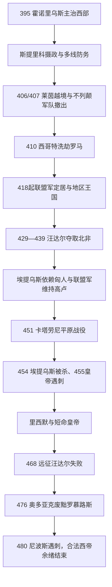

# 西罗马帝国

## 时间

395年—476年；若按东部宫廷承认的合法西帝朱利乌斯·尼波斯仍在达尔马提亚保有皇号，则法统余绪至480年。476年是奥多亚克废黜控制意大利的罗慕路斯·奥古斯都、停止另立西部皇帝的传统标志。

## 概括

西罗马不是在395年从统一帝国“分裂出来的新国家”，而是罗马帝国西部宫廷、军队、财政和行政体系长期独立运行的结果。五世纪西部仍有元老院、税制、法律、城市和皇帝称号，但不列颠税军体系撤离，高卢与西班牙出现竞争皇帝和联盟军王国，汪达尔夺取北非后切断最富裕税粮区。皇帝年幼或短命时，斯提里科、君士坦提乌斯、埃提乌斯、里西默和奥瑞斯特斯等将领掌握实际军权；他们既依赖哥特、匈人、勃艮第等军队，又无法把这些力量稳定纳入税收国家。

476年不是罗马社会瞬间消失。奥多亚克以意大利国王和东部皇帝名义下的军政领袖执政，保留大量罗马行政与元老院。变化是西部独立皇帝职位、跨地区税军协调和恢复失地的能力终结。

## 演进图

## 西部皇帝完整主线与实际权力

更完整的共治、争位和法律承认见[罗马帝国皇帝世系表](/%E4%BA%BA%E6%96%87%E7%A7%91%E5%AD%A6/%E5%8E%86%E5%8F%B2/%E6%AC%A7%E6%B4%B2/_%E9%80%9A%E5%8F%B2/%E5%8F%A4%E7%BD%97%E9%A9%AC/%E7%BD%97%E9%A9%AC%E5%B8%9D%E5%9B%BD%E7%9A%87%E5%B8%9D%E4%B8%96%E7%B3%BB%E8%A1%A8.md)。下表将每位正式西帝逐人列出，不把末期皇帝合并为“后期诸帝”。

| 顺序 | 皇帝 | 在位时间 | 法律来源与实际掌权者 | 关键事件 / 结局 |
|---:|---|---|---|---|
| 1 | 霍诺里乌斯 | 395—423 | 狄奥多西一世之子；早期由斯提里科掌军，后由宫廷官员和君士坦提乌斯等竞争 | 宫廷迁拉文纳；410年罗马被洗劫；不列颠和高卢多地失控 |
| 2 | 君士坦提乌斯三世 | 421 | 霍诺里乌斯妹夫与最高将领，共治西帝 | 收复部分高卢、西班牙并安置西哥特；在位七个月病死 |
| 3 | 约翰尼斯 | 423—425 | 霍诺里乌斯死后由拉文纳官僚与军队拥立，东部不承认 | 被东部远征军推翻处死，通常列竞争皇帝 |
| 4 | 瓦伦丁尼安三世 | 425—455 | 狄奥多西王朝，东部支持；幼年由母后加拉·普拉西狄娅摄政，后埃提乌斯掌军 | 北非失守；皇帝454年亲杀埃提乌斯，次年被其旧部刺杀 |
| 5 | 佩特罗尼乌斯·马克西穆斯 | 455 | 元老贵族夺位，可能参与前帝遇刺 | 汪达尔逼近时逃亡，被杀；在位约两个半月 |
| 6 | 阿维图斯 | 455—456 | 高卢贵族与西哥特支持 | 无法稳定意大利粮食和军饷，被里西默、马约里安击败 |
| 7 | **马约里安** | 457—461 | 里西默协助拥立，后获东帝承认 | 重整税制、军队和高卢；远征非洲舰队被毁，遭里西默废杀 |
| 8 | 利比乌斯·塞维鲁 | 461—465 | 里西默拥立，东部未承认 | 西部实际控制缩至意大利等地，军政由里西默主导 |
| 9 | 安特米乌斯 | 467—472 | 东帝利奥一世派遣并承认，与狄奥多西王室通婚 | 468年联合攻汪达尔失败；与里西默内战，罗马再遭战火并被杀 |
| 10 | 奥利布里乌斯 | 472 | 里西默在围攻安特米乌斯时拥立 | 与汪达尔王室有婚姻联系；在位数月病死 |
| 11 | 格利凯里乌斯 | 473—474 | 勃艮第将领贡多巴德拥立，东部不承认 | 东部支持尼波斯来攻后退位，改任主教 |
| 12 | **朱利乌斯·尼波斯** | 474—475在意大利；475—480在达尔马提亚 | 东部皇帝利奥、芝诺承认 | 被奥瑞斯特斯逐走后仍发行法律 / 钱币并保皇号；480年遇刺 |
| 13 | **罗慕路斯·奥古斯都** | 475—476 | 奥瑞斯特斯之子，控制意大利，东部不承认 | 奥多亚克杀奥瑞斯特斯并废黜少年皇帝；获准隐居 |

### 竞争皇帝与地区权力

- 君士坦丁三世、其子君士坦斯二世、马克西穆斯、约维努斯、塞巴斯蒂安努斯、普里斯库斯·阿塔卢斯和赫拉克利安均在407—415年前后称帝，逐人资料见皇帝专表。
- 西哥特王阿拉里克两次扶植阿塔卢斯，说明竞争皇帝仍是向罗马行政和城市索取合法性的工具，而非日耳曼集团简单否定帝国。
- 东部宫廷是否承认某位西帝，关系到外交、婚姻与法统，却不能自动提供其在意大利的军队。利比乌斯·塞维鲁和格利凯里乌斯实际在位但不获东部承认；尼波斯获承认却被逐离意大利。

## 军政强人与皇帝的关系

| 人物 | 实际权力期 | 法律身份与军事基础 | 与皇帝关系 / 结局 |
|---|---|---|---|
| 斯提里科 | 395—408 | 最高统帅，汪达尔出身、娶狄奥多西家族成员 | 以幼帝监护人自居，击退阿拉里克等；被宫廷政变处死，部下家属遭屠杀后大量投向阿拉里克 |
| 君士坦提乌斯 | 411—421 | 将领，后娶加拉·普拉西狄娅并升共治皇帝 | 平定多名竞争皇帝、与西哥特达成安置；短命未能建立稳定王朝 |
| 埃提乌斯 | 约433—454 | 最高统帅，早年在匈人处为人质，利用匈人与高卢联盟军 | 长期维持高卢均势；451年抗阿提拉，后被瓦伦丁尼安三世亲杀 |
| 里西默 | 456—472 | 日耳曼—苏维汇合血统的最高统帅，无意 / 无资格自称皇帝 | 先后拥立、废黜或对抗数位西帝；依赖意大利军队和联盟军 |
| 贡多巴德 | 472—474 | 里西默外甥、勃艮第王族与统帅 | 拥立格利凯里乌斯，后返回高卢争夺勃艮第王位 |
| 奥瑞斯特斯 | 475—476 | 曾服务阿提拉，后任尼波斯军官 | 驱逐尼波斯、立幼子罗慕路斯；拒绝向部队分配意大利土地后被奥多亚克杀死 |
| 奥多亚克 | 476—493 | 意大利多族军队首领，获“国王”地位 | 不再立西帝，名义承认芝诺；保留行政和元老院，后被东哥特狄奥多里克推翻 |

## 分阶段过程

### 斯提里科时代与410年洗劫

395年后，哥特首领阿拉里克利用东西宫廷争夺巴尔干军队和职位。斯提里科多次击退或与其谈判，同时还要应对非洲粮源、莱茵防务和宫廷派系。405/406年拉达盖苏斯入侵意大利被击败；406年末多支汪达尔、阿兰、苏维集团渡过结冰或水位较低的莱茵，进入高卢。407年不列颠军队拥立君士坦丁三世并渡海，高卢、西班牙发生连锁争位。

408年霍诺里乌斯宫廷处死斯提里科，罗马军城屠杀军中“蛮族”士兵家属，大量士兵加入阿拉里克。谈判因军职、金钱和粮食条件破裂；410年8月西哥特进入罗马三日劫掠。城市并非被彻底毁灭，但“永恒之城”八百年未遭外敌攻破的象征冲击巨大。

### 联盟军安置与西部区域化

君士坦提乌斯在高卢击败竞争皇帝，并于418年前后让西哥特在阿基坦获得补给 / 税收安排。具体是直接分地还是分享税收仍有争论。西哥特王国形式逐渐发展，但早期国王仍接受罗马头衔并为帝国作战。勃艮第、法兰克和阿兰集团也以不同条约进入高卢政治。

不列颠在407年后缺乏西部中央野战军和官员；410年霍诺里乌斯“致不列颠诸城书”是否专指意大利布鲁提乌姆有文本争议，不能把它简单写成正式“罗马宣布放弃英国”。考古和地方政治显示税军体系在五世纪初迅速解体，各地自行防卫。

### 汪达尔夺取非洲

汪达尔、阿兰集团从西班牙于429年渡海北非，盖萨里克利用罗马总督博尼法提乌斯与宫廷冲突推进。罗马最初条约承认其部分领地，但439年汪达尔突袭迦太基，夺取非洲最富庶税粮区和舰队基地。它建立能控制西地中海航线的王国，西罗马失去支付军队和供应意大利的关键收入。442年和约承认现实；此后恢复非洲成为西部战略核心。

### 埃提乌斯、匈人与451年

埃提乌斯借匈人援军压制高卢对手，又在阿提拉统一更大匈人联盟后转向对抗。451年阿提拉入侵高卢，埃提乌斯组织罗马、西哥特、阿兰等联军在卡塔劳尼平原阻止其继续推进；战役并非彻底消灭匈人。452年阿提拉进入意大利，疫病、补给和东方军队威胁共同促使其撤退，教宗利奥一世会面是外交的一部分而非唯一原因。

454年瓦伦丁尼安三世亲手杀埃提乌斯，可能希望收回军权；次年皇帝被埃提乌斯旧部刺杀。这个双重清洗摧毁最后能协调高卢联盟和意大利宫廷的军政网络。

### 455—476年终局

455年汪达尔洗劫罗马两周，带走财富与俘虏。里西默不自称皇帝，却凭意大利军队决定皇位。马约里安试图恢复高卢、西班牙和非洲，舰队在西班牙港口被汪达尔突袭焚毁后遭废杀。468年东西帝国投入巨资联合进攻迦太基，舰队在邦角附近被盖萨里克火船击败；东部尚能恢复财政，西部再无能力发动同等远征。

里西默死后皇位更替加快。475年奥瑞斯特斯驱逐尼波斯并立儿子罗慕路斯。他的军队要求像其他联盟军一样获得意大利三分之一土地，奥瑞斯特斯拒绝；奥多亚克被拥为领袖，击败并杀死奥瑞斯特斯。476年罗慕路斯退位，奥多亚克把帝权标志送往君士坦丁堡，声称一位皇帝足够，并请求统治意大利的头衔。芝诺形式上仍要求承认尼波斯，实际与奥多亚克妥协。

## 国家为何在东部存续、在西部瓦解

| 类型 | 西部因素 | 与东部对比 |
|---|---|---|
| 税源 | 高卢、西班牙、不列颠逐步脱离，439年后丧失非洲 | 东部保有埃及至7世纪、安纳托利亚、叙利亚和富裕城市网络 |
| 地理 | 莱茵、多瑙上游、长海岸和分散政治中心难集中防御 | 君士坦丁堡海峡、城墙和相对紧凑的东方核心有利防守 |
| 军队 | 越来越依赖由自身首领整合的联盟军，中央无钱维持足够常备军 | 东部仍能支付较大野战军并以外交把哥特压力导向西方 |
| 宫廷 | 幼帝、短命皇帝和将领互杀消耗协调能力 | 东部也有宫廷斗争，但皇位和官僚连续性较强 |
| 外交 | 各地区王国可在罗马派系间交换支持 | 东部能用金钱、头衔、婚姻和军队介入西部 |
| 直接触发 | 468年非洲远征失败、475—476年军队土地争端 | 西部无法恢复税基，意大利军队选择无皇帝的国王统治 |

“日耳曼入侵”只是外部压力的一部分。许多集团本已作为罗马军人和盟友进入帝国；真正致命的是中央无法持续收税、支付和轮换军队，导致地方首领把暂时军事责任转化为世袭领土权力。

## 重要事件

- 395年，霍诺里乌斯继承西部，斯提里科掌握最高军权。
- 401—403年，阿拉里克入侵意大利，斯提里科击退。
- 405/406年，拉达盖苏斯入侵失败。
- 406/407年，汪达尔、阿兰、苏维等越过莱茵，高卢秩序崩解。
- 407年，君士坦丁三世从不列颠渡海称帝。
- 408年，斯提里科被处死。
- 410年，阿拉里克率西哥特洗劫罗马。
- 418年前后，西哥特在阿基坦获得安置。
- 429年，汪达尔进入北非；439年夺取迦太基。
- 451年，卡塔劳尼平原战役阻止阿提拉深入高卢。
- 452年，匈人入侵意大利后撤退。
- 454年，埃提乌斯被皇帝杀；455年瓦伦丁尼安三世遇刺。
- 455年，汪达尔洗劫罗马。
- 461年，马约里安被里西默废杀。
- 468年，东西联合远征汪达尔失败。
- 472年，里西默围攻罗马并推翻安特米乌斯。
- 475年，尼波斯被逐，奥瑞斯特斯立幼帝。
- 476年，奥多亚克废黜罗慕路斯·奥古斯都。
- 480年，朱利乌斯·尼波斯在达尔马提亚遇刺。

## 演变关系

- 前一节点：[罗马帝国晚期](/%E4%BA%BA%E6%96%87%E7%A7%91%E5%AD%A6/%E5%8E%86%E5%8F%B2/%E6%AC%A7%E6%B4%B2/_%E9%80%9A%E5%8F%B2/%E5%8F%A4%E7%BD%97%E9%A9%AC/%E7%BD%97%E9%A9%AC%E5%B8%9D%E5%9B%BD%E6%99%9A%E6%9C%9F.md)。
- 并行东部：[东罗马帝国与拜占庭帝国](/%E4%BA%BA%E6%96%87%E7%A7%91%E5%AD%A6/%E5%8E%86%E5%8F%B2/%E6%AC%A7%E6%B4%B2/_%E9%80%9A%E5%8F%B2/%E5%8F%A4%E7%BD%97%E9%A9%AC/%E4%B8%9C%E7%BD%97%E9%A9%AC%E5%B8%9D%E5%9B%BD%E4%B8%8E%E6%8B%9C%E5%8D%A0%E5%BA%AD%E5%B8%9D%E5%9B%BD.md)。
- 完整皇帝表：[罗马帝国皇帝世系表](/%E4%BA%BA%E6%96%87%E7%A7%91%E5%AD%A6/%E5%8E%86%E5%8F%B2/%E6%AC%A7%E6%B4%B2/_%E9%80%9A%E5%8F%B2/%E5%8F%A4%E7%BD%97%E9%A9%AC/%E7%BD%97%E9%A9%AC%E5%B8%9D%E5%9B%BD%E7%9A%87%E5%B8%9D%E4%B8%96%E7%B3%BB%E8%A1%A8.md)。
- 后一节点：[后罗马时代的日耳曼诸国](/%E4%BA%BA%E6%96%87%E7%A7%91%E5%AD%A6/%E5%8E%86%E5%8F%B2/%E6%AC%A7%E6%B4%B2/_%E9%80%9A%E5%8F%B2/%E5%90%8E%E7%BD%97%E9%A9%AC%E6%97%B6%E4%BB%A3%E7%9A%84%E6%97%A5%E8%80%B3%E6%9B%BC%E8%AF%B8%E5%9B%BD/README.md)。
- 意大利承接：[东哥特、拜占庭与伦巴德时期](/%E4%BA%BA%E6%96%87%E7%A7%91%E5%AD%A6/%E5%8E%86%E5%8F%B2/%E6%AC%A7%E6%B4%B2/%E6%84%8F%E5%A4%A7%E5%88%A9/%E4%B8%9C%E5%93%A5%E7%89%B9%E3%80%81%E6%8B%9C%E5%8D%A0%E5%BA%AD%E4%B8%8E%E4%BC%A6%E5%B7%B4%E5%BE%B7%E6%97%B6%E6%9C%9F.md)。
- 所属总览：[古罗马](/%E4%BA%BA%E6%96%87%E7%A7%91%E5%AD%A6/%E5%8E%86%E5%8F%B2/%E6%AC%A7%E6%B4%B2/_%E9%80%9A%E5%8F%B2/%E5%8F%A4%E7%BD%97%E9%A9%AC/README.md)。
