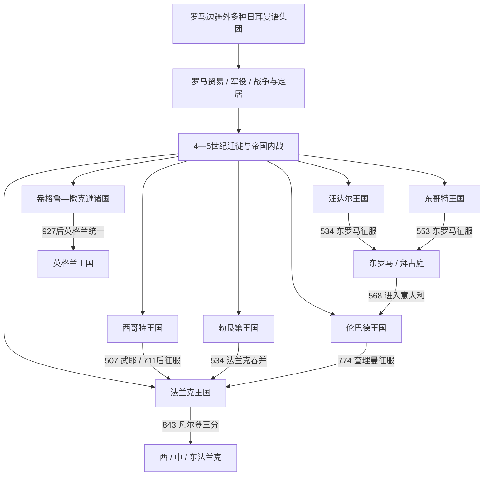

# 后罗马时代的日耳曼诸国

## 时间与范围

约公元前1世纪-8世纪；王国主线集中于4世纪末至774年。盎格鲁—撒克逊英格兰作为北海分支延续至1066年，法兰克三分后的继承王国延续至10世纪。

## 概括

“日耳曼诸国”不是一个统一日耳曼民族接替罗马帝国的直线过程。罗马时代的法兰克、哥特、汪达尔、勃艮第、伦巴德、萨克森等名称，往往指在战争、迁徙、同盟服役和首领竞争中不断重组的军政共同体。4-6世纪，它们进入西罗马行省后必须与当地罗马地主、主教、城市、税制和法律合作，才可能把战团转化为王国。

各王国结局不同：汪达尔、东哥特被查士丁尼的东罗马征服；勃艮第、西哥特、伦巴德分别被法兰克、倭马亚军和加洛林吞并；法兰克王国则以高卢税基、天主教联盟和宫相军政网络持续扩张，成为西欧最有延续性的后罗马王权。多数“灭亡”没有使人口和制度同时消失，征服者常保留地方法律、贵族和教会；罗马传统也不是在476年一夜中断。

## 历史主线

罗马与日耳曼世界长期互相塑造。莱茵—多瑙边界既有战役和壁垒，也有市场、军役、人质教育与跨境婚姻。3世纪以后出现的法兰克、阿勒曼尼等联盟常由更早的小集团重组。376年哥特越过多瑙、406年多族集团越过莱茵、429年汪达尔渡海北非，都发生在罗马内战、财政困难和外部压力交叠的环境中。

建国后的共同难题包括：少数军人如何控制行省多数人口；国王如何在王族、军队和罗马精英之间安排继承；阿里乌派王室如何面对尼西亚派多数；以及地方公爵、伯爵与主教如何纳入中央。西哥特通过589年改宗和654年统一法典深化整合，伦巴德在643年书写习惯法并逐步天主教化，东哥特保持哥特军队—罗马行政双轨，汪达尔则因宗教和土地政策与部分非洲精英持续紧张。

王国的衰亡也不能单因解释。继承内战、有限税军、地方化属于结构因素；法兰克、东罗马、倭马亚等外部强权属于外压；阿马拉逊塔被杀、盖利默政变、瓜达莱特战败、德西德里乌斯与教皇决裂等才是直接触发。把三层因素分开，才能理解为何相似制度会产生不同寿命。

## 按时间排序的导航

| 顺序 | 笔记 | 主要时间 | 内容定位 |
|---:|---|---|---|
| 1 | [日耳曼部落](/%E4%BA%BA%E6%96%87%E7%A7%91%E5%AD%A6/%E5%8E%86%E5%8F%B2/%E6%AC%A7%E6%B4%B2/_%E9%80%9A%E5%8F%B2/%E5%90%8E%E7%BD%97%E9%A9%AC%E6%97%B6%E4%BB%A3%E7%9A%84%E6%97%A5%E8%80%B3%E6%9B%BC%E8%AF%B8%E5%9B%BD/%E6%97%A5%E8%80%B3%E6%9B%BC%E9%83%A8%E8%90%BD.md) | 前1世纪-6世纪 | 概念、语言、联盟形成、罗马边疆互动与迁徙机制，不套王朝模板。 |
| 2 | [西哥特王国](/%E4%BA%BA%E6%96%87%E7%A7%91%E5%AD%A6/%E5%8E%86%E5%8F%B2/%E6%AC%A7%E6%B4%B2/_%E9%80%9A%E5%8F%B2/%E5%90%8E%E7%BD%97%E9%A9%AC%E6%97%B6%E4%BB%A3%E7%9A%84%E6%97%A5%E8%80%B3%E6%9B%BC%E8%AF%B8%E5%9B%BD/%E8%A5%BF%E5%93%A5%E7%89%B9%E7%8E%8B%E5%9B%BD.md) | 395-约720/721年 | 从流动军团、图卢兹到托莱多，宗教法律整合、711年崩溃与东北残余王权。 |
| 专表 | [西哥特王国君主世系表](/%E4%BA%BA%E6%96%87%E7%A7%91%E5%AD%A6/%E5%8E%86%E5%8F%B2/%E6%AC%A7%E6%B4%B2/_%E9%80%9A%E5%8F%B2/%E5%90%8E%E7%BD%97%E9%A9%AC%E6%97%B6%E4%BB%A3%E7%9A%84%E6%97%A5%E8%80%B3%E6%9B%BC%E8%AF%B8%E5%9B%BD/%E8%A5%BF%E5%93%A5%E7%89%B9%E7%8E%8B%E5%9B%BD%E5%90%9B%E4%B8%BB%E4%B8%96%E7%B3%BB%E8%A1%A8.md) | 395-约720/721年 | 阿拉里克一世至阿尔多，含东哥特摄政、共治和罗德里克—阿基拉二世并立。 |
| 3 | [汪达尔王国](/%E4%BA%BA%E6%96%87%E7%A7%91%E5%AD%A6/%E5%8E%86%E5%8F%B2/%E6%AC%A7%E6%B4%B2/_%E9%80%9A%E5%8F%B2/%E5%90%8E%E7%BD%97%E9%A9%AC%E6%97%B6%E4%BB%A3%E7%9A%84%E6%97%A5%E8%80%B3%E6%9B%BC%E8%AF%B8%E5%9B%BD/%E6%B1%AA%E8%BE%BE%E5%B0%94%E7%8E%8B%E5%9B%BD.md) | 429-534年 | 北非建国、海权、宗教政策、全部六王及贝利撒留征服。 |
| 4 | [勃艮第王国](/%E4%BA%BA%E6%96%87%E7%A7%91%E5%AD%A6/%E5%8E%86%E5%8F%B2/%E6%AC%A7%E6%B4%B2/_%E9%80%9A%E5%8F%B2/%E5%90%8E%E7%BD%97%E9%A9%AC%E6%97%B6%E4%BB%A3%E7%9A%84%E6%97%A5%E8%80%B3%E6%9B%BC%E8%AF%B8%E5%9B%BD/%E5%8B%83%E8%89%AE%E7%AC%AC%E7%8E%8B%E5%9B%BD.md) | 约411-534年 | 莱茵、萨帕乌迪亚两次建国，贡多巴德法典、全部分区王与法兰克吞并。 |
| 5 | [东哥特王国](/%E4%BA%BA%E6%96%87%E7%A7%91%E5%AD%A6/%E5%8E%86%E5%8F%B2/%E6%AC%A7%E6%B4%B2/_%E9%80%9A%E5%8F%B2/%E5%90%8E%E7%BD%97%E9%A9%AC%E6%97%B6%E4%BB%A3%E7%9A%84%E6%97%A5%E8%80%B3%E6%9B%BC%E8%AF%B8%E5%9B%BD/%E4%B8%9C%E5%93%A5%E7%89%B9%E7%8E%8B%E5%9B%BD.md) | 493-553年 | 狄奥多里克双重治理、全部八王 / 女王摄政、哥特战争和直接灭亡过程。 |
| 6 | [盎格鲁-撒克逊诸国](/%E4%BA%BA%E6%96%87%E7%A7%91%E5%AD%A6/%E5%8E%86%E5%8F%B2/%E6%AC%A7%E6%B4%B2/_%E9%80%9A%E5%8F%B2/%E5%90%8E%E7%BD%97%E9%A9%AC%E6%97%B6%E4%BB%A3%E7%9A%84%E6%97%A5%E8%80%B3%E6%9B%BC%E8%AF%B8%E5%9B%BD/%E7%9B%8E%E6%A0%BC%E9%B2%81-%E6%92%92%E5%85%8B%E9%80%8A%E8%AF%B8%E5%9B%BD.md) | 5世纪-1066年 | 诸王国形成、基督教化、霸权轮替、丹麦法区、统一与诺曼征服。 |
| 7 | [法兰克王国](/%E4%BA%BA%E6%96%87%E7%A7%91%E5%AD%A6/%E5%8E%86%E5%8F%B2/%E6%AC%A7%E6%B4%B2/_%E9%80%9A%E5%8F%B2/%E5%90%8E%E7%BD%97%E9%A9%AC%E6%97%B6%E4%BB%A3%E7%9A%84%E6%97%A5%E8%80%B3%E6%9B%BC%E8%AF%B8%E5%9B%BD/%E6%B3%95%E5%85%B0%E5%85%8B%E7%8E%8B%E5%9B%BD/README.md) | 约481/486-843年；继承国至10世纪 | 墨洛温、加洛林、三分王国的总入口。 |
| 8 | [伦巴德王国](/%E4%BA%BA%E6%96%87%E7%A7%91%E5%AD%A6/%E5%8E%86%E5%8F%B2/%E6%AC%A7%E6%B4%B2/_%E9%80%9A%E5%8F%B2/%E5%90%8E%E7%BD%97%E9%A9%AC%E6%97%B6%E4%BB%A3%E7%9A%84%E6%97%A5%E8%80%B3%E6%9B%BC%E8%AF%B8%E5%9B%BD/%E4%BC%A6%E5%B7%B4%E5%BE%B7%E7%8E%8B%E5%9B%BD.md) | 568-774年 | 意大利多中心征服、法律与公爵结构、教皇—法兰克联盟和帕维亚陷落。 |
| 专表 | [伦巴德王国君主世系表](/%E4%BA%BA%E6%96%87%E7%A7%91%E5%AD%A6/%E5%8E%86%E5%8F%B2/%E6%AC%A7%E6%B4%B2/_%E9%80%9A%E5%8F%B2/%E5%90%8E%E7%BD%97%E9%A9%AC%E6%97%B6%E4%BB%A3%E7%9A%84%E6%97%A5%E8%80%B3%E6%9B%BC%E8%AF%B8%E5%9B%BD/%E4%BC%A6%E5%B7%B4%E5%BE%B7%E7%8E%8B%E5%9B%BD%E5%90%9B%E4%B8%BB%E4%B8%96%E7%B3%BB%E8%A1%A8.md) | 568-774年 | 阿尔博因至德西德里乌斯，含诸公爵期、复位、争议王与阿德尔基斯共治。 |

## 重要转折与比较

| 时间 | 转折 | 跨区域意义 |
|---|---|---|
| 9年 | 条顿堡森林战役 | 罗马放弃永久易北行省，但边境贸易与军役继续。 |
| 376-382年 | 哥特越境、阿德里安堡与条约 | 大型武装集团以同盟身份在帝国内长期存在。 |
| 406-418年 | 越莱茵、罗马被攻与阿基坦定居 | 迁徙战团开始获得稳定行省税地。 |
| 439年 | 汪达尔夺迦太基 | 西罗马失去关键粮税区，西地中海海权转变。 |
| 451年 | 沙隆战役 | 罗马、哥特、法兰克等联盟抵御匈人，敌友身份高度流动。 |
| 476年 | 西部皇位停止 | 意大利罗马行政延续于奥多亚塞及东哥特王权，不等于罗马社会消失。 |
| 493年 | 狄奥多里克建立意大利王国 | 罗马官僚与哥特军队双轨治理达到成熟形态。 |
| 507年 | 武耶战役 | 法兰克取得高卢主导，西哥特转向伊比利亚。 |
| 533-553年 | 查士丁尼西征 | 汪达尔、东哥特灭亡，北非与意大利遭不同程度重构。 |
| 568年 | 伦巴德进入意大利 | 拜占庭重建未稳即被打断，半岛长期分裂。 |
| 589年 | 西哥特改宗 | 哥特王廷与尼西亚派多数宗教整合。 |
| 654年 | 《西哥特法典》 | 哥特与罗马臣民由属人分法走向统一地域法。 |
| 711年 | 瓜达莱特战败 | 托莱多中央政权崩溃，残余王权仍延续约十年。 |
| 751、774年 | 丕平称王、查理曼征服伦巴德 | 加洛林—教皇联盟重塑西欧和意大利。 |
| 843年 | 《凡尔登条约》 | 法兰克帝国三分，法国、德意志、意大利和洛林等后续主线分化。 |
| 927、1066年 | 英格兰统一与诺曼征服 | 北海日耳曼王国走向全国行政，又被诺曼王朝接管而非制度清零。 |

## 王国比较矩阵

| 政权 | 崛起机制 | 罗马制度连续 | 主要整合方式 | 结构弱点 | 直接终结 |
|---|---|---|---|---|---|
| 西哥特 | 同盟服役、阿基坦定居、接管高卢与伊比利亚 | 城市、主教、罗马法、税收 | 589宗教统一、654地域法 | 选王政变、地方公爵、710并立 | 711主力战败，约720/721残余消失 |
| 东哥特 | 帝国授权征服奥多亚塞 | 元老院、官僚、税制保存最完整 | 宗教宽容、哥特军队—罗马文官分工 | 女系继承、双轨互疑、人口资源有限 | 552-553决定性会战 |
| 汪达尔 | 伊比利亚复合军团渡海、夺迦太基 | 庄园、城市、钱币、港口 | 军人土地、男系长幼序继承 | 宗教裂痕、边疆毛里压力、舰队依赖 | 530政变后，533两战、534投降 |
| 勃艮第 | 罗马两次同盟安置、控制罗讷城市 | 主教、城市、罗马属人法 | 《勃艮第法典》与通婚 | 王族分区内战、战略纵深小 | 532-534法兰克连续征服 |
| 伦巴德 | 乘哥特战争后真空，公爵分路占城 | 地产、城市、拉丁文法律 | 天主教化、643书面法 | 南北割裂、选王、公爵自治 | 教皇求援，773-774帕维亚围城 |
| 法兰克 | 接管高卢、教会联盟、宫相军政网络 | 伯爵、主教、拉丁法、庄园 | 尼西亚信仰、分国共同王权 | 多子继承、地方化 | 未被外敌灭亡，843分国转型 |
| 盎格鲁—撒克逊 | 北海移民与本地重组，多国竞争 | 罗马城市税制连续较弱，教会后期恢复书写 | 基督教化、堡镇、郡制与全国税 | 王国竞争、维京压力、无嗣继承 | 1066诺曼征服接管全国制度 |

## 阅读提示

- 事件年代、统治范围和人口规模在古代材料中常有差异；笔记对不确定项使用“约”“可能”“存在争议”。
- 世系长的西哥特、伦巴德、法兰克另设完整专表；汪达尔、东哥特、勃艮第在主笔记直接列全。
- 王国灭亡后仍延续的法律、贵族、教会和区域名称放在各主笔记的“后继”中，不把政权终结等同族群消失。
- 盎格鲁—撒克逊诸国的英格兰区域细节由[盎格鲁-撒克逊时期](/%E4%BA%BA%E6%96%87%E7%A7%91%E5%AD%A6/%E5%8E%86%E5%8F%B2/%E6%AC%A7%E6%B4%B2/%E4%B8%8D%E5%88%97%E9%A2%A0%E7%BE%A4%E5%B2%9B/%E8%8B%B1%E6%A0%BC%E5%85%B0/%E7%9B%8E%E6%A0%BC%E9%B2%81-%E6%92%92%E5%85%8B%E9%80%8A%E6%97%B6%E6%9C%9F.md)继续维护。

## 演变关系

- 前一大框架：[西罗马帝国](/%E4%BA%BA%E6%96%87%E7%A7%91%E5%AD%A6/%E5%8E%86%E5%8F%B2/%E6%AC%A7%E6%B4%B2/_%E9%80%9A%E5%8F%B2/%E5%8F%A4%E7%BD%97%E9%A9%AC/%E8%A5%BF%E7%BD%97%E9%A9%AC%E5%B8%9D%E5%9B%BD.md)。
- 法国方向：[法国历史](/%E4%BA%BA%E6%96%87%E7%A7%91%E5%AD%A6/%E5%8E%86%E5%8F%B2/%E6%AC%A7%E6%B4%B2/%E6%B3%95%E5%9B%BD/README.md)。
- 德意志方向：[德意志历史](/%E4%BA%BA%E6%96%87%E7%A7%91%E5%AD%A6/%E5%8E%86%E5%8F%B2/%E6%AC%A7%E6%B4%B2/%E5%BE%B7%E6%84%8F%E5%BF%97/README.md)。
- 意大利方向：[意大利历史](/%E4%BA%BA%E6%96%87%E7%A7%91%E5%AD%A6/%E5%8E%86%E5%8F%B2/%E6%AC%A7%E6%B4%B2/%E6%84%8F%E5%A4%A7%E5%88%A9/README.md)。
- 伊比利亚方向：[伊比利亚半岛](/%E4%BA%BA%E6%96%87%E7%A7%91%E5%AD%A6/%E5%8E%86%E5%8F%B2/%E6%AC%A7%E6%B4%B2/%E4%BC%8A%E6%AF%94%E5%88%A9%E4%BA%9A%E5%8D%8A%E5%B2%9B/README.md)。
- 不列颠方向：[不列颠群岛](/%E4%BA%BA%E6%96%87%E7%A7%91%E5%AD%A6/%E5%8E%86%E5%8F%B2/%E6%AC%A7%E6%B4%B2/%E4%B8%8D%E5%88%97%E9%A2%A0%E7%BE%A4%E5%B2%9B/README.md)。
- 上级：[欧洲通史](/%E4%BA%BA%E6%96%87%E7%A7%91%E5%AD%A6/%E5%8E%86%E5%8F%B2/%E6%AC%A7%E6%B4%B2/_%E9%80%9A%E5%8F%B2/README.md)。
