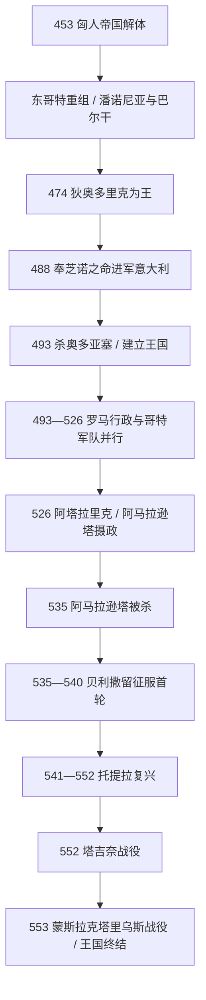

# 东哥特王国

## 时间

493年-553年；狄奥多里克于488-493年征服意大利，535-554年哥特战争摧毁王国及意大利旧秩序。

## 概括

东哥特王国是狄奥多里克率领的哥特军政集团在意大利建立的后罗马政权。其合法性具有双重性：对东哥特军队而言，狄奥多里克是分配土地、统率战争的国王；对君士坦丁堡而言，他最初受皇帝芝诺委托清除奥多亚塞并治理意大利。493年狄奥多里克杀死奥多亚塞后，实际上以拉文纳为中心独立统治。

王国没有摧毁罗马行政体系。元老院、行省官员、税制、城市与罗马法继续服务罗马人口，哥特人则主要承担军事并依哥特习惯法生活；卡西奥多罗斯、波爱修斯等罗马精英在宫廷任职。这种“军政分工”在和平时期降低治理成本，却未形成共同继承机制。526年狄奥多里克去世后，幼王、摄政女王与哥特军人集团互不信任；阿马拉逊塔被杀给查士丁尼提供干预理由。535年开始的哥特战争不是一次迅速征服，而是长达近二十年的多轮战争。托提拉一度重占意大利大部，最终在552年塔吉奈战役阵亡；553年特亚败于维苏威山附近，王国作为独立政权终结。

## 建立背景与崛起机制

### 匈人统治后的重组

4世纪末至5世纪中叶，黑海北方与多瑙河流域的哥特集团受匈人帝国支配。“东哥特”并不是从远古始终不变的单一民族，而是在匈人体系解体后，由阿马尔王族、旧部、附属群体和罗马边军关系重新整合的政治身份。454年内达奥战役后，瓦拉米尔、狄奥迪米尔等首领在潘诺尼亚获得联邦土地，又通过劫掠和罗马补贴维持军队。

狄奥多里克年轻时作为人质在君士坦丁堡生活，既熟悉帝国政治，也掌握一支令皇帝难以安置的武装集团。芝诺面对意大利的奥多亚塞和巴尔干的哥特压力，488年授权狄奥多里克进军意大利。该安排既是帝国委任，也是把一个危险盟友移出巴尔干的权宜之计。

### 征服奥多亚塞（488-493）

哥特军队携家属与财产整体西迁，在伊松佐、维罗纳和阿达河一带击败奥多亚塞。拉文纳依靠沼泽与港口长期坚守，双方493年约定共治。不久狄奥多里克在宴会上亲手杀死奥多亚塞，并清洗其核心支持者。王国的领土基础来自对奥多亚塞政权的接管；哥特军人获得土地或税收份额，具体分配机制仍有争议，但大规模驱逐全部罗马地主并不符合现存证据。

## 狄奥多里克的统治与鼎盛

### 双重统治结构

狄奥多里克沿用西罗马官职、元老院、行省和税务体系，以罗马文书发布法令。罗马臣民由罗马法与文官审理，哥特军人保持自己的军队组织和部分法律习惯；涉及两群体的案件由王室官员协调。他不使用“西罗马皇帝”称号，硬币仍保留东罗马皇帝名义，却自行任命高官、进行外交、缔结王室婚姻，实际主权远超普通帝国总督。

| 领域 | 延续与调整 | 作用 / 局限 |
|---|---|---|
| 中央行政 | 保留禁卫大臣、宫廷财务、文书与元老院荣衔，卡西奥多罗斯等罗马贵族任职。 | 维持税收和书面治理；罗马精英忠诚取决于王国与帝国关系。 |
| 军事 | 哥特人组成野战军，王室以土地、俸禄和战利品维系；罗马人口较少承担军事。 | 和平时专业有效，战时却强化族群分工与互疑。 |
| 法律 | 罗马人与哥特人原则上各循既有法，国王敕令协调治安、税收和土地争端。 | 保留制度连续，却没有形成如西哥特后期那样的统一法典。 |
| 宗教 | 王室信奉阿里乌派，多数罗马人信奉尼西亚派；保护犹太会堂并抑制宗教暴力。 | 宽容有利稳定，但东罗马宗教政策变化会立即影响宫廷安全感。 |
| 外交 | 与西哥特、汪达尔、法兰克、勃艮第、图林根王室联姻。 | 构建短暂的西方哥特霸权；联姻未能在继承危机中提供可靠援军。 |

### 扩张与罗马复兴

狄奥多里克控制意大利、西西里、达尔马提亚，并在法兰克击败西哥特后保护塞普提曼尼亚、摄政西哥特王国。他修复拉文纳、罗马和维罗纳的城墙、引水设施与公共建筑，维持谷物供给和竞技活动，强调自己恢复而非取代罗马文明。长期和平、意大利税基、东哥特军事精英的凝聚力，以及东方帝国暂时无力西征，共同构成鼎盛条件。

晚年形势转坏。法兰克扩张击破王室联姻网络，查士丁一世的反阿里乌政策加剧猜疑；元老波爱修斯及岳父西马库斯因叛国指控被处死，教皇若望一世也死于拘禁。这些事件没有立即摧毁王国，却破坏哥特宫廷与罗马元老精英之间的信任。

## 继承危机与哥特战争

### 阿马拉逊塔、阿塔拉里克与狄奥达哈德（526-536）

狄奥多里克没有存活的儿子，外孙阿塔拉里克年幼即位，由其母阿马拉逊塔摄政。她重用罗马教育与帝国友好政策，遭主张传统军事培养的哥特贵族反对；阿塔拉里克于534年早亡后，她邀请堂兄狄奥达哈德共治以巩固合法性。狄奥达哈德却囚禁并于535年杀害她。

查士丁尼此前已灭汪达尔王国，遂以保护阿马拉逊塔及恢复帝国统治为理由发动战争。贝利撒留先取西西里、那不勒斯，536年进入罗马。哥特贵族废杀无力组织抵抗的狄奥达哈德，拥立将领维蒂吉斯。

### 贝利撒留首轮征服（536-540）

维蒂吉斯围攻罗马一年未克，撤退时损失惨重。法兰克以盟友和机会主义者双重身份介入北意大利，加剧粮荒与破坏。540年贝利撒留围困拉文纳，部分哥特贵族提出拥立他为“西方皇帝”；贝利撒留假意接受以促成投降，随后把维蒂吉斯押往君士坦丁堡。查士丁尼召回主将，却未能立即消灭波河以北哥特残部。

### 托提拉的复兴与最终失败（540-553）

伊尔迪巴德重建抵抗后被刺，鲁吉人埃拉里克因被怀疑与帝国交易而被杀。541年哥特人拥立伊尔迪巴德之侄托提拉。帝国将领分权争功、军饷拖欠，托提拉则释放俘虏、吸纳逃亡士兵，并试图以减租和招募奴隶削弱大地主支持，迅速恢复意大利大部。

托提拉于546年攻入罗马，之后罗马数度易手；他控制陆地，却难长期抗衡帝国海军和东地中海资源。查士丁尼最终任命纳尔塞斯，集结帝国军、伦巴德人与赫鲁利等盟军从东北进入意大利。552年塔吉奈战役中托提拉战败身亡。特亚继位，在那不勒斯附近蒙斯拉克塔里乌斯战役坚持两日后阵亡；残部获得离境或归降条件，553年王国终结，个别城堡抵抗延续至555年前后。

## 完整君主世系

| 顺序 | 君主 | 在位 | 继承方式 / 关键事件 |
|---:|---|---|---|
| 1 | **狄奥多里克大王** | 493-526（474起为东哥特首领） | 阿马尔王族；征服奥多亚塞，建立并扩展意大利王国。 |
| 2 | 阿塔拉里克 | 526-534 | 狄奥多里克外孙，幼年即位；母亲阿马拉逊塔摄政。 |
| — | **阿马拉逊塔（摄政 / 女王）** | 526-534摄政；534-535以女王共治 | 狄奥多里克之女；阿塔拉里克死后与堂兄狄奥达哈德共治，被其囚杀。 |
| 3 | 狄奥达哈德 | 534-536 | 阿马尔王族旁支，与阿马拉逊塔共治后独掌；战争失利被废杀。 |
| 4 | 维蒂吉斯 | 536-540 | 军队推举；围攻罗马失败，拉文纳投降后被带往君士坦丁堡。 |
| 5 | 伊尔迪巴德 | 540-541 | 北意大利残军推举；恢复部分势力，因私人仇杀遇刺。 |
| 6 | 埃拉里克 | 541，约五个月 | 鲁吉人首领；被怀疑准备向帝国投降，遭哥特军人杀害。 |
| 7 | **托提拉（巴杜伊拉）** | 541-552 | 伊尔迪巴德之侄；重占意大利大部，塔吉奈战败身亡。 |
| 8 | **特亚** | 552-553 | 托提拉部将，末代国王；蒙斯拉克塔里乌斯战役阵亡。 |

## 重要事件

| 时间 | 事件 | 结果与长期影响 |
|---|---|---|
| 488-493年 | 东哥特迁徙并征服意大利 | 奥多亚塞政权终结，哥特王国接管罗马行政。 |
| 493年 | 拉文纳宴会杀奥多亚塞 | 狄奥多里克独占统治，但以暴力清除共治承诺。 |
| 507-526年 | 干预西哥特继承 | 保存塞普提曼尼亚，形成短暂哥特霸权。 |
| 523-525年 | 波爱修斯、西马库斯案 | 王廷与元老院互信受损。 |
| 535年 | 阿马拉逊塔被杀 | 查士丁尼获得战争名义，继承危机外部化。 |
| 536-537年 | 那不勒斯陷落、罗马易手 | 帝国建立意大利中部立足点。 |
| 537-538年 | 哥特围攻罗马 | 久攻失败，维蒂吉斯战略主动权下降。 |
| 540年 | 拉文纳投降 | 首轮征服完成，但帝国未解决北方残军与治理。 |
| 541-546年 | 托提拉反攻、夺取罗马 | 王国短暂复兴，战争转为破坏性消耗。 |
| 552年 | 塔吉奈战役 | 托提拉阵亡，主力覆灭。 |
| 553年 | 蒙斯拉克塔里乌斯战役 | 特亚战死，独立王权终结。 |

## 兴盛、衰落与灭亡原因

### 鼎盛条件

- 狄奥多里克兼具哥特军事威望与东罗马宫廷经验，能在两套政治语言中行动。
- 直接继承奥多亚塞保存的税制、城市和官僚，避免征服后重建国家机器。
- 宗教宽容与罗马精英合作维持意大利生产和公共秩序。
- 王室联姻、东罗马暂不西征和法兰克尚未完全压倒邻国，为外交霸权提供窗口。

### 结构因素

- 哥特军事共同体与罗马文官社会分工明显，没有形成共同的继承与军事责任。
- 王国人口、财政与海军资源弱于东罗马帝国；一旦帝国投入长期战争，难以补充损失。
- 狄奥多里克只有女系继承，幼王与女摄政遭军人贵族抵制，王权合法性缺口迅速暴露。
- 哥特战争破坏农田、城市、引水设施与税基，饥荒和瘟疫进一步降低抵抗能力。

### 外部压力与直接触发

- 查士丁尼在东方暂时和约、北非征服成功后，能够把军队和舰队转向意大利。
- 阿马拉逊塔被杀是开战的直接政治借口；狄奥达哈德和维蒂吉斯的军事失误让帝国夺得桥头堡。
- 托提拉复兴说明王国并非因“制度落后”必然立即灭亡；最终失败来自帝国持续投入、海权、纳尔塞斯统一指挥及决定性会战。
- 王国灭亡后的意大利没有恢复狄奥多里克时代稳定。长期战争耗空社会，568年伦巴德入侵时帝国只能守住分散据点。

## 演变关系

- 前一节点：[西罗马帝国](/%E4%BA%BA%E6%96%87%E7%A7%91%E5%AD%A6/%E5%8E%86%E5%8F%B2/%E6%AC%A7%E6%B4%B2/_%E9%80%9A%E5%8F%B2/%E5%8F%A4%E7%BD%97%E9%A9%AC/%E8%A5%BF%E7%BD%97%E9%A9%AC%E5%B8%9D%E5%9B%BD.md)及奥多亚塞的意大利政权。
- 并列节点：[西哥特王国](/%E4%BA%BA%E6%96%87%E7%A7%91%E5%AD%A6/%E5%8E%86%E5%8F%B2/%E6%AC%A7%E6%B4%B2/_%E9%80%9A%E5%8F%B2/%E5%90%8E%E7%BD%97%E9%A9%AC%E6%97%B6%E4%BB%A3%E7%9A%84%E6%97%A5%E8%80%B3%E6%9B%BC%E8%AF%B8%E5%9B%BD/%E8%A5%BF%E5%93%A5%E7%89%B9%E7%8E%8B%E5%9B%BD.md)。
- 后一节点：东罗马 / 拜占庭短暂重建意大利行省，继而[伦巴德王国](/%E4%BA%BA%E6%96%87%E7%A7%91%E5%AD%A6/%E5%8E%86%E5%8F%B2/%E6%AC%A7%E6%B4%B2/_%E9%80%9A%E5%8F%B2/%E5%90%8E%E7%BD%97%E9%A9%AC%E6%97%B6%E4%BB%A3%E7%9A%84%E6%97%A5%E8%80%B3%E6%9B%BC%E8%AF%B8%E5%9B%BD/%E4%BC%A6%E5%B7%B4%E5%BE%B7%E7%8E%8B%E5%9B%BD.md)入侵。
- 区域主线：[意大利历史](/%E4%BA%BA%E6%96%87%E7%A7%91%E5%AD%A6/%E5%8E%86%E5%8F%B2/%E6%AC%A7%E6%B4%B2/%E6%84%8F%E5%A4%A7%E5%88%A9/README.md)。
- 所属总览：[后罗马时代的日耳曼诸国](/%E4%BA%BA%E6%96%87%E7%A7%91%E5%AD%A6/%E5%8E%86%E5%8F%B2/%E6%AC%A7%E6%B4%B2/_%E9%80%9A%E5%8F%B2/%E5%90%8E%E7%BD%97%E9%A9%AC%E6%97%B6%E4%BB%A3%E7%9A%84%E6%97%A5%E8%80%B3%E6%9B%BC%E8%AF%B8%E5%9B%BD/README.md)。
