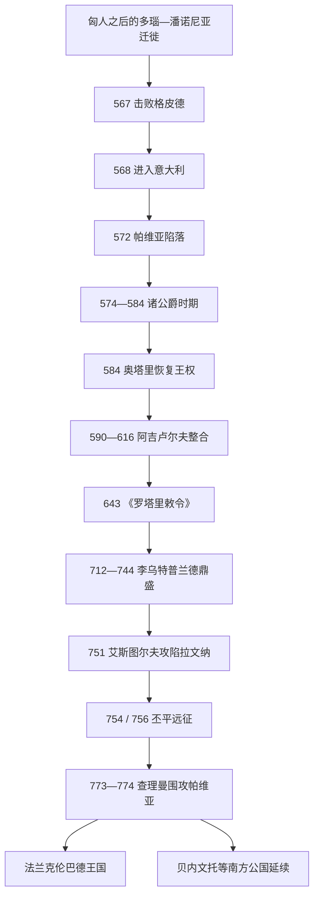

# 伦巴德王国

## 时间

568年-774年；南意大利伦巴德公国继续存在，其中贝内文托及其后继政权延续至11世纪。

## 概括

伦巴德王国是伦巴德人及其萨克森、格皮德、斯拉夫等盟众在拜占庭刚结束哥特战争的意大利建立的王国。568年阿尔博因率众从潘诺尼亚越过阿尔卑斯，迅速占领波河平原，572年攻下帕维亚。拜占庭仍守拉文纳、罗马、那不勒斯、西西里和沿海走廊，伦巴德的斯波莱托、贝内文托等公国又具有高度自主，因而意大利不是被一个王国整齐取代，而是形成持续两百年的多中心格局。

伦巴德早期王权依赖公爵推举。574-584年甚至没有国王，各城市公爵各自扩张；外部法兰克和拜占庭压力促使公爵交出部分领地，拥立奥塔里重建中央。王国逐步继承罗马地产、税收、城市和书写文化，伦巴德人与罗马居民的法律、语言和宗教界线也逐渐淡化。643年《罗塔里敕令》以拉丁文书写伦巴德法，8世纪时国王与精英已普遍信奉天主教。

李乌特普兰德利用拜占庭圣像破坏争议扩张，王国在712-744年达到鼎盛。艾斯图尔夫751年攻陷拉文纳后直接威胁罗马，反而促成教皇与法兰克结盟。丕平两次越过阿尔卑斯迫使伦巴德让地，德西德里乌斯与查理曼的通婚和解破裂后，法兰克军于773-774年围困帕维亚，废黜德西德里乌斯。独立王国灭亡，但查理曼兼任“伦巴德国王”，保留许多法律和贵族；南方贝内文托仍未被完全征服。

## 建立背景与迁徙机制

### 多瑙河世界中的伦巴德人

伦巴德人的早期起源传说把他们追溯到斯堪的纳维亚，但可核实的政治形成发生在易北河、多瑙河与潘诺尼亚的迁徙和联盟中。6世纪，他们进入潘诺尼亚，与格皮德争夺喀尔巴阡盆地，并与拜占庭、阿瓦尔人建立时战时和的关系。567年阿尔博因联合阿瓦尔击败格皮德；阿瓦尔随即成为更强邻国，潘诺尼亚资源与安全压力促使伦巴德迁入意大利。迁徙者包括非伦巴德盟众，说明“伦巴德”也是在共同远征与法律身份中扩大的政治共同体。

### 乘哥特战争后的权力真空进入意大利

拜占庭于554年结束哥特战争，却继承一个人口、财政和防御均受重创的半岛。帝国军分散驻守城市，缺乏足够野战力量；是否有拜占庭将领纳尔塞斯“邀请”伦巴德报复皇帝的传说缺乏可靠证据。568年阿尔博因沿朱利安阿尔卑斯进入弗留利，任命侄子吉苏尔夫为公爵，继而夺取米兰和北方多城。帕维亚抵抗约三年后在572年投降，成为长期王都。

伦巴德的征服呈点状：公爵控制城市和周边地产，拜占庭保有拉文纳—罗马走廊、利古里亚和南部沿海，罗马本地由教皇、元老与帝国官员协同防守。斯波莱托与贝内文托公爵越过亚平宁在中南部建国，与帕维亚之间隔着拜占庭领土，自治性尤其强。

## 王权重建与制度发展

### 诸公爵时期与奥塔里—阿吉卢尔夫整合

阿尔博因572年遭宫廷刺杀，克莱夫两年后也被杀。574-584年公爵们不再选王，各自夺取土地、征收贡赋；这种分权有利快速扩张，却无法统一应对法兰克入侵、拜占庭外交收买和内部争端。584年公爵推举克莱夫之子奥塔里，并交出约一半王室领地以供中央财政。奥塔里采用罗马皇帝常用的“弗拉维乌斯”名号，显示王权开始借用意大利合法性。

阿吉卢尔夫通过与王后狄奥德琳达的婚姻继位，扩大对公爵控制，与教皇格里高利一世和拜占庭分别停战。狄奥德琳达信奉天主教，资助蒙扎等教会；王室仍有阿里乌派支持者，但宗教转变已开始。王权以帕维亚宫廷、王室地产、铸币和巡行方式运作，没有消灭公爵自治。

### 《罗塔里敕令》与法律整合

罗塔里于643年颁布敕令，以拉丁文记录伦巴德习惯法。法典用金钱赔偿取代许多血仇，规范人身伤害、继承、婚姻、奴隶和军事义务；不同自由等级的赔偿额并不相同。它主要面向伦巴德人，罗马居民仍适用罗马法，但后续国王不断增补，法律适用逐渐呈地域化趋势。

| 层次 | 机构 / 群体 | 运作方式 | 演变 |
|---|---|---|---|
| 国王 | 由公爵、军队与王族联盟推举；掌王室地产、最高司法和外交 | 通过婚姻、共治、没收与任命加强继承 | 8世纪中央权威增强，但仍非绝对世袭。 |
| 公爵 | 以城市和周边地区为军政基础 | 弗留利、特伦托、斯波莱托、贝内文托等拥有军队与司法 | 北方公国逐渐受帕维亚控制，南方长期自主。 |
| 城市官员 | 司法官、地方管理者、主教与罗马书吏 | 维持税务、契约、教会财产和城市社会 | 罗马官衔与伦巴德职务融合。 |
| 自由人与军役 | 阿里曼尼自由战士承担军役，另有半自由人、奴隶和罗马地主 | 土地、身份和兵役紧密相连 | 族群界线逐渐被法律身份与地方归属取代。 |
| 教会 | 阿里乌派、天主教及三章派并存 | 王后与国王资助修道院、主教调解外交 | 7世纪后王室天主教化，为与教皇合作提供基础，但领土冲突仍持续。 |

## 鼎盛：李乌特普兰德时代（712-744）

李乌特普兰德继承安斯普兰德后，利用拜占庭内部争议扩张。726年后皇帝利奥三世的圣像政策引起意大利地方反抗，拉文纳总督权威下降；伦巴德夺取多座城镇，一度进抵罗马公国。728年李乌特普兰德把苏特里交给教皇，这不是现代主权国家间的永久“赠国”，却成为教皇领土权扩张的重要节点。

他通过立法、王室法庭和干预斯波莱托、贝内文托继承来压制公爵，收回拉文纳后又因外交暂时退让。王国的鼎盛来自长期君主、北方税基、天主教共同信仰、拜占庭衰弱以及法兰克宫相尚未直接干预意大利。其局限是罗马与教皇不愿被伦巴德吞并，南方公爵也只在强王压力下服从。

## 与教皇、拜占庭和法兰克的决裂

### 艾斯图尔夫攻陷拉文纳

拉奇斯围攻佩鲁贾后在教皇劝说下退兵，被贵族迫使入修道院。其弟艾斯图尔夫采取更强硬路线，751年攻陷拉文纳，终结延续近两个世纪的拜占庭总督区，并要求罗马缴纳贡赋。东罗马无力派遣大军，教皇斯德望二世越过阿尔卑斯向丕平三世求援。

丕平于754、756年两次远征，击败艾斯图尔夫并迫使其交出拉文纳等地。相关领土被交给教皇而非归还拜占庭，形成“丕平献土”和教皇国领土基础。法兰克—教皇联盟由此把伦巴德王国置于北方大国压力下。

### 德西德里乌斯与查理曼征服

德西德里乌斯击败短暂复位的拉奇斯，最初与教皇、法兰克修好，并把女儿嫁给查理曼。771年卡洛曼一世去世后，其遗孀与儿子投奔伦巴德；查理曼解除伦巴德婚姻，教皇哈德良一世又因德西德里乌斯占领教皇领地求援。773年法兰克军分两路越过阿尔卑斯，绕过伦巴德山口防线，围困帕维亚和维罗纳。

帕维亚坚守至774年，饥荒迫使德西德里乌斯投降，被送入修道院；共治王阿德尔基斯逃往君士坦丁堡。查理曼戴上伦巴德王冠，确认教皇领地，并逐步更换不服从的公爵，但保留《罗塔里敕令》、地方贵族和王国称号。776年弗留利叛乱被镇压后，法兰克控制加强；贝内文托公爵阿雷基斯二世则称“亲王”，在南方维持独立。

## 重要事件

| 时间 | 事件 | 过程与结果 |
|---|---|---|
| 567年 | 击败格皮德 | 联阿瓦尔取胜，随后因阿瓦尔压力与意大利机会西迁。 |
| 568年 | 进入意大利 | 弗留利成为首个公国，拜占庭防线迅速分裂。 |
| 572年 | 帕维亚陷落 | 获得长期王都；阿尔博因同年被刺。 |
| 574-584年 | 诸公爵时期 | 无中央国王，公爵扩张但外交与财政碎片化。 |
| 584年 | 奥塔里即位 | 公爵让渡领地，王权与王室财政恢复。 |
| 590-616年 | 阿吉卢尔夫统治 | 与教皇、拜占庭谈判，王室天主教化加深。 |
| 643年 | 《罗塔里敕令》 | 伦巴德习惯法书面化，抑制血仇并强化王室司法。 |
| 680年 | 与拜占庭长期和约 | 帝国承认伦巴德王国现实，边界相对稳定。 |
| 712-744年 | 李乌特普兰德统治 | 中央化与扩张达到高峰，干预南方公国。 |
| 728年 | 苏特里移交 | 教皇取得重要领地与象征先例。 |
| 751年 | 拉文纳陷落 | 拜占庭总督区终结，伦巴德直接面对教皇—法兰克联盟。 |
| 754、756年 | 丕平远征 | 迫使艾斯图尔夫退让，教皇国领土基础形成。 |
| 773-774年 | 帕维亚围城 | 德西德里乌斯被废，独立王国终结。 |

## 兴盛、衰落与灭亡原因

### 崛起与鼎盛条件

- 哥特战争破坏意大利防御和财政，拜占庭兵力集中于沿海与要塞，波河平原出现权力真空。
- 伦巴德迁徙集团包含多族盟军，以公爵为单位能分路快速占城。
- 王权重建后保留罗马地产、城市、契约和教会网络，逐步形成稳定税收与法律。
- 李乌特普兰德长期在位，利用拜占庭宗教争议和南方公国内斗完成中央化。

### 结构性局限

- 征服地被拜占庭走廊和亚平宁山地切割，南北公国难以形成统一战略。
- 王位依赖公爵推举，复位、共治和政变频繁；强王死后政策容易逆转。
- 伦巴德天主教化消除了宗派隔阂，却没有消除与教皇对罗马公国、拉文纳和中意大利领土的冲突。
- 王国缺乏与法兰克相当的人口和跨区域动员，一旦教皇为北方征服赋予宗教合法性，外交空间骤缩。

### 外部压力与直接触发

- 东罗马衰弱使伦巴德扩张，却促使教皇寻找新的军事保护者；丕平献土把法兰克利益制度化。
- 艾斯图尔夫、德西德里乌斯持续进逼罗马，未能把教皇纳入可接受的共存秩序。
- 卡洛曼家属、查理曼婚姻破裂和哈德良一世求援是773年战争的直接政治触发。
- 法兰克分路越过山口、长期围城和北意大利贵族倒向胜者，造成帕维亚孤立。王国灭亡不是伦巴德社会消失，而是最高王权被查理曼兼并。

## 王朝世系

完整国王表列出诸公爵时期、两次在位的佩尔克塔里特与拉奇斯、阿拉希斯争议王及阿德尔基斯共治：

- [伦巴德王国君主世系表](/%E4%BA%BA%E6%96%87%E7%A7%91%E5%AD%A6/%E5%8E%86%E5%8F%B2/%E6%AC%A7%E6%B4%B2/_%E9%80%9A%E5%8F%B2/%E5%90%8E%E7%BD%97%E9%A9%AC%E6%97%B6%E4%BB%A3%E7%9A%84%E6%97%A5%E8%80%B3%E6%9B%BC%E8%AF%B8%E5%9B%BD/%E4%BC%A6%E5%B7%B4%E5%BE%B7%E7%8E%8B%E5%9B%BD%E5%90%9B%E4%B8%BB%E4%B8%96%E7%B3%BB%E8%A1%A8.md)

## 演变关系

- 前一节点：[东哥特王国](/%E4%BA%BA%E6%96%87%E7%A7%91%E5%AD%A6/%E5%8E%86%E5%8F%B2/%E6%AC%A7%E6%B4%B2/_%E9%80%9A%E5%8F%B2/%E5%90%8E%E7%BD%97%E9%A9%AC%E6%97%B6%E4%BB%A3%E7%9A%84%E6%97%A5%E8%80%B3%E6%9B%BC%E8%AF%B8%E5%9B%BD/%E4%B8%9C%E5%93%A5%E7%89%B9%E7%8E%8B%E5%9B%BD.md)灭亡后的拜占庭意大利。
- 征服者：[加洛林王朝](/%E4%BA%BA%E6%96%87%E7%A7%91%E5%AD%A6/%E5%8E%86%E5%8F%B2/%E6%AC%A7%E6%B4%B2/_%E9%80%9A%E5%8F%B2/%E5%90%8E%E7%BD%97%E9%A9%AC%E6%97%B6%E4%BB%A3%E7%9A%84%E6%97%A5%E8%80%B3%E6%9B%BC%E8%AF%B8%E5%9B%BD/%E6%B3%95%E5%85%B0%E5%85%8B%E7%8E%8B%E5%9B%BD/%E5%8A%A0%E6%B4%9B%E6%9E%97%E7%8E%8B%E6%9C%9D.md)。
- 区域后续：[意大利历史](/%E4%BA%BA%E6%96%87%E7%A7%91%E5%AD%A6/%E5%8E%86%E5%8F%B2/%E6%AC%A7%E6%B4%B2/%E6%84%8F%E5%A4%A7%E5%88%A9/README.md)。
- 所属总览：[后罗马时代的日耳曼诸国](/%E4%BA%BA%E6%96%87%E7%A7%91%E5%AD%A6/%E5%8E%86%E5%8F%B2/%E6%AC%A7%E6%B4%B2/_%E9%80%9A%E5%8F%B2/%E5%90%8E%E7%BD%97%E9%A9%AC%E6%97%B6%E4%BB%A3%E7%9A%84%E6%97%A5%E8%80%B3%E6%9B%BC%E8%AF%B8%E5%9B%BD/README.md)。
