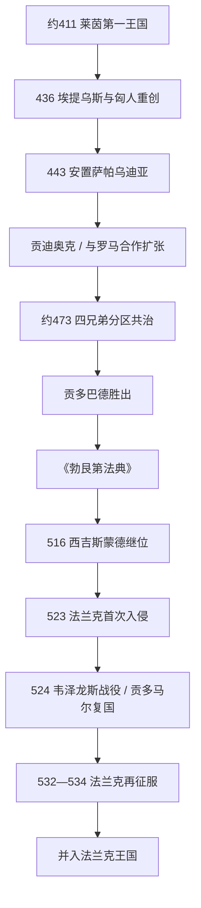

# 勃艮第王国

## 时间

约411年-534年；第一王国约411-436年位于莱茵河中游，第二王国443年后以萨帕乌迪亚、日内瓦和罗讷河流域为核心。

## 概括

早期勃艮第王国不是后来勃艮第公国的直接同一政体。勃艮第人在西罗马内战中进入莱茵边境，约411年由贡达哈尔支持僭帝约维努斯并在沃尔姆斯一带建立第一王国。436年，罗马统帅埃提乌斯借匈人军队重创该集团，这场灾难后来进入《尼伯龙根之歌》的传说记忆。幸存者于443年被安置在“萨帕乌迪亚”，大致涉及今萨瓦、日内瓦湖与罗讷河上游，形成第二王国。

第二王国依靠为西罗马提供军队、接管里昂与维埃纳等城市、和高卢罗马地主与主教合作而扩张。贡多巴德时期编纂《勃艮第法典》，同时保留罗马臣民法律，显示族群分法和制度连续。王国地处法兰克、东哥特与意大利交通之间，王族内部实行分区共治，既扩大覆盖面也造成内战。西吉斯蒙德改宗尼西亚信仰并与教会合作，却杀死儿子西格里克、削弱合法性；523-534年法兰克诸王以王室复仇、领土扩张为动力多次入侵。贡多马尔二世虽一度复国，534年最终败亡，领土被并入法兰克王国。

## 建立背景与两次建国

### 莱茵河第一王国（约411-436）

406年莱茵边界崩溃后，勃艮第集团没有与汪达尔等完全相同地一路进入伊比利亚，而是留在莱茵中游。411年贡达哈尔与阿兰王戈阿尔支持约维努斯称帝，作为交换获得定居与政治地位。约维努斯很快败亡，罗马仍在413年前后承认勃艮第的同盟者安排。王国控制范围与首都是否确为沃尔姆斯均不完全确定，不能把史诗地理当成精确行政记录。

435年贡达哈尔试图向罗马高卢扩张，遭埃提乌斯击败。次年埃提乌斯利用匈人辅助军进一步攻击，贡达哈尔和大量战士阵亡。史料没有说明勃艮第人被彻底灭绝；相反，帝国很快重新安置幸存集团，说明其军事价值仍被需要。

### 萨帕乌迪亚与罗讷河王国（443年后）

443年埃提乌斯把勃艮第人安置在萨帕乌迪亚，目的可能包括保护阿尔卑斯通道、牵制巴高达与其他同盟军。土地分配细节不明，后来的法律提及罗马人与勃艮第人分享土地、森林和奴隶，但实际过程可能分批且地区差异很大。王国逐步控制日内瓦、里昂、维埃纳，向索恩河与普罗旺斯扩展。

贡迪奥克与弟希尔佩里克一世在5世纪中叶为罗马作战，并获得“高卢军务长官”等罗马头衔。西罗马中央衰落后，他们把帝国军职、王族军队和城市税基结合起来。王国的崛起不是摧毁地方社会，而是借助高卢罗马元老贵族、主教和文书人员把军事实力转化为领土治理。

## 王族共治与贡多巴德整合

贡迪奥克死后，其四子贡多巴德、希尔佩里克二世、贡多马尔一世和戈德吉塞尔分别在里昂、日内瓦、维埃纳等中心拥有权力。具体分区、在位起年与兄弟死亡经过并不完全清楚。贡多巴德曾在意大利成为军务长官，并支持格利凯里乌斯称帝；返回高卢后逐步消灭或吞并兄弟领地。后世说他杀死希尔佩里克二世并把侄女克洛蒂尔德嫁给克洛维，其中细节受格列高利·都尔的王朝叙事影响，需谨慎看待。

500年前后，戈德吉塞尔秘密联合克洛维反对贡多巴德。贡多巴德在第戎附近战败，退守阿维尼翁，随后反攻维埃纳并杀死兄弟，重新统一王国。他一度向法兰克称贡或结盟，却利用法兰克与西哥特竞争保持独立，并在507年武耶战役前后与法兰克共同攻击西哥特。

## 制度、法律与族群整合

| 领域 | 机制 | 内容与影响 |
|---|---|---|
| 王权 | 王族分区共治、军队拥护与罗马官职结合 | 有利于控制多个城市，却使兄弟内战成为常态；统一取决于个人军事胜利。 |
| 地方治理 | 城市伯爵、罗马地主、主教和王室官员合作 | 里昂、维埃纳、日内瓦等晚期罗马中心继续运行；主教是外交与调解关键。 |
| 《勃艮第法典》 | 贡多巴德及继承者在5世纪末至6世纪初编纂 | 规范勃艮第臣民的赔偿、继承、婚姻、土地与暴力，反映军人定居社会。 |
| 《罗马勃艮第法》 | 为罗马臣民汇编帝国法 | 保留属人法原则，王国没有强迫所有居民立即采用日耳曼习惯法。 |
| 宗教 | 王族早期多阿里乌派，地方多数尼西亚派；西吉斯蒙德公开改宗 | 阿维图斯等主教推动王廷融入高卢教会；圣莫里斯修道院成为王室宗教中心。 |
| 族群 | 勃艮第军人数量有限，与高卢罗马人口通婚、共居并共享经济网络 | 6世纪后“勃艮第”逐渐成为地域与法权身份，不再只是迁徙集团血缘标签。 |

贡多巴德的法典并非一次性颁布，后续条款可能由西吉斯蒙德补充。法律以身份、性别和社会地位规定不同赔偿，显示整合仍不平等；但它也保护罗马人的部分财产与诉讼权，避免把征服写成毫无制度的强夺。

## 完整君主世系

| 顺序 | 君主 | 在位 | 继承与控制范围 | 关键事件 / 备注 |
|---:|---|---|---|---|
| 1 | **贡达哈尔 / 贡迪卡尔** | 约411-436 | 第一王国国王 | 支持约维努斯，在莱茵中游建国；436年遭埃提乌斯与匈人军重创并阵亡。 |
| 2A | **贡迪奥克** | 约443-473 | 可能为贡达哈尔后裔，第二王国主要国王 | 在萨帕乌迪亚重建，向里昂与罗讷河扩张；与西罗马合作并获高级军职。 |
| 2B | 希尔佩里克一世 | 约443-约480 | 贡迪奥克之弟或共同统治者 | 与贡迪奥克共治；后期可能在日内瓦掌权，年代不确。 |
| 3A | **贡多巴德** | 约473-516；501后基本独治 | 贡迪奥克之子 | 曾控制意大利宫廷；击败兄弟、编纂法典并在法兰克—西哥特间维持王国。 |
| 3B | 希尔佩里克二世 | 约473-约493 | 贡迪奥克之子，可能据瓦朗斯或里昂 | 克洛蒂尔德之父；被贡多巴德杀害的传统叙事细节有争议。 |
| 3C | 贡多马尔一世 | 约473-约486 | 贡迪奥克之子，共治分区王 | 史料极少，约在兄弟整合中消失。 |
| 3D | 戈德吉塞尔 | 约473-501 | 贡迪奥克之子，主要据日内瓦 / 维埃纳 | 500年联合克洛维反贡多巴德；501年在维埃纳被杀。 |
| 4 | **西吉斯蒙德** | 516-523 | 贡多巴德之子；约501起可能共治 | 改宗尼西亚信仰、建立圣莫里斯修道院；杀子西格里克后政治孤立，败于法兰克并被处死。 |
| 5 | **贡多马尔二世** | 523-534 | 贡多巴德之子、西吉斯蒙德之弟 | 524年韦泽龙斯战役击败法兰克并杀克洛多米尔，一度复国；532后再败，534年王国被吞并。 |

## 重要事件与具体过程

| 时间 | 事件 | 过程 | 结果 |
|---|---|---|---|
| 411年 | 支持约维努斯称帝 | 贡达哈尔以边境军力换取罗马承认。 | 莱茵第一王国形成。 |
| 436年 | 匈人辅助军打击 | 埃提乌斯镇压勃艮第扩张。 | 第一王国崩溃，成为史诗记忆来源。 |
| 443年 | 安置萨帕乌迪亚 | 罗马重新利用幸存勃艮第军人。 | 第二王国建立。 |
| 461-473年 | 向罗讷河扩张 | 王室接管里昂、维埃纳等城市，与罗马贵族合作。 | 建立富庶的河谷王国。 |
| 约500-501年 | 贡多巴德—戈德吉塞尔内战 | 戈德吉塞尔获克洛维支持；贡多巴德先败后围攻维埃纳。 | 贡多巴德统一王国，承认法兰克压力。 |
| 507年 | 武耶战争 | 勃艮第与法兰克协同进攻西哥特，东哥特随后干预。 | 王国获部分南方利益，却进入法兰克—东哥特夹缝。 |
| 516年 | 西吉斯蒙德继位 | 天主教王权与主教关系强化。 | 宗教整合加深，但王室内部矛盾未解。 |
| 522年 | 西格里克被杀 | 西吉斯蒙德受继后影响处死亲子，后公开忏悔。 | 失去东哥特外援与部分贵族信任。 |
| 523年 | 法兰克首次入侵 | 克洛蒂尔德之子以母族复仇为名进军。 | 西吉斯蒙德被俘杀，贡多马尔继续抵抗。 |
| 524年 | 韦泽龙斯战役 | 贡多马尔诱敌反击，法兰克王克洛多米尔阵亡。 | 王国暂时恢复。 |
| 532-534年 | 法兰克再征服 | 希尔德贝尔特一世、克洛泰尔一世等持续进攻。 | 贡多马尔败亡，领土纳入法兰克分国。 |

## 兴盛、衰落与灭亡原因

### 崛起与鼎盛条件

- 西罗马需要边境同盟军，先承认莱茵定居，后在战略性阿尔卑斯门户重新安置幸存者。
- 罗讷—索恩河谷拥有城市、道路、葡萄酒与跨阿尔卑斯贸易，提供稳定税基。
- 王室使用罗马军职、法律与主教网络，把少数军人集团嵌入高卢社会。
- 贡多巴德在兄弟内战中胜出，并利用法兰克与西哥特、东哥特竞争保持回旋空间。

### 结构性衰落因素

- 分区共治没有明确最高继承规则，兄弟内战反复消耗王族和贵族。
- 王国狭长且位于交通走廊，缺乏可阻挡法兰克连续进攻的天然屏障和人口纵深。
- 天主教化改善与主教合作，却不能消除地方贵族的独立利益；法律仍按族群和身份区分。
- 王室婚姻外交高度依赖个人关系，西格里克之死破坏与东哥特的联结。

### 外部压力与直接灭亡过程

- 克洛维后裔拥有更大人口与多路军队，吞并勃艮第可连接法兰克高卢与地中海。
- 克洛蒂尔德的家族复仇提供政治叙事，领土和贡赋才是持续远征的结构动力。
- 523年西吉斯蒙德被俘并非最终灭亡；贡多马尔在524年反胜，说明王国仍有恢复力。
- 532-534年法兰克诸王协调再攻，贡多马尔无法获得东哥特有效援助，才是王国终结的直接过程。

## 后继与名称辨析

534年后法兰克诸王继续以“勃艮第王国”作为分国名称，当地法律与贵族网络延续。此后还有上勃艮第、下勃艮第、阿尔勒王国以及中世纪勃艮第公国、勃艮第伯国。这些政体继承了地域名称和部分政治记忆，却不是5-6世纪勃艮第王国的单一直线王朝。

- 后一节点：[墨洛温王朝](/%E4%BA%BA%E6%96%87%E7%A7%91%E5%AD%A6/%E5%8E%86%E5%8F%B2/%E6%AC%A7%E6%B4%B2/_%E9%80%9A%E5%8F%B2/%E5%90%8E%E7%BD%97%E9%A9%AC%E6%97%B6%E4%BB%A3%E7%9A%84%E6%97%A5%E8%80%B3%E6%9B%BC%E8%AF%B8%E5%9B%BD/%E6%B3%95%E5%85%B0%E5%85%8B%E7%8E%8B%E5%9B%BD/%E5%A2%A8%E6%B4%9B%E6%B8%A9%E7%8E%8B%E6%9C%9D.md)。
- 法国区域主线：[法国历史](/%E4%BA%BA%E6%96%87%E7%A7%91%E5%AD%A6/%E5%8E%86%E5%8F%B2/%E6%AC%A7%E6%B4%B2/%E6%B3%95%E5%9B%BD/README.md)。
- 所属总览：[后罗马时代的日耳曼诸国](/%E4%BA%BA%E6%96%87%E7%A7%91%E5%AD%A6/%E5%8E%86%E5%8F%B2/%E6%AC%A7%E6%B4%B2/_%E9%80%9A%E5%8F%B2/%E5%90%8E%E7%BD%97%E9%A9%AC%E6%97%B6%E4%BB%A3%E7%9A%84%E6%97%A5%E8%80%B3%E6%9B%BC%E8%AF%B8%E5%9B%BD/README.md)。
