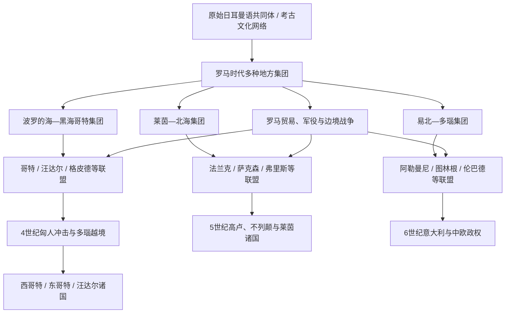

# 日耳曼部落

## 时间与范围

约公元前一千纪后期至公元6世纪；“日耳曼”既是罗马人的边疆分类，也是现代历史语言学对一组语言的统称，不等于单一民族、国家或稳定部落名单。

## 概括

“日耳曼部落”不是从北欧一次迁出、血缘纯一的共同民族。凯撒、塔西佗等罗马作者把莱茵河以东、多瑙河以北的许多集团归为“日耳曼人”，借此区分高卢行省与帝国外部；这些集团对自身的认同更多来自亲族、首领、地方、神祇和临时联盟。现代所谓日耳曼语族则依据语言亲缘重建，包括东、北、西日耳曼语支；语言边界、物质文化与政治身份并不完全重合。

公元前后，罗马扩张、贸易和军事招募深刻改变边疆社会。9年条顿堡森林战役使奥古斯都放弃把莱茵河以东整体建成行省，但罗马从未停止跨境战争、外交、补贴与招募。3世纪以后，法兰克、阿勒曼尼、萨克森、哥特等名称常指吸收旧部落、逃亡者和罗马军人的新联盟，而非远古部落原封不动地延续。4-6世纪的迁徙由匈人压力、帝国内战、气候与资源、追随首领的战利品分配和罗马定居政策共同驱动；它既有暴力入侵，也有同盟服役、谈判安置和逐代渗透。

## “日耳曼”概念的三层含义

| 层次 | 含义 | 可以说明什么 | 不能直接推出什么 |
|---|---|---|---|
| 罗马地理政治概念 | 凯撒以后常以莱茵河区分高卢人与“日耳曼人”，塔西佗再赋予共同风俗描述。 | 罗马如何组织边疆、敌友与民族志知识。 | 莱茵两岸实际族群边界固定，或所有被称日耳曼者自认同族。 |
| 历史语言学概念 | 由共同音变、词汇和语法重建原始日耳曼语及东、北、西分支。 | 哥特语、古诺斯语、古英语、古高地德语等的亲缘。 | 说相近日耳曼语的人一定属于同一政治共同体或拥有共同祖先神话。 |
| 历史政治身份 | 法兰克、哥特、萨克森、伦巴德等在战争、联盟和王权中形成的名称。 | 集团如何动员、制定法律并建立王国。 | 这些名称自青铜时代起人员组成不变，或现代民族国家是其直接纯系后裔。 |

“部落”一词也需谨慎。许多拉丁文中的民族名可以指小型亲族单位、区域联盟、军队、罗马登记的同盟军或国王统治下的多族人口。用“政治共同体”“军政联盟”有时比想象中的血缘部落更准确。

## 语言与主要集团

### 语言分支

- 东日耳曼语支包括有大量文献的哥特语，以及文献稀少的汪达尔、勃艮第等语言；这些语言在中世纪前后消亡。
- 北日耳曼语支由古诺斯语发展出丹麦语、瑞典语、挪威语、冰岛语等，主要属于斯堪的纳维亚和维京时代主线。
- 西日耳曼语支包括古英语、古弗里斯语、古撒克逊语、古高地德语、古荷兰语等；“西日耳曼人”是语言分类，不曾构成统一国家。
- 语支分化是长期过程，符文铭文与人名提供线索，但无法为每个古代政治集团精确指定单一语言。

### 罗马时代常见集团

| 区域 / 联盟 | 形成与活动 | 后续政治方向 |
|---|---|---|
| 切鲁西、卡狄等莱茵内地集团 | 与罗马军役关系密切；阿尔米尼乌斯利用罗马训练组织9年伏击。 | 联盟后来重组，名称多在晚期消失。 |
| 马科曼尼、夸迪 | 易北河与多瑙河地区强权，2世纪与罗马爆发马科曼尼战争。 | 部分融入苏维汇、巴伐利亚等后续认同。 |
| 法兰克 | 3世纪起在莱茵下游形成多个集团的联盟，部分在帝国内定居和服役。 | [法兰克王国](/%E4%BA%BA%E6%96%87%E7%A7%91%E5%AD%A6/%E5%8E%86%E5%8F%B2/%E6%AC%A7%E6%B4%B2/_%E9%80%9A%E5%8F%B2/%E5%90%8E%E7%BD%97%E9%A9%AC%E6%97%B6%E4%BB%A3%E7%9A%84%E6%97%A5%E8%80%B3%E6%9B%BC%E8%AF%B8%E5%9B%BD/%E6%B3%95%E5%85%B0%E5%85%8B%E7%8E%8B%E5%9B%BD/README.md)。 |
| 阿勒曼尼 | 3世纪起在莱茵上游出现的联盟，多次进入高卢。 | 被克洛维击败后逐步纳入法兰克，区域名称延续。 |
| 萨克森、盎格鲁、朱特、弗里斯 | 北海沿岸从海上贸易、劫掠和罗马军役中形成网络。 | [盎格鲁-撒克逊诸国](/%E4%BA%BA%E6%96%87%E7%A7%91%E5%AD%A6/%E5%8E%86%E5%8F%B2/%E6%AC%A7%E6%B4%B2/_%E9%80%9A%E5%8F%B2/%E5%90%8E%E7%BD%97%E9%A9%AC%E6%97%B6%E4%BB%A3%E7%9A%84%E6%97%A5%E8%80%B3%E6%9B%BC%E8%AF%B8%E5%9B%BD/%E7%9B%8E%E6%A0%BC%E9%B2%81-%E6%92%92%E5%85%8B%E9%80%8A%E8%AF%B8%E5%9B%BD.md)及大陆萨克森。 |
| 哥特 | 黑海北岸多个集团与切尔尼亚霍夫文化网络相关；4世纪政治分化。 | [西哥特王国](/%E4%BA%BA%E6%96%87%E7%A7%91%E5%AD%A6/%E5%8E%86%E5%8F%B2/%E6%AC%A7%E6%B4%B2/_%E9%80%9A%E5%8F%B2/%E5%90%8E%E7%BD%97%E9%A9%AC%E6%97%B6%E4%BB%A3%E7%9A%84%E6%97%A5%E8%80%B3%E6%9B%BC%E8%AF%B8%E5%9B%BD/%E8%A5%BF%E5%93%A5%E7%89%B9%E7%8E%8B%E5%9B%BD.md)、[东哥特王国](/%E4%BA%BA%E6%96%87%E7%A7%91%E5%AD%A6/%E5%8E%86%E5%8F%B2/%E6%AC%A7%E6%B4%B2/_%E9%80%9A%E5%8F%B2/%E5%90%8E%E7%BD%97%E9%A9%AC%E6%97%B6%E4%BB%A3%E7%9A%84%E6%97%A5%E8%80%B3%E6%9B%BC%E8%AF%B8%E5%9B%BD/%E4%B8%9C%E5%93%A5%E7%89%B9%E7%8E%8B%E5%9B%BD.md)。 |
| 汪达尔、阿兰复合集团 | 汪达尔为日耳曼语集团，阿兰为伊朗语集团；迁徙中接受共同王权。 | [汪达尔王国](/%E4%BA%BA%E6%96%87%E7%A7%91%E5%AD%A6/%E5%8E%86%E5%8F%B2/%E6%AC%A7%E6%B4%B2/_%E9%80%9A%E5%8F%B2/%E5%90%8E%E7%BD%97%E9%A9%AC%E6%97%B6%E4%BB%A3%E7%9A%84%E6%97%A5%E8%80%B3%E6%9B%BC%E8%AF%B8%E5%9B%BD/%E6%B1%AA%E8%BE%BE%E5%B0%94%E7%8E%8B%E5%9B%BD.md)。 |
| 勃艮第 | 早期来源与迁徙路线不确定，5世纪在莱茵和罗讷河建国。 | [勃艮第王国](/%E4%BA%BA%E6%96%87%E7%A7%91%E5%AD%A6/%E5%8E%86%E5%8F%B2/%E6%AC%A7%E6%B4%B2/_%E9%80%9A%E5%8F%B2/%E5%90%8E%E7%BD%97%E9%A9%AC%E6%97%B6%E4%BB%A3%E7%9A%84%E6%97%A5%E8%80%B3%E6%9B%BC%E8%AF%B8%E5%9B%BD/%E5%8B%83%E8%89%AE%E7%AC%AC%E7%8E%8B%E5%9B%BD.md)。 |
| 伦巴德 | 在易北、多瑙与潘诺尼亚长期迁徙、吸收盟众。 | [伦巴德王国](/%E4%BA%BA%E6%96%87%E7%A7%91%E5%AD%A6/%E5%8E%86%E5%8F%B2/%E6%AC%A7%E6%B4%B2/_%E9%80%9A%E5%8F%B2/%E5%90%8E%E7%BD%97%E9%A9%AC%E6%97%B6%E4%BB%A3%E7%9A%84%E6%97%A5%E8%80%B3%E6%9B%BC%E8%AF%B8%E5%9B%BD/%E4%BC%A6%E5%B7%B4%E5%BE%B7%E7%8E%8B%E5%9B%BD.md)。 |
| 格皮德、赫鲁利、鲁吉 | 多瑙和黑海世界的军政集团，常在匈人、东罗马与哥特体系中转换联盟。 | 建立短期政权或融入东罗马、伦巴德、东哥特军队。 |

## 社会与政治机制

### 首领、随从与大会

罗马作者描述自由战士大会、王与军事首领、贵族随从队等制度，但不同地区和时代差异很大。首领权力来自血统声望、宗教角色、对外谈判、战利品与罗马补贴的分配。战争会吸引外来追随者，失败则使联盟迅速解体；这解释为何政治名称可以扩张或消失，而不是因为全族人口同时迁徙。

“王”也不是单一职务。有的集团在战争时推举军王，和平时由多个贵族分权；有的王族声称神圣祖先；进入帝国后，首领又可同时拥有罗马军务长官、执政官或贵族头衔。后罗马王国正是这种首领政治与帝国官职结合的产物。

### 聚落、生产与交换

日耳曼语区并非只有迁徙牧民。多数人口经营谷物、畜牧和手工业，居住在不断移动或重建的村落；土地占有从家庭农户到大地产均存在。莱茵、多瑙边境的陶器、金属、玻璃、钱币和酒类贸易十分活跃。罗马军队采购牲畜、皮革与奴隶，边外精英用进口奢侈品展示地位。罗马货币与器物出现不等于当地被征服，而说明边疆经济互相依赖。

### 法律与身份

早期习惯法主要口头传承。建国后，西哥特、勃艮第、法兰克、伦巴德等王室用拉丁文编纂“蛮族法典”，常按族属和社会等级规定赔偿、婚姻、继承和司法程序。这些法典不是原始风俗的原样记录，而是国王、罗马法学和教会共同塑造的新制度，也说明身份可通过服役、婚姻、法律选择与王权归属改变。

## 罗马—日耳曼关系的阶段

### 扩张与边界形成（前1世纪-1世纪）

凯撒征服高卢时把莱茵塑造成高卢—日耳曼界线，但他也承认两岸人口移动。奥古斯都试图把军事控制推进易北河，罗马军团修路、建营并招募当地盟友。阿尔米尼乌斯出身切鲁西贵族，拥有罗马公民权和骑士身份，却在9年组织联盟，于条顿堡森林伏击瓦鲁斯三军团。罗马随后多次报复远征，但未建立永久易北行省，莱茵—多瑙成为主要军事边界。

### 边疆共生与联盟重组（1-3世纪）

罗马在界墙、军营和市场周围形成庞大边境经济。日耳曼首领可获得年金、人质教育和军职，也可能利用罗马内战越境。166-180年的马科曼尼战争显示多瑙集团能发动大规模联盟，罗马则通过战争、迁徙安置和分化外交恢复边境。3世纪帝国危机时，法兰克、阿勒曼尼等新名称出现，说明旧的小集团在持续战争中重组。

### 帝国内定居与军队“日耳曼化”的辨析（4世纪）

罗马越来越多招募边外士兵，也把战败或投降集团安置为农民和同盟军。军官如法兰克人阿尔博加斯特可进入最高统帅层，但军队包含巴尔干人、伊利里亚人、罗马地方人及多种外来者，不能简单称整个帝国军队“日耳曼化”。真正改变结构的是中央财政和征兵困难、将领掌握私人忠诚军队，以及皇位内战让边境集团成为决定性盟友。

### 迁徙与建国（4-6世纪）

375年前后匈人进入黑海草原，击破部分哥特政权并推动多瑙越境；此后匈人帝国本身又吸纳哥特、格皮德、阿兰和罗马人。406年越莱茵、410年罗马被攻、429年汪达尔渡海、451年沙隆战役、476年意大利皇位终止，都发生在帝国内战和外部迁徙交叠的环境中。迁徙群体往往只占行省人口少数，其王国必须依赖罗马税制、地主、主教与城市，因而“罗马灭亡—日耳曼完全取代”并非实际过程。

## 重要事件

| 时间 | 事件 | 意义 |
|---|---|---|
| 前58-前50年 | 凯撒高卢战争 | “日耳曼”被固定为罗马边疆分类，莱茵成为政治界线。 |
| 9年 | 条顿堡森林战役 | 罗马三军团覆灭，易北行省计划终止；边境互动仍继续。 |
| 166-180年 | 马科曼尼战争 | 多瑙联盟大规模冲击帝国，罗马采用战争与安置并行。 |
| 3世纪中叶 | 法兰克、阿勒曼尼联盟见于史料 | 小部落重组为更大军政共同体。 |
| 376-382年 | 哥特越境、阿德里安堡与条约 | 大型武装集团首次在帝国内以整体同盟地位长期存在。 |
| 406-407年 | 莱茵边界突破 | 汪达尔、阿兰、苏维汇等进入高卢，帝国内战加速。 |
| 410年 | 阿拉里克攻入罗马 | 哥特军政共同体成为帝国政治核心参与者。 |
| 418年 | 西哥特获阿基坦定居 | 同盟军向领土王国转化。 |
| 429-439年 | 汪达尔进入北非并夺迦太基 | 西罗马失去关键税粮区。 |
| 451年 | 沙隆战役 | 罗马、哥特、法兰克等联盟对抗匈人，敌友身份高度流动。 |
| 476年 | 奥多亚塞废罗慕路斯 | 西部皇位停止，意大利罗马行政由日耳曼军王接管。 |
| 493-568年 | 东哥特、伦巴德先后统治意大利 | 日耳曼军政王权与罗马社会形成不同整合模式。 |

## 迁徙的多重原因

- 外部压力：匈人、阿瓦尔等草原帝国改变黑海和多瑙力量平衡，但并非所有迁徙都由同一次“推力”造成。
- 罗马吸引：帝国内土地、税粮、军饷、官职和合法性具有强大吸引力；很多集团目标是获得帝国承认而非摧毁罗马文化。
- 内部政治：首领通过成功远征吸引追随者，王位争夺和联盟失败又会造成再迁徙。
- 帝国内战：竞争皇帝主动招募、安置或放任外来军队，削弱一致边防。
- 生态与人口：局部气候、疾病和资源压力可能影响移动，但证据不足以支持一场单因“人口爆炸”解释全欧迁徙。

## 后续转化与历史影响

日耳曼诸王国没有把罗马制度整体清零。国王采用拉丁文、罗马官职、基督教与帝国合法性，地方居民又逐渐接受王国法律和军事身份。西哥特与伦巴德形成统一或趋同法制，法兰克与高卢教会结合，盎格鲁—撒克逊不列颠则因罗马城市体系衰退更深而走出不同道路。大多数东日耳曼语言消失，西日耳曼与北日耳曼语言持续分化。

现代“德国人等于古代日耳曼人”的等式并不成立。德语名称与部分区域历史确有联系，但古代日耳曼语集团同时参与法国、英格兰、西班牙、意大利、北非和北欧历史；现代国家、民族和语言是在其后一千多年中形成。

## 演变关系

- 后罗马诸国入口：[后罗马时代的日耳曼诸国](/%E4%BA%BA%E6%96%87%E7%A7%91%E5%AD%A6/%E5%8E%86%E5%8F%B2/%E6%AC%A7%E6%B4%B2/_%E9%80%9A%E5%8F%B2/%E5%90%8E%E7%BD%97%E9%A9%AC%E6%97%B6%E4%BB%A3%E7%9A%84%E6%97%A5%E8%80%B3%E6%9B%BC%E8%AF%B8%E5%9B%BD/README.md)。
- 主要王国：[西哥特王国](/%E4%BA%BA%E6%96%87%E7%A7%91%E5%AD%A6/%E5%8E%86%E5%8F%B2/%E6%AC%A7%E6%B4%B2/_%E9%80%9A%E5%8F%B2/%E5%90%8E%E7%BD%97%E9%A9%AC%E6%97%B6%E4%BB%A3%E7%9A%84%E6%97%A5%E8%80%B3%E6%9B%BC%E8%AF%B8%E5%9B%BD/%E8%A5%BF%E5%93%A5%E7%89%B9%E7%8E%8B%E5%9B%BD.md)、[东哥特王国](/%E4%BA%BA%E6%96%87%E7%A7%91%E5%AD%A6/%E5%8E%86%E5%8F%B2/%E6%AC%A7%E6%B4%B2/_%E9%80%9A%E5%8F%B2/%E5%90%8E%E7%BD%97%E9%A9%AC%E6%97%B6%E4%BB%A3%E7%9A%84%E6%97%A5%E8%80%B3%E6%9B%BC%E8%AF%B8%E5%9B%BD/%E4%B8%9C%E5%93%A5%E7%89%B9%E7%8E%8B%E5%9B%BD.md)、[汪达尔王国](/%E4%BA%BA%E6%96%87%E7%A7%91%E5%AD%A6/%E5%8E%86%E5%8F%B2/%E6%AC%A7%E6%B4%B2/_%E9%80%9A%E5%8F%B2/%E5%90%8E%E7%BD%97%E9%A9%AC%E6%97%B6%E4%BB%A3%E7%9A%84%E6%97%A5%E8%80%B3%E6%9B%BC%E8%AF%B8%E5%9B%BD/%E6%B1%AA%E8%BE%BE%E5%B0%94%E7%8E%8B%E5%9B%BD.md)、[勃艮第王国](/%E4%BA%BA%E6%96%87%E7%A7%91%E5%AD%A6/%E5%8E%86%E5%8F%B2/%E6%AC%A7%E6%B4%B2/_%E9%80%9A%E5%8F%B2/%E5%90%8E%E7%BD%97%E9%A9%AC%E6%97%B6%E4%BB%A3%E7%9A%84%E6%97%A5%E8%80%B3%E6%9B%BC%E8%AF%B8%E5%9B%BD/%E5%8B%83%E8%89%AE%E7%AC%AC%E7%8E%8B%E5%9B%BD.md)、[法兰克王国](/%E4%BA%BA%E6%96%87%E7%A7%91%E5%AD%A6/%E5%8E%86%E5%8F%B2/%E6%AC%A7%E6%B4%B2/_%E9%80%9A%E5%8F%B2/%E5%90%8E%E7%BD%97%E9%A9%AC%E6%97%B6%E4%BB%A3%E7%9A%84%E6%97%A5%E8%80%B3%E6%9B%BC%E8%AF%B8%E5%9B%BD/%E6%B3%95%E5%85%B0%E5%85%8B%E7%8E%8B%E5%9B%BD/README.md)、[伦巴德王国](/%E4%BA%BA%E6%96%87%E7%A7%91%E5%AD%A6/%E5%8E%86%E5%8F%B2/%E6%AC%A7%E6%B4%B2/_%E9%80%9A%E5%8F%B2/%E5%90%8E%E7%BD%97%E9%A9%AC%E6%97%B6%E4%BB%A3%E7%9A%84%E6%97%A5%E8%80%B3%E6%9B%BC%E8%AF%B8%E5%9B%BD/%E4%BC%A6%E5%B7%B4%E5%BE%B7%E7%8E%8B%E5%9B%BD.md)。
- 不列颠方向：[盎格鲁-撒克逊诸国](/%E4%BA%BA%E6%96%87%E7%A7%91%E5%AD%A6/%E5%8E%86%E5%8F%B2/%E6%AC%A7%E6%B4%B2/_%E9%80%9A%E5%8F%B2/%E5%90%8E%E7%BD%97%E9%A9%AC%E6%97%B6%E4%BB%A3%E7%9A%84%E6%97%A5%E8%80%B3%E6%9B%BC%E8%AF%B8%E5%9B%BD/%E7%9B%8E%E6%A0%BC%E9%B2%81-%E6%92%92%E5%85%8B%E9%80%8A%E8%AF%B8%E5%9B%BD.md)。
- 德意志长期主线：[德意志历史](/%E4%BA%BA%E6%96%87%E7%A7%91%E5%AD%A6/%E5%8E%86%E5%8F%B2/%E6%AC%A7%E6%B4%B2/%E5%BE%B7%E6%84%8F%E5%BF%97/README.md)。
