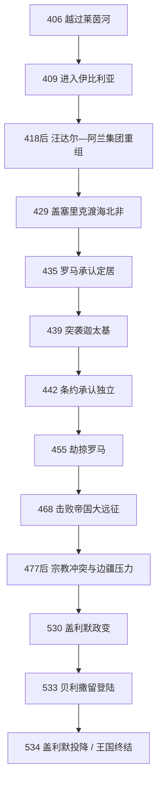

# 汪达尔王国

## 时间

429年-534年；435年获罗马承认北非定居地，439年夺取迦太基并形成独立海上王国。

## 概括

汪达尔王国是汪达尔人与阿兰人等迁徙集团在罗马北非建立的王国。它的崛起并非单靠“蛮族劫掠”：盖塞里克利用西罗马内战、北非地方军政冲突与帝国舰队不足，率集团于429年从伊比利亚渡海，439年突袭迦太基，接管非洲行省税收、粮食与港口。此后王国控制北非核心、巴利阿里群岛、撒丁、科西嘉及一度控制的西西里据点，以舰队打击西罗马海运；455年劫掠罗马和468年击败东西罗马联合远征标志其鼎盛。

王国继承罗马庄园、城市、铸币和行政人才，但土地没收使汪达尔军人集团成为新的特权层。统治者信奉阿里乌派，多数非洲罗马人信奉尼西亚派；政策从容忍到迫害不一，匈纳里克时期冲突最尖锐。盖塞里克的男系长幼序继承制避免了同时分国，却把王位交给宗族中最年长男性，造成晚期君主年长、继承支系互相猜忌。希尔德里克被盖利默推翻后，查士丁尼以恢复合法君主为由出兵。533年阿德西穆姆与特里卡马鲁姆两战摧毁王国野战军，534年盖利默投降。

## 迁徙、建立与崛起

### 从莱茵河到伊比利亚

406年末，哈斯丁汪达尔、息林汪达尔、阿兰、苏维汇等集团越过结冰与否存在争议的莱茵边境，穿过内战中的高卢，于409年进入伊比利亚。罗马政府以同盟安排分配其驻地，但西哥特军队奉帝国之命进攻他们。息林汪达尔和部分阿兰集团被重创，幸存者接受哈斯丁王贡德里克的领导，形成“汪达尔人与阿兰人的国王”这一复合王权。王国后来始终保留阿兰王号，说明族群身份来自共同迁徙与军政整合，而非纯血缘部落。

### 渡海与夺取迦太基

盖塞里克于428年继承王位，次年率军民从伊比利亚南部渡海，人数的古代记载可能包括男女老幼，精确规模不明。北非当时有总督博尼法提乌斯与中央政府冲突；“博尼法提乌斯主动邀请汪达尔”的传统说法证据相互矛盾，但内战确实削弱防御。汪达尔沿海岸东进，430-431年围攻希波，主教奥古斯丁在围城中去世。

435年西罗马条约承认汪达尔在毛里塔尼亚和努米底亚部分地区的同盟者地位。439年盖塞里克利用罗马注意力转向高卢，突然夺取未充分防守的迦太基。港口、船厂、粮仓和非洲富庶税区使一个陆上迁徙集团转化为海上强权。442年新条约事实上承认其独立，并以皇室婚约安排和平。

## 鼎盛：北非税基与西地中海海权

盖塞里克建立舰队，袭击西西里和意大利沿岸，控制或威胁撒丁、科西嘉、巴利阿里群岛。455年西罗马皇帝瓦伦提尼安三世被杀，原定嫁给盖塞里克之子的公主尤多西亚被迫另嫁；盖塞里克以婚约遭破坏为由进军罗马。教皇利奥一世的交涉可能限制了纵火和屠杀，但汪达尔仍系统运走金银、皇室成员与大量俘虏。后世“vandalism”把此事塑造成无差别毁坏，不能替代对有组织战利品与政治人质行动的理解。

西罗马多次反攻。460年皇帝马约里安在西班牙集结舰队，船只被汪达尔突袭摧毁；468年东皇利奥一世与西皇安特米乌斯发动规模巨大的联合远征，巴西利斯库斯舰队在迦太基附近被火攻和夜袭击溃。此次失败耗费巨额财政，确保王国数十年安全。474/475年的永久和约进一步确认盖塞里克控制。

| 权力基础 | 运作机制 | 脆弱点 |
|---|---|---|
| 非洲税收与粮食 | 接管迦太基、拜扎凯纳和努米底亚的庄园、港口与税务人员。 | 收益集中于沿海核心，一旦失去迦太基便难维持舰队。 |
| 汪达尔军人土地 | 没收王室和大地主土地，分配给核心军队；普通罗马土地制度继续。 | 特权军人数量有限，与更广泛非洲人口存在距离。 |
| 舰队与岛屿基地 | 使用罗马港口、船员与造船技术，进行突袭而非长期海战控制所有航线。 | 晚期缺乏盖塞里克式统帅，岛屿和边缘地区逐渐丧失。 |
| 罗马行政连续 | 铸造高质量钱币，保存城市、庄园文书与税收实践。 | 阿里乌王权对尼西亚教会的没收与流放削弱地方合作。 |
| 王室男系长幼序继承法 | 盖塞里克规定王族中辈分最长男性继位，减少幼子分国。 | 导致侄叔相继、晚年继位者年龄偏高，产生旁支清洗。 |

## 宗教、社会与族群整合

汪达尔王室与军队主要信奉阿里乌派，非洲罗马居民与主教多信奉尼西亚派。盖塞里克没收迦太基大教堂与部分主教财产，流放反对者，但政策随外交需要变化。匈纳里克于484年召集迦太基宗教会议，随后关闭教堂、流放主教并强迫改宗，是迫害高潮。贡萨蒙德和特拉萨蒙德仍限制教会组织，却也有缓和期；希尔德里克允许流亡主教返回并亲近君士坦丁堡。

王国并非只有汪达尔征服者与被动罗马人两群体。阿兰、毛里人、城市商人、非洲乡村劳动者、奴隶和犹太社群处境不同。汪达尔精英采用拉丁语、罗马住宅、诗歌和钱币；迦太基继续是文化中心。与此同时，王室未能把毛里塔尼亚与奥雷斯山区完全纳入常规税收，地方“毛里—罗马”政治体逐渐扩大，这既是边疆压力，也是北非罗马国家长期区域差异的延续。

## 完整君主世系

| 顺序 | 君主 | 在位 | 与前任关系 | 关键事件 / 备注 |
|---:|---|---|---|---|
| — | 戈迪吉塞尔 | 约389-406 | 盖塞里克与贡德里克之父 | 迁徙前的哈斯丁汪达尔王；越莱茵前后与法兰克作战阵亡，不属于北非王国。 |
| — | 贡德里克 | 407-428 | 戈迪吉塞尔之子 | 率众进入伊比利亚，吸收阿兰残部并控制贝提卡；北非王国的直接前身首领。 |
| 1 | **盖塞里克** | 428-477；439起据迦太基 | 贡德里克异母弟 | 渡海、夺取迦太基、建立舰队；455年劫掠罗马，468年击败帝国远征。 |
| 2 | 匈纳里克 | 477-484 | 盖塞里克之子 | 依据男系长幼序继承法即位；清洗王族竞争者，严厉迫害尼西亚派，统治末年遭瘟疫和毛里反抗。 |
| 3 | 贡萨蒙德 | 484-496 | 盖塞里克之孙、根托之子 | 依辈分继承；对尼西亚派较缓和，面对毛里人与东哥特争夺西西里。 |
| 4 | 特拉萨蒙德 | 496-523 | 贡萨蒙德之弟 | 娶东哥特王妹阿玛拉弗里达，维系西方同盟；流放拒绝改宗的主教。 |
| 5 | 希尔德里克 | 523-530 | 匈纳里克之子、瓦伦提尼安三世外孙 | 亲东罗马、恢复尼西亚派教会；军队败于毛里人后被盖利默政变囚禁。 |
| 6 | **盖利默** | 530-534 | 盖塞里克曾孙、盖拉里斯之子 | 推翻希尔德里克，触发东罗马干预；533年两次会战失败，534年投降。 |

## 拜占庭征服的具体过程

533年，查士丁尼任命贝利撒留统率一支规模不算庞大但组织完整的海陆军。盖利默此前派弟弟察宗带主力去镇压撒丁叛乱，又未能封锁登陆点，使帝国军在卡普特瓦达安全上岸。盖利默设计在迦太基外阿德西穆姆三路合围，但各路未同步；其弟阿马塔斯战死后，盖利默在战场因处理亲属尸体失去追击时机，贝利撒留进入迦太基。

察宗从撒丁返回后，双方于533年12月在特里卡马鲁姆再战。帝国骑兵反复冲击，察宗战死，盖利默撤离造成全军崩溃。希尔德里克已在盖利默命令下被杀，失去复位可能。盖利默逃入帕普阿山，因饥困于534年投降，被带到君士坦丁堡参加凯旋式，后获庄园养老。北非成为帝国行省，但毛里战争、兵变和高税使恢复统治并不轻松。

## 重要事件

| 时间 | 事件 | 结果 |
|---|---|---|
| 406-409年 | 越莱茵、进入伊比利亚 | 迁徙集团在罗马内战中寻找定居地。 |
| 418年前后 | 汪达尔—阿兰合并 | 贡德里克兼称两族国王，形成复合军政共同体。 |
| 429年 | 渡过直布罗陀海峡 | 北非成为新的战略目标。 |
| 430-431年 | 围攻希波 | 打开努米底亚门户，暴露帝国防御崩溃。 |
| 439年 | 夺取迦太基 | 获得首都、税基、粮食与舰队。 |
| 442年 | 与西罗马订约 | 王国独立和疆界获事实承认。 |
| 455年 | 劫掠罗马 | 取得财富与皇室人质，震动西地中海。 |
| 468年 | 邦角海战 / 帝国远征失败 | 王国达到安全与海权顶峰，东罗马财政受重创。 |
| 484年 | 匈纳里克宗教会议与迫害 | 尼西亚教会遭系统打击，社会裂痕加深。 |
| 523年 | 希尔德里克即位 | 转向亲东罗马和宗教缓和，引起军人反对。 |
| 530年 | 盖利默政变 | 破坏与君士坦丁堡关系，提供征服借口。 |
| 533年 | 阿德西穆姆、特里卡马鲁姆战役 | 汪达尔主力覆灭，迦太基失守。 |
| 534年 | 盖利默投降 | 王国灭亡，北非转入东罗马统治。 |

## 兴盛、衰落与灭亡原因

### 鼎盛条件

- 迦太基及非洲行省是西罗马最富裕的粮食、橄榄油与税收中心之一。
- 西罗马内战和舰队不足使盖塞里克能逐次扩张；岛屿基地支撑快速海上突袭。
- 盖塞里克长期统治、军事威望与清晰的宗族继承安排抑制了早期内战。
- 罗马行政、城市和庄园经济被保留，汪达尔精英能从现成体系获取资源。

### 结构性衰落因素

- 核心军人集团规模有限，海上帝国过度依赖单一首都、单一舰队和非洲沿海税基。
- 男系长幼序继承法避免分国，却造成老年继位和王族旁支清洗，无法培养稳定的父子继承行政团队。
- 宗教没收和流放使尼西亚主教、地主与城市精英难以形成长期认同。
- 内陆毛里政治体扩张，边疆土地和兵源逐渐脱离王室控制；晚期舰队也未维持盖塞里克时代优势。

### 外部压力与直接触发

- 查士丁尼的帝国拥有更大财政、海军和多地区兵源，且在与波斯暂时议和后可发动远征。
- 希尔德里克亲帝国政策和盖利默政变把内部继承争议转成国际合法性危机。
- 盖利默分兵撒丁、未阻击登陆、阿德西穆姆协同失败，是征服迅速成功的直接军事原因。
- 两场会战的偶然与指挥错误很重要；不能把灭亡简化为宗教迫害的“必然惩罚”或汪达尔“天生不善治理”。

## 演变关系

- 前一背景：[西罗马帝国](/%E4%BA%BA%E6%96%87%E7%A7%91%E5%AD%A6/%E5%8E%86%E5%8F%B2/%E6%AC%A7%E6%B4%B2/_%E9%80%9A%E5%8F%B2/%E5%8F%A4%E7%BD%97%E9%A9%AC/%E8%A5%BF%E7%BD%97%E9%A9%AC%E5%B8%9D%E5%9B%BD.md)的伊比利亚与非洲行省危机。
- 同期海上与意大利关系：[东哥特王国](/%E4%BA%BA%E6%96%87%E7%A7%91%E5%AD%A6/%E5%8E%86%E5%8F%B2/%E6%AC%A7%E6%B4%B2/_%E9%80%9A%E5%8F%B2/%E5%90%8E%E7%BD%97%E9%A9%AC%E6%97%B6%E4%BB%A3%E7%9A%84%E6%97%A5%E8%80%B3%E6%9B%BC%E8%AF%B8%E5%9B%BD/%E4%B8%9C%E5%93%A5%E7%89%B9%E7%8E%8B%E5%9B%BD.md)。
- 后一节点：东罗马非洲总督区及后来的北非地方政权。
- 所属总览：[后罗马时代的日耳曼诸国](/%E4%BA%BA%E6%96%87%E7%A7%91%E5%AD%A6/%E5%8E%86%E5%8F%B2/%E6%AC%A7%E6%B4%B2/_%E9%80%9A%E5%8F%B2/%E5%90%8E%E7%BD%97%E9%A9%AC%E6%97%B6%E4%BB%A3%E7%9A%84%E6%97%A5%E8%80%B3%E6%9B%BC%E8%AF%B8%E5%9B%BD/README.md)。
