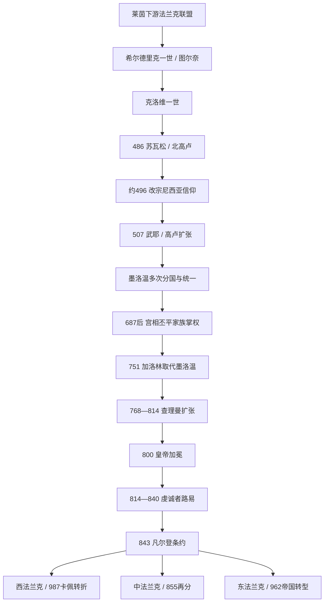

# 法兰克王国

## 时间

约481/486年-843年为墨洛温、加洛林共同法兰克王国主线；843年后三个继承王国分别延续并分化，西法兰克至987年、东法兰克主线至962年，中法兰克自855年起再分。

## 概括

法兰克王国由莱茵下游多个法兰克集团与晚期罗马高卢社会结合而成。克洛维一世在486年后取得北高卢，约496年前后改宗尼西亚基督教，507年击败西哥特；其后墨洛温诸王把勃艮第、图林根等地纳入王国。王国可在王族诸子之间分割，奥斯特拉西亚、纽斯特里亚和勃艮第既有独立宫廷又共享法兰克王权。

7世纪后期，奥斯特拉西亚宫相丕平家族控制军队和贵族联盟。丕平三世751年废黜墨洛温末王，建立加洛林王朝；查理曼征服伦巴德、萨克森、巴伐利亚和阿瓦尔边地，800年加冕皇帝。帝国没有统一常备官僚和不可分继承法，虔诚者路易诸子内战后，843年《凡尔登条约》形成西、中、东法兰克。三者不是现代法国、意大利、德国在843年的直接诞生，而是此后区域王国的共同前史。

## 历史主线

法兰克崛起的关键不是简单“日耳曼人征服罗马人”，而是法兰克军事首领接管高卢城市、税收、庄园与主教网络。尼西亚信仰帮助王权与高卢罗马多数合作；拉丁文、罗马法和地方伯爵制延续，法兰克习惯法与军役体系又改变政治。墨洛温分国能让多位成年国王同时远征，却造成王族内战和地方宫相上升。

加洛林家族凭宫相军政资源、教皇联盟和边疆胜利取代旧王朝。查理曼的帝国由国王巡行、伯爵、主教、修道院、皇家使者和年度大会连接；长期征服与战利品维持精英合作。继承战争停止扩张后，地方贵族支持不同王子，最终把一个复合帝国制度化为多个王国。

843年后：

- 西法兰克逐渐形成罗贝尔—加洛林竞争，维京定居与地方诸侯化，987年转入卡佩王朝。
- 中法兰克855年即按洛泰尔一世三子再分，衍生洛林、上 / 下勃艮第和意大利多王竞争。
- 东法兰克911年加洛林绝嗣，919年萨克森王朝兴起，962年奥托一世加冕后进入神圣罗马帝国主线。

## 阶段导航

| 顺序 | 笔记 | 时间 | 本页定位 |
|---:|---|---|---|
| 1 | [墨洛温王朝](/%E4%BA%BA%E6%96%87%E7%A7%91%E5%AD%A6/%E5%8E%86%E5%8F%B2/%E6%AC%A7%E6%B4%B2/_%E9%80%9A%E5%8F%B2/%E5%90%8E%E7%BD%97%E9%A9%AC%E6%97%B6%E4%BB%A3%E7%9A%84%E6%97%A5%E8%80%B3%E6%9B%BC%E8%AF%B8%E5%9B%BD/%E6%B3%95%E5%85%B0%E5%85%8B%E7%8E%8B%E5%9B%BD/%E5%A2%A8%E6%B4%9B%E6%B8%A9%E7%8E%8B%E6%9C%9D.md) | 约481-751年 | 克洛维扩张、分国制度、王权—教会整合、宫相崛起及王朝被废全过程。 |
| 2 | [加洛林王朝](/%E4%BA%BA%E6%96%87%E7%A7%91%E5%AD%A6/%E5%8E%86%E5%8F%B2/%E6%AC%A7%E6%B4%B2/_%E9%80%9A%E5%8F%B2/%E5%90%8E%E7%BD%97%E9%A9%AC%E6%97%B6%E4%BB%A3%E7%9A%84%E6%97%A5%E8%80%B3%E6%9B%BC%E8%AF%B8%E5%9B%BD/%E6%B3%95%E5%85%B0%E5%85%8B%E7%8E%8B%E5%9B%BD/%E5%8A%A0%E6%B4%9B%E6%9E%97%E7%8E%8B%E6%9C%9D.md) | 751-843年；各支后续不同 | 丕平称王、查理曼帝国、统治结构、继承内战与三分原因。 |
| 3 | [西法兰克王国](/%E4%BA%BA%E6%96%87%E7%A7%91%E5%AD%A6/%E5%8E%86%E5%8F%B2/%E6%AC%A7%E6%B4%B2/_%E9%80%9A%E5%8F%B2/%E5%90%8E%E7%BD%97%E9%A9%AC%E6%97%B6%E4%BB%A3%E7%9A%84%E6%97%A5%E8%80%B3%E6%9B%BC%E8%AF%B8%E5%9B%BD/%E6%B3%95%E5%85%B0%E5%85%8B%E7%8E%8B%E5%9B%BD/%E8%A5%BF%E6%B3%95%E5%85%B0%E5%85%8B%E7%8E%8B%E5%9B%BD.md) | 843-987年 | 秃头查理至路易五世，罗贝尔家族竞争、诺曼底形成与卡佩转折。 |
| 4 | [中法兰克王国](/%E4%BA%BA%E6%96%87%E7%A7%91%E5%AD%A6/%E5%8E%86%E5%8F%B2/%E6%AC%A7%E6%B4%B2/_%E9%80%9A%E5%8F%B2/%E5%90%8E%E7%BD%97%E9%A9%AC%E6%97%B6%E4%BB%A3%E7%9A%84%E6%97%A5%E8%80%B3%E6%9B%BC%E8%AF%B8%E5%9B%BD/%E6%B3%95%E5%85%B0%E5%85%8B%E7%8E%8B%E5%9B%BD/%E4%B8%AD%E6%B3%95%E5%85%B0%E5%85%8B%E7%8E%8B%E5%9B%BD.md) | 843-855年；后继至10世纪以后 | 洛泰尔王国、洛塔林吉亚、勃艮第与意大利的再分化。 |
| 5 | [东法兰克王国](/%E4%BA%BA%E6%96%87%E7%A7%91%E5%AD%A6/%E5%8E%86%E5%8F%B2/%E6%AC%A7%E6%B4%B2/_%E9%80%9A%E5%8F%B2/%E5%90%8E%E7%BD%97%E9%A9%AC%E6%97%B6%E4%BB%A3%E7%9A%84%E6%97%A5%E8%80%B3%E6%9B%BC%E8%AF%B8%E5%9B%BD/%E6%B3%95%E5%85%B0%E5%85%8B%E7%8E%8B%E5%9B%BD/%E4%B8%9C%E6%B3%95%E5%85%B0%E5%85%8B%E7%8E%8B%E5%9B%BD.md) | 843-962年 | 加洛林东支、部族公国、亨利与奥托王朝、帝国转型。 |
| 专表 | [法兰克统治者完整世系表](/%E4%BA%BA%E6%96%87%E7%A7%91%E5%AD%A6/%E5%8E%86%E5%8F%B2/%E6%AC%A7%E6%B4%B2/_%E9%80%9A%E5%8F%B2/%E5%90%8E%E7%BD%97%E9%A9%AC%E6%97%B6%E4%BB%A3%E7%9A%84%E6%97%A5%E8%80%B3%E6%9B%BC%E8%AF%B8%E5%9B%BD/%E6%B3%95%E5%85%B0%E5%85%8B%E7%8E%8B%E5%9B%BD/%E6%B3%95%E5%85%B0%E5%85%8B%E7%BB%9F%E6%B2%BB%E8%80%85%E5%AE%8C%E6%95%B4%E4%B8%96%E7%B3%BB%E8%A1%A8.md) | 5世纪中叶-10世纪 | 墨洛温全部分国王、争议王、无王期，以及西中东各支共治、复位与跨区王冠。 |

## 关键转折

| 时间 | 事件 | 政治意义 |
|---|---|---|
| 486年 | 克洛维击败苏瓦松 | 接管北高卢罗马军政核心。 |
| 约496-508年 | 克洛维受洗 | 法兰克王权与尼西亚派高卢教会结合；精确年份有争议。 |
| 507年 | 武耶战役 | 西哥特退向伊比利亚，法兰克取得阿基坦大部。 |
| 511年 | 克洛维四子分国 | 法兰克共同王权与多宫廷制度确立。 |
| 613年 | 克洛泰尔二世再统一 | 王后战争结束，宫相和地区贵族地位制度化。 |
| 687年 | 泰尔特里战役 | 赫斯塔尔丕平取得跨王国宫相霸权。 |
| 732年 | 图尔—普瓦捷战役 | 查理·马特击退当次安达卢斯远征，军政威望上升。 |
| 751年 | 丕平三世称王 | 加洛林王朝以贵族推举、教会受膏取代墨洛温。 |
| 774年 | 查理曼征服伦巴德 | 法兰克进入意大利并保护教皇。 |
| 800年 | 查理曼加冕皇帝 | 西方帝权复兴，与东罗马和教皇关系重构。 |
| 817年 | 《帝国诏令》 | 尝试以长子共帝维持统一，却未解决后生子继承。 |
| 841年 | 丰特努瓦战役 | 洛泰尔一世无法强制统一帝国。 |
| 843年 | 《凡尔登条约》 | 三位兄弟各获王国，帝国共同统治阶段结束。 |
| 855年 | 《普吕姆条约》 | 中法兰克再分，狭长王国迅速解体。 |
| 911年 | 东法兰克加洛林绝嗣 | 诸侯推举康拉德一世，东部王位转向选举。 |
| 962年 | 奥托一世加冕 | 东法兰克 / 德意志王国与意大利形成帝国复合主线。 |
| 987年 | 雨果·卡佩获选 | 西法兰克加洛林终结，卡佩王朝开始。 |

## 统治结构比较

| 阶段 | 王权基础 | 地方治理 | 主要继承问题 |
|---|---|---|---|
| 墨洛温 | 王室神圣血统、战利品、庄园、教会合作 | 城市伯爵、公爵、主教、宫相 | 所有儿子分国，王族内战与幼王频繁。 |
| 早期加洛林 | 宫相军政网络、受膏、教皇联盟 | 伯爵、侯爵、主教、修道院、皇家使者 | 新王朝需不断以征服和宗教合法性巩固。 |
| 查理曼帝国 | 皇帝个人威望、年度远征、王室庄园与跨区教会 | 巡行宫廷和地方精英合作 | 无固定中央税军，个人统治难制度化。 |
| 843年后 | 各分国王室与区域贵族联盟 | 公爵、伯爵和主教职务家族化 / 地方化 | 跨区绝嗣、复位、贵族推举与王朝竞争。 |

## 名称与继承辨析

- “法兰克王国”是墨洛温、加洛林时期跨高卢与莱茵两岸的共同政体，不应只归入法国史或德国史。
- 843年“西 / 中 / 东法兰克”主要是史学方位称呼，国王仍常自称法兰克人的国王。
- 中法兰克并非现代意大利：其领地还包括洛林、勃艮第和低地；意大利本身又保留伦巴德王国制度。
- 东法兰克到“德意志王国”、西法兰克到“法兰西王国”都是渐变。962、987适合作为王朝与帝国主线分界，不是人口身份一夜改变。
- 世系表中的重叠是共治、分区或争位的真实反映，不能为排成直线而删除。

## 演变关系

- 前一节点：[后罗马时代的日耳曼诸国](/%E4%BA%BA%E6%96%87%E7%A7%91%E5%AD%A6/%E5%8E%86%E5%8F%B2/%E6%AC%A7%E6%B4%B2/_%E9%80%9A%E5%8F%B2/%E5%90%8E%E7%BD%97%E9%A9%AC%E6%97%B6%E4%BB%A3%E7%9A%84%E6%97%A5%E8%80%B3%E6%9B%BC%E8%AF%B8%E5%9B%BD/README.md)与[日耳曼部落](/%E4%BA%BA%E6%96%87%E7%A7%91%E5%AD%A6/%E5%8E%86%E5%8F%B2/%E6%AC%A7%E6%B4%B2/_%E9%80%9A%E5%8F%B2/%E5%90%8E%E7%BD%97%E9%A9%AC%E6%97%B6%E4%BB%A3%E7%9A%84%E6%97%A5%E8%80%B3%E6%9B%BC%E8%AF%B8%E5%9B%BD/%E6%97%A5%E8%80%B3%E6%9B%BC%E9%83%A8%E8%90%BD.md)。
- 高卢前史：[西罗马帝国](/%E4%BA%BA%E6%96%87%E7%A7%91%E5%AD%A6/%E5%8E%86%E5%8F%B2/%E6%AC%A7%E6%B4%B2/_%E9%80%9A%E5%8F%B2/%E5%8F%A4%E7%BD%97%E9%A9%AC/%E8%A5%BF%E7%BD%97%E9%A9%AC%E5%B8%9D%E5%9B%BD.md)。
- 法国方向：[法国历史](/%E4%BA%BA%E6%96%87%E7%A7%91%E5%AD%A6/%E5%8E%86%E5%8F%B2/%E6%AC%A7%E6%B4%B2/%E6%B3%95%E5%9B%BD/README.md)。
- 德意志方向：[德意志历史](/%E4%BA%BA%E6%96%87%E7%A7%91%E5%AD%A6/%E5%8E%86%E5%8F%B2/%E6%AC%A7%E6%B4%B2/%E5%BE%B7%E6%84%8F%E5%BF%97/README.md)。
- 意大利方向：[意大利历史](/%E4%BA%BA%E6%96%87%E7%A7%91%E5%AD%A6/%E5%8E%86%E5%8F%B2/%E6%AC%A7%E6%B4%B2/%E6%84%8F%E5%A4%A7%E5%88%A9/README.md)。
