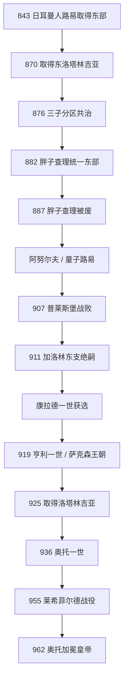

# 东法兰克王国

## 时间

843年-962年；911年东部加洛林直系断绝，919年后常称“德意志王国”，962年奥托一世加冕使主线进入神圣罗马帝国，但王国本身并未在当天消失。

## 概括

东法兰克王国是843年《凡尔登条约》中日耳曼人路易取得的帝国东部，核心包括萨克森、法兰肯、巴伐利亚、阿勒曼尼亚 / 施瓦本，870年后取得洛塔林吉亚东部。这里并非语言和民族完全一致：拉丁文是教会与王室书写语言，西部有罗曼语人口，斯拉夫、丹麦与马扎尔边疆又不断变化。“东法兰克”逐渐被“德意志人之王国”等称呼取代，是9-11世纪的演变，不是843年立即建立现代德国。

876年日耳曼人路易死后，三子分区共治；胖子查理882年重聚东部并一度继承帝国大部，887年因贵族反对被废。克恩滕的阿努尔夫、童子路易继续加洛林王统，期间维京、摩拉维亚与马扎尔压力使萨克森、巴伐利亚、法兰肯、施瓦本等公国形成强大地方军事网络。911年童子路易无嗣去世，诸侯选法兰肯公爵康拉德一世，而西法兰克加洛林王查理三世只获得洛塔林吉亚。

康拉德难以压服诸公国，临终推荐萨克森公爵亨利。919年亨利一世即位，通过妥协承认公爵地位、重建边防和征服洛塔林吉亚奠定奥托王朝。奥托一世镇压王族与公爵叛乱，依靠主教和修道院治理，955年莱希菲尔德击败马扎尔、同年在雷克尼茨击败斯拉夫联盟。951、961年两次进入意大利，962年由教皇加冕皇帝。东法兰克没有“灭亡”，而是成为德意志王国和跨阿尔卑斯帝国的核心王国。

## 建立与加洛林分区统治（843-887）

### 日耳曼人路易

日耳曼人路易早在父亲在世时统治巴伐利亚，并多次反叛争取莱茵以东更大领地。843年后，他以雷根斯堡、法兰克福等宫廷为中心，依靠修道院、主教和地方贵族统治。其王国面对丹麦、易北河以东斯拉夫集团与大摩拉维亚；路易用军事远征、传教和任命边疆侯爵扩大影响，但大摩拉维亚在罗斯季斯拉夫、斯瓦托普鲁克时期保持自主。

869年洛泰尔二世死后，东、西叔父于870年瓜分洛塔林吉亚；路易取得莱茵以东及梅斯、亚琛等部分区域。876年秃头查理试图趁路易死进攻，在安德纳赫被青年路易击败，东部王国显示独立军事认同。

### 三子与胖子查理

日耳曼人路易把王国分给卡洛曼、青年路易和胖子查理。卡洛曼控制巴伐利亚并于877年取得意大利王号；青年路易控制萨克森、法兰肯、图林根，880年又继承巴伐利亚；胖子查理统治阿勒曼尼亚，879年继承意大利、882年继承全部东法兰克。三兄弟在位重叠，不应排成简单先后序列。

胖子查理881年加冕皇帝，884年又获西法兰克贵族邀请，短暂重聚查理曼帝国大部。885-886年他以赎金解决巴黎维京围攻，东部贵族又不满其无合法子、病弱并偏爱侄子。887年阿努尔夫在巴伐利亚起兵，贵族会议废黜胖子查理。帝国重聚终止，各区域另立统治者。

## 阿努尔夫、童子路易与边疆危机（887-911）

克恩滕的阿努尔夫是卡洛曼非婚生子，凭东南边疆军力即位。他允许或鼓励大摩拉维亚内部分裂，并于891年鲁汶战役击败维京军。894、895/896年两次进军意大利，896年在罗马加冕皇帝，但中风后撤退，未能建立长期意大利统治。899年去世后，幼子童子路易在美因茨获选，主教和公爵摄政。

约900年马扎尔人在喀尔巴阡盆地建立力量，快速骑兵反复袭击巴伐利亚、意大利和更远地区。907年巴伐利亚军在普莱斯堡战役惨败，东部边区崩溃，王国停止向潘诺尼亚扩张。地方公爵以组织防御为理由扩大权力。童子路易911年无嗣去世，东部诸侯没有邀请西法兰克查理三世统治全境，而是选康拉德一世；洛塔林吉亚贵族却投向查理，说明各区选择不同。

## 部族公国与康拉德一世（911-918）

所谓“部族公国”不是古代部族国家原样复活，而是加洛林边疆、伯爵家族、主教区和军事危机结合形成的区域权力：

| 公国 | 权力基础 | 与王权关系 |
|---|---|---|
| 萨克森 | 柳多尔芬家族、东部边疆军力和多个撒克森集团 | 亨利一世拒绝康拉德压制，919年取得王位。 |
| 巴伐利亚 | 阿努尔夫公爵掌握地方教会、边疆与对马扎尔战争 | 一度自行任命主教，后与亨利妥协承认王位。 |
| 法兰肯 | 康拉丁家族在中莱茵与主教网络的资源 | 康拉德一世的直接基地，王死后公国逐渐分散。 |
| 施瓦本 | 阿勒曼尼亚伯爵、修道院和博登湖网络 | 917年布尔夏德二世成为公爵，向亨利臣服。 |
| 洛塔林吉亚 | 加洛林宫廷遗产、莱茵—默兹主教与贵族 | 911转向西法兰克，925被亨利一世重新纳入东部。 |

康拉德一世试图以加洛林王权方式任命主教、压制公爵，却在萨克森和巴伐利亚战争中失败。918年临终时，他据后世记载让弟弟把王权标志交给主要对手亨利，承认只有萨克森军力能维持王国。无论细节是否经奥托史家润色，919年非王族诸侯选择亨利确实标志跨公国妥协。

## 亨利一世：妥协式重建（919-936）

亨利没有立即由大主教举行传统受膏，强调军人与诸侯推举。他逐一与施瓦本、巴伐利亚公爵达成承认王位、保留内部权力的协议；925年利用西法兰克内乱取得洛塔林吉亚，并让本地公爵保持地位。王国因此不是高度中央集权，而是国王作为公爵中的最高协调者。

924年马扎尔袭击后，亨利俘获一名首领，以九年贡金休战，利用时间修建或扩充城堡、训练骑兵。933年拒绝续贡，在里阿德战役击败马扎尔军。向东，他征服易北河沿岸斯拉夫要塞，建立迈森等边区；934年又迫使丹麦王臣服或纳贡。929年他在奎德林堡安排诸子与贵族继承，指定奥托而非按传统分割王国，为单一王位继承奠定先例。

## 奥托一世与帝国转型（936-962）

### 王族叛乱与教会治理

936年奥托在查理曼的阿亨宫廷加冕，公爵们象征性承担宫廷职务，宣示更强王权。他把公国交给亲属或姻亲，却因此引发异母兄坦克马尔、弟弟亨利、儿子柳多尔夫与女婿康拉德等叛乱。939年安德纳赫胜利与954年镇压柳多尔夫叛乱后，奥托减少对世袭公爵的单纯依赖，重用主教和修道院长，授予地产、司法和市场权。教会领主无合法婚生世袭子嗣，理论上职位可由国王重新任命；但他们并非没有家族利益，也会参与政治竞争。

### 955年双重胜利

954年马扎尔大军趁内乱入境。955年8月，奥托在奥格斯堡附近莱希菲尔德集结萨克森、巴伐利亚、施瓦本、法兰肯和波希米亚部队，击败马扎尔，俘杀撤退首领。战役终止其向德意志腹地的大规模掠夺，并提升奥托为基督教保护者的威望。同年萨克森军在雷克尼茨击败奥博特里特等斯拉夫联盟，东部边疆重新受控。

### 意大利与962年加冕

951年意大利王洛泰尔二世死后，贝伦加尔二世囚禁王后阿德莱德。奥托越过阿尔卑斯，迎娶阿德莱德并称意大利王，但因国内叛乱暂时承认贝伦加尔为附庸。贝伦加尔继续威胁教皇若望十二世，奥托961年再次入意大利，962年在罗马加冕皇帝。随后《奥托特权》确认教皇领地并要求教皇选举与皇帝关系，双方很快冲突，奥托废立教皇。

962年不是一个全新国家从无到有的确切“建国日”。奥托继承加洛林帝权、东法兰克王国和意大利王冠；后世逐渐称这一政治体为罗马帝国、最终为神圣罗马帝国。本页以962为阶段分界，以避免与帝国专页重复。

## 完整国王表

| 顺序 | 君主 | 在位 | 分区 / 继承 | 关键事件 |
|---:|---|---|---|---|
| 1 | **日耳曼人路易** | 843-876 | 加洛林；虔诚者路易之子 | 建立东部分国，870年取得东洛塔林吉亚。 |
| 2A | 卡洛曼 | 876-880 | 长子，统治巴伐利亚；877起兼意大利 | 病重后分让领地，无合法子。 |
| 2B | 青年路易 | 876-882 | 次子，萨克森、法兰肯、图林根；880后兼巴伐利亚 | 876年安德纳赫胜西军，无合法子。 |
| 2C | 胖子查理 | 876-887 | 幼子，先阿勒曼尼亚；882后统合东部 | 884-887短暂重聚帝国大部，887年被废。 |
| 3 | 克恩滕的阿努尔夫 | 887-899 | 卡洛曼非婚生子 | 击败维京，896年称帝。 |
| 4 | 童子路易 | 900-911 | 阿努尔夫之子 | 幼王；马扎尔入侵和公国上升，加洛林东支终结。 |
| 5 | 康拉德一世 | 911-918 | 康拉丁家族、法兰肯公爵，经诸侯推举 | 难以压服诸公国，临终转向萨克森继承。 |
| 6 | **亨利一世** | 919-936 | 奥托王朝、萨克森公爵 | 通过妥协整合公国，925取洛林，933胜马扎尔。 |
| 7 | **奥托一世** | 936-973；962起皇帝 | 亨利一世之子 | 镇压叛乱、955双胜、962加冕；本页只追至帝国阶段开启。 |

更广共治与跨区王冠见[法兰克统治者完整世系表](/%E4%BA%BA%E6%96%87%E7%A7%91%E5%AD%A6/%E5%8E%86%E5%8F%B2/%E6%AC%A7%E6%B4%B2/_%E9%80%9A%E5%8F%B2/%E5%90%8E%E7%BD%97%E9%A9%AC%E6%97%B6%E4%BB%A3%E7%9A%84%E6%97%A5%E8%80%B3%E6%9B%BC%E8%AF%B8%E5%9B%BD/%E6%B3%95%E5%85%B0%E5%85%8B%E7%8E%8B%E5%9B%BD/%E6%B3%95%E5%85%B0%E5%85%8B%E7%BB%9F%E6%B2%BB%E8%80%85%E5%AE%8C%E6%95%B4%E4%B8%96%E7%B3%BB%E8%A1%A8.md)。

## 重要事件

| 时间 | 事件 | 结果 |
|---|---|---|
| 843年 | 《凡尔登条约》 | 东法兰克分国形成。 |
| 870年 | 《梅尔森条约》 | 取得东洛塔林吉亚，莱茵—默兹资源增加。 |
| 876年 | 三子分治、安德纳赫战役 | 分国共治延续，抵住西法兰克扩张。 |
| 882-887年 | 胖子查理统一与被废 | 帝国重聚失败，东部贵族废王能力显现。 |
| 891年 | 鲁汶战役 | 阿努尔夫重创维京军。 |
| 907年 | 普莱斯堡战役 | 巴伐利亚东进崩溃，马扎尔威胁加剧。 |
| 911年 | 童子路易死、康拉德获选 | 加洛林东支绝嗣，选举王权开启。 |
| 919年 | 亨利一世即位 | 萨克森王朝与公国妥协形成。 |
| 925年 | 洛塔林吉亚并入 | 东部王国控制亚琛、科隆等帝国核心。 |
| 933年 | 里阿德战役 | 亨利结束贡金并首次大胜马扎尔。 |
| 936年 | 奥托阿亨加冕 | 强调查理曼继承与公爵服从。 |
| 955年 | 莱希菲尔德、雷克尼茨战役 | 西、东边疆威胁下降，王权威望达到顶点。 |
| 962年 | 奥托一世加冕皇帝 | 德意志—意大利复合帝国主线形成。 |

## 崛起、转型与阶段结束原因

### 王国凝聚条件

- 莱茵河以东已有加洛林修道院、主教、王室庄园和伯爵制，843年不是从无制度起步。
- 丹麦、斯拉夫、摩拉维亚和马扎尔压力要求跨公国协调，外敌促进共同王权。
- 加洛林绝嗣后诸侯选择本地最强家族，避免西法兰克国王遥控；选举与血缘合法性结合。
- 亨利的妥协和奥托的军事胜利分别解决公国内部承认、外部安全两大问题。

### 结构性张力

- 公国掌握地方军队、主教和贵族，国王必须通过婚姻、赐地和任官合作，叛乱反复。
- 王权重用教会减少世袭公爵风险，却把主教任命变成帝国政治核心冲突。
- 德意志与意大利两套贵族、法律和教会网络由同一君主连接，跨阿尔卑斯统治成本高。
- 东部边疆扩张伴随贡赋、传教和暴力，斯拉夫集团服从并不稳定。

### 为什么以962年为分界

东法兰克并非被外敌灭亡，也没有由一份条约正式改名。919年后本地王朝和“德意志”称呼增加，951年取得意大利王冠、962年复兴皇帝称号，使政治重心从加洛林继承国转为德意志—意大利帝国。这个阶段结束是制度叠加与称号转型，不是国家断裂。

## 演变关系

- 前一节点：[加洛林王朝](/%E4%BA%BA%E6%96%87%E7%A7%91%E5%AD%A6/%E5%8E%86%E5%8F%B2/%E6%AC%A7%E6%B4%B2/_%E9%80%9A%E5%8F%B2/%E5%90%8E%E7%BD%97%E9%A9%AC%E6%97%B6%E4%BB%A3%E7%9A%84%E6%97%A5%E8%80%B3%E6%9B%BC%E8%AF%B8%E5%9B%BD/%E6%B3%95%E5%85%B0%E5%85%8B%E7%8E%8B%E5%9B%BD/%E5%8A%A0%E6%B4%9B%E6%9E%97%E7%8E%8B%E6%9C%9D.md)。
- 并列节点：[西法兰克王国](/%E4%BA%BA%E6%96%87%E7%A7%91%E5%AD%A6/%E5%8E%86%E5%8F%B2/%E6%AC%A7%E6%B4%B2/_%E9%80%9A%E5%8F%B2/%E5%90%8E%E7%BD%97%E9%A9%AC%E6%97%B6%E4%BB%A3%E7%9A%84%E6%97%A5%E8%80%B3%E6%9B%BC%E8%AF%B8%E5%9B%BD/%E6%B3%95%E5%85%B0%E5%85%8B%E7%8E%8B%E5%9B%BD/%E8%A5%BF%E6%B3%95%E5%85%B0%E5%85%8B%E7%8E%8B%E5%9B%BD.md)、[中法兰克王国](/%E4%BA%BA%E6%96%87%E7%A7%91%E5%AD%A6/%E5%8E%86%E5%8F%B2/%E6%AC%A7%E6%B4%B2/_%E9%80%9A%E5%8F%B2/%E5%90%8E%E7%BD%97%E9%A9%AC%E6%97%B6%E4%BB%A3%E7%9A%84%E6%97%A5%E8%80%B3%E6%9B%BC%E8%AF%B8%E5%9B%BD/%E6%B3%95%E5%85%B0%E5%85%8B%E7%8E%8B%E5%9B%BD/%E4%B8%AD%E6%B3%95%E5%85%B0%E5%85%8B%E7%8E%8B%E5%9B%BD.md)。
- 后一节点：[神圣罗马帝国](/%E4%BA%BA%E6%96%87%E7%A7%91%E5%AD%A6/%E5%8E%86%E5%8F%B2/%E6%AC%A7%E6%B4%B2/%E5%BE%B7%E6%84%8F%E5%BF%97/%E7%A5%9E%E5%9C%A3%E7%BD%97%E9%A9%AC%E5%B8%9D%E5%9B%BD/README.md)。
- 国王与皇帝对照：[德意志国王与皇帝对照表](/%E4%BA%BA%E6%96%87%E7%A7%91%E5%AD%A6/%E5%8E%86%E5%8F%B2/%E6%AC%A7%E6%B4%B2/%E5%BE%B7%E6%84%8F%E5%BF%97/%E7%A5%9E%E5%9C%A3%E7%BD%97%E9%A9%AC%E5%B8%9D%E5%9B%BD/%E5%BE%B7%E6%84%8F%E5%BF%97%E5%9B%BD%E7%8E%8B%E4%B8%8E%E7%9A%87%E5%B8%9D%E5%AF%B9%E7%85%A7%E8%A1%A8.md)。
- 所属总览：[法兰克王国](/%E4%BA%BA%E6%96%87%E7%A7%91%E5%AD%A6/%E5%8E%86%E5%8F%B2/%E6%AC%A7%E6%B4%B2/_%E9%80%9A%E5%8F%B2/%E5%90%8E%E7%BD%97%E9%A9%AC%E6%97%B6%E4%BB%A3%E7%9A%84%E6%97%A5%E8%80%B3%E6%9B%BC%E8%AF%B8%E5%9B%BD/%E6%B3%95%E5%85%B0%E5%85%8B%E7%8E%8B%E5%9B%BD/README.md)。
