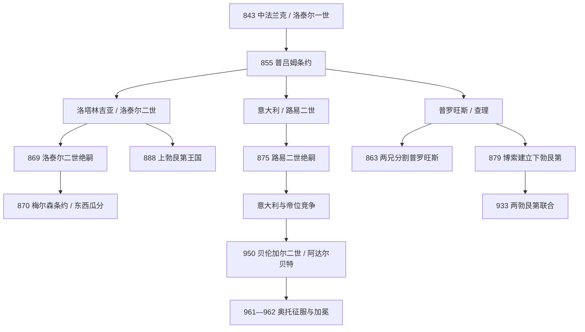

# 中法兰克王国

## 时间

843年-855年为洛泰尔一世直接统治的中法兰克王国；855年后三分为洛塔林吉亚、意大利和普罗旺斯，后继王国在9-10世纪继续重组。

## 概括

中法兰克王国是843年《凡尔登条约》中洛泰尔一世保留的帝国中部，包含北海沿岸的弗里西亚、莱茵与默兹之间的洛塔林吉亚、勃艮第和普罗旺斯部分地区，以及意大利王国。它还包括阿亨与罗马这两个加洛林帝国象征中心，洛泰尔保留皇帝称号。这个从北海到中意大利的狭长复合王国横跨阿尔卑斯、多个语言区和既有地方政治网络，缺乏一条稳定的东西交通与共同贵族中心。

855年洛泰尔一世退入修道院前以《普吕姆条约》把王国分给三子：路易二世取得意大利和皇帝称号，洛泰尔二世取得北部洛塔林吉亚，幼子查理取得普罗旺斯及罗讷河下游。查理863年无嗣去世，两个兄长分其领地；洛泰尔二世869年无合法子，东西法兰克叔父于870年《梅尔森条约》瓜分洛塔林吉亚；路易二世875年无男性继承人，引发西、东法兰克争夺意大利与帝位。中法兰克王国因此不是被一次外敌灭亡，而是因王族分割与绝嗣逐层解体。

其后，“中部地带”分化出洛林公国、上勃艮第、下勃艮第 / 普罗旺斯和竞争激烈的意大利王国。东、西法兰克长期争夺洛林；勃艮第王国在933年走向联合；意大利王冠在弗留利、斯波莱托、普罗旺斯、上勃艮第与伊夫雷亚家族间轮替，最终奥托一世于951、961年介入。中法兰克的遗产不是一个失败的“第三民族国家”，而是低地国家、洛林、勃艮第、瑞士与北意大利多重边疆的共同历史背景。

## 843年的王国：地理优势与结构弱点

洛泰尔的份额并非随意画出一条狭长带。它保留帝国旧都阿亨、意大利与罗马、莱茵—罗讷商路、弗里西亚港口以及皇帝称号，使长子在象征上仍高于兄弟。洛泰尔可以在北方处理维京和兄弟关系，在意大利由长子路易担任国王和共帝。

然而，其领地被孚日、汝拉和阿尔卑斯分隔，北部面向莱茵与北海，中部勃艮第面向罗讷，意大利拥有独立的伦巴德法律、主教和贵族。国王缺乏覆盖全境的税收与官僚，必须依赖区域伯爵和主教。843年三兄弟仍不断召开会谈、调整边界并相互干预，说明三个王国属于一个王族秩序，而非立即形成三个主权民族国家。

## 《普吕姆条约》与三子王国（855-875）

### 洛塔林吉亚与婚姻危机

洛泰尔二世的王国从弗里西亚、亚琛到汝拉山，后世以其名形成“洛塔林吉亚 / 洛林”。他与王后图特贝加没有子女，试图离婚并承认伴侣瓦尔德拉达及其子女。地方主教一度支持，教皇尼古拉一世却否决婚姻撤销；叔父秃头查理、日耳曼人路易又等待其绝嗣后分地。婚姻争议因此不是私人道德事件，而是王位、教会司法和国际均势问题。

869年洛泰尔二世死于意大利返程。路易二世因在南意大利作战来不及北上，秃头查理先在梅斯加冕；870年日耳曼人路易迫使其签《梅尔森条约》，大致沿默兹、摩泽尔等地瓜分王国。880年《里布蒙条约》又使东法兰克取得原洛塔林吉亚大部，但西部仍反复争夺；911年当地贵族转投西法兰克，925年亨利一世再纳入东部。

### 意大利与路易二世

路易二世自844年为意大利王、850年为共帝，855年后独立统治意大利。其核心任务不是管理北方洛林，而是压服贝内文托等南方伦巴德诸侯，并对抗占据巴里、塔兰托等基地的穆斯林势力。871年他联合拜占庭和地方势力攻克巴里，却随后被贝内文托亲王阿德尔基斯拘禁，获释时被迫发誓不再进入该地；教皇后来解除誓言。

路易875年去世，无男性继承人。虽然他可能希望东部侄子卡洛曼继承，教皇若望八世选择秃头查理并为其加冕。意大利王冠与皇帝称号从此在西、东加洛林和地方贵族间竞争。

### 普罗旺斯的查理

幼子查理取得里昂、维埃纳、普罗旺斯等地，因年幼与疾病依赖地方伯爵吉拉尔摄政。863年他无嗣去世，洛泰尔二世取得北部里昂等地，路易二世取得普罗旺斯大部。该王国只有八年，却保留罗讷河下游作为独立王权空间的先例。

## 870年后的后继政治体

### 洛塔林吉亚：东西法兰克之间

洛塔林吉亚拥有亚琛、科隆、特里尔、梅斯及莱茵—默兹商路，因经济与帝国象征价值被两方争夺。地方的雷吉纳尔家族、主教和伯爵会根据王位强弱选择宗主。925年纳入东部后，奥托一世先让女婿康拉德“红发”任公爵，953年叛乱后改由弟弟科隆大主教布鲁诺兼管；959年上、下洛林分化。洛林身份因反复归属而强化，不等于当地缺乏政治主体。

### 上、下勃艮第

879年，西法兰克与意大利贵族中的博索在芒塔耶会议获主教、贵族选为王，建立下勃艮第 / 普罗旺斯王国；加洛林诸王围攻后仍未完全消灭。其子盲人路易一度进入意大利并称帝，905年被刺瞎后退回普罗旺斯。

888年胖子查理被废，欧塞尔伯爵鲁道夫一世在圣莫里斯获选为上勃艮第王，控制汝拉、日内瓦与阿尔卑斯北侧。其子鲁道夫二世曾争夺意大利；933年与阿尔勒的于格协议，放弃意大利主张，取得下勃艮第名义权利。两区由同一王统连接，后称阿尔勒王国，1032年末王鲁道夫三世死后转入帝国。

### 意大利多王竞争

887年胖子查理被废后，弗留利侯爵贝伦加尔一世、斯波莱托的圭多及其子兰贝特、东法兰克的阿努尔夫、盲人路易、上勃艮第鲁道夫二世、阿尔勒的于格先后或并立争夺王冠。王位合法性来自加洛林女性血统、地方贵族推举、占领帕维亚、教皇加冕与军事胜利的不同组合。

950年伊夫雷亚的贝伦加尔二世与子阿达尔贝特共治，囚禁前王遗孀阿德莱德，促使东法兰克王奥托一世951年入意大利并迎娶她。奥托先保留贝伦加尔为附庸，后因其威胁教皇和叛服，961年再征服，962年加冕皇帝。意大利王国继续作为帝国组成部分，不是被简单并入“德国”。

## 直接王统与后继王表

### 855年三子分国

| 区域 | 君主 | 在位 | 继承关系 | 结局 |
|---|---|---|---|---|
| 中法兰克 | **洛泰尔一世** | 843-855；817起共帝 | 虔诚者路易长子 | 855年退位入修道院，以《普吕姆条约》分给三子。 |
| 意大利 | **路易二世** | 855-875；844起王、850起共帝 | 洛泰尔一世长子 | 无男性继承人，王冠与帝位被叔父、堂兄弟争夺。 |
| 洛塔林吉亚 | 洛泰尔二世 | 855-869 | 洛泰尔一世次子 | 无合法子，叔父于870年瓜分。 |
| 普罗旺斯 | 普罗旺斯的查理 | 855-863 | 洛泰尔一世幼子 | 无嗣，领地由两兄分割。 |

### 主要后继王统

| 后继区域 | 统治者序列 | 时间与说明 |
|---|---|---|
| 意大利 | 秃头查理 → 卡洛曼 → 胖子查理 | 875-887，西、东加洛林先后兼任。 |
| 意大利竞争期 | 贝伦加尔一世、圭多、兰贝特、阿努尔夫、盲人路易、鲁道夫二世 | 887-926，多人并立、复位与称帝，不能排成无重叠直线。 |
| 意大利 | 阿尔勒的于格 → 洛泰尔二世（意大利） → 贝伦加尔二世与阿达尔贝特 | 926-961；950-961父子共治，后败于奥托一世。 |
| 下勃艮第 / 普罗旺斯 | 博索 → 盲人路易 | 879-928；933年后与上勃艮第王统合流。 |
| 上勃艮第 | 鲁道夫一世 → 鲁道夫二世 → 和平者康拉德 | 888-993；933年取得下勃艮第权利。 |
| 洛塔林吉亚 | 869/870后由东西法兰克国王争夺 | 不是持续独立王统；911转西、925转东，后形成洛林公国。 |

全部个人在位、并立和复位关系见[法兰克统治者完整世系表](/%E4%BA%BA%E6%96%87%E7%A7%91%E5%AD%A6/%E5%8E%86%E5%8F%B2/%E6%AC%A7%E6%B4%B2/_%E9%80%9A%E5%8F%B2/%E5%90%8E%E7%BD%97%E9%A9%AC%E6%97%B6%E4%BB%A3%E7%9A%84%E6%97%A5%E8%80%B3%E6%9B%BC%E8%AF%B8%E5%9B%BD/%E6%B3%95%E5%85%B0%E5%85%8B%E7%8E%8B%E5%9B%BD/%E6%B3%95%E5%85%B0%E5%85%8B%E7%BB%9F%E6%B2%BB%E8%80%85%E5%AE%8C%E6%95%B4%E4%B8%96%E7%B3%BB%E8%A1%A8.md)。

## 统治结构与地区差异

| 区域 | 主要制度资源 | 分化方向 |
|---|---|---|
| 弗里西亚—洛塔林吉亚 | 河港贸易、皇家修道院、科隆 / 特里尔 / 梅斯主教、加洛林宫廷记忆 | 东西法兰克争夺，形成洛林公国和低地诸伯国。 |
| 勃艮第—普罗旺斯 | 罗讷河城市、阿尔卑斯山口、主教会议与地方伯爵 | 上下勃艮第王国，后合为阿尔勒王国。 |
| 意大利 | 伦巴德王国法律、帕维亚王冠、罗马教皇、北方主教与南方公国 | 地方多王竞争，最终与东部王权组成帝国。 |
| 帝国称号 | 需控制意大利并获教皇加冕，理论上继承查理曼 | 从洛泰尔家族转入西、东加洛林，再转奥托王朝。 |

## 重要事件

| 时间 | 事件 | 结果 |
|---|---|---|
| 843年 | 《凡尔登条约》 | 洛泰尔保留皇帝称号与中部地带。 |
| 855年 | 《普吕姆条约》 | 中法兰克分为三子王国，原政体结束。 |
| 863年 | 普罗旺斯的查理无嗣去世 | 领地被两兄瓜分。 |
| 869-870年 | 洛泰尔二世死、《梅尔森条约》 | 洛塔林吉亚被东西叔父瓜分。 |
| 871年 | 路易二世攻克巴里后被拘禁 | 帝国在南意大利的权威受地方亲王限制。 |
| 875年 | 路易二世绝嗣 | 意大利与皇帝称号进入跨支系竞争。 |
| 879年 | 博索获选 | 非加洛林下勃艮第王权形成。 |
| 880年 | 《里布蒙条约》 | 原洛塔林吉亚大部转入东法兰克。 |
| 887-888年 | 胖子查理被废 | 意大利、上勃艮第等地方分别选王。 |
| 905年 | 盲人路易被俘刺瞎 | 下勃艮第退出意大利竞争。 |
| 911、925年 | 洛塔林吉亚两次转向 | 地方贵族在西、东王权间选择，925后稳定入东。 |
| 933年 | 两勃艮第王权合流 | 阿尔卑斯—罗讷王国逐渐形成。 |
| 950-962年 | 贝伦加尔父子、奥托介入 | 意大利王冠与东法兰克 / 德意志王权长期结合。 |

## 解体原因与历史影响

### 结构因素

- 王国横跨北海、阿尔卑斯和意大利，交通方向不同，缺少共同的区域贵族核心。
- 皇帝称号提供象征，却没有独立于各地区王室地产和军队的中央行政。
- 加洛林诸子皆需领地，855年再次平分符合王族政治惯例；三个继承者又陆续无合法男性后裔。
- 东、西邻国包围中部，能在绝嗣时以亲族权利和军力瓜分，而中部没有统一继承人。

### 直接解体过程

855年分国是原中法兰克王国的直接终点；863、869、875年三支绝嗣使每一部分再被瓜分或争夺。870年《梅尔森条约》解决北部当下均势，887年胖子查理被废则让地方贵族自由选王。中部没有一次“亡国战役”，而是多次继承断裂积累成永久区域化。

### 长期影响

- 洛林成为法德之间长期争夺的政治地带，但其边疆性不是现代民族冲突的简单前史。
- 勃艮第名称分化为多个王国、公国和伯国，连接法国、瑞士与帝国历史。
- 意大利王冠与皇帝称号的结合，为奥托王朝和神圣罗马帝国的跨阿尔卑斯结构奠定路径。
- 低地、莱茵—默兹城市和主教区保存加洛林核心记忆，后发展出高度多元的诸侯体系。

## 演变关系

- 前一节点：[加洛林王朝](/%E4%BA%BA%E6%96%87%E7%A7%91%E5%AD%A6/%E5%8E%86%E5%8F%B2/%E6%AC%A7%E6%B4%B2/_%E9%80%9A%E5%8F%B2/%E5%90%8E%E7%BD%97%E9%A9%AC%E6%97%B6%E4%BB%A3%E7%9A%84%E6%97%A5%E8%80%B3%E6%9B%BC%E8%AF%B8%E5%9B%BD/%E6%B3%95%E5%85%B0%E5%85%8B%E7%8E%8B%E5%9B%BD/%E5%8A%A0%E6%B4%9B%E6%9E%97%E7%8E%8B%E6%9C%9D.md)。
- 并列节点：[西法兰克王国](/%E4%BA%BA%E6%96%87%E7%A7%91%E5%AD%A6/%E5%8E%86%E5%8F%B2/%E6%AC%A7%E6%B4%B2/_%E9%80%9A%E5%8F%B2/%E5%90%8E%E7%BD%97%E9%A9%AC%E6%97%B6%E4%BB%A3%E7%9A%84%E6%97%A5%E8%80%B3%E6%9B%BC%E8%AF%B8%E5%9B%BD/%E6%B3%95%E5%85%B0%E5%85%8B%E7%8E%8B%E5%9B%BD/%E8%A5%BF%E6%B3%95%E5%85%B0%E5%85%8B%E7%8E%8B%E5%9B%BD.md)、[东法兰克王国](/%E4%BA%BA%E6%96%87%E7%A7%91%E5%AD%A6/%E5%8E%86%E5%8F%B2/%E6%AC%A7%E6%B4%B2/_%E9%80%9A%E5%8F%B2/%E5%90%8E%E7%BD%97%E9%A9%AC%E6%97%B6%E4%BB%A3%E7%9A%84%E6%97%A5%E8%80%B3%E6%9B%BC%E8%AF%B8%E5%9B%BD/%E6%B3%95%E5%85%B0%E5%85%8B%E7%8E%8B%E5%9B%BD/%E4%B8%9C%E6%B3%95%E5%85%B0%E5%85%8B%E7%8E%8B%E5%9B%BD.md)。
- 后续区域：[法国历史](/%E4%BA%BA%E6%96%87%E7%A7%91%E5%AD%A6/%E5%8E%86%E5%8F%B2/%E6%AC%A7%E6%B4%B2/%E6%B3%95%E5%9B%BD/README.md)、[德意志历史](/%E4%BA%BA%E6%96%87%E7%A7%91%E5%AD%A6/%E5%8E%86%E5%8F%B2/%E6%AC%A7%E6%B4%B2/%E5%BE%B7%E6%84%8F%E5%BF%97/README.md)、[意大利历史](/%E4%BA%BA%E6%96%87%E7%A7%91%E5%AD%A6/%E5%8E%86%E5%8F%B2/%E6%AC%A7%E6%B4%B2/%E6%84%8F%E5%A4%A7%E5%88%A9/README.md)。
- 所属总览：[法兰克王国](/%E4%BA%BA%E6%96%87%E7%A7%91%E5%AD%A6/%E5%8E%86%E5%8F%B2/%E6%AC%A7%E6%B4%B2/_%E9%80%9A%E5%8F%B2/%E5%90%8E%E7%BD%97%E9%A9%AC%E6%97%B6%E4%BB%A3%E7%9A%84%E6%97%A5%E8%80%B3%E6%9B%BC%E8%AF%B8%E5%9B%BD/%E6%B3%95%E5%85%B0%E5%85%8B%E7%8E%8B%E5%9B%BD/README.md)。
