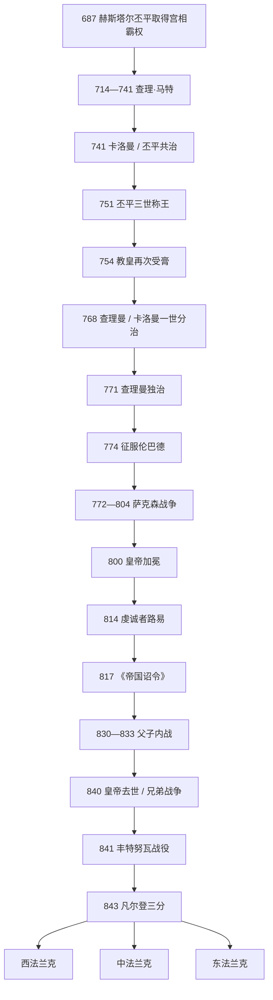

# 加洛林王朝

## 时间

751年-843年为统一法兰克王国 / 帝国阶段；加洛林王族在中、东、西法兰克分别延续至875年、911年、987年，间有复位与非加洛林国王。

## 概括

加洛林王朝不是从751年才突然出现。其前身丕平—阿努尔夫家族在7世纪奥斯特拉西亚拥有庄园、修道院关系和宫相职位，687年后控制法兰克王国，查理·马特又在继承内战、边疆战争和教会地产重组中建立跨区域军政网络。丕平三世于751年废黜墨洛温末王，利用贵族推举、主教受膏和教皇认可把实际权力转化为新王朝合法性。

查理曼通过征服伦巴德、萨克森、巴伐利亚、阿瓦尔环地与西班牙边区，把王国扩张为西欧复合帝国。800年教皇利奥三世为其加冕“罗马人的皇帝”，既宣称西方帝权复兴，也造成与君士坦丁堡的地位竞争。帝国以巡行宫廷、伯爵、侯爵、主教、修道院、皇家使者和地方大会治理，没有固定首都或现代常备官僚；阿亨是重要宫廷中心。

虔诚者路易试图用817年《帝国诏令》保持帝国统一、让长子洛泰尔取得最高地位，同时分封幼子。第二任妻子所生秃头查理加入继承后，父子与兄弟战争爆发。840年路易去世，841年丰特努瓦战役、842年斯特拉斯堡誓言和843年《凡尔登条约》使帝国三分。分裂并非单纯由“日耳曼继承制”自动造成，而是王族多子、贵族区域利益、皇帝无法建立单一税军体系及战争结果共同作用。

## 从宫相到王朝（687-768）

### 丕平—阿努尔夫家族的资源

赫斯塔尔的丕平通过母系与梅斯主教阿努尔夫家族结合，在奥斯特拉西亚拥有广泛地产和教会亲属。687年泰尔特里战役后，他以宫相身份支配纽斯特里亚，却仍借墨洛温国王发布命令。714年其死引发家族和地区内战；查理·马特从被囚的旁支身份起兵，击败普莱克特鲁德、拉甘弗雷德和外部盟友，718年前后统一宫相权。

查理在阿勒曼尼、巴伐利亚、弗里西亚与阿基坦作战。732年安达卢斯总督阿卜杜勒·拉赫曼率军北进，查理在图尔—普瓦捷之间取胜。此战终止当次远征，却不是穆斯林军首次或最后进入高卢，也不能单因一战解释加洛林崛起。查理的关键成就在于整合贵族随从、利用或暂时占用教会土地供养军队、把王室边疆战争变成家族权力来源。

741年查理死后，卡洛曼与丕平分治，先拥立希尔德里克三世恢复王名，镇压阿基坦、阿勒曼尼等反抗。卡洛曼747年退入修道院，丕平独掌。751年丕平获教皇意见、法兰克贵族推举和教会受膏，废黜末王。754年教皇斯德望二世亲赴法兰克，再为丕平、妻子贝尔特拉达和两子受膏；丕平两次远征伦巴德，把拉文纳等地交给教皇，建立法兰克王权—罗马教廷联盟。

## 查理曼的征服与帝国

### 多战线扩张

768年丕平去世，查理与卡洛曼一世分治。兄弟关系紧张但卡洛曼771年猝死，查理吸收其领地；遗孀和幼子投奔伦巴德，成为后来战争的一项理由。773-774年查理越过阿尔卑斯，攻陷帕维亚，兼任伦巴德国王。

772-804年的萨克森战争是最漫长冲突。萨克森各集团反复投降、叛乱，维杜金德785年受洗后抵抗仍继续；查理采取摧毁圣林、强制受洗、迁徙人口和严刑法令，782年费尔登处决的规模与具体性质仍有争议。最终萨克森被划为伯爵区、教区和修道院网络，扩张伴随强制基督教化。

788年巴伐利亚公爵塔西洛三世被废，公国纳入直接统治。791-796年法兰克及斯拉夫盟军打击阿瓦尔环形营地，取得大量财富，东南边疆形成侯区。778年进攻萨拉戈萨失败，撤军时后卫在龙塞斯瓦耶被巴斯克人伏击；之后法兰克逐步建立西班牙边区，801年占巴塞罗那。

### 800年加冕与帝权

教皇利奥三世因罗马贵族袭击逃往查理宫廷，查理恢复其地位。800年圣诞日，利奥在圣彼得大教堂为查理加冕。加冕是否令查理完全意外难确定；重要的是教皇取得加冕者角色，查理获得超越诸王的罗马帝权。东罗马当时由女皇伊琳娜统治，最初拒绝承认；812年双方妥协，东皇米海尔一世承认查理皇帝称号，查理放弃对威尼斯、达尔马提亚等争议地的部分要求。

## 统治结构与加洛林“复兴”

| 机构 / 层次 | 运作机制 | 成效与局限 |
|---|---|---|
| 皇帝与巡行宫廷 | 在阿亨、因格尔海姆、法兰克福等宫廷巡行，召集贵族与教会会议，颁布敕令集。 | 个人在场和恩赐有效，疆域过大使远方控制不均。 |
| 伯爵 | 在伯爵区主持法院、征兵、收取王室权益。 | 把地方贵族纳入帝国，但伯爵可积累家族地产和地方支持。 |
| 边区侯爵 / 边疆统帅 | 在西班牙、布列塔尼、丹麦、阿瓦尔等边疆拥有较大军权。 | 提高快速防御，亦培育半自主地方强人。 |
| 皇家使者 | 通常一名教士与一名世俗贵族结对巡察，传达法令、受理申诉。 | 加强监督，依赖使者忠诚和地方合作，覆盖并不持续。 |
| 主教与修道院长 | 负责教育、文书、救济和地方政治，参与军役与帝国会议。 | 提供识字网络，也使教会职务成为王室与贵族争夺资源。 |
| 军事 | 王室随从、伯爵征召、附庸与盟军；自由土地所有者按财产承担装备。 | 能进行年度远征，长期战争负担推动地方化和免役。 |
| 财政 | 王室地产、贡赋、关税、司法罚金、战利品，统一重量与银第纳尔。 | 缺乏覆盖全帝国的稳定土地税，和平期中央现金收入有限。 |

“加洛林文艺复兴”主要是宫廷和修道院主导的拉丁教育改革。阿尔昆等学者校订圣经、礼仪和语法，卡洛林小写体提高抄写可读性；学校培养教士和官员。789年《总训令》等要求教区纠正礼仪、办学。其影响深远，但识字仍集中于教会和精英，不能理解成全民教育。

法律方面，各族法典继续并存，皇帝用敕令补充公共秩序。货币改革确立银本位第纳尔，促进跨区域计价；庄园清册与王室地产管理加强。帝国不是统一民族国家，而是以法兰克王族、基督教和战争利益连接的多语言复合体。

## 虔诚者路易与继承战争

### 817年安排

813年查理曼在阿亨为唯一存活成年合法子路易加冕共帝，814年平稳继承。路易清理宫廷、推动修道院改革，并于816年接受教皇再次加冕。817年桥梁坍塌事故使他担忧死亡，于是颁《帝国诏令》：长子洛泰尔为共帝和未来最高继承人；丕平获阿基坦，日耳曼人路易获巴伐利亚，后两者须服从洛泰尔。安排试图兼顾统一与王子领地。

第二任妻子朱迪丝于823年生秃头查理，路易希望为幼子划地，打破原安排。洛泰尔、丕平、日耳曼人路易与不同贵族集团轮番反叛。830年皇帝一度被控制；833年“谎言之野”上军队倒戈，路易被公开忏悔和废黜，但洛泰尔的专断促使兄弟转而帮助父亲复位。丕平838年死后，皇帝把阿基坦给秃头查理，排除孙子丕平二世，又引起新冲突。

### 840-843年兄弟战争

840年路易去世，洛泰尔主张817年最高权；日耳曼人路易与秃头查理结盟。841年丰特努瓦战役双方伤亡惨重，洛泰尔败退。842年两弟以古高地德语和古罗曼语互向对方军队宣誓，即斯特拉斯堡誓言；其语言选择是确保士兵理解，也显示帝国内语言差异。843年《凡尔登条约》分配：

- 洛泰尔一世保有皇帝称号和从北海经洛林、勃艮第至意大利的中部。
- 日耳曼人路易取得莱茵河以东核心的东法兰克。
- 秃头查理取得高卢西部的西法兰克。

条约没有创立现代法国、德国、意大利，也未被当事人视为永不可变国界。其直接意义是停止内战、承认三位成年国王各自资源基础；后续跨区继承、分割和战争仍持续。

## 重要事件

| 时间 | 事件 | 结果与意义 |
|---|---|---|
| 687年 | 泰尔特里战役 | 丕平家族取得全法兰克宫相霸权。 |
| 714-718年 | 宫相内战 | 查理·马特胜出，重组跨区域军事网络。 |
| 732年 | 图尔—普瓦捷战役 | 阻止当次安达卢斯远征，增强查理威望。 |
| 751、754年 | 丕平称王与再次受膏 | 实权转换为王朝合法性，教皇联盟制度化。 |
| 754、756年 | 丕平远征意大利 | 伦巴德退让，教皇领地基础形成。 |
| 768-771年 | 查理曼与卡洛曼分治 | 卡洛曼早逝避免内战，查理统一。 |
| 774年 | 征服伦巴德 | 查理兼任伦巴德国王，法兰克势力进入意大利。 |
| 772-804年 | 萨克森战争 | 东北扩张与强制基督教化，帝国边界抵易北河。 |
| 788年 | 废黜塔西洛三世 | 巴伐利亚纳入直接统治。 |
| 791-796年 | 阿瓦尔战争 | 获取巨额战利品，建立东南边区。 |
| 800年 | 查理曼加冕皇帝 | 西方帝权复兴，与教皇、东罗马关系重构。 |
| 813/814年 | 路易平稳继承 | 短期实现单子继承，随后多子问题再现。 |
| 817年 | 《帝国诏令》 | 试图保持帝国统一并分配王子领地。 |
| 830-833年 | 父子内战与“谎言之野” | 皇权道德与军事威望受损，贵族区域联盟强化。 |
| 841年 | 丰特努瓦战役 | 洛泰尔无法强制统一。 |
| 842年 | 斯特拉斯堡誓言 | 两弟联盟公开化，留下古罗曼语、古高地德语早期文本。 |
| 843年 | 《凡尔登条约》 | 帝国三分，进入西、中、东法兰克主线。 |

## 兴盛与分裂原因

### 崛起和鼎盛条件

- 丕平家族拥有跨区域地产、修道院和婚姻网络，能在墨洛温幼王时期稳定控制宫相。
- 教皇需要对付伦巴德，法兰克新王需要神圣合法性，双方利益互补。
- 查理曼长期在位且竞争兄弟早逝，战利品可奖赏贵族，年度远征保持精英凝聚。
- 罗马教会、修道院识字网络和地方伯爵让帝国以较低官僚成本运转。
- 周边萨克森、阿瓦尔、伦巴德等政权各自分裂或处于转型，给法兰克逐个击破机会。

### 结构性分裂因素

- 王族传统要求每位合法儿子获得政治地位；817年统一方案仍需给幼子分国，没有公认的不可分皇位继承法。
- 中央财政依赖王室地产、贡赋和战利品，不足以长期支付独立官僚与常备军，皇帝必须与地方精英分享权力。
- 伯爵、侯爵和主教掌握地方征兵及地产；内战时他们可用支持某位王子换取特权。
- 帝国地理横跨多语言和不同罗马化程度区域，阿基坦、巴伐利亚、意大利等已有强烈地方政治网络。
- 查理曼的个人威望和连续胜利难由虔诚者路易复制，和平与改革减少了通过战利品重分配利益的空间。

### 直接触发与结果

秃头查理出生后的再分封破坏817年安排，父子互疑和王后派系成为直接触发；833年公开废父使所有参与者合法性受损。840年皇帝未留下各方接受的新安排，洛泰尔又试图以共帝身份取得最高权，导致战争。841年的战场失败和842年两弟联盟使其无力统一，843年分约遂成为军事均势的制度化结果。

## 王朝世系

统一阶段、分国后各支、共治、复位、非加洛林竞争王及中部意大利多王均见：

- [法兰克统治者完整世系表](/%E4%BA%BA%E6%96%87%E7%A7%91%E5%AD%A6/%E5%8E%86%E5%8F%B2/%E6%AC%A7%E6%B4%B2/_%E9%80%9A%E5%8F%B2/%E5%90%8E%E7%BD%97%E9%A9%AC%E6%97%B6%E4%BB%A3%E7%9A%84%E6%97%A5%E8%80%B3%E6%9B%BC%E8%AF%B8%E5%9B%BD/%E6%B3%95%E5%85%B0%E5%85%8B%E7%8E%8B%E5%9B%BD/%E6%B3%95%E5%85%B0%E5%85%8B%E7%BB%9F%E6%B2%BB%E8%80%85%E5%AE%8C%E6%95%B4%E4%B8%96%E7%B3%BB%E8%A1%A8.md)

## 演变关系

- 前一节点：[墨洛温王朝](/%E4%BA%BA%E6%96%87%E7%A7%91%E5%AD%A6/%E5%8E%86%E5%8F%B2/%E6%AC%A7%E6%B4%B2/_%E9%80%9A%E5%8F%B2/%E5%90%8E%E7%BD%97%E9%A9%AC%E6%97%B6%E4%BB%A3%E7%9A%84%E6%97%A5%E8%80%B3%E6%9B%BC%E8%AF%B8%E5%9B%BD/%E6%B3%95%E5%85%B0%E5%85%8B%E7%8E%8B%E5%9B%BD/%E5%A2%A8%E6%B4%9B%E6%B8%A9%E7%8E%8B%E6%9C%9D.md)。
- 三分节点：[西法兰克王国](/%E4%BA%BA%E6%96%87%E7%A7%91%E5%AD%A6/%E5%8E%86%E5%8F%B2/%E6%AC%A7%E6%B4%B2/_%E9%80%9A%E5%8F%B2/%E5%90%8E%E7%BD%97%E9%A9%AC%E6%97%B6%E4%BB%A3%E7%9A%84%E6%97%A5%E8%80%B3%E6%9B%BC%E8%AF%B8%E5%9B%BD/%E6%B3%95%E5%85%B0%E5%85%8B%E7%8E%8B%E5%9B%BD/%E8%A5%BF%E6%B3%95%E5%85%B0%E5%85%8B%E7%8E%8B%E5%9B%BD.md)、[中法兰克王国](/%E4%BA%BA%E6%96%87%E7%A7%91%E5%AD%A6/%E5%8E%86%E5%8F%B2/%E6%AC%A7%E6%B4%B2/_%E9%80%9A%E5%8F%B2/%E5%90%8E%E7%BD%97%E9%A9%AC%E6%97%B6%E4%BB%A3%E7%9A%84%E6%97%A5%E8%80%B3%E6%9B%BC%E8%AF%B8%E5%9B%BD/%E6%B3%95%E5%85%B0%E5%85%8B%E7%8E%8B%E5%9B%BD/%E4%B8%AD%E6%B3%95%E5%85%B0%E5%85%8B%E7%8E%8B%E5%9B%BD.md)、[东法兰克王国](/%E4%BA%BA%E6%96%87%E7%A7%91%E5%AD%A6/%E5%8E%86%E5%8F%B2/%E6%AC%A7%E6%B4%B2/_%E9%80%9A%E5%8F%B2/%E5%90%8E%E7%BD%97%E9%A9%AC%E6%97%B6%E4%BB%A3%E7%9A%84%E6%97%A5%E8%80%B3%E6%9B%BC%E8%AF%B8%E5%9B%BD/%E6%B3%95%E5%85%B0%E5%85%8B%E7%8E%8B%E5%9B%BD/%E4%B8%9C%E6%B3%95%E5%85%B0%E5%85%8B%E7%8E%8B%E5%9B%BD.md)。
- 意大利征服对象：[伦巴德王国](/%E4%BA%BA%E6%96%87%E7%A7%91%E5%AD%A6/%E5%8E%86%E5%8F%B2/%E6%AC%A7%E6%B4%B2/_%E9%80%9A%E5%8F%B2/%E5%90%8E%E7%BD%97%E9%A9%AC%E6%97%B6%E4%BB%A3%E7%9A%84%E6%97%A5%E8%80%B3%E6%9B%BC%E8%AF%B8%E5%9B%BD/%E4%BC%A6%E5%B7%B4%E5%BE%B7%E7%8E%8B%E5%9B%BD.md)。
- 所属总览：[法兰克王国](/%E4%BA%BA%E6%96%87%E7%A7%91%E5%AD%A6/%E5%8E%86%E5%8F%B2/%E6%AC%A7%E6%B4%B2/_%E9%80%9A%E5%8F%B2/%E5%90%8E%E7%BD%97%E9%A9%AC%E6%97%B6%E4%BB%A3%E7%9A%84%E6%97%A5%E8%80%B3%E6%9B%BC%E8%AF%B8%E5%9B%BD/%E6%B3%95%E5%85%B0%E5%85%8B%E7%8E%8B%E5%9B%BD/README.md)。
