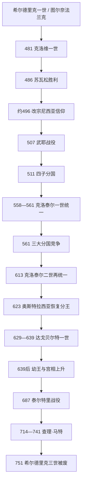

# 墨洛温王朝

## 时间

约481年-751年；王朝祖先可追溯至5世纪中叶的图尔奈法兰克首领，486年克洛维击败苏瓦松后取得北高卢核心。

## 概括

墨洛温王朝把莱茵下游的萨利安法兰克王权扩张为控制高卢大部的法兰克王国。克洛维一世通过击败西阿格里乌斯、阿勒曼尼和西哥特，兼并其他法兰克小王，并在约496年前后受尼西亚派洗礼，使王室能够与高卢罗马主教和地主合作。王国没有简单取代罗马社会：拉丁文、城市伯爵、主教网络、土地税与罗马法持续存在，法兰克军队和王室随从则提供新的军事核心。

王国被视为王族共同财产，国王诸子都可继承，不实行现代意义的长子单一继承。511、561等年份分国后，各王仍称“法兰克人的国王”，在奥斯特拉西亚、纽斯特里亚、勃艮第和阿基坦等宫廷中心竞争、通婚、互杀并短暂统一。613年克洛泰尔二世再统一，629-639年达戈贝尔特一世保持强势；此后幼王频繁，宫相掌握军队、地产和贵族联盟。687年赫斯塔尔的丕平取得跨王国支配，查理·马特及丕平三世继承其权力。751年丕平在贵族与教皇支持下废黜希尔德里克三世，王朝正式终结。

## 建立背景与克洛维的崛起

### 罗马边境中的法兰克人

“法兰克”在3世纪罗马史料中出现，指莱茵下游多个集团形成的联盟。部分法兰克人袭击帝国，部分被安置在边境并进入军队。希尔德里克一世墓中的罗马金印戒、武器和拜占庭金币显示，他既是法兰克王，也嵌入高卢罗马军政网络。其与罗马将领埃吉迪乌斯、保罗等关系细节不明，但并非生活在完全隔绝的“蛮族世界”。

克洛维于约481年继位。486年他在苏瓦松击败西阿格里乌斯，接管卢瓦尔河以北最后一个独立罗马军政区；随后通过战争、谋杀或吸收兼并里普阿里法兰克等同族王权。传统把496年的托尔比亚克战役与其受洗相连，精确日期可能在496-508年之间。其改宗尼西亚信仰而非多数日耳曼王室的阿里乌派，使高卢主教可把法兰克国王视为正统保护者。王后克洛蒂尔德和兰斯主教雷米吉乌斯发挥作用，但改宗也是长期宫廷与地方社会整合，而非一次仪式后全体法兰克立即受洗。

507年，克洛维在武耶击败西哥特王阿拉里克二世，占领阿基坦大部。东哥特干预阻止其取得地中海沿岸。东罗马皇帝阿纳斯塔修斯授予克洛维荣誉执政官标志，他在图尔举行罗马式仪式；这不是把法兰克王变成帝国官员，而是双方互借合法性。511年克洛维在奥尔良召集主教会议，确定王室与教会合作框架。

## 分国、内战与再次统一（511-613）

### 511年四子分国

克洛维死后，狄奥多里克一世、克洛多米尔、希尔德贝尔特一世、克洛泰尔一世分别取得以兰斯、奥尔良、巴黎、苏瓦松为中心的领地。分配不是把高卢整齐切成四块，而是让每个儿子拥有宫廷、税源和战略城市。兄弟仍可联合征服图林根、勃艮第和普罗旺斯，也会谋杀侄子、瓜分绝嗣者领地。558年希尔德贝尔特无嗣去世，克洛泰尔一世短暂统一全部王国。

### 561年三大政治区域

克洛泰尔一世死后，儿子们再次分国。查理贝尔特一世早逝后，政治集中为：

- 奥斯特拉西亚：莱茵、默兹和东部高卢，贵族与跨莱茵军事联系强。
- 纽斯特里亚：塞纳、卢瓦尔及西北高卢，围绕苏瓦松、巴黎等宫廷。
- 勃艮第：罗讷、索恩与阿尔卑斯门户，保留534年被征服王国的地域身份。

西吉贝尔特一世与王后布伦希尔德、希尔佩里克一世与王后芙蕾德贡德之间的长期战争包含领土、婚姻赔偿和宫廷仇杀。575年西吉贝尔特遇刺，584年希尔佩里克也遭刺杀。布伦希尔德在幼王时期担任摄政，试图依赖罗马式税收、道路和王室官员加强中央，因而与部分贵族冲突。613年奥斯特拉西亚大贵族倒向纽斯特里亚的克洛泰尔二世，布伦希尔德与曾孙西吉贝尔特二世败亡。

## 克洛泰尔二世、达戈贝尔特与宫相制度

克洛泰尔二世统一后颁布614年巴黎敕令，确认主教选举、官员在本地任职和贵族财产权。它既限制任意王权，也帮助国王与各区域精英达成战后妥协。王国设置奥斯特拉西亚、纽斯特里亚和勃艮第宫相；宫相原为宫廷管理者，逐渐代表地区贵族、控制王室地产和军队。

623年，奥斯特拉西亚贵族要求拥有本地国王，克洛泰尔立子达戈贝尔特统治东部。629年达戈贝尔特继承全境，移居巴黎，重新控制铸币、任官和外交，征服布列塔尼贡赋并干预西班牙、西斯拉夫边境。634年他又立幼子西吉贝尔特三世为奥斯特拉西亚王。639年达戈贝尔特去世后，两个幼子分别统治奥斯特拉西亚、纽斯特里亚—勃艮第，宫相和王太后权力扩大。

## 639年后的王权与“懒王”问题

后世加洛林史家把晚期墨洛温王统称为“懒王”，以证明丕平家族夺位合理。实际情况更复杂：国王仍颁发特许状、主持司法、巡行并提供神圣血统合法性；希尔德贝尔特三世甚至在文书中被称“公正者”。问题不是国王完全无事可做，而是他们多在幼年即位，缺乏独立地产、军队和成年亲族网络，宫相能控制接触国王和发布命令的渠道。

奥斯特拉西亚宫相格里莫阿尔德一世曾把达戈贝尔特二世流放，拥立自己的儿子希尔德贝尔特“养子”，但656/660-661/662年的夺位最终失败，说明墨洛温血统仍不可轻易替代。687年泰尔特里战役后，赫斯塔尔的丕平击败纽斯特里亚，以宫相身份支配各区，却继续保留墨洛温国王。

714年丕平死后，遗孀普莱克特鲁德、孙子狄奥多阿尔德、纽斯特里亚宫相拉甘弗雷德与私生子查理·马特内战。查理胜出后分别利用克洛泰尔四世、希尔佩里克二世、狄奥多里克四世取得合法性。737-743年他及两子甚至不立国王，说明实际权力已转移；但743年卡洛曼与丕平仍重新拥立希尔德里克三世，表明王族象征尚有用处。

## 统治结构、法律与社会

| 领域 | 运作 | 连续与变化 |
|---|---|---|
| 王权与分国 | 国王从王室地产、罚金、贡赋和战利品获得资源；诸子都有继承权。 | 继承罗马皇室巡行和仪式，同时把王国视作王族共同财产。 |
| 伯爵与公爵 | 伯爵负责城市司法、征税和军役，公爵统率更大区域军队。 | 多沿用晚期罗马城市和行省框架，职位逐渐成为地方贵族资源。 |
| 宫相 | 管理宫廷与王室地产，代表分国贵族，统率军队。 | 从家政官发展为实际最高军政职位，最终取代王朝。 |
| 主教与会议 | 主教维护城市、司法、救济和文书，国王召集奥尔良、巴黎等会议。 | 高卢罗马精英通过教会进入新王国，教会为王权提供正统合法性。 |
| 法律 | 《萨利克法》、里普阿里法及罗马法并存，赔偿、继承和程序按身份处理。 | 法典以拉丁文编写并由国王修订，不是未经改变的口头传统。 |
| 财政与货币 | 延续土地税与关税但征收不均；大量金质特里恩斯由各地铸币者生产。 | 7世纪后金币向银币过渡，地方铸币显示经济活跃也显示中央控制有限。 |
| 军事 | 王室随从、贵族军队、地方征召与同盟集团结合。 | 扩张期靠战利品维持，后期宫相掌握主要军事网络。 |

法兰克人与高卢罗马人逐渐通婚、共享天主教信仰和拉丁文法律文化。北部地区法兰克语影响较深，南部主要继续通俗拉丁语。族群边界没有在克洛维受洗后立即消失，也不是两群体长期完全隔离；不同地区、阶层和法律案件呈现不同速度的融合。

## 重要事件

| 时间 | 事件 | 过程与影响 |
|---|---|---|
| 486年 | 苏瓦松战役 | 克洛维接管北高卢罗马军政区，获得城市与税基。 |
| 约496-508年 | 克洛维受洗 | 与尼西亚派主教结盟，具体年份与集体受洗规模存在争议。 |
| 507年 | 武耶战役 | 西哥特失去阿基坦大部，法兰克成为高卢主导力量。 |
| 511年 | 奥尔良会议与首次分国 | 教会合作制度化；四子建立分区宫廷。 |
| 531-534年 | 征服图林根与勃艮第 | 王国扩至莱茵东部、罗讷河流域。 |
| 558-561年 | 克洛泰尔一世统一 | 首次短暂整合，死后再次分割。 |
| 575-613年 | 王后战争与三分国冲突 | 王族死亡、贵族选边，奥斯特拉西亚和纽斯特里亚身份强化。 |
| 613年 | 克洛泰尔二世胜利 | 王国再统一，布伦希尔德被处死。 |
| 614年 | 巴黎敕令 | 王权与地方贵族、主教达成妥协。 |
| 629-639年 | 达戈贝尔特一世 | 最后一次较强王室统治，仍恢复奥斯特拉西亚分王。 |
| 687年 | 泰尔特里战役 | 赫斯塔尔丕平取得跨王国宫相霸权。 |
| 714-718年 | 宫相继承内战 | 查理·马特击败竞争者，建立加洛林家族军政基础。 |
| 732年 | 图尔—普瓦捷战役 | 查理击退安达卢斯远征军；不是一次性“拯救欧洲”，却增强其威望。 |
| 737-743年 | 无王期 | 宫相可不立墨洛温王，权力转移已公开化。 |
| 751年 | 丕平三世称王 | 希尔德里克三世被废，王朝终结。 |

## 崛起、衰落与王朝灭亡原因

### 崛起条件

- 克洛维继承图尔奈法兰克的罗马军政联系，又能吸收其他法兰克王权。
- 高卢保有城市、道路、庄园、主教和识字官员，为扩张提供治理基础。
- 尼西亚信仰使法兰克比阿里乌派西哥特、勃艮第更易获得高卢教会支持。
- 西罗马瓦解及邻国继承危机提供扩张窗口，王族用分国让多个成年军王同时开拓边境。

### 结构性衰落因素

- 诸子平分并非单纯“愚蠢制度”，它能避免王子反叛和扩展多战线，却持续制造分国战争与侄系清洗。
- 王室不断赠地奖赏贵族和教会，直接地产减少；各区贵族以宫相为组织中心。
- 幼王、短寿和王族内斗使长期政策难维持，军事指挥转移到宫相。
- 奥斯特拉西亚丕平—阿努尔夫家族掌握跨莱茵土地、教会亲属和军队，资源超过单一国王宫廷。

### 直接灭亡过程

查理·马特死后，两子卡洛曼与丕平先共同统治，再由丕平独掌。丕平向教皇扎迦利亚询问“有王名而无王权者是否应继续为王”，获得支持性回答；751年贵族推举、主教博尼法斯或其他教士施行受膏，希尔德里克三世被剃发入修道院。754年教皇斯德望二世再次为丕平及其子受膏，并禁止法兰克人另选他族。墨洛温王朝由制度化政变终结，而非在战场被外敌灭亡。

## 完整王朝世系

完整表按全部分国、共治、复位、争议王与无王期列出，不使用“懒王时期诸王”合并项：

- [法兰克统治者完整世系表](/%E4%BA%BA%E6%96%87%E7%A7%91%E5%AD%A6/%E5%8E%86%E5%8F%B2/%E6%AC%A7%E6%B4%B2/_%E9%80%9A%E5%8F%B2/%E5%90%8E%E7%BD%97%E9%A9%AC%E6%97%B6%E4%BB%A3%E7%9A%84%E6%97%A5%E8%80%B3%E6%9B%BC%E8%AF%B8%E5%9B%BD/%E6%B3%95%E5%85%B0%E5%85%8B%E7%8E%8B%E5%9B%BD/%E6%B3%95%E5%85%B0%E5%85%8B%E7%BB%9F%E6%B2%BB%E8%80%85%E5%AE%8C%E6%95%B4%E4%B8%96%E7%B3%BB%E8%A1%A8.md)

## 演变关系

- 前一背景：[日耳曼部落](/%E4%BA%BA%E6%96%87%E7%A7%91%E5%AD%A6/%E5%8E%86%E5%8F%B2/%E6%AC%A7%E6%B4%B2/_%E9%80%9A%E5%8F%B2/%E5%90%8E%E7%BD%97%E9%A9%AC%E6%97%B6%E4%BB%A3%E7%9A%84%E6%97%A5%E8%80%B3%E6%9B%BC%E8%AF%B8%E5%9B%BD/%E6%97%A5%E8%80%B3%E6%9B%BC%E9%83%A8%E8%90%BD.md)中的法兰克联盟与罗马高卢。
- 被征服 / 并入者：[西哥特王国](/%E4%BA%BA%E6%96%87%E7%A7%91%E5%AD%A6/%E5%8E%86%E5%8F%B2/%E6%AC%A7%E6%B4%B2/_%E9%80%9A%E5%8F%B2/%E5%90%8E%E7%BD%97%E9%A9%AC%E6%97%B6%E4%BB%A3%E7%9A%84%E6%97%A5%E8%80%B3%E6%9B%BC%E8%AF%B8%E5%9B%BD/%E8%A5%BF%E5%93%A5%E7%89%B9%E7%8E%8B%E5%9B%BD.md)高卢领地、[勃艮第王国](/%E4%BA%BA%E6%96%87%E7%A7%91%E5%AD%A6/%E5%8E%86%E5%8F%B2/%E6%AC%A7%E6%B4%B2/_%E9%80%9A%E5%8F%B2/%E5%90%8E%E7%BD%97%E9%A9%AC%E6%97%B6%E4%BB%A3%E7%9A%84%E6%97%A5%E8%80%B3%E6%9B%BC%E8%AF%B8%E5%9B%BD/%E5%8B%83%E8%89%AE%E7%AC%AC%E7%8E%8B%E5%9B%BD.md)。
- 后一节点：[加洛林王朝](/%E4%BA%BA%E6%96%87%E7%A7%91%E5%AD%A6/%E5%8E%86%E5%8F%B2/%E6%AC%A7%E6%B4%B2/_%E9%80%9A%E5%8F%B2/%E5%90%8E%E7%BD%97%E9%A9%AC%E6%97%B6%E4%BB%A3%E7%9A%84%E6%97%A5%E8%80%B3%E6%9B%BC%E8%AF%B8%E5%9B%BD/%E6%B3%95%E5%85%B0%E5%85%8B%E7%8E%8B%E5%9B%BD/%E5%8A%A0%E6%B4%9B%E6%9E%97%E7%8E%8B%E6%9C%9D.md)。
- 所属总览：[法兰克王国](/%E4%BA%BA%E6%96%87%E7%A7%91%E5%AD%A6/%E5%8E%86%E5%8F%B2/%E6%AC%A7%E6%B4%B2/_%E9%80%9A%E5%8F%B2/%E5%90%8E%E7%BD%97%E9%A9%AC%E6%97%B6%E4%BB%A3%E7%9A%84%E6%97%A5%E8%80%B3%E6%9B%BC%E8%AF%B8%E5%9B%BD/%E6%B3%95%E5%85%B0%E5%85%8B%E7%8E%8B%E5%9B%BD/README.md)。
