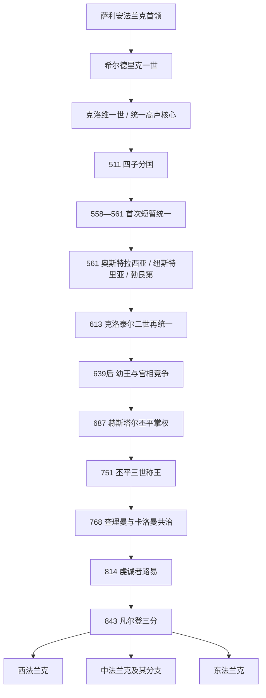

# 法兰克统治者完整世系表

## 范围与读法

法兰克王国在墨洛温时期被视为一份可以在王族成员间分割、又可重新合并的家族王权，因此同一时间常有多位“法兰克人的国王”。本表不是把奥斯特拉西亚、纽斯特里亚、勃艮第等误当成现代主权国家，而是按公认统治者列全各分国、共治、复位与争议王。843年以后，西、中、东法兰克走向不同继承体系，分别列表。

## 墨洛温王朝：早期与511年分国

| 顺序 | 君主 | 在位 / 分国 | 与前任关系 | 关键说明 |
|---:|---|---|---|---|
| 1 | 克洛迪奥 | 约5世纪中叶 | 早期萨利安法兰克首领 | 年代与世系均不确定；在图尔奈一带扩张，是后世王统记忆中的先驱。 |
| 2 | 墨洛维 | 约450-458 | 传统上承接克洛迪奥，亲缘有争议 | 王朝以其命名；其历史形象与传说混合。 |
| 3 | **希尔德里克一世** | 约458-481，图尔奈 | 墨洛维之子或亲族 | 与高卢罗马将领合作作战，墓葬显示法兰克与晚期罗马军政文化并存。 |
| 4 | **克洛维一世** | 481-511；约509后统一主要法兰克集团 | 希尔德里克一世之子 | 486年胜苏瓦松、约496年前后受洗、507年胜西哥特；建立王朝核心。 |
| 5A | 狄奥多里克一世 | 511-534，兰斯 / 后称奥斯特拉西亚 | 克洛维一世长子 | 继承莱茵与东部领地，征服图林根；其支系延续至555年。 |
| 5B | 克洛多米尔 | 511-524，奥尔良 | 克洛维一世之子 | 进攻勃艮第时战死；其幼子多数被叔父杀害，领地被兄弟瓜分。 |
| 5C | 希尔德贝尔特一世 | 511-558，巴黎 | 克洛维一世之子 | 参与征服勃艮第并远征西哥特；无子，领地归克洛泰尔。 |
| 5D | 克洛泰尔一世 | 511-561，苏瓦松；558-561统治全部王国 | 克洛维一世幼子 | 吞并兄弟及侄系领地，558年短暂统一法兰克王国。 |
| 6 | 狄奥德贝尔特一世 | 534-548，奥斯特拉西亚 | 狄奥多里克一世之子 | 介入意大利哥特战争并自行铸造带王像金币，显示高度独立王权。 |
| 7 | 狄奥德巴尔德 | 548-555，奥斯特拉西亚 | 狄奥德贝尔特一世之子 | 无嗣而亡，东部领地归克洛泰尔一世。 |

## 561年分国至达戈贝尔特一世

| 顺序 | 君主 | 在位 / 分国 | 继承关系 | 关键说明 |
|---:|---|---|---|---|
| 8A | 西吉贝尔特一世 | 561-575，奥斯特拉西亚 | 克洛泰尔一世之子 | 与兄希尔佩里克长期内战；娶布伦希尔德，遇刺后幼子继位。 |
| 8B | 希尔佩里克一世 | 561-584，纽斯特里亚 | 克洛泰尔一世之子 | 与西吉贝尔特、贡特拉姆争夺领地；宫廷仇杀与王后芙蕾德贡德政治突出。 |
| 8C | 贡特拉姆 | 561-592，勃艮第 / 奥尔良 | 克洛泰尔一世之子 | 无成年存活子嗣，以《昂德洛条约》承认侄子希尔德贝尔特二世为继承人。 |
| 8D | 查理贝尔特一世 | 561-567，巴黎与西部 | 克洛泰尔一世之子 | 无合法男性继承人，领地死后由兄弟瓜分。 |
| 9 | **希尔德贝尔特二世** | 575-595，奥斯特拉西亚；592起兼勃艮第 | 西吉贝尔特一世之子 | 幼年由母后布伦希尔德摄政；继承贡特拉姆领地。 |
| 10 | 克洛泰尔二世 | 584-629，纽斯特里亚；613后全法兰克 | 希尔佩里克一世之子 | 在母后芙蕾德贡德保护下即位；613年击败布伦希尔德与西吉贝尔特二世，再度统一。 |
| 11A | 狄奥德贝尔特二世 | 595-612，奥斯特拉西亚 | 希尔德贝尔特二世长子 | 与弟狄奥多里克二世内战，兵败后被杀。 |
| 11B | 狄奥多里克二世 | 595-613，勃艮第；612起兼奥斯特拉西亚 | 希尔德贝尔特二世次子 | 击败兄长后短暂统一东部，准备进攻克洛泰尔二世时病亡。 |
| 12 | 西吉贝尔特二世 | 613，奥斯特拉西亚与勃艮第 | 狄奥多里克二世之子 | 由曾祖母布伦希尔德拥立，战败被克洛泰尔二世处死。 |
| 13 | **达戈贝尔特一世** | 623-639：先奥斯特拉西亚；629后全法兰克；634后与子分治 | 克洛泰尔二世之子 | 被立为奥斯特拉西亚王以安抚当地贵族；629年继承全境，常被视为最后一位强势墨洛温王。 |
| 14 | 查理贝尔特二世 | 629-632，阿基坦 | 克洛泰尔二世幼子 | 获兄达戈贝尔特分封阿基坦，死后幼子希尔佩里克很快死亡，领地被收回。 |
| 15 | 希尔佩里克（阿基坦） | 632，幼王 | 查理贝尔特二世之子 | 婴幼年即位，不久死亡；是否遭谋害不详。 |

## 639年后的分国、争议王与王朝终结

| 顺序 | 君主 | 在位 / 分国 | 继承关系 | 关键说明 |
|---:|---|---|---|---|
| 16A | 西吉贝尔特三世 | 634-656/660，奥斯特拉西亚 | 达戈贝尔特一世之子 | 幼年即位，宫相权力增强；去世年份在不同编年传统中有差异。 |
| 16B | 克洛维二世 | 639-657，纽斯特里亚与勃艮第 | 达戈贝尔特一世之子 | 幼年由母后与宫相摄政；其后裔构成末期主要王统。 |
| 17 | 希尔德贝尔特“养子” | 656/660-661/662，奥斯特拉西亚 | 宫相格里莫阿尔德之子，被西吉贝尔特三世收养的说法有争议 | 将达戈贝尔特二世流放后即位；被纽斯特里亚势力推翻，合法性长期有争议。 |
| 18 | 克洛泰尔三世 | 657-673，纽斯特里亚与勃艮第；661/662后名义兼奥斯特拉西亚 | 克洛维二世长子 | 幼年由母后巴蒂尔德与宫相执政；实际地区控制有限。 |
| 19 | 希尔德里克二世 | 662-675，奥斯特拉西亚；673-675全法兰克 | 克洛维二世次子 | 迎娶西吉贝尔特三世之女，获奥斯特拉西亚王位；后兼并纽斯特里亚，因强制政策被刺杀。 |
| 20 | 狄奥多里克三世 | 673；675-691，纽斯特里亚与勃艮第；679后名义全法兰克 | 克洛维二世幼子 | 673年短暂被立又遭废；675年复位，687年泰尔特里战败后受赫斯塔尔丕平支配。 |
| — | 克洛维三世（争议） | 675-676，奥斯特拉西亚 | 自称克洛泰尔三世之子，身份不确定 | 奥斯特拉西亚贵族与宫相短暂拥立，旋被放弃；是否为真正墨洛温成员有争议。 |
| 21 | 达戈贝尔特二世 | 676-679，奥斯特拉西亚 | 西吉贝尔特三世之子；从流放地归国 | 被贵族迎回复位，679年遇刺，王权再归狄奥多里克三世名义统合。 |
| 22 | 克洛维四世 | 691-695，全法兰克 | 狄奥多里克三世之子 | 由赫斯塔尔丕平控制下即位。 |
| 23 | 希尔德贝尔特三世 | 695-711，全法兰克 | 狄奥多里克三世之子、克洛维四世之弟 | 司法文书显示王室仍非完全无能，但军事与任官受宫相体系制约。 |
| 24 | 达戈贝尔特三世 | 711-715，全法兰克 | 希尔德贝尔特三世之子 | 宫相丕平死后权力危机爆发，纽斯特里亚与奥斯特拉西亚重新交战。 |
| 25 | 希尔佩里克二世 | 715-721，先纽斯特里亚；718后获查理·马特承认为全法兰克王 | 可能为希尔德里克二世之子，早年在修道院 | 与纽斯特里亚宫相拉甘弗雷德合作反对查理·马特，败后和解。 |
| — | 克洛泰尔四世 | 717-718，奥斯特拉西亚 | 世系不详，可能为墨洛温旁支 | 查理·马特为对抗希尔佩里克二世所立的竞争王，早逝后其支持者转而承认希尔佩里克。 |
| 26 | 狄奥多里克四世 | 721-737，全法兰克 | 达戈贝尔特三世之子 | 由查理·马特拥立，王死后查理四年不再立王。 |
| — | 无王期 | 737-743 | 查理·马特与其子卡洛曼、丕平掌权 | 宫相直接统治，但仍未正式废除墨洛温合法性。 |
| 27 | **希尔德里克三世** | 743-751，全法兰克 | 世系不详，公认墨洛温末王 | 卡洛曼与丕平为增加合法性而拥立；751年被丕平废黜、剃发入修道院。 |

## 宫相到加洛林国王

| 顺序 | 人物 | 掌权 / 在位 | 身份与关系 | 关键说明 |
|---:|---|---|---|---|
| — | 赫斯塔尔的丕平 | 680-714；687后控制全王国宫相 | 阿努尔夫—丕平家族 | 泰尔特里战役后以“法兰克人的公爵与亲王”地位支配王国。 |
| — | 查理·马特 | 715-741 | 赫斯塔尔丕平之子 | 内战胜出，重建跨区域军政网络；732年图尔—普瓦捷战役提升威望。 |
| 1 | **丕平三世** | 751-768 | 查理·马特之子 | 获贵族与教皇支持废黜希尔德里克三世，两次受膏；援助教皇并形成“丕平献土”。 |
| 2A | **查理曼** | 768-814；800起皇帝 | 丕平三世长子 | 先与弟分治，771年后统合；征服伦巴德、萨克森等地，800年加冕皇帝。 |
| 2B | 卡洛曼一世 | 768-771 | 丕平三世次子；与查理曼分区共治 | 猝死后其贵族转向查理曼，遗孀与子投奔伦巴德；未发生正式内战。 |
| — | 意大利的丕平（原名卡洛曼） | 781-810 | 查理曼次子；受父亲加冕为伦巴德 / 意大利副王 | 在意大利与阿瓦尔边疆作战，先于父亲去世；其子伯纳德继承意大利。 |
| — | 阿基坦的路易 | 781-814；813起共帝 | 查理曼幼子，即后来的虔诚者路易 | 幼年受立为阿基坦王，由摄政与地方官治理；因兄长相继早亡成为唯一成年继承人。 |
| — | 小查理 | 800-811，父王之下的法兰克副王 | 查理曼长子 | 负责萨克森等战线，806年继承方案中将得法兰克核心；先于父亲去世。 |
| — | 意大利的伯纳德 | 810-817/818 | 意大利丕平之子、查理曼之孙 | 获准继承意大利；817年新继承安排后反叛虔诚者路易，818年受刑致死，王号终止点按反叛或判刑记法略有差异。 |
| 3 | **虔诚者路易** | 813起共帝；814-833、834-840 | 查理曼唯一存活的合法成年儿子 | 817年安排继承；833年被诸子废黜并公开忏悔，834年获支持者恢复帝位，后续内战延续。 |
| — | 洛泰尔一世 | 817-855；840前共帝，843后中法兰克王 | 虔诚者路易长子 | 817年立为共帝；父死后要求最高权，败于两弟并接受843年三分。 |
| — | 丕平一世（阿基坦） | 817-838 | 虔诚者路易次子 | 获封阿基坦王，参与反父战争；先于父亡，其子丕平二世的继承权不获皇帝承认。 |
| — | 丕平二世（阿基坦争位） | 838-852间主张；845-848一度获承认 | 丕平一世之子 | 与秃头查理争夺阿基坦，数次失位、复起并被俘；不是全法兰克最高国王。 |
| — | 日耳曼人路易 | 817/826起巴伐利亚；843-876东法兰克 | 虔诚者路易第三子 | 与秃头查理在斯特拉斯堡宣誓结盟反对洛泰尔。 |
| — | 秃头查理 | 829起获领地；843-877西法兰克 | 虔诚者路易与第二任妻子朱迪丝之子 | 出生打破817年安排，是帝国内战的直接继承争点之一。 |

## 西法兰克完整王表（843-987）

| 顺序 | 君主 | 在位 | 王族 / 继承关系 | 关键说明 |
|---:|---|---|---|---|
| 1 | **秃头查理（查理二世）** | 843-877 | 加洛林；虔诚者路易之子 | 取得西部；875年兼皇帝，877年远征意大利途中去世。 |
| 2 | 口吃者路易（路易二世） | 877-879 | 秃头查理之子 | 王权需贵族承认，在位短暂。 |
| 3A | 路易三世 | 879-882 | 路易二世之子，与弟共治北部 | 881年索库尔击败维京军，早逝。 |
| 3B | 卡洛曼二世 | 879-884 | 路易二世之子，与兄共治南部；882后独治 | 继续对维京作战，狩猎意外死亡。 |
| 4 | 胖子查理 | 884-888 | 东法兰克加洛林支系，贵族迎立 | 短暂重聚帝国大部；无法应对巴黎围城与贵族反对，887年被废，西部另立厄德。 |
| 5 | 厄德 | 888-898 | 罗贝尔家族，巴黎伯爵 | 因抗击维京获选；893年起与查理三世并立，898年双方和解。 |
| 6 | 糊涂者查理（查理三世） | 893/898-922；923-929被囚仍有支持者 | 加洛林；路易二世遗腹子 | 911年与罗洛订立圣克莱尔叙尔埃普特条约；922年被废，923年被赫伯特俘虏。 |
| 7 | 罗贝尔一世 | 922-923 | 罗贝尔家族；厄德之弟 | 反查理三世联盟推举，苏瓦松战役中阵亡。 |
| 8 | 拉乌尔 | 923-936 | 博索尼德家族；罗贝尔一世女婿 | 贵族绕过加洛林直系选立，处理维京和地方诸侯。 |
| 9 | 海外归来的路易（路易四世） | 936-954 | 加洛林；查理三世之子 | 由英格兰归国，受大贵族于格控制，依赖奥托王朝支持。 |
| 10 | 洛泰尔 | 954-986 | 路易四世之子 | 争夺洛林并与奥托二世交战；979年立子路易共治以确保继承。 |
| 11 | **懒王路易（路易五世）** | 979-987共治；986-987独治 | 洛泰尔之子 | 无嗣猝死；贵族选雨果·卡佩而非下洛林公爵查理，西法兰克加洛林王统终结。 |

## 东法兰克完整王表（843-962）

| 顺序 | 君主 | 在位 | 王族 / 分区关系 | 关键说明 |
|---:|---|---|---|---|
| 1 | **日耳曼人路易** | 843-876 | 加洛林 | 取得莱茵河以东核心；870年《梅尔森条约》获得东洛塔林吉亚大部。 |
| 2A | 卡洛曼 | 876-880 | 路易长子；统治巴伐利亚，877起兼意大利 | 病重后把意大利、巴伐利亚分别交予弟弟，880年死。 |
| 2B | 青年路易（路易三世） | 876-882 | 路易次子；统治萨克森、法兰肯、图林根，880后兼巴伐利亚 | 876年安德纳赫击败秃头查理；无合法男性继承人。 |
| 2C | 胖子查理 | 876-887 | 路易幼子；先统治阿勒曼尼亚，882后全东法兰克 | 逐步继承意大利、西法兰克与皇位；887年在东部被废。 |
| 3 | 克恩滕的阿努尔夫 | 887-899 | 卡洛曼非婚生子 | 推翻叔父胖子查理，击败维京军；896年加冕皇帝。 |
| 4 | 童子路易 | 900-911 | 阿努尔夫合法子 | 幼年统治，马扎尔袭击与公国坐大；加洛林东支绝嗣。 |
| 5 | 康拉德一世 | 911-918 | 康拉丁家族，法兰肯公爵 | 由诸侯推举；难以压服部族公国，临终推荐萨克森的亨利。 |
| 6 | **捕鸟者亨利一世** | 919-936 | 奥托王朝，萨克森公爵 | 通过盟约、战争和边疆防御整合公国，奠定德意志王权。 |
| 7 | **奥托一世** | 936-973；962起皇帝 | 亨利一世之子 | 镇压公爵叛乱、955年莱希菲尔德胜马扎尔；962年加冕后，本笔记主线转入神圣罗马帝国。 |

## 中法兰克及直接继承王统

| 区域 | 顺序 | 君主 | 在位 | 继承与结局 |
|---|---:|---|---|---|
| 中法兰克 | 1 | **洛泰尔一世** | 843-855；817起共帝 | 取得从北海至意大利的狭长地带与皇帝称号；855年《普吕姆条约》分给三子。 |
| 洛塔林吉亚 | 1 | 洛泰尔二世 | 855-869 | 洛泰尔一世次子；婚姻撤销争议牵动教皇与叔父，无合法子，死后领地被叔父分割。 |
| 普罗旺斯 / 下勃艮第 | 1 | 普罗旺斯的查理 | 855-863 | 洛泰尔一世幼子；无嗣，领地主要由两兄分割。 |
| 意大利 | 1 | 路易二世 | 855-875；844起意大利王、850起共帝 | 洛泰尔一世长子；在意大利南部对穆斯林势力作战，无男性继承人。 |
| 意大利 | 2 | 秃头查理 | 875-877 | 西法兰克王，凭教皇与部分贵族支持兼皇帝、意大利王。 |
| 意大利 | 3 | 卡洛曼 | 877-879 | 东法兰克王之一；进入意大利获承认，病重退位。 |
| 意大利 | 4 | 胖子查理 | 879-887 | 881年加冕皇帝；887年被废后意大利进入多王竞争。 |
| 意大利 | 5A | 贝伦加尔一世 | 887-924，数次失位 / 复位 | 弗留利侯爵、加洛林母系后裔；与圭多、兰贝特、阿努尔夫、路易盲王、鲁道夫二世长期竞争，915年称帝。 |
| 意大利 | 5B | 斯波莱托的圭多 | 889-894 | 博索尼德家族；与贝伦加尔并立，891年称帝。 |
| 意大利 | 5C | 兰贝特 | 891-898共治 / 894后独治 | 圭多之子；与贝伦加尔、阿努尔夫并立，死于意外。 |
| 意大利 | 5D | 阿努尔夫 | 894-899间主张；896称帝 | 东法兰克王；两次入意大利，疾病迫使其撤退。 |
| 意大利 | 5E | 盲人路易 | 900-905，数次失位 / 复位 | 下勃艮第王；901年称帝，905年被贝伦加尔俘虏刺瞎并逐出。 |
| 意大利 | 5F | 勃艮第的鲁道夫二世 | 922-926 | 上勃艮第王；贵族邀请反对贝伦加尔，后被普罗旺斯的于格排挤。 |
| 意大利 | 6 | 阿尔勒的于格 | 926-947 | 博索尼德 / 普罗旺斯贵族；与鲁道夫二世协议，933年以放弃上勃艮第主张换取意大利；被贝伦加尔二世逼退。 |
| 意大利 | 7 | 洛泰尔二世（意大利） | 945/947-950 | 于格之子，945后名义共治、947后独治；实权受贝伦加尔二世控制，突然死亡引发毒杀传言。 |
| 意大利 | 8A | 贝伦加尔二世 | 950-961 | 伊夫雷亚侯爵；与子共治，压迫洛泰尔遗孀阿德莱德；奥托一世介入，961年失位。 |
| 意大利 | 8B | 阿达尔贝特 | 950-961共治 | 贝伦加尔二世之子；与父共治，败后流亡并继续抵抗奥托。 |
| 下勃艮第 | 1 | 博索 | 879-887 | 非加洛林贵族，经地方主教与贵族选立；在普罗旺斯建立独立王权，遭加洛林诸王围攻但保有南部。 |
| 下勃艮第 | 2 | 盲人路易 | 887-928 | 博索之子；幼年由母摄政，失去意大利后仍名义统治普罗旺斯。 |
| 上勃艮第 | 1 | 鲁道夫一世 | 888-912 | 韦尔夫家族；胖子查理被废后在圣莫里斯获选，建立上勃艮第王国。 |
| 上勃艮第 | 2 | 鲁道夫二世 | 912-937 | 鲁道夫一世之子；一度为意大利王，933年取得下勃艮第，形成两勃艮第联合方向。 |
| 两勃艮第 | 3 | 和平者康拉德 | 937-993 | 鲁道夫二世之子；幼年获奥托王朝保护，维持阿尔卑斯—罗讷河王国，其后世系延续到1032年鲁道夫三世。 |

## 使用说明与交叉链接

- “完整”指公认拥有国王头衔者，不把所有宫相、公爵或仅有地方军事权的王子混入；争议身份与短期竞争王则明确标注。
- 墨洛温各王共享“法兰克人的国王”观念，分国表是行政与宫廷中心的分配，不代表族群或主权永久分裂。
- 843年后的西、中、东三国仍有跨区继承：胖子查理曾短暂重聚帝国大部，秃头查理与东部卡洛曼也兼任意大利王；表中重现同一人是因为其在不同王冠上的在位期不同。
- 主入口：[法兰克王国](/%E4%BA%BA%E6%96%87%E7%A7%91%E5%AD%A6/%E5%8E%86%E5%8F%B2/%E6%AC%A7%E6%B4%B2/_%E9%80%9A%E5%8F%B2/%E5%90%8E%E7%BD%97%E9%A9%AC%E6%97%B6%E4%BB%A3%E7%9A%84%E6%97%A5%E8%80%B3%E6%9B%BC%E8%AF%B8%E5%9B%BD/%E6%B3%95%E5%85%B0%E5%85%8B%E7%8E%8B%E5%9B%BD/README.md)
- 分期笔记：[墨洛温王朝](/%E4%BA%BA%E6%96%87%E7%A7%91%E5%AD%A6/%E5%8E%86%E5%8F%B2/%E6%AC%A7%E6%B4%B2/_%E9%80%9A%E5%8F%B2/%E5%90%8E%E7%BD%97%E9%A9%AC%E6%97%B6%E4%BB%A3%E7%9A%84%E6%97%A5%E8%80%B3%E6%9B%BC%E8%AF%B8%E5%9B%BD/%E6%B3%95%E5%85%B0%E5%85%8B%E7%8E%8B%E5%9B%BD/%E5%A2%A8%E6%B4%9B%E6%B8%A9%E7%8E%8B%E6%9C%9D.md)、[加洛林王朝](/%E4%BA%BA%E6%96%87%E7%A7%91%E5%AD%A6/%E5%8E%86%E5%8F%B2/%E6%AC%A7%E6%B4%B2/_%E9%80%9A%E5%8F%B2/%E5%90%8E%E7%BD%97%E9%A9%AC%E6%97%B6%E4%BB%A3%E7%9A%84%E6%97%A5%E8%80%B3%E6%9B%BC%E8%AF%B8%E5%9B%BD/%E6%B3%95%E5%85%B0%E5%85%8B%E7%8E%8B%E5%9B%BD/%E5%8A%A0%E6%B4%9B%E6%9E%97%E7%8E%8B%E6%9C%9D.md)、[西法兰克王国](/%E4%BA%BA%E6%96%87%E7%A7%91%E5%AD%A6/%E5%8E%86%E5%8F%B2/%E6%AC%A7%E6%B4%B2/_%E9%80%9A%E5%8F%B2/%E5%90%8E%E7%BD%97%E9%A9%AC%E6%97%B6%E4%BB%A3%E7%9A%84%E6%97%A5%E8%80%B3%E6%9B%BC%E8%AF%B8%E5%9B%BD/%E6%B3%95%E5%85%B0%E5%85%8B%E7%8E%8B%E5%9B%BD/%E8%A5%BF%E6%B3%95%E5%85%B0%E5%85%8B%E7%8E%8B%E5%9B%BD.md)、[中法兰克王国](/%E4%BA%BA%E6%96%87%E7%A7%91%E5%AD%A6/%E5%8E%86%E5%8F%B2/%E6%AC%A7%E6%B4%B2/_%E9%80%9A%E5%8F%B2/%E5%90%8E%E7%BD%97%E9%A9%AC%E6%97%B6%E4%BB%A3%E7%9A%84%E6%97%A5%E8%80%B3%E6%9B%BC%E8%AF%B8%E5%9B%BD/%E6%B3%95%E5%85%B0%E5%85%8B%E7%8E%8B%E5%9B%BD/%E4%B8%AD%E6%B3%95%E5%85%B0%E5%85%8B%E7%8E%8B%E5%9B%BD.md)、[东法兰克王国](/%E4%BA%BA%E6%96%87%E7%A7%91%E5%AD%A6/%E5%8E%86%E5%8F%B2/%E6%AC%A7%E6%B4%B2/_%E9%80%9A%E5%8F%B2/%E5%90%8E%E7%BD%97%E9%A9%AC%E6%97%B6%E4%BB%A3%E7%9A%84%E6%97%A5%E8%80%B3%E6%9B%BC%E8%AF%B8%E5%9B%BD/%E6%B3%95%E5%85%B0%E5%85%8B%E7%8E%8B%E5%9B%BD/%E4%B8%9C%E6%B3%95%E5%85%B0%E5%85%8B%E7%8E%8B%E5%9B%BD.md)
- 上级总览：[后罗马时代的日耳曼诸国](/%E4%BA%BA%E6%96%87%E7%A7%91%E5%AD%A6/%E5%8E%86%E5%8F%B2/%E6%AC%A7%E6%B4%B2/_%E9%80%9A%E5%8F%B2/%E5%90%8E%E7%BD%97%E9%A9%AC%E6%97%B6%E4%BB%A3%E7%9A%84%E6%97%A5%E8%80%B3%E6%9B%BC%E8%AF%B8%E5%9B%BD/README.md)
