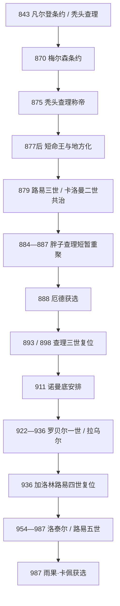

# 西法兰克王国

## 时间

843年-987年；“西法兰克”逐渐转为“法兰西”是10-12世纪的长期过程，987年不是现代法国立即诞生。

## 概括

西法兰克王国是843年《凡尔登条约》中秃头查理取得的帝国西部，核心为高卢罗曼语地区，但也包括布列塔尼边缘、阿基坦、勃艮第等高度自主的政治区域。国王仍称“法兰克人的国王”，与东、中法兰克王族保持继承和帝国竞争。870年《梅尔森条约》取得洛塔林吉亚西部，875年秃头查理兼皇帝；胖子查理又于884-887年短暂把西部与其他加洛林王国合并，说明843年边界并非民族国家定型。

9世纪后期的维京袭击、王室频繁短命和伯爵、侯爵权力世袭化，使国王直接控制缩小。911年查理三世与罗洛订约，承认塞纳河下游诺曼领地，以受洗和守边换取停止袭击。巴黎伯爵厄德、其弟罗贝尔一世与女婿拉乌尔先后由贵族推举，和加洛林王查理三世、路易四世交替，王位逐步带有选举与大贵族协商色彩。

987年路易五世无嗣去世，兰斯大主教阿达尔贝罗支持贵族选择掌握巴黎—奥尔良核心的雨果·卡佩，而非加洛林旁支下洛林公爵查理。卡佩即位是王朝更替，不是国家灭亡；西法兰克的伯爵区、主教、王室法令与“法兰克国王”称号继续。长期看，卡佩家族以父子共治、王室领地和教会合作稳定继承，政治主线才逐渐成为法兰西王国。

## 建立与秃头查理的王国（843-877）

秃头查理在父亲虔诚者路易晚年才获得稳定领地。843年分国后，他仍须对付阿基坦的丕平二世、布列塔尼统治者诺米诺埃、维京军与洛泰尔兄弟。阿基坦贵族在查理与丕平之间反复选择，直到864年丕平二世被俘，王室才取得相对优势。布列塔尼则在巴隆战役后迫使查理承认埃里斯波埃的王号与扩张，显示西法兰克从来不是中央直接统治全部领土。

869年洛泰尔二世无合法子去世，秃头查理迅速在梅斯加冕；日耳曼人路易反对，双方于870年《梅尔森条约》瓜分洛塔林吉亚。875年意大利王兼皇帝路易二世死后，查理越过阿尔卑斯，由教皇若望八世加冕皇帝。877年他再赴意大利，在贵族不愿长期服役、侄子卡洛曼进攻的压力下撤退并病死。

877年《基耶尔济敕令》常被称为“封建世袭起点”，实际是皇帝远征时对伯爵死后由儿子暂管职务、待国王裁定的应急规则。伯爵职位和荣誉确在9-10世纪越来越家族化，但不是一纸敕令立即把所有公职变成永久私人封地。

## 王权危机、维京战争与非加洛林国王

### 877-888年的短命继承

口吃者路易二世获得贵族承认后在位不足两年。其子路易三世、卡洛曼二世分治，路易于881年索库尔击败维京军，却在882年意外死亡；卡洛曼于884年狩猎事故身亡。幼弟查理当时年幼，贵族邀请已统治东法兰克、意大利并拥有皇帝称号的胖子查理，短暂恢复查理曼帝国大部统一。

885-886年维京军围攻巴黎，巴黎伯爵厄德和主教戈兹兰坚守。胖子查理最终以赎金并允许维京军前往勃艮第解决，虽符合帝国全局权衡，却被当地精英视为软弱。887年胖子查理在东部被废，888年西法兰克贵族推举厄德，而不是等待加洛林幼王。

### 厄德、查理三世与诺曼底

厄德凭抗击维京威望即位，但其王权主要依赖罗贝尔家族领地。893年反对派在兰斯为加洛林的查理三世加冕，两王并立至898年厄德死。查理随后统治全境，并把重心放在洛塔林吉亚，任用哈根诺等外来宠臣，引起西部贵族不满。

911年塞纳河维京首领罗洛在沙特尔附近受挫后，与查理订立圣克莱尔叙尔埃普特条约。条约文本未完整保存，领地范围分阶段扩大；核心机制是罗洛受洗、向国王效忠并保卫塞纳口，换取鲁昂周边土地。诺曼底随后吸收更多北欧移民并采用法兰克基督教、法语和伯爵制度，成为强大但名义从属的公国。

922年贵族废黜查理，选罗贝尔一世。923年苏瓦松战役中罗贝尔虽阵亡，查理却被韦尔芒杜瓦伯爵赫伯特二世俘虏，直至929年死。贵族转选罗贝尔女婿、勃艮第公爵拉乌尔；因此923-936年不是加洛林“正常继承”，而是非加洛林贵族王权。

## 加洛林复位与卡佩转折（936-987）

### 路易四世与于格大帝

拉乌尔无子死后，最强贵族于格大帝没有自己称王，而是从英格兰迎回查理三世之子路易四世。保留加洛林王可避免其他贵族反对于格垄断王位，也提供与东法兰克奥托王朝交涉的合法君主。路易试图摆脱于格控制，在诺曼底被俘，又依赖奥托一世和教会获释。954年路易死，年幼的洛泰尔继位，于格大帝摄政；956年于格死后，其子雨果·卡佩继承家族资源。

洛泰尔在979年立子路易五世共治，试图保证继承。他反复争夺洛林，978年突袭亚琛，奥托二世随即反攻至巴黎。王室与兰斯大主教、卡佩家族和下洛林加洛林旁支之间矛盾加剧。986年洛泰尔死，路易五世独治不足一年，在准备审判兰斯大主教时狩猎身亡，无嗣。

### 987年的选择

下洛林公爵查理是路易四世之子，有加洛林血统，但他是东法兰克 / 帝国的公爵，且与兰斯教会敌对。阿达尔贝罗提出王位应授予能力与德望兼具者，贵族在桑利斯选雨果·卡佩。雨果控制巴黎、奥尔良及重要修道院，能保护核心地区；同年为子罗贝尔加冕共治，把一次选举转化为世袭安排。查理一度占领拉昂，自称国王，991年被背叛俘虏，旁支挑战才失败。

## 完整王位世系

| 顺序 | 君主 | 在位 | 王族 / 继承关系 | 关键事件 / 备注 |
|---:|---|---|---|---|
| 1 | **秃头查理（查理二世）** | 843-877 | 加洛林；虔诚者路易之子 | 建立西部分国，870年取洛林西部，875年称帝。 |
| 2 | 口吃者路易（路易二世） | 877-879 | 秃头查理之子 | 经贵族承认继位，在位短暂。 |
| 3A | 路易三世 | 879-882 | 路易二世之子，与弟共治北部 | 881年索库尔胜维京军，意外死亡。 |
| 3B | 卡洛曼二世 | 879-884 | 路易二世之子，与兄共治南部，882后独治 | 延续抗维京战争，狩猎事故死亡。 |
| 4 | 胖子查理 | 884-888 | 东部加洛林支系，贵族邀请 | 短暂统一帝国大部；887年被废，西部另选厄德。 |
| 5 | **厄德** | 888-898 | 罗贝尔家族，巴黎伯爵 | 首位非加洛林西法兰克王；893后与查理三世并立。 |
| 6 | 糊涂者查理（查理三世） | 893/898-922；923-929被囚仍有主张 | 加洛林；路易二世遗腹子 | 911年承认诺曼领地；922年被废、923年被俘。 |
| 7 | 罗贝尔一世 | 922-923 | 罗贝尔家族；厄德之弟 | 反查理贵族推举，苏瓦松战役阵亡。 |
| 8 | 拉乌尔 | 923-936 | 博索尼德；罗贝尔一世女婿 | 经贵族推举，在查理被囚期间统治。 |
| 9 | **路易四世** | 936-954 | 加洛林；查理三世之子 | 从英格兰归国，受于格大帝和奥托一世制约。 |
| 10 | 洛泰尔 | 954-986 | 路易四世之子 | 争夺洛林，979年立子共治。 |
| 11 | **路易五世** | 979-987共治；986-987独治 | 洛泰尔之子 | 无嗣死亡，贵族转选雨果·卡佩。 |

更广的三分王统、并立范围和意大利王位见[法兰克统治者完整世系表](/%E4%BA%BA%E6%96%87%E7%A7%91%E5%AD%A6/%E5%8E%86%E5%8F%B2/%E6%AC%A7%E6%B4%B2/_%E9%80%9A%E5%8F%B2/%E5%90%8E%E7%BD%97%E9%A9%AC%E6%97%B6%E4%BB%A3%E7%9A%84%E6%97%A5%E8%80%B3%E6%9B%BC%E8%AF%B8%E5%9B%BD/%E6%B3%95%E5%85%B0%E5%85%8B%E7%8E%8B%E5%9B%BD/%E6%B3%95%E5%85%B0%E5%85%8B%E7%BB%9F%E6%B2%BB%E8%80%85%E5%AE%8C%E6%95%B4%E4%B8%96%E7%B3%BB%E8%A1%A8.md)。

## 统治结构与社会变化

| 机制 | 9世纪中叶 | 10世纪变化 | 影响 |
|---|---|---|---|
| 王室领地 | 分散于各地，国王靠巡行、庄园和修道院供给 | 大量荣誉与地产落入公爵、伯爵家族，直接控制缩向拉昂—兰斯或巴黎—奥尔良 | 王号仍有合法性，实际动员地域化。 |
| 伯爵 / 公爵 | 理论上由国王任命，负责军政与司法 | 诺曼底、佛兰德、安茹、勃艮第、阿基坦等职位家族化 | 形成诸侯政治，不等于完全无国家秩序。 |
| 教会 | 主教、修道院提供文书和王权受膏 | 王室与贵族争夺主教任命，克吕尼改革等扩大跨区网络 | 教会既支撑王权也能决定继承联盟。 |
| 军事 | 伯爵征召、王室随从和贡赋 | 城堡、地方骑士与诸侯家兵增加，王军依赖联盟 | 国王难长期跨区域作战。 |
| 语言与身份 | 拉丁文文书，多数民众说罗曼语或日耳曼语方言 | 西部“法兰克”日益成为王国和精英名称，法语方言发展 | 仍不能把843国界直接等同现代民族边界。 |

## 重要事件

| 时间 | 事件 | 结果 |
|---|---|---|
| 843年 | 《凡尔登条约》 | 秃头查理取得西部王国。 |
| 848-864年 | 阿基坦继承战争 | 丕平二世失败，王室取得名义控制但地方自治仍强。 |
| 870年 | 《梅尔森条约》 | 西法兰克取得洛塔林吉亚西部。 |
| 875年 | 秃头查理加冕皇帝 | 西部国王短暂进入意大利帝权。 |
| 877年 | 皇帝死亡与继承 | 王位连续落入短命国王，地方贵族影响增强。 |
| 881年 | 索库尔战役 | 路易三世胜维京，未能终止持续袭击。 |
| 885-886年 | 巴黎围城 | 厄德威望上升，胖子查理妥协受批评。 |
| 888年 | 厄德获选 | 王位首次转向罗贝尔家族。 |
| 911年 | 诺曼底协议 | 将维京首领纳入法兰克封臣和基督教秩序。 |
| 922-923年 | 查理三世被废、被俘 | 加洛林和罗贝尔家族竞争公开化。 |
| 936年 | 路易四世复位 | 加洛林王号仍有跨区合法性，但依赖于格大帝。 |
| 978年 | 洛泰尔攻亚琛、奥托二世反击 | 洛林争端显示西、东王权仍相互竞争。 |
| 987年 | 雨果·卡佩获选 | 西部加洛林直系终结，卡佩王朝开始。 |

## 王权衰落与王朝更替原因

### 结构因素

- 国王没有覆盖全境的常备税军，必须把土地与职位交给伯爵、主教换取防御和军役。
- 王室连续短命、幼王和无嗣，使贵族推举从应急做法变成政治常态。
- 维京军沿河袭击迫使地方伯爵建堡、筹军，防御成功者积累比巡行国王更直接的威望。
- 阿基坦、布列塔尼、勃艮第、诺曼底等区域拥有独立传统，国王对它们多为宗主而非日常行政者。
- 加洛林王过度关注洛林与帝国继承，核心西部贵族认为资源被外部战争消耗。

### 外部压力与直接触发

维京压力推动地方化，却没有直接“灭亡西法兰克”；罗洛等最终被制度吸收。真正结束加洛林王统的是986-987年洛泰尔、路易五世相继无嗣死亡，旁支查理缺乏教会和核心贵族支持。阿达尔贝罗的政治论证、雨果·卡佩的地域资源及同年立子共治，使王位平稳转移。

## 演变关系

- 前一节点：[加洛林王朝](/%E4%BA%BA%E6%96%87%E7%A7%91%E5%AD%A6/%E5%8E%86%E5%8F%B2/%E6%AC%A7%E6%B4%B2/_%E9%80%9A%E5%8F%B2/%E5%90%8E%E7%BD%97%E9%A9%AC%E6%97%B6%E4%BB%A3%E7%9A%84%E6%97%A5%E8%80%B3%E6%9B%BC%E8%AF%B8%E5%9B%BD/%E6%B3%95%E5%85%B0%E5%85%8B%E7%8E%8B%E5%9B%BD/%E5%8A%A0%E6%B4%9B%E6%9E%97%E7%8E%8B%E6%9C%9D.md)。
- 并列节点：[中法兰克王国](/%E4%BA%BA%E6%96%87%E7%A7%91%E5%AD%A6/%E5%8E%86%E5%8F%B2/%E6%AC%A7%E6%B4%B2/_%E9%80%9A%E5%8F%B2/%E5%90%8E%E7%BD%97%E9%A9%AC%E6%97%B6%E4%BB%A3%E7%9A%84%E6%97%A5%E8%80%B3%E6%9B%BC%E8%AF%B8%E5%9B%BD/%E6%B3%95%E5%85%B0%E5%85%8B%E7%8E%8B%E5%9B%BD/%E4%B8%AD%E6%B3%95%E5%85%B0%E5%85%8B%E7%8E%8B%E5%9B%BD.md)、[东法兰克王国](/%E4%BA%BA%E6%96%87%E7%A7%91%E5%AD%A6/%E5%8E%86%E5%8F%B2/%E6%AC%A7%E6%B4%B2/_%E9%80%9A%E5%8F%B2/%E5%90%8E%E7%BD%97%E9%A9%AC%E6%97%B6%E4%BB%A3%E7%9A%84%E6%97%A5%E8%80%B3%E6%9B%BC%E8%AF%B8%E5%9B%BD/%E6%B3%95%E5%85%B0%E5%85%8B%E7%8E%8B%E5%9B%BD/%E4%B8%9C%E6%B3%95%E5%85%B0%E5%85%8B%E7%8E%8B%E5%9B%BD.md)。
- 后一节点：[卡佩王朝](/%E4%BA%BA%E6%96%87%E7%A7%91%E5%AD%A6/%E5%8E%86%E5%8F%B2/%E6%AC%A7%E6%B4%B2/%E6%B3%95%E5%9B%BD/%E5%8D%A1%E4%BD%A9%E7%8E%8B%E6%9C%9D.md)。
- 区域总览：[法国历史](/%E4%BA%BA%E6%96%87%E7%A7%91%E5%AD%A6/%E5%8E%86%E5%8F%B2/%E6%AC%A7%E6%B4%B2/%E6%B3%95%E5%9B%BD/README.md)。
- 所属总览：[法兰克王国](/%E4%BA%BA%E6%96%87%E7%A7%91%E5%AD%A6/%E5%8E%86%E5%8F%B2/%E6%AC%A7%E6%B4%B2/_%E9%80%9A%E5%8F%B2/%E5%90%8E%E7%BD%97%E9%A9%AC%E6%97%B6%E4%BB%A3%E7%9A%84%E6%97%A5%E8%80%B3%E6%9B%BC%E8%AF%B8%E5%9B%BD/%E6%B3%95%E5%85%B0%E5%85%8B%E7%8E%8B%E5%9B%BD/README.md)。
