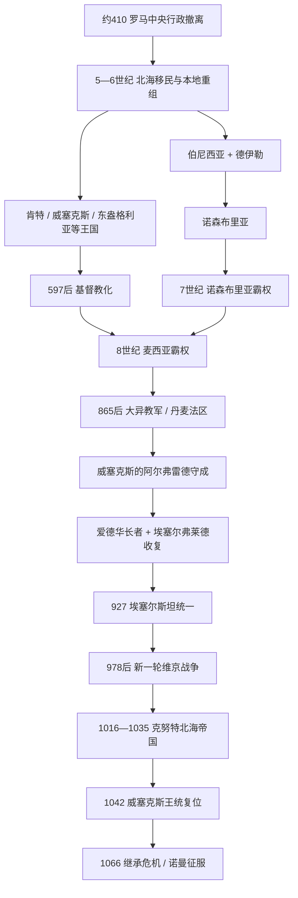

# 盎格鲁-撒克逊诸国

## 时间

约5世纪中叶-1066年；927年埃塞尔斯坦首次较稳定地统治全英格兰，但统一经历多次维京征服、复位与丹麦王朝统治。

## 概括

盎格鲁—撒克逊诸国是罗马不列颠行政撤离后，由来自北海沿岸的盎格鲁人、撒克逊人、朱特人、弗里斯人等移民及本地不列颠人共同形成的一系列王国。“七国时代”是后世为肯特、苏塞克斯、埃塞克斯、东盎格利亚、威塞克斯、麦西亚、诺森布里亚七个主要王国设计的便捷框架，实际同时存在的政权远多于七个，边界、霸主和王族反复变化。

移民过程既包括武装征服和土地夺取，也包括罗马末期雇佣兵定居、亲族迁移、本地精英改用日耳曼语言与身份，以及不同人口通婚。5-7世纪，罗马城市、货币和中央税制在低地英格兰显著衰退，王权以战团、贡赋、王室庄园和地方大会为基础。597年以后，坎特伯雷传教团、爱尔兰—爱奥那修道传统与本地王室共同推动基督教化，拉丁书写和跨海外交恢复。

7世纪诺森布里亚、8世纪麦西亚先后取得霸权；9世纪“大异教军”摧毁或控制多个王国，威塞克斯的阿尔弗雷德守住南部并与丹麦势力划界。其后爱德华长者、麦西亚女领主埃塞尔弗莱德与埃塞尔斯坦逐步征服丹麦法区。1013-1042年间英格兰数度被丹麦王统控制，克努特把它纳入北海帝国。1066年忏悔者爱德华无嗣去世，引发哈罗德、挪威王哈拉尔与诺曼底公爵威廉三方争位；黑斯廷斯战役结束盎格鲁—撒克逊王族的全国统治。

## 罗马之后的转型与移民

约410年，皇帝霍诺留统治下的西罗马政府停止向不列颠提供常规军政支持。地方城市、庄园、基督教社群与不列颠统治者并未一夜消失，但硬币流通、公共税收、军团和远距离行政迅速萎缩。5世纪文献稀少，后世《盎格鲁—撒克逊编年史》给出的亨吉斯特、霍萨等建国日期含王族传说，不能当作逐年可靠记录。

考古学显示北海式墓葬、长屋和器物从东南、东部沿海向内陆扩展，古英语最终在大部分低地占优势。遗传与地名材料说明有显著大陆移民，也有大量本地人口延续；地区比例不同。西部威尔士、康沃尔和北方不列颠王国持续抵抗，巴顿山战役等冲突延缓西进。所谓“盎格鲁—撒克逊人”本身在英格兰内部形成，后来把多种来历的人纳入共同法律、语言和基督教身份。

## 诸王国形成与“七国时代”

| 王国 / 集团 | 形成与中心 | 政治演变 |
|---|---|---|
| 肯特 | 泰晤士河口与坎特伯雷，王族传统称奥伊斯金加斯 | 6世纪埃塞尔伯特通过婚姻、贸易和霸权居领先；597年接纳奥古斯丁传教团。 |
| 苏塞克斯 | 南撒克逊地区，以奇切斯特周边为中心 | 早期史料稀少，先后受麦西亚、威塞克斯影响，9世纪并入威塞克斯体系。 |
| 埃塞克斯 | 伦敦以东与中撒克逊地区 | 控制伦敦的能力随霸主变化，8世纪受麦西亚支配，9世纪部分进入丹麦法区。 |
| 东盎格利亚 | 诺福克、萨福克，伍芬加斯王族 | 雷德沃尔德时期强盛，萨顿胡墓葬反映跨海财富；869年国王埃德蒙被维京军杀害。 |
| 威塞克斯 | 泰晤士河上游与汉普郡逐步扩张，塞尔迪克王族 | 7世纪向西推进，825年后取代麦西亚霸权；9世纪成为抵抗维京与统一英格兰核心。 |
| 麦西亚 | 特伦特河谷及中部，伊克林加斯王族 | 彭达、埃塞尔博尔德、奥法时期扩张；奥法修筑边墙并铸造高质量钱币，8世纪称霸南英格兰。 |
| 伯尼西亚 / 德伊勒—诺森布里亚 | 北方两个王国反复合并，以班堡、约克为中心 | 埃塞尔弗里思、埃德温、奥斯瓦尔德、奥斯威等建立7世纪霸权；修道院文化繁荣，后因内斗和维京攻占约克而分裂。 |
| 小王国 | 林赛、赫维切、马贡赛特、怀特岛等 | 常作为大国附属或缓冲区，不应从“七国”框架中抹去。 |

“霸主”不是全国常设皇帝。早期资料用布雷特瓦尔达等词描述某些扩张国王，但他们的贡赋、军役和外交控制通常随个人死亡消失。王国兼并通过战争、王室婚姻、附庸、教会任命和继承绝嗣逐步发生。

## 基督教化与书写国家

597年教皇格里高利一世派奥古斯丁到肯特，埃塞尔伯特的法兰克妻子伯莎已信基督教，王室受洗推动坎特伯雷教省建立。北方则由爱奥那岛林迪斯法恩传统和罗马传教系统共同传播。664年惠特比会议采纳罗马复活节计算和剃发惯例，更多是教会行政协调，不是“凯尔特教会”被完全消灭。

修道院成为土地所有者、学校、档案和外交节点。比德的历史著作、盎格鲁—撒克逊法律、王室特许状与钱币为政治提供书面记忆。国王通过资助教会获取祈祷、识字官员和合法性，教会也依赖王室保护。8世纪诺森布里亚的贾罗、约克和林迪斯法恩形成学术网络，英格兰传教士博尼法斯又影响大陆法兰克教会。

## 诺森布里亚、麦西亚与威塞克斯霸权

### 诺森布里亚（7世纪）

埃塞尔弗里思把伯尼西亚与德伊勒置于同一王权下；埃德温在616年后扩张到马恩岛和威尔士边缘，接受基督教，633年在哈特菲尔德蔡斯战死。奥斯瓦尔德从流亡归来，于海文菲尔德获胜；其弟奥斯威在655年温韦德战役击败并杀死麦西亚异教王彭达，短暂控制大片南部。685年埃格弗里思在内克坦斯米尔败于皮克特，北方扩张终止。王族内斗和频繁更替随后削弱王国。

### 麦西亚（7-8世纪）

彭达以军事联盟挑战诺森布里亚，虽最终战死，却奠定麦西亚中部核心。埃塞尔博尔德控制多数南方王国；奥法在757-796年通过战争、婚姻、主教区调整和钱币改革建立最强霸权，著名的奥法堤划定与威尔士政权的部分边界。其权力仍依赖附属国王和地方精英，儿子短命后霸权迅速松动。

### 威塞克斯上升（9世纪初）

埃格伯特于825年埃兰顿战役击败麦西亚，东南诸王国承认威塞克斯上位。其子埃塞尔伍尔夫既与大陆教会联系，也面对维京袭击。威塞克斯并非线性统一全国；它先建立南方复合王权，随后在维京危机中成为唯一保有独立本土王族的主要盎格鲁—撒克逊王国。

## 维京战争、丹麦法区与统一

### 大异教军与阿尔弗雷德

793年林迪斯法恩被袭常被用作维京时代象征，但此前后已有海上袭击。865年“大异教军”进入英格兰，利用诸王国内争逐一攻破诺森布里亚、东盎格利亚和麦西亚。威塞克斯国王埃塞尔雷德一世死后，弟阿尔弗雷德于871年即位。878年古斯鲁姆突袭使他退守阿塞尔尼，阿尔弗雷德重组军队后在爱丁顿取胜；古斯鲁姆受洗，双方以条约划分势力。

“丹麦法区”指东部和北部采用不同法律、军政与定居网络的地区，不是边界永久固定的单一丹麦国家。约克有北欧国王，东部又有多个军团和地方领袖。阿尔弗雷德修建堡镇体系、轮换征召军和舰队，翻译拉丁著作，并以“盎格鲁人与撒克逊人的国王”等称号扩大共同身份。

### 收复与英格兰王国

阿尔弗雷德之子爱德华长者与姐姐、麦西亚女领主埃塞尔弗莱德合作，以堡镇链推进，先后控制东盎格利亚、麦西亚和丹麦五城。埃塞尔弗莱德918年去世后，其女埃尔夫温短暂继承，随即被爱德华带往威塞克斯，麦西亚独立宫廷终止。

927年埃塞尔斯坦攻取约克，成为第一位较稳定统治全英格兰的国王；937年布鲁南堡战役击败苏格兰、都柏林和斯特拉斯克莱德联盟，巩固地位。其后约克仍多次在挪威国王与英格兰王之间易手，954年血斧埃里克被逐后才长期纳入王国。因此“927统一”是关键节点而非一劳永逸。

## 英格兰全国王权与丹麦复位（927-1066）

本表列统一王权主线；927年前各并立王国并不存在一条全国王位世系，不能把七国国王硬排成同一序列。英格兰跨时期的完整王位表见[英格兰君主完整世系表](/%E4%BA%BA%E6%96%87%E7%A7%91%E5%AD%A6/%E5%8E%86%E5%8F%B2/%E6%AC%A7%E6%B4%B2/%E4%B8%8D%E5%88%97%E9%A2%A0%E7%BE%A4%E5%B2%9B/%E8%8B%B1%E6%A0%BC%E5%85%B0/%E8%8B%B1%E6%A0%BC%E5%85%B0%E5%90%9B%E4%B8%BB%E5%AE%8C%E6%95%B4%E4%B8%96%E7%B3%BB%E8%A1%A8.md)。

| 顺序 | 君主 | 在位 | 王室 / 继承关系 | 关键事件 / 备注 |
|---:|---|---|---|---|
| 1 | **埃塞尔斯坦** | 924/925-939；927起全英格兰 | 威塞克斯王朝，爱德华长者之子 | 927取约克，937布鲁南堡胜利；首个稳定统治全英格兰者。 |
| 2 | 埃德蒙一世 | 939-946 | 埃塞尔斯坦异母弟 | 重新夺回被都柏林北欧王占据的米德兰与诺森布里亚，遇刺身亡。 |
| 3 | 埃德雷德 | 946-955 | 埃德蒙之弟 | 954年逐出血斧埃里克，约克王国终结。 |
| 4 | 埃德威 | 955-959 | 埃德蒙一世长子 | 一度与弟埃德加分治泰晤士南北，早逝。 |
| 5 | **和平者埃德加** | 957/959-975 | 埃德蒙一世幼子 | 统一后推行修道院改革、货币与行政整合；973年巴斯加冕强化王权仪式。 |
| 6 | 殉教者爱德华 | 975-978 | 埃德加长子 | 宫廷派系争夺中在科夫城堡被杀。 |
| 7 | 决策无方者埃塞尔雷德二世 | 978-1013；1014-1016复位 | 埃德加幼子 | 面对新一轮丹麦战争，以贡金、屠杀与反复将领更换应对；被斯韦恩短暂逐出后复位。 |
| 8 | 八字胡斯韦恩 | 1013-1014 | 丹麦王，征服取得 | 获英格兰承认后数周去世，埃塞尔雷德复位。 |
| 9A | 埃德蒙二世“刚勇王” | 1016，4-11月 | 埃塞尔雷德之子 | 与克努特多次会战，阿桑敦败后分国，不久去世。 |
| 9B | **克努特** | 1016-1035 | 斯韦恩之子；与埃德蒙并立后独治 | 结合英格兰、丹麦和挪威王权，保留郡、百户区、教会和英格兰税制。 |
| 10 | 哈罗德一世“兔足王” | 1035-1040 | 克努特与北安普顿的埃尔夫吉夫之子 | 初为摄政 / 北部实际王，1037后获全国承认；与同父异母弟继承派竞争。 |
| 11 | 哈德克努特 | 1040-1042 | 克努特与诺曼底的埃玛之子 | 原为丹麦王，继承英格兰后重征舰队税，突然死亡。 |
| 12 | 忏悔者爱德华 | 1042-1066 | 埃塞尔雷德与埃玛之子，威塞克斯王统复位 | 无嗣；与戈德温家族、诺曼关系和继承承诺争议造成危机。 |
| 13 | **哈罗德二世** | 1066，1-10月 | 戈德温之子，经贤人会议选立 | 斯坦福桥击败挪威军，旋在黑斯廷斯败死。 |
| — | 埃德加·埃塞林 | 1066年10-12月名义获推举，未加冕 | 埃德蒙二世之孙 | 伦敦集团在哈罗德死后推举，未能组织有效抵抗，向威廉投降。 |

## 1066年继承危机与诺曼征服

忏悔者爱德华没有子嗣。哈罗德·戈德温森掌握英格兰最大军政资源，并声称国王临终托付王位；贤人会议于1066年1月选他为王。诺曼底公爵威廉声称爱德华早已许诺王位、哈罗德又曾宣誓支持他；挪威王哈拉尔·哈德拉达则依据斯堪的纳维亚王室协议主张继承，哈罗德被流放的弟弟托斯蒂格与其联合。

9月，哈罗德军先北上，在斯坦福桥击败挪威军，哈拉尔与托斯蒂格战死。随后英军急行南下，10月14日在黑斯廷斯与威廉军作战。盾墙长期坚守，最终哈罗德及兄弟阵亡，军队崩溃。伦敦一度推举埃德加·埃塞林，但贵族陆续投降；威廉圣诞节加冕。诺曼征服更换大量土地贵族与主教、建设城堡，并以法语宫廷统治，却保存郡、百户区、王室税、铸币和书面令状等盎格鲁—撒克逊国家遗产。

## 统治结构

| 层次 | 机构 / 角色 | 作用 |
|---|---|---|
| 国王与王室 | 战争领袖、最高司法、土地与铸币权 | 从多王并立发展为全国巡行王权；继承需血统、推举和实际军力共同确认。 |
| 贤人会议 | 主教、郡长与大贵族 | 见证法令、选认国王、处理土地与战争；不是现代议会，也非可随意主宰强王。 |
| 郡与郡长 | 郡长代表王权征税、司法和征兵 | 统一时代形成覆盖全国的行政骨架，丹麦与诺曼统治者均保留。 |
| 百户区与地方大会 | 自由民、地方领主和司法人员 | 处理诉讼、治安、赋役，连接村社与王室。 |
| 王室庄园与贡赋 | 食物租、土地收入、罚金、关税 | 早期王权主要物质基础；后期全国税如丹麦金增强财政。 |
| 军事 | 贵族家兵、郡民兵、堡镇与舰队 | 阿尔弗雷德后轮换服役和堡镇防御提高持续作战能力。 |
| 教会 | 坎特伯雷、约克大主教区与修道院 | 提供书写、外交、教育和合法性，同时拥有巨大土地与独立利益。 |

## 重要事件

| 时间 | 事件 | 长期影响 |
|---|---|---|
| 约410年 | 罗马中央行政撤离 | 地方权力重组，货币与城市公共体系收缩。 |
| 5-6世纪 | 北海移民与王国形成 | 古英语扩张，本地与移民人口形成新身份。 |
| 597年 | 奥古斯丁抵肯特 | 罗马传教网络建立，王权进入拉丁基督教外交。 |
| 633-655年 | 诺森布里亚—麦西亚战争 | 北方霸权与基督教化路线反复，655年麦西亚彭达战死。 |
| 664年 | 惠特比会议 | 诺森布里亚采用罗马复活节计算，教会协调增强。 |
| 757-796年 | 奥法统治麦西亚 | 南部霸权、钱币和跨海外交发展。 |
| 825年 | 埃兰顿战役 | 威塞克斯取代麦西亚成为南部核心。 |
| 865-878年 | 大异教军与爱丁顿战役 | 多国崩溃，威塞克斯幸存，丹麦法区形成。 |
| 911-918年 | 爱德华与埃塞尔弗莱德推进堡镇 | 收复中部和东部，麦西亚独立王权终止。 |
| 927、937年 | 约克纳入与布鲁南堡战役 | 全英格兰王权获得军事和象征确认。 |
| 954年 | 血斧埃里克被逐 | 约克北欧王权终结。 |
| 1013-1016年 | 斯韦恩、克努特征服 | 英格兰进入北海帝国，同时本地行政延续。 |
| 1042年 | 威塞克斯王统复位 | 丹麦直系中断，但王国已深度北海化。 |
| 1066年 | 斯坦福桥与黑斯廷斯 | 挪威入侵失败，诺曼征服成功，全国精英重组。 |

## 兴盛、危机与统一原因

- 王国崛起依赖可动员的王室庄园、战团、贡赋和对港口贸易的控制；教会书写又把短期霸权转为可持续行政。
- 诺森布里亚和麦西亚的霸权因王族内斗、附属国不稳与边界过长难以长期维持。
- 威塞克斯拥有南部人口与资源纵深，阿尔弗雷德改革堡镇、军役、舰队和书写，再由与麦西亚合作的王室逐步统一。
- 维京征服既是外压，也是制度催化：战争摧毁旧王国，却促使全国税、堡镇和“英格兰人”政治身份形成。
- 978年后王权仍有强财政，却在将领忠诚、海防和继承上失误；克努特成功利用本地郡制与教会，而非以丹麦制度完全替换。
- 1066年的直接原因是无嗣继承与三方军事竞争；哈罗德连续南北作战的战略负担、诺曼骑兵与威廉长期动员共同决定结果，不能简化为某一支箭的传说。

## 区域主线与演变关系

- 英格兰完整阶段史：[盎格鲁-撒克逊时期](/%E4%BA%BA%E6%96%87%E7%A7%91%E5%AD%A6/%E5%8E%86%E5%8F%B2/%E6%AC%A7%E6%B4%B2/%E4%B8%8D%E5%88%97%E9%A2%A0%E7%BE%A4%E5%B2%9B/%E8%8B%B1%E6%A0%BC%E5%85%B0/%E7%9B%8E%E6%A0%BC%E9%B2%81-%E6%92%92%E5%85%8B%E9%80%8A%E6%97%B6%E6%9C%9F.md)。
- 前一背景：[罗马帝国不列颠省](/%E4%BA%BA%E6%96%87%E7%A7%91%E5%AD%A6/%E5%8E%86%E5%8F%B2/%E6%AC%A7%E6%B4%B2/%E4%B8%8D%E5%88%97%E9%A2%A0%E7%BE%A4%E5%B2%9B/%E7%BD%97%E9%A9%AC%E5%B8%9D%E5%9B%BD%E4%B8%8D%E5%88%97%E9%A2%A0%E7%9C%81.md)。
- 后一节点：[威廉征服时期](/%E4%BA%BA%E6%96%87%E7%A7%91%E5%AD%A6/%E5%8E%86%E5%8F%B2/%E6%AC%A7%E6%B4%B2/%E4%B8%8D%E5%88%97%E9%A2%A0%E7%BE%A4%E5%B2%9B/%E8%8B%B1%E6%A0%BC%E5%85%B0/%E5%A8%81%E5%BB%89%E5%BE%81%E6%9C%8D%E6%97%B6%E6%9C%9F.md)。
- 日耳曼诸国视角：[后罗马时代的日耳曼诸国](/%E4%BA%BA%E6%96%87%E7%A7%91%E5%AD%A6/%E5%8E%86%E5%8F%B2/%E6%AC%A7%E6%B4%B2/_%E9%80%9A%E5%8F%B2/%E5%90%8E%E7%BD%97%E9%A9%AC%E6%97%B6%E4%BB%A3%E7%9A%84%E6%97%A5%E8%80%B3%E6%9B%BC%E8%AF%B8%E5%9B%BD/README.md)。
- 本页承担跨区域通史，不重复拆分英格兰目录中的王朝专表。
