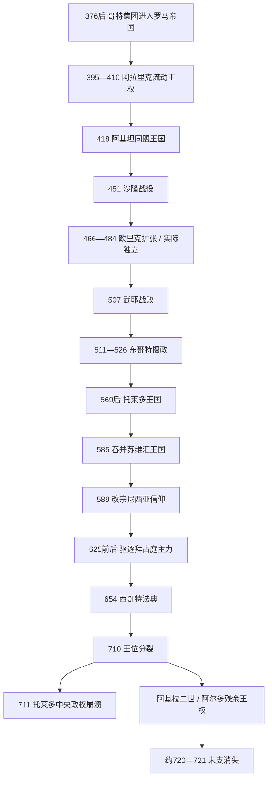

# 西哥特王国

## 时间

395年-约720/721年；418年取得阿基坦定居地，507年后重心转入伊比利亚，711年托莱多中央政权崩溃。

## 概括

西哥特王国并非在418年突然由一个完整民族国家建立。它起源于4世纪末进入罗马帝国的哥特军政共同体：阿拉里克一世把来自不同哥特集团、罗马逃亡者与附属军人组织成流动作战力量；瓦利亚与西罗马政府达成同盟后，418年获准在阿基坦定居。5世纪中叶以后，王国逐步从帝国同盟军转为独立的领土政权。507年武耶战败使其失去除塞普提曼尼亚外的大部分高卢领地，政治中心遂转向伊比利亚，最终形成以托莱多宫廷、主教会议和地方贵族共同支撑的王国。

589年雷卡雷德一世改宗尼西亚基督教，654年《西哥特法典》取消哥特人与罗马臣民分法的基本框架，标志统治集团与伊比利亚罗马社会的法律、宗教整合。可是王位缺乏稳定继承规则，宫廷政变、贵族竞争与地方军事动员困难长期削弱中央。710年后罗德里克与阿基拉二世并立，711年瓜达莱特战败成为直接触发点；托莱多体系迅速瓦解，但东北残余王权延续到阿尔多约720/721年失势，不能把711年误写成所有西哥特政治力量瞬间消失。

## 建立背景与崛起机制

### 从帝国内移民到军事共同体

376年，受匈人压力的哥特集团越过多瑙河进入东罗马境内。帝国官员的盘剥和粮食危机引发叛乱，378年阿德里安堡战役中皇帝瓦伦斯战死。382年条约允许部分哥特人作为同盟者定居，但没有形成永久稳定的单一政权。395年阿拉里克被推举后，依靠持续作战、分配战利品和与帝国谈判维系追随者；410年攻入罗马并非以占领全城建立首都，而是迫使帝国满足军职、粮饷和土地要求的手段。

阿拉里克死后，阿陶尔夫率军进入高卢并与皇帝霍诺留的妹妹加拉·普拉西狄娅联姻。其继任者瓦利亚在粮食与海运受限的情况下与罗马和解，为帝国打击伊比利亚的阿兰与汪达尔集团。作为回报，西哥特人于418年在阿基坦获得驻地。土地究竟通过直接没收、税收份额还是混合方式安置，学界有争议；可以确定的是，王室由此获得可持续的农业、城市税收和地方贵族合作基础。

### 从图卢兹同盟国到独立王国

狄奥多里克一世时期，图卢兹成为王权中心。西哥特既与罗马争夺阿尔勒等城市，也在451年与埃提乌斯、法兰克等联合抵御阿提拉，狄奥多里克本人战死于沙隆战场。欧里克在466年夺位后利用西罗马内战，占领高卢南部、西班牙大部并编纂哥特法；475年与皇帝朱利乌斯·尼波斯达成协议后，王国的实际独立获得承认。王权扩张依靠机动军队、对罗马城市和税制的接管，以及让地方贵族继续经营庄园与市政网络，而非以少数哥特移民全面替换原居民。

## 分阶段发展

### 图卢兹王国的鼎盛与武耶转折（418-507）

欧里克至阿拉里克二世时，王国横跨卢瓦尔河以南高卢和伊比利亚多地，是西罗马解体后最大的西方继承国之一。阿拉里克二世颁行《阿拉里克摘编》，为罗马臣民汇集帝国法，显示王国仍采用“哥特人适用哥特法、罗马人适用罗马法”的属人法结构。

其脆弱点是高卢天主教主教与信奉阿里乌派的王廷关系紧张，同时北方克洛维在改宗后可争取高卢教会支持。507年武耶战役中阿拉里克二世败死，法兰克夺取阿基坦大部。东哥特国王狄奥多里克大王出兵保存地中海沿岸的塞普提曼尼亚，并以外祖父身份摄政至526年，使西、东哥特王国短暂形成王朝联盟。

### 托莱多王国的领土整合（531-589）

阿马拉里克死后巴尔特王族断绝，王位转为贵族与军队竞争的选举性君权。阿塔纳吉尔德为推翻阿吉拉一世，引入查士丁尼军队，结果拜占庭在伊比利亚南岸建立“西班牙行省”。利奥维吉尔德通过战争征服坎塔布里亚与地方割据势力，585年吞并西北部苏维汇王国，并以王冠、宝座、独立金币和共治安排强化君主仪式。他仍坚持阿里乌派，并镇压改宗尼西亚信仰的儿子赫尔梅内吉尔德，暴露宗教整合难题。

雷卡雷德一世在589年第三次托莱多会议宣布改宗。多数哥特贵族和主教随后接受尼西亚信仰，教会会议成为制定信仰、继承规范、犹太政策和公共法令的重要场所。改宗减少了统治集团与伊比利亚罗马多数人口之间最显著的身份边界，但不等于社会差异立即消失。

### 统一法律与贵族—教会王权（589-672）

苏因提拉约625年前后夺取拜占庭在南部的最后主要据点，实现除北方山地与塞普提曼尼亚之外的半岛政治整合。钦达苏因特以大规模清洗反对贵族、没收财产并立子共治来强化王朝化继承；其子雷塞斯温特于654年颁行《西哥特法典》，对自由臣民原则上采用同一地域法。这一法典后续在基督教诸王国仍有影响。

鼎盛条件包括托莱多的交通与象征地位、主教网络提供的行政与书写能力、继承罗马税收和庄园体系、半岛外敌一度减弱，以及国王可用没收财产奖赏支持者。不过王室没有常备官僚与军队，必须依赖公爵、伯爵、主教和大土地所有者执行征税、司法与征兵；强王能调动这套网络，弱王则容易被它架空或推翻。

### 晚期继承危机（672-711）

万巴镇压塞普提曼尼亚的保卢叛乱后颁布严厉军役法，反映贵族与教士拒绝远征的现实。他在680年病中接受悔罪剃发，康复后因教规不能复位，埃尔维格由此继承，事件常被视为精心策划的宫廷政变。埃吉卡继续清算前朝、强化反犹政策，并在瘟疫和地方政治压力下立维蒂萨共治。

维蒂萨约710年死后，托莱多贵族拥立罗德里克，东北部则出现阿基拉二世王权。两者是否代表维蒂萨家族与反对派、是否曾直接交战，证据不足；但铸币分布证实中央已分裂。北非倭马亚总督体系在征服马格里布后具备渡海条件，塔里克于711年率军登陆。罗德里克仓促南下，在瓜达莱特战役败亡。穆斯林军随后利用道路和城市协商投降，迅速占领托莱多、科尔多瓦等中心；712年穆萨增援后，征服从一次袭击转为持续占领。

## 统治结构与社会整合

| 层次 | 机构 / 群体 | 运作方式 | 长期影响 |
|---|---|---|---|
| 国王与宫廷 | 国王、王族、宫廷伯爵、财政与文书人员 | 国王由王族继承、共治指定或贵族军队推举；缺乏固定规则，合法性依赖胜利、受膏和会议承认。 | 便于强人上升，也造成频繁政变和继承内战。 |
| 托莱多会议 | 主教、国王与高级贵族 | 处理教义、王位誓约、司法和社会政策；国王召集但会议也可约束继承者。 | 把天主教会嵌入公共权力，留下大量法令文书。 |
| 地方治理 | 公爵、伯爵、城市与教区 | 公爵负责大区军政，伯爵执行司法税收，主教维持城市组织与救济。 | 罗马行省、城市和教会网络得以延续，但地方强人拥有独立资源。 |
| 法律 | 欧里克法、阿拉里克摘编、《西哥特法典》 | 由早期属人法逐渐转为统一地域法。 | 促进哥特与罗马臣民法律整合，成为中世纪伊比利亚法传统来源之一。 |
| 族群与宗教 | 哥特军政贵族、伊比利亚罗马多数、苏维汇人与犹太社群 | 通婚与共同信仰削弱哥特—罗马边界；对犹太人的强制改宗、财产限制和奴役政策却加深排斥。 | 王国形成较统一的基督教政治身份，同时积累被压迫群体与地方社会的不满。 |

## 重要事件

| 时间 | 事件 | 过程与转折 | 结果 |
|---|---|---|---|
| 410年 | 攻入罗马 | 阿拉里克围城后进入罗马，三日劫掠。 | 提升哥特军团谈判地位，但未建立意大利政权。 |
| 418年 | 阿基坦定居 | 瓦利亚为帝国作战后获安置。 | 图卢兹王国的税收与领土基础形成。 |
| 451年 | 沙隆战役 | 西哥特与罗马联盟抗击阿提拉。 | 狄奥多里克一世阵亡，哥特作为高卢大国地位上升。 |
| 466-475年 | 欧里克扩张 | 趁帝国权力真空攻取城市、接收行省。 | 王国由同盟军政权转为实际独立国家。 |
| 507年 | 武耶战役 | 克洛维击败并杀死阿拉里克二世。 | 失去高卢大部，中心移向伊比利亚。 |
| 585年 | 吞并苏维汇王国 | 利奥维吉尔德征服西北部。 | 半岛主要日耳曼王国合并。 |
| 589年 | 第三次托莱多会议 | 雷卡雷德宣布改宗。 | 结束王廷阿里乌派地位，建立王权—主教联盟。 |
| 625年前后 | 拜占庭主要属地消失 | 苏因提拉攻取南岸据点。 | 半岛领土整合达到高点。 |
| 654年 | 《西哥特法典》 | 雷塞斯温特完成统一法典。 | 属人法分隔显著削弱。 |
| 711年 | 瓜达莱特战役 | 罗德里克主力败于塔里克。 | 中央军事与继承合法性同时崩塌，城市相继失守。 |
| 713-约721年 | 东北残余王权 | 阿基拉二世、阿尔多在塞普提曼尼亚及周边延续统治。 | 纳博讷等地失陷后，独立西哥特王权终结。 |

## 兴盛、衰落与灭亡原因

### 鼎盛条件

- 继承并适配罗马道路、城市、税法、土地和主教网络，降低了征服后的治理成本。
- 507年后地理重心集中于伊比利亚，585年吞并苏维汇、625年前后排除拜占庭据点，减少并立竞争者。
- 589年宗教统一与654年法律统一，为哥特军事贵族和伊比利亚罗马多数提供共同制度框架。
- 6世纪末至7世纪中叶外部压力相对有限，使王权有空间整合内部。

### 结构性衰落因素

- 王位既可世袭又需贵族推举，缺乏可预期继承法；共治虽能安排继承，也常催生竞争派系。
- 王室军队、税收和地方行政依赖公爵、伯爵、主教，中央不能稳定穿透地方。
- 没收、清洗与强制改宗成为统治工具，贵族会在国王虚弱时倒戈，犹太社群遭系统迫害。
- 瘟疫、饥荒、货币收缩和人口下降的程度难精确量化，但共同削弱财政和动员能力。

### 外部压力与直接触发

- 倭马亚政权完成北非征服后获得舰船、马匹和经验丰富的柏柏尔军队，海峡不再是安全屏障。
- 710年后的并立王权使军队分散、北方主力远离登陆点，也降低地方对托莱多的忠诚。
- 瓜达莱特战败及罗德里克失踪是直接触发；城市通过条约投降、地方贵族各自求生，使失败迅速扩散。
- 征服成功不是“西哥特腐败”或某一群体“引敌”这一种原因所能解释，而是继承危机、地方化、外部军事优势和战役偶然共同作用。

## 王朝世系

完整列出36位公认或有文献见证的统治者，并说明东哥特摄政、共治和末期并立：

- [西哥特王国君主世系表](/%E4%BA%BA%E6%96%87%E7%A7%91%E5%AD%A6/%E5%8E%86%E5%8F%B2/%E6%AC%A7%E6%B4%B2/_%E9%80%9A%E5%8F%B2/%E5%90%8E%E7%BD%97%E9%A9%AC%E6%97%B6%E4%BB%A3%E7%9A%84%E6%97%A5%E8%80%B3%E6%9B%BC%E8%AF%B8%E5%9B%BD/%E8%A5%BF%E5%93%A5%E7%89%B9%E7%8E%8B%E5%9B%BD%E5%90%9B%E4%B8%BB%E4%B8%96%E7%B3%BB%E8%A1%A8.md)

## 演变关系

- 前一背景：[西罗马帝国](/%E4%BA%BA%E6%96%87%E7%A7%91%E5%AD%A6/%E5%8E%86%E5%8F%B2/%E6%AC%A7%E6%B4%B2/_%E9%80%9A%E5%8F%B2/%E5%8F%A4%E7%BD%97%E9%A9%AC/%E8%A5%BF%E7%BD%97%E9%A9%AC%E5%B8%9D%E5%9B%BD.md)与晚期罗马同盟军制度。
- 法兰克竞争：[墨洛温王朝](/%E4%BA%BA%E6%96%87%E7%A7%91%E5%AD%A6/%E5%8E%86%E5%8F%B2/%E6%AC%A7%E6%B4%B2/_%E9%80%9A%E5%8F%B2/%E5%90%8E%E7%BD%97%E9%A9%AC%E6%97%B6%E4%BB%A3%E7%9A%84%E6%97%A5%E8%80%B3%E6%9B%BC%E8%AF%B8%E5%9B%BD/%E6%B3%95%E5%85%B0%E5%85%8B%E7%8E%8B%E5%9B%BD/%E5%A2%A8%E6%B4%9B%E6%B8%A9%E7%8E%8B%E6%9C%9D.md)。
- 半岛区域视角：[西哥特统治下的伊比利亚](/%E4%BA%BA%E6%96%87%E7%A7%91%E5%AD%A6/%E5%8E%86%E5%8F%B2/%E6%AC%A7%E6%B4%B2/%E4%BC%8A%E6%AF%94%E5%88%A9%E4%BA%9A%E5%8D%8A%E5%B2%9B/%E8%A5%BF%E5%93%A5%E7%89%B9%E7%BB%9F%E6%B2%BB%E4%B8%8B%E7%9A%84%E4%BC%8A%E6%AF%94%E5%88%A9%E4%BA%9A.md)。
- 征服背景：[倭马亚王朝](/%E4%BA%BA%E6%96%87%E7%A7%91%E5%AD%A6/%E5%8E%86%E5%8F%B2/%E8%A5%BF%E4%BA%9A/_%E9%80%9A%E5%8F%B2/%E9%98%BF%E6%8B%89%E4%BC%AF%E5%B8%9D%E5%9B%BD/%E5%80%AD%E9%A9%AC%E4%BA%9A%E7%8E%8B%E6%9C%9D.md)。
- 所属总览：[后罗马时代的日耳曼诸国](/%E4%BA%BA%E6%96%87%E7%A7%91%E5%AD%A6/%E5%8E%86%E5%8F%B2/%E6%AC%A7%E6%B4%B2/_%E9%80%9A%E5%8F%B2/%E5%90%8E%E7%BD%97%E9%A9%AC%E6%97%B6%E4%BB%A3%E7%9A%84%E6%97%A5%E8%80%B3%E6%9B%BC%E8%AF%B8%E5%9B%BD/README.md)。
