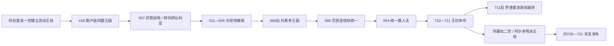

# 西哥特王国君主世系表

## 范围与读法

本表从阿拉里克一世建立较稳定的哥特王权起，列至穆斯林征服后仍据守东北部与塞普提曼尼亚的阿尔多。418年以前是迁徙中的军政共同体；418年起通常称图卢兹王国；507年以后王权重心逐渐移向伊比利亚；6世纪后期起以托莱多为核心。早期年代、共治起点和末期对立王的控制范围存在史料差异，表中以“约”或备注标明。

## 巴尔特王族与图卢兹王国

| 顺序 | 君主 | 在位 | 与前任关系 | 政治中心 / 关键事件 |
|---:|---|---|---|---|
| 1 | **阿拉里克一世** | 395-410 | 被哥特军队推举 | 在巴尔干与希腊活动，长期要求帝国给予土地和军职；410年攻入罗马，王权仍随军队迁徙。 |
| 2 | 阿陶尔夫 | 410-415 | 阿拉里克的姻亲、可能为妹夫 | 率集团转入高卢和西班牙，与西罗马皇室联姻；415年在巴塞罗那遇刺。 |
| 3 | 西格里克 | 415，约7日 | 与前王无直接继承关系，政变夺位 | 杀害阿陶尔夫家属并改变对罗马政策，很快被杀。 |
| 4 | 瓦利亚 | 415-418 | 被军队推举 | 与西罗马和解，以同盟军身份打击伊比利亚的汪达尔、阿兰势力；418年获准定居阿基坦。 |
| 5 | **狄奥多里克一世** | 418-451 | 可能为阿拉里克的女婿 | 建立图卢兹王国的领土基础；与罗马时战时和，451年在沙隆战役抗击匈人时阵亡。 |
| 6 | 托里斯蒙德 | 451-453 | 狄奥多里克一世之子 | 沙隆战后即位，试图采取更独立政策，被兄弟集团刺杀。 |
| 7 | 狄奥多里克二世 | 453-466 | 托里斯蒙德之弟 | 干预西罗马皇位与伊比利亚事务，扩大在高卢、西班牙的实际控制；被弟弟欧里克杀死。 |
| 8 | **欧里克** | 466-484 | 狄奥多里克二世之弟 | 趁西罗马衰败摆脱同盟附属地位，控制高卢南部与伊比利亚广大地区，编纂早期哥特法。 |
| 9 | 阿拉里克二世 | 484-507 | 欧里克之子 | 发布《阿拉里克摘编》供罗马臣民使用；507年在武耶战役败死于克洛维。 |
| 10 | 盖萨莱克 | 507-511 | 阿拉里克二世的非婚生子 | 在危机中被推举；失去高卢大部，先被东哥特势力废黜，后复位失败并被杀。 |
| — | **狄奥多里克大王（摄政）** | 511-526 | 阿马拉里克的外祖父；兼任东哥特国王 | 以外孙年幼为由控制西哥特王国，保存塞普提曼尼亚并恢复伊比利亚秩序；不是单独的西哥特血统继承王。 |
| 11 | 阿马拉里克 | 511-531；526后亲政 | 阿拉里克二世之子 | 成年后结束摄政；因与法兰克公主克洛蒂尔德的宗教冲突引发战争，败亡于巴塞罗那。 |

## 后巴尔特时期与托莱多王国

| 顺序 | 君主 | 在位 | 与前任关系 | 关键事件 / 备注 |
|---:|---|---|---|---|
| 12 | 狄乌迪斯 | 531-548 | 东哥特出身的宫廷与军政强人 | 结束巴尔特直系统治；迁移政治重心，抵御法兰克并面对拜占庭在西地中海的扩张。 |
| 13 | 狄乌迪吉塞尔 | 548-549 | 狄乌迪斯的将领 | 因宫廷政变即位，不足两年即在宴会上被刺杀。 |
| 14 | 阿吉拉一世 | 549-554 | 贵族推举 | 科尔多瓦叛乱削弱王权；与阿塔纳吉尔德内战，后者引入拜占庭军队；阿吉拉被己方杀死。 |
| 15 | 阿塔纳吉尔德 | 551-567；554后独治 | 反对阿吉拉的竞争王 | 借拜占庭援军夺位，却使帝国取得伊比利亚南岸“西班牙行省”；托莱多逐渐成为宫廷中心。 |
| 16 | 利乌瓦一世 | 568-573 | 贵族推举 | 主要守卫塞普提曼尼亚；568年起让弟弟利奥维吉尔共治伊比利亚。 |
| 17 | **利奥维吉尔德** | 568-586；573后独治 | 利乌瓦一世之弟 | 大幅征服苏维汇王国和地方势力，改革货币与王权礼仪；镇压信奉尼西亚派的儿子赫尔梅内吉尔德。 |
| 18 | **雷卡雷德一世** | 586-601 | 利奥维吉尔德之子 | 589年第三次托莱多会议宣布由阿里乌派改宗尼西亚信仰，拉近哥特统治集团与伊比利亚罗马教会。 |
| 19 | 利乌瓦二世 | 601-603 | 雷卡雷德一世之子 | 年轻即位，被维特里克政变废黜并杀害。 |
| 20 | 维特里克 | 603-610 | 反对王室的军人 | 夺位后未能恢复对军队与贵族的稳定控制，被宴会政变杀死。 |
| 21 | 贡德马尔 | 610-612 | 政变集团推举 | 承认托莱多教会首席地位，继续对拜占庭属地作战。 |
| 22 | 西塞布特 | 612-621 | 贵族推举 | 扩张至拜占庭残余地区，重视学术与教会；强制犹太人改宗政策加深社会压力。 |
| 23 | 雷卡雷德二世 | 621，数周或数月 | 西塞布特之子 | 年幼即位，不久死亡。 |
| 24 | **苏因提拉** | 621-631 | 将领、可能为雷卡雷德一世家族成员 | 约625年夺取拜占庭在半岛的最后主要据点，一度完成半岛政治统一；后因贵族与教会反对被废。 |
| 25 | 西塞南德 | 631-636 | 借法兰克援助反叛苏因提拉 | 第四次托莱多会议确认贵族与主教参与王位合法化，同时谴责弑君与篡位。 |
| 26 | 钦提拉 | 636-639 | 贵族推举 | 连续召开托莱多会议，强化国王、贵族和教会之间的誓约秩序。 |
| 27 | 图尔加 | 639-642 | 钦提拉之子 | 被钦达苏因特政变废黜；是否被迫出家、何时去世存在记载差异。 |
| 28 | **钦达苏因特** | 642-653 | 老年军事贵族，政变即位 | 处决、放逐反对贵族并没收财产，强化王权；649年立子雷塞斯温特共治。 |
| 29 | **雷塞斯温特** | 649-672；653后独治 | 钦达苏因特之子 | 654年颁行《西哥特法典》，以统一地域法取代哥特人与罗马人的分法传统。 |
| 30 | 万巴 | 672-680 | 贵族推举 | 镇压保卢在塞普提曼尼亚的叛乱并规范军役；病中被强行剃发，按教规失去王位资格。 |
| 31 | 埃尔维格 | 680-687 | 宫廷贵族，可能参与废黜万巴 | 获托莱多会议承认，修订法典并加强反犹政策；临终指定女婿埃吉卡。 |
| 32 | 埃吉卡 | 687-702 | 埃尔维格女婿 | 与前王家族清算，面对瘟疫、贵族阴谋和财政压力；约694/698年起让儿子维蒂萨共治。 |
| 33 | 维蒂萨 | 约694/698-710；702后独治 | 埃吉卡之子 | 在加利西亚先共治后独治；末年继承安排不明，去世后王国分裂为敌对王权。 |

## 末期对立王与残余王权

| 顺序 | 君主 | 在位 | 控制范围与争议 | 结局 |
|---:|---|---|---|---|
| 34 | **罗德里克** | 710-711 | 多由西南与托莱多贵族拥立，未必控制东北部；传统上常被称“末代国王”，但不是最后有文献记载的西哥特王。 | 711年瓜达莱特战役败于塔里克军队，此后失踪或战死，托莱多中央政权迅速崩溃。 |
| 35 | 阿基拉二世 | 约710-713 | 可能为维蒂萨家族成员，在塔拉戈纳、纳博讷和东北部铸币；与罗德里克并立而非顺序继承的可能性较大。 | 随穆斯林军推进而失去伊比利亚据点；死亡、退位或与阿尔多关系均不详。 |
| 36 | **阿尔多** | 约713/714-720/721 | 只见于一份王表，主要据守塞普提曼尼亚和比利牛斯以南少数地区；统治范围与确切身份存在争议。 | 纳博讷及残余领土被征服后，独立西哥特王权消失。 |

## 世系连续性的关键说明

- 西哥特王位不是稳定的长子继承制。巴尔特王族在阿马拉里克后断绝，此后国王常由宫廷贵族、军队和主教会议推举，政变、谋杀与强迫出家屡见不鲜。
- 511-526年的狄奥多里克大王既是东哥特国王，也是阿马拉里克的外祖父与西哥特摄政者；将他列作“西哥特国王”或“摄政”取决于史料传统，本表按摄政处理。
- 551-554年阿塔纳吉尔德与阿吉拉一世内战，568-573年利乌瓦一世与利奥维吉尔共治，649-653年钦达苏因特与雷塞斯温特共治，约694/698-702年埃吉卡与维蒂萨共治，因此在位时间重叠不是错误。
- 710-711年罗德里克和阿基拉二世很可能分区并立。罗德里克之败摧毁中央主力，但阿基拉二世与阿尔多的残余王权说明王国并非在单一战役后瞬间消失。

## 双向链接

- 主笔记：[西哥特王国](/%E4%BA%BA%E6%96%87%E7%A7%91%E5%AD%A6/%E5%8E%86%E5%8F%B2/%E6%AC%A7%E6%B4%B2/_%E9%80%9A%E5%8F%B2/%E5%90%8E%E7%BD%97%E9%A9%AC%E6%97%B6%E4%BB%A3%E7%9A%84%E6%97%A5%E8%80%B3%E6%9B%BC%E8%AF%B8%E5%9B%BD/%E8%A5%BF%E5%93%A5%E7%89%B9%E7%8E%8B%E5%9B%BD.md)
- 总览：[后罗马时代的日耳曼诸国](/%E4%BA%BA%E6%96%87%E7%A7%91%E5%AD%A6/%E5%8E%86%E5%8F%B2/%E6%AC%A7%E6%B4%B2/_%E9%80%9A%E5%8F%B2/%E5%90%8E%E7%BD%97%E9%A9%AC%E6%97%B6%E4%BB%A3%E7%9A%84%E6%97%A5%E8%80%B3%E6%9B%BC%E8%AF%B8%E5%9B%BD/README.md)
- 半岛视角：[西哥特统治下的伊比利亚](/%E4%BA%BA%E6%96%87%E7%A7%91%E5%AD%A6/%E5%8E%86%E5%8F%B2/%E6%AC%A7%E6%B4%B2/%E4%BC%8A%E6%AF%94%E5%88%A9%E4%BA%9A%E5%8D%8A%E5%B2%9B/%E8%A5%BF%E5%93%A5%E7%89%B9%E7%BB%9F%E6%B2%BB%E4%B8%8B%E7%9A%84%E4%BC%8A%E6%AF%94%E5%88%A9%E4%BA%9A.md)
