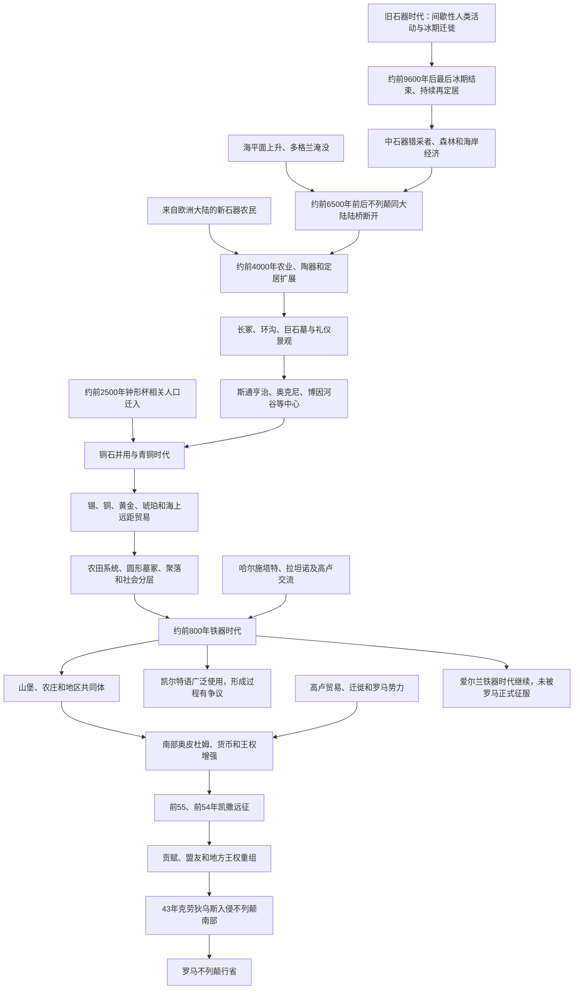

# 史前不列颠时期

## 时间

约80万年前已见早期人类活动；约前9600年后形成较连续聚落；前4000年左右进入新石器时代；前2500年后进入铜石并用与青铜时代；约前800年—公元43年为铁器时代。不列颠南部自43年起被罗马征服，爱尔兰和大不列颠北部仍延续各自非罗马政治。

## 范围与史料

本笔记讨论大不列颠岛、爱尔兰岛及周边岛屿的史前社会。史前分期是现代考古学按技术、生计和物质文化建立的框架，各地区转换时间不同。“不列颠”在古代通常指大不列颠岛而非现代联合王国；爱尔兰没有被罗马帝国正式征服，其史前与原史阶段不能在公元43年一刀切结束。

没有本地连续文字记录时，认识主要来自遗址、骨骼、花粉、工具、同位素、古DNA和后来的希腊—罗马作者。器物风格、语言和基因并非一一对应，尤其不应把全部铁器时代居民简单称为从欧洲大陆一次入侵的“凯尔特人”。凯尔特语确实在罗马征服前广泛使用，但何时、通过何种人口和社会网络传入仍有多种模型。

## 概括

冰期海平面变化使不列颠时而与欧洲大陆相连、时而成为岛屿。旧石器时代人类在暖期进入，冰川最盛时又撤离；现代智人约在最后冰期后建立长期聚落。中石器猎采者利用森林、河流和海岸，约前6500年前后海平面上升淹没多格兰，不列颠与大陆陆桥最终断开。

约前4000年，来自欧洲大陆的新石器农民迁入并传播种植、畜牧、陶器和巨石墓葬，狩猎采集人口被大规模吸收或取代。前3000年前后，巨石景观和区域礼仪中心发展，斯通亨治、新石器奥克尼和爱尔兰博因河谷墓群最著名。约前2500年，钟形杯文化相关人口从大陆进入，古DNA显示不列颠人口再次发生显著变化；铜、青铜冶金、远距离贸易和圆形墓冢扩展。

铁器时代没有形成全岛统一国家。山堡、农庄、部落和地区王权并存，南部与高卢、罗马贸易密切，出现货币和城镇式“奥皮杜姆”。凯撒前55、前54年远征没有建立行省，却介入地方首领和贡赋关系。1世纪前期卡图维劳尼等政权扩张及流亡首领向罗马求援，为克劳狄乌斯43年入侵提供政治借口。罗马征服结束的是不列颠南部史前政治，并非全群岛社会同时进入同一时代。

## 社会演变图

## 旧石器时代

### 最早人类活动

英格兰东部哈匹斯堡遗址的石器和足迹表明约80万至85万年前已有早期人类在气候温和时活动，是北欧最早人类证据之一。约50万年前博克斯格罗夫遗址保存海德堡人类骨骼、手斧和动物加工痕迹。冰期反复覆盖或使不列颠环境不适居，人口多次进入和消失，不能画成从最早居民到现代人的连续直线。

尼安德特人在中、晚旧石器时代多次活动。现代智人约4万年前进入，使用更复杂的石器、骨角工具和象征物，但末次盛冰期又使人口南撤。约前1.2万年至前9600年气候回暖后，群岛才出现更连续的现代人聚落。

### 地理变化

冰期海平面降低时，不列颠是欧洲西北半岛，可经今日北海平原和英吉利海峡区域与大陆相连。冰川融化后海平面上升，约前6500年前后多格兰大部被淹，北海风暴和海侵加速最后陆桥消失。爱尔兰更早与大不列颠分离，其冰后人类抵达路线可能经海上。

成为岛屿没有切断交流。中石器人已经能沿海航行，后来农业、金属和人口仍多次跨越海峡与爱尔兰海传播。

## 中石器时代（约前9600—前4000年）

### 生计和聚落

气候转暖后森林扩展，居民以鹿、野猪、鱼、贝类、鸟类、坚果和植物为生，使用细石器、弓箭、鱼叉和独木舟。聚落多为季节性营地，却不等于漫无目的游荡；一些湖岸和海岸地点反复使用，形成稳定领地和资源知识。

约前9000年的斯塔卡遗址保存房屋、鹿角头饰、木工和湖岸栈道，显示社会组织和仪式生活比“简单猎人”标签复杂。海岸遗址许多因海平面上升被淹，现存材料低估了海洋经济。

### 爱尔兰和岛屿定居

爱尔兰可靠中石器遗址约自前8000年后出现，居民已需要跨海到达。奥克尼、赫布里底等远岛在不同时段被探索和定居。岛屿网络为后来新石器农业和巨石文化传播提供航海经验。

## 新石器时代（约前4000—前2500年）

### 农业迁入

约前4000年，小麦、大麦、牛、羊和家猪，以及磨制石斧、陶器和新式房屋在群岛迅速出现。古DNA表明不列颠新石器人主要来自经法国、大西洋沿岸和海峡抵达的大陆农民，与当地中石器猎采者有有限但并非完全没有的混合。爱尔兰也出现来自大陆的农民人口。

农业转换包含迁徙、通婚和知识传播，不应写成单纯“本地人学会耕作”或一次军事征服。早期农民清理林地、建立田地和畜群，人口增长也伴随疾病、营养压力和土地冲突。

### 长冢、环沟和共同体

长条形墓冢、石室墓和堤道围场需要多人协作，既埋葬部分祖先，也举行集会、交换和宴饮。死亡者并非社会所有成员，墓葬选择显示身份与谱系。英格兰南部温德米尔山等环沟遗址、威尔士和苏格兰石室墓展示区域差异。

约前3500年后，巨石圆环和木柱圆环发展。巨石不是由“德鲁伊”建造的确定证据；德鲁伊见于两千年后铁器时代文字资料，两者不可直接连接。

### 斯通亨治与巨石景观

斯通亨治经历多个阶段：约前3000年先建环沟和坑列，约前2500年后竖立大型砂岩和来自威尔士的青石，并多次重排。附近杜灵顿垣墙、埃文河和道路构成更大礼仪景观。石材运输、季节聚会、祖先纪念和天象对齐可能共同作用，单一“天文台”“墓地”或“外星工程”解释均不足。

对斯通亨治人骨同位素研究显示参与者来自不列颠不同地区。它反映跨区域集会能力，却不是统一王国首都。

### 奥克尼与爱尔兰

奥克尼的斯卡拉布雷保存石砌房屋、家具和下水结构，布罗德加之环、斯坦尼斯立石及布罗德加岬形成密集礼仪中心。新石器奥克尼并非边缘，而是北海和大西洋网络的重要创新区。

爱尔兰博因河谷的纽格莱奇通道墓约建于前3200年，早于斯通亨治主要石圈。墓道与冬至日出对齐，巨石刻纹和工程组织显示复杂共同体。爱尔兰各地通道墓、宫廷墓和楔形墓有不同传统。

## 铜石并用与青铜时代（约前2500—前800年）

### 钟形杯相关迁徙

约前2500年，钟形杯陶器、射箭装备、铜器和个人墓葬进入不列颠。古DNA显示此后数世纪大陆草原祖源相关人口大规模增加，新石器人口的遗传比例显著下降。这是重大人口转换，具体过程可能包括连续迁徙、婚姻网络、疾病和社会优势，而非一次可指名战争。

“钟形杯人”是物质文化和网络标签，不必代表一个统一民族。埃姆斯伯里弓箭手等墓葬的同位素说明个人可从欧洲大陆迁到威塞克斯。

### 金属和贸易

爱尔兰铜矿、不列颠锡矿、威尔士和其他地区铜源支持青铜冶金。康沃尔锡对欧洲青铜生产重要，黄金、琥珀、玻璃、武器和装饰品经大西洋、英吉利海峡、爱尔兰海与北海流动。冶金知识和原料控制可能提高部分首领地位。

金属并未完全取代石器，青铜制品也常用于仪式沉积而非日常工具。河流、沼泽和湖泊出土大量剑、盾、斧和金饰，可能是献祭、身份展示或冲突遗留。

### 聚落、田地和社会分层

青铜时代圆形房屋、田界、牧场和村落比新石器遗迹更常见。达特穆尔等地保存规则田系统，显示土地长期划分。圆形墓冢早期突出个人和小家族，后来火葬墓群扩大。大型墓葬和贵重器物显示财富差异，但没有证据证明存在覆盖全岛的王朝国家。

剑、堡垒和创伤骨骼说明战争，海上贸易和宴饮又创造联盟。约前1200年后聚落、金属储藏和气候变化显示社会重组，不能把“青铜时代崩溃”简单套用到整个群岛。

### 马斯特农庄

英格兰东部马斯特青铜时代聚落约在前9世纪遭火灾后坍入河道，水浸保存圆屋、纺织、木器、食物和车轮。它展示家庭生活、远距玻璃珠和精细工艺，纠正史前社会只有墓葬和武器的偏见。

## 铁器时代（约前800年—公元43年及地区性延续）

### 铁器与山堡

铁冶炼逐步普及，农业仍是经济基础。山堡在南部和西部较多，有些从青铜时代末已使用，铁器时代扩建为多重城墙；它们可兼具居住、避难、集会、储藏和精英展示功能，并非每座都是常备军事城堡。梅登堡、丹伯里、奥斯沃斯特里等规模显著。

多数人口住在农庄和小聚落，圆形房屋、谷仓和田界构成日常景观。东部和南部部分地区大型山堡较少，说明政治组织方式多样。

### 凯尔特语言与文化

罗马征服时，大不列颠和爱尔兰多数本地语言属于凯尔特语族。大不列颠南北主要使用不列颠凯尔特语连续体，后来发展为威尔士语、康沃尔语、布列塔尼语等；爱尔兰及与其相连的盖尔世界使用早期海岛凯尔特语另一方向，后来形成爱尔兰语、苏格兰盖尔语和马恩语。

考古所称哈尔施塔特、拉坦诺艺术风格来自大陆中欧和西欧，部分器物和图案传入群岛，却没有证据证明前800年前后一支统一“凯尔特民族”征服全岛。语言可能在青铜时代或更长交流中扩散；“凯尔特人”适合语言文化概括，不应替代具体地区共同体。

### 社会和政治

罗马作者按“部族”记录卡图维劳尼、特里诺万特、阿特雷巴特、爱西尼、布里甘特、杜罗特里吉、卡图埃拉等群体。名称和疆域反映1世纪外交和战争形势，不一定存在数百年。首领通过亲属、战士随从、客户关系、牲畜、宴饮和贸易掌权；某些地区有王与王后，继承规则并非统一男性世袭。

南部出现大型低地聚落和奥皮杜姆，如卡穆洛杜努姆一带。铁制工具、犁耕、储粮坑和盐业支持人口；沿海同高卢贸易葡萄酒、陶器和金属。前1世纪后期硬币带有首领名称，帮助重建王权，却也受罗马币制和宣传影响。

### 宗教和德鲁伊

凯撒等作者描述德鲁伊承担祭祀、教育和裁判，并称不列颠是德鲁伊学习中心。这些记载来自征服者和外部观察，可能夸大统一组织。水域献祭、金属沉积、特殊墓葬和神圣林地有考古支持，但具体神名、仪式和“人祭”规模需要谨慎。

林道人遗体等沼泽葬可能与仪式处死、刑罚或暴力有关，单一“德鲁伊人祭”结论不确定。罗马时代铭文才保存较多本地神名，显示地方神与罗马神常被并置。

## 爱尔兰史前社会

爱尔兰同大不列颠共享新石器农业、巨石墓、青铜和凯尔特语言网络，又有独立区域发展。纽格莱奇等通道墓显示前4千纪末强大礼仪组织；青铜时代爱尔兰是铜、黄金和大西洋贸易中心；铁器遗址和拉坦诺艺术数量分布同不列颠不同，不能以英格兰考古分期机械套用。

罗马没有正式征服爱尔兰。希腊—罗马作者称其为希伯尼亚，托勒密2世纪列出河流、聚落和人群名称。罗马商品、钱币和个别人群通过贸易或劫掠进入，晚期罗马时代爱尔兰海两岸联系密切。爱尔兰从史前进入有文字的早期中世纪，主要依靠5世纪后基督教铭文和文献，而非43年罗马入侵。

## 同高卢和罗马的接触

### 凯撒远征

前55年，尤利乌斯·凯撒在征服高卢期间首次渡海，登陆受阻且骑兵、风暴和补给限制使行动短暂。前54年第二次远征规模更大，凯撒击败由卡西维拉努斯协调的联盟，恢复特里诺万特首领曼杜布拉基乌斯地位，并要求贡赋和人质。罗马军撤回后没有驻军或行省行政。

凯撒叙述服务其政治声望，兵力、敌方组织和结果带有自我宣传。远征仍使罗马更深介入不列颠王权，贸易和外交在随后一世纪扩大。

### 地区王权和罗马客户

前1世纪末至1世纪初，阿特雷巴特王科米乌斯及其后裔在南部建立政权，硬币和罗马物品显示大陆联系。卡图维劳尼王塔斯基奥瓦努斯、库诺贝利努斯扩张，卡穆洛杜努姆成为主要中心。罗马作者称库诺贝利努斯为“不列颠人的王”，实际不代表统治全岛。

库诺贝利努斯死后，卡拉塔库斯、托戈杜姆努斯等继续扩张。阿特雷巴特流亡王维里卡赴罗马求援，为克劳狄乌斯43年入侵提供借口之一。罗马征服不是对统一不列颠王国作战，而是利用地方敌对逐步建立行省。

## 主要政治共同体与人物

| 名称 / 人物 | 地区与时间 | 政治作用 | 说明与争议 |
|---|---|---|---|
| 卡西维拉努斯 | 泰晤士河以北，前54年 | 协调多方抵抗凯撒 | 凯撒称其曾与邻近群体交战；不能称全不列颠固定国王。 |
| 曼杜布拉基乌斯 | 特里诺万特，前54年 | 获凯撒支持恢复地位 | 展示罗马利用地方王位争端。 |
| 科米乌斯及阿特雷巴特诸王 | 高卢—不列颠南部，前1世纪 | 建立跨海网络，后代统治南部部分地区 | 科米乌斯同凯撒关系由盟友转敌对，谱系细节有争议。 |
| 塔斯基奥瓦努斯 | 卡图维劳尼，约前20年—公元初 | 发行硬币、扩张地区王权 | 可能控制维鲁拉米翁中心。 |
| **库诺贝利努斯** | 卡图维劳尼／特里诺万特区域，约公元9—40年 | 统合东南多个中心，同罗马贸易 | 莎士比亚“辛白林”的历史原型，但文学故事非史实。 |
| 维里卡 | 阿特雷巴特，1世纪前期 | 被竞争者驱逐后向罗马求援 | 其流亡是43年入侵的外交借口之一。 |
| 卡拉塔库斯、托戈杜姆努斯 | 库诺贝利努斯之子，43年 | 领导抵抗罗马入侵 | 卡拉塔库斯继续在威尔士方向抵抗至51年。 |
| 爱西尼、布里甘特等 | 英格兰东部、北部 | 与罗马时战时和 | 布狄卡属于罗马征服后的60／61年起义，应置于罗马不列颠阶段。 |

## 重要事件与阶段

| 时间 | 事件或过程 | 结果与意义 |
|---|---|---|
| 约80万年前 | 哈匹斯堡早期人类活动 | 证明暖期间人类已抵达不列颠纬度。 |
| 约前1万纪 | 最后冰期结束后持续再定居 | 中石器社会形成。 |
| 约前6500年 | 多格兰大部淹没 | 不列颠同大陆陆桥最终断开。 |
| 约前4000年 | 新石器农业迁入 | 种植、畜牧、陶器和巨石墓扩展。 |
| 约前3200年 | 纽格莱奇通道墓建成 | 爱尔兰大型礼仪工程和天象知识体现。 |
| 约前3000年起 | 斯通亨治多阶段营建 | 跨地区聚会和礼仪景观长期发展。 |
| 约前2500年 | 钟形杯相关人口和金属技术进入 | 人口、墓葬和远距网络显著转型。 |
| 约前2200—前800年 | 青铜时代 | 冶金、田地、海上贸易和社会分层扩大。 |
| 约前800年 | 铁器时代开始 | 铁器、山堡和地区政治发展。 |
| 前2—前1世纪 | 拉坦诺艺术、硬币和高卢贸易增强 | 南部王权和跨海网络更可辨识。 |
| 前55、前54年 | 凯撒两次远征 | 未建立行省，但形成贡赋、盟友和政治干预。 |
| 1世纪前期 | 卡图维劳尼扩张、维里卡流亡 | 地方权力失衡给罗马提供介入机会。 |
| 43年 | 克劳狄乌斯发动征服 | 不列颠南部进入罗马行省阶段。 |

## 转型机制

### 新石器转型

迁入农民带来人口和技术，地方猎采传统被吸收。农业提高单位土地供养，也带来定居、土地权、疾病和新的社会协作。巨石墓和围场显示共同体需要通过祖先和仪式协调。

### 青铜时代转型

钟形杯人口迁徙与金属网络重组人口构成，铜、锡和黄金把群岛接入欧洲远距贸易。个人墓葬和贵重物显示地位更突出，后期农田和村落又说明社会基础仍是家庭农业。

### 铁器时代政治化

人口、农业剩余、铁器和山堡支持更大地方联盟，罗马高卢市场和战争推动南部首领发行货币、建立客户王权。没有统一国家和共同军队，使罗马能逐一结盟或征服；但崎岖西部、北部和岛屿仍可长期抵抗。

## 关键辨析

- “史前不列颠始于前8000年”过晚；更早有人类活动，前9600年后才形成较连续冰后聚落。
- 大不列颠岛同大陆分离不是英吉利海峡一次突然打开，而是长期海平面上升和多格兰淹没。
- 新石器农业和钟形杯转型都包含明显人口迁徙，不能只写文化思想传播。
- 钟形杯文化不是一个有统一国王和族名的民族国家。
- 斯通亨治由新石器和青铜时代多代人营建，不能确定为德鲁伊神庙。
- “凯尔特人”适合语言文化概括，不等于前800年有单一凯尔特军队征服全岛。
- 铁器时代部族名称主要由罗马人记录，疆域和政治关系会变化。
- 卡西维拉努斯是前54年联盟领袖，不是全岛世袭国王。
- 布狄卡起义发生在罗马征服约17年后，应放入罗马不列颠而非史前事件。
- 爱尔兰没有在43年被罗马征服，其铁器和原史社会继续发展。
- 现代英格兰、威尔士、苏格兰、爱尔兰民族身份不能直接投射到史前居民。
- 史前遗传祖源不等于现代民族所有权，遗址是群岛共同人类遗产。

## 长期影响

1. 冰期与海平面塑造群岛地理，也使海洋既是边界又是交通网络。
2. 新石器农业、巨石景观和青铜贸易建立跨地区社会联系。
3. 康沃尔锡、爱尔兰铜金和大西洋航线使群岛从未孤立于欧洲。
4. 凯尔特语言成为罗马征服前主要语言基础，后来在罗马化和盎格鲁-撒克逊迁徙下退向西北，但未消失。
5. 铁器时代地方王权、道路和聚落被罗马利用、改造或压制。
6. 罗马对南部政权的客户关系使43年征服具有地方政治前奏，而非突然发现未知岛屿。
7. 不列颠南部、北部和爱尔兰进入文字史的时间与方式不同，群岛史不能只以英格兰分期统摄。

## 演变关系

- 后一节点：[罗马帝国不列颠省](/%E4%BA%BA%E6%96%87%E7%A7%91%E5%AD%A6/%E5%8E%86%E5%8F%B2/%E6%AC%A7%E6%B4%B2/%E4%B8%8D%E5%88%97%E9%A2%A0%E7%BE%A4%E5%B2%9B/%E7%BD%97%E9%A9%AC%E5%B8%9D%E5%9B%BD%E4%B8%8D%E5%88%97%E9%A2%A0%E7%9C%81.md)。
- 后续区域分支：[英格兰](/%E4%BA%BA%E6%96%87%E7%A7%91%E5%AD%A6/%E5%8E%86%E5%8F%B2/%E6%AC%A7%E6%B4%B2/%E4%B8%8D%E5%88%97%E9%A2%A0%E7%BE%A4%E5%B2%9B/%E8%8B%B1%E6%A0%BC%E5%85%B0/README.md)、[威尔士](/%E4%BA%BA%E6%96%87%E7%A7%91%E5%AD%A6/%E5%8E%86%E5%8F%B2/%E6%AC%A7%E6%B4%B2/%E4%B8%8D%E5%88%97%E9%A2%A0%E7%BE%A4%E5%B2%9B/%E5%A8%81%E5%B0%94%E5%A3%AB/README.md)、[苏格兰](/%E4%BA%BA%E6%96%87%E7%A7%91%E5%AD%A6/%E5%8E%86%E5%8F%B2/%E6%AC%A7%E6%B4%B2/%E4%B8%8D%E5%88%97%E9%A2%A0%E7%BE%A4%E5%B2%9B/%E8%8B%8F%E6%A0%BC%E5%85%B0/README.md)与[爱尔兰](/%E4%BA%BA%E6%96%87%E7%A7%91%E5%AD%A6/%E5%8E%86%E5%8F%B2/%E6%AC%A7%E6%B4%B2/%E4%B8%8D%E5%88%97%E9%A2%A0%E7%BE%A4%E5%B2%9B/%E7%88%B1%E5%B0%94%E5%85%B0/README.md)。
- 返回：[不列颠群岛](/%E4%BA%BA%E6%96%87%E7%A7%91%E5%AD%A6/%E5%8E%86%E5%8F%B2/%E6%AC%A7%E6%B4%B2/%E4%B8%8D%E5%88%97%E9%A2%A0%E7%BE%A4%E5%B2%9B/README.md)。
