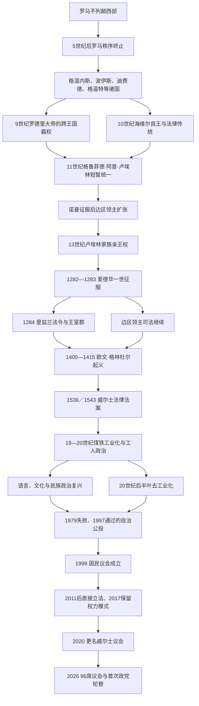

# 威尔士

[返回不列颠群岛](/%E4%BA%BA%E6%96%87%E7%A7%91%E5%AD%A6/%E5%8E%86%E5%8F%B2/%E6%AC%A7%E6%B4%B2/%E4%B8%8D%E5%88%97%E9%A2%A0%E7%BE%A4%E5%B2%9B/README.md)

## 概括

威尔士历史不是从独立王国直接变成现代自治的单线过程。罗马行省秩序在5世纪初终止后，西部布立吞社会重组为格温内斯、波伊斯、迪费德、格温特等王国；它们保存基督教、古威尔士语和地方王统，同时同盎格鲁诸国、爱尔兰海世界、维京人和诺曼势力竞争。中世纪数位统治者曾短暂整合大部威尔士，13世纪格温内斯亲王权达到顶点，最终于1282—1283年被英格兰国王爱德华一世征服。

1284年以后，王室直属郡和边区领主领地长期并存；1536、1543年法律合并才统一郡制、司法与英格兰议会代表权。工业化把南威尔士变为煤铁中心，也孕育工会、劳工政治、语言复兴和自治运动。1999年建立全国民选机构后，威尔士逐步取得下放领域立法权；2026年扩大为96席议会，伦·阿普·约沃思成为首位威尔士党籍首席大臣。现代威尔士仍是联合王国构成国，不是主权国家。

## 演变图

## 历史主线

1. 罗马撤离后不是立即出现统一威尔士，而是地方王族、教会和军事网络形成多个布立吞王国。
2. 9—13世纪的整合由罗德里大帝、海维尔良王、格鲁菲德·阿普·卢埃林和卢埃林家族等反复推进，继承分割与外部压力使统一难持久。
3. 诺曼边区领主与英格兰王权从东部、南部和沿海逐步蚕食；1282—1283年是独立亲王权的直接终结，而非法律合并完成时点。
4. 1284—1536／1543年间，王室行政、边区领主特权和部分威尔士习惯法并存；都铎法律才把威尔士纳入统一英格兰法制和议会代表体系。
5. 工业化、非国教文化、工会和工党重塑社会，语言压力与文化复兴又形成现代民族政治。
6. 1999年以来的自治是渐进扩权；2026年的政党轮替发生在联合王国下放制度内，不等同于独立。

## 时期导航

| 顺序 | 阶段 | 时间 | 入口 | 简要概括 |
|---:|---|---|---|---|
| 1 | 罗马后威尔士诸国 | 5世纪—9世纪 | [罗马后威尔士诸国](/%E4%BA%BA%E6%96%87%E7%A7%91%E5%AD%A6/%E5%8E%86%E5%8F%B2/%E6%AC%A7%E6%B4%B2/%E4%B8%8D%E5%88%97%E9%A2%A0%E7%BE%A4%E5%B2%9B/%E5%A8%81%E5%B0%94%E5%A3%AB/%E7%BD%97%E9%A9%AC%E5%90%8E%E5%A8%81%E5%B0%94%E5%A3%AB%E8%AF%B8%E5%9B%BD.md) | 格温内斯、波伊斯、迪费德、格温特等布立吞王国形成；基督教、地方谱系和古威尔士语延续。 |
| 2 | 威尔士亲王与英格兰征服 | 9世纪—1283年 | [威尔士亲王与英格兰征服](/%E4%BA%BA%E6%96%87%E7%A7%91%E5%AD%A6/%E5%8E%86%E5%8F%B2/%E6%AC%A7%E6%B4%B2/%E4%B8%8D%E5%88%97%E9%A2%A0%E7%BE%A4%E5%B2%9B/%E5%A8%81%E5%B0%94%E5%A3%AB/%E5%A8%81%E5%B0%94%E5%A3%AB%E4%BA%B2%E7%8E%8B%E4%B8%8E%E8%8B%B1%E6%A0%BC%E5%85%B0%E5%BE%81%E6%9C%8D.md) | 多次跨王国霸权、诺曼边区扩张和13世纪亲王权发展，终于爱德华一世征服。 |
| 3 | 威尔士并入英格兰法制 | 1284年—1536／1543年 | [威尔士并入英格兰法制](/%E4%BA%BA%E6%96%87%E7%A7%91%E5%AD%A6/%E5%8E%86%E5%8F%B2/%E6%AC%A7%E6%B4%B2/%E4%B8%8D%E5%88%97%E9%A2%A0%E7%BE%A4%E5%B2%9B/%E5%A8%81%E5%B0%94%E5%A3%AB/%E5%A8%81%E5%B0%94%E5%A3%AB%E5%B9%B6%E5%85%A5%E8%8B%B1%E6%A0%BC%E5%85%B0%E6%B3%95%E5%88%B6.md) | 从里兹兰法令、边区领主制和格林杜尔起义到都铎法律合并。 |
| 4 | 现代威尔士 | 约1780年代至今 | [现代威尔士](/%E4%BA%BA%E6%96%87%E7%A7%91%E5%AD%A6/%E5%8E%86%E5%8F%B2/%E6%AC%A7%E6%B4%B2/%E4%B8%8D%E5%88%97%E9%A2%A0%E7%BE%A4%E5%B2%9B/%E5%A8%81%E5%B0%94%E5%A3%AB/%E7%8E%B0%E4%BB%A3%E5%A8%81%E5%B0%94%E5%A3%AB.md) | 工业化、去工业化、语言复兴与自治；含1999年以来政府首脑和议长完整表。 |

## 世系专表

[威尔士主要王国与亲王世系表](/%E4%BA%BA%E6%96%87%E7%A7%91%E5%AD%A6/%E5%8E%86%E5%8F%B2/%E6%AC%A7%E6%B4%B2/%E4%B8%8D%E5%88%97%E9%A2%A0%E7%BE%A4%E5%B2%9B/%E5%A8%81%E5%B0%94%E5%A3%AB/%E5%A8%81%E5%B0%94%E5%A3%AB%E4%B8%BB%E8%A6%81%E7%8E%8B%E5%9B%BD%E4%B8%8E%E4%BA%B2%E7%8E%8B%E4%B8%96%E7%B3%BB%E8%A1%A8.md)按格温内斯、德赫巴思、波伊斯分别列出可重建的统治者次序，并另列本土威尔士亲王；共治、篡位、复位、早期年代争议和1283年后的王储封号均作区分。

## 重要转折与时间节点

| 时间 | 转折 | 历史意义 |
|---|---|---|
| 约410年后 | 罗马行省军政终止 | 西部布立吞地方权力与教会网络重组为诸王国。 |
| 844—878年 | 罗德里大帝统治 | 通过继承和战争兼有多个王国，成为后世王统资源。 |
| 1055—1063年 | 格鲁菲德·阿普·卢埃林控制大部威尔士 | 中世纪唯一较完整的全威尔士实际统一，死后即分裂。 |
| 1067年后 | 诺曼边区领主推进 | 城堡、封建领地和独立司法使东南边境长期碎片化。 |
| 1267年 | 《蒙哥马利条约》 | 英王承认卢埃林·阿普·格鲁菲德为威尔士亲王，同时保留宗主权。 |
| 1282—1283年 | 爱德华一世征服 | 卢埃林战死、达菲德被俘处死，本土独立亲王权终结。 |
| 1284年 | 《里兹兰法令》 | 在征服区建立王室郡和英式行政，但没有统一全部威尔士法制。 |
| 1400—1415年 | 欧文·格林杜尔起义 | 一度恢复本土亲王、议会和外交主张，最终被镇压。 |
| 1536、1543年 | 《威尔士法律法案》 | 取消边区司法碎片、统一郡制和议会代表，并强化英语公职要求。 |
| 18世纪末—20世纪初 | 煤铁工业化 | 城市、港口、工人社区、工会和劳工政治形成。 |
| 1914／1920年 | 威尔士教会法通过／生效 | 威尔士圣公会脱离法定国教地位。 |
| 1967—2011年 | 语言地位分阶段立法 | 威尔士语由有限许可走向公共平等原则和官方地位。 |
| 1979、1997年 | 两次自治公投 | 首次大幅失败，第二次微弱通过。 |
| 1999年 | 威尔士国民议会成立 | 自16世纪以来首次建立全国民选机构。 |
| 2011年 | 立法权公投 | 议会可在下放领域直接制定法案。 |
| 2024—2026年 | 议会选制与规模改革 | 议会增至96席，2026年首次使用封闭名单比例制并发生政府轮替。 |

## 范围辨析

- “威尔士”作为文化和历史共同体早于现代边界，但早期诸国并不总把自己视为一个统一国家。
- 威尔士诸王国的在位年代和谱系常由后世编年史、谱牒与诗歌重建，共治、并立和追认需要保留不确定说明。
- “威尔士亲王”在13世纪曾是本土统治主张；1301年后逐渐成为英格兰、后来英国王储常用头衔，两者权力性质不同。
- 1283年结束独立亲王权，1284年建立征服行政，1536／1543年完成法律制度整合，不应合并为一个日期。
- 现代威尔士议会和政府属于权力下放结构，英国议会仍掌握保留事务与法律上的最高立法权。
