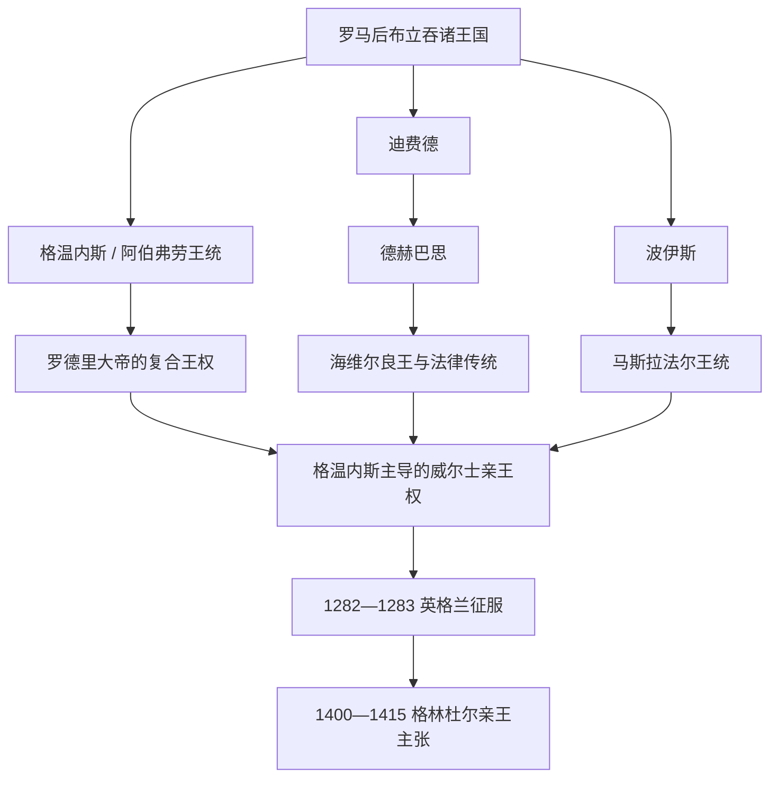

# 威尔士主要王国与亲王世系表

## 口径说明

中世纪威尔士长期由格温内斯、德赫巴思、波伊斯、格温特、格拉摩根等并立王国组成，没有一条可覆盖全境的连续“威尔士国王世系”。本表按政权分别列出史料较可重建的主要统治者；5—8世纪年代多来自后世编年与谱系，故用“约”、并列在位或“存在争议”标记。一个人兼领多国时会在不同表重复出现，这反映复合王权而非录入重复。

## 世系演变图

## 格温内斯王统

早期“库内达自北方迁入并建立格温内斯”的故事兼有王朝起源传说性质。下表从传统早期王统列到1283年；约950—1100年间经常共治、篡位和复位。

| 顺序 | 统治者 | 在位时间 | 王室与继承关系 | 关键事项 / 争议 |
|---:|---|---|---|---|
| 1 | 库内达 | 约5世纪中叶 | 传统建国祖 | 活动年代、迁徙规模和是否直接称格温内斯王均有争议。 |
| 2 | 埃尼昂·伊尔思 | 约5世纪后半 | 库内达之子 | 早期谱系人物，年代不确定。 |
| 3 | 卡德瓦隆·劳希尔 | 约5世纪末—6世纪初 | 埃尼昂之子 | 传统称在安格尔西驱逐爱尔兰势力。 |
| 4 | **马尔贡·圭内斯** | 约520—547 | 卡德瓦隆后裔 | 6世纪最具史料可见度的强王之一；被吉尔达斯批评。 |
| 5 | 鲁恩·希尔 | 约547—580 | 马尔贡之子 | 后世谱系称其远征北方，细节难核。 |
| 6 | 贝利·阿普·鲁恩 | 约580—599 | 鲁恩之子 | 年代约略。 |
| 7 | 雅戈·阿普·贝利 | 约599—616 | 贝利之子 | 616年前后死亡。 |
| 8 | 卡德范·阿普·雅戈 | 约616—625 | 雅戈之子 | 墓碑显示拉丁—基督教王权文化。 |
| 9 | **卡德瓦隆·阿普·卡德范** | 约625—634 | 卡德范之子 | 联合麦西亚击败诺森布里亚埃德温，后在赫文菲尔德败亡。 |
| 10 | 卡达瓦尔·卡多梅德 | 约634—655 | 王族关系不详 | 后世称其临阵退缩，记载带道德化色彩。 |
| 11 | 卡德瓦拉德 | 约655—682 | 卡德瓦隆之子 | 后世民族传说中的末代“全不列颠”希望，实际统治范围有限。 |
| 12 | 伊德瓦尔·伊乌尔赫 | 约682—720 | 卡德瓦拉德之子 | 年代不详。 |
| 13 | 罗德里·莫尔维诺格 | 约720—754 | 伊德瓦尔之子 | 与麦西亚压力并存。 |
| 14 | 卡拉多格·阿普·梅里昂 | 约754—798 | 继承关系有争议 | 可能并非前王直系。 |
| 15 | 基南·丁代思维 | 798—816 | 王族成员 | 与海维尔争位。 |
| 16 | 海维尔·阿普·罗德里 | 816—825 | 罗德里·莫尔维诺格之子 | 击败基南后统治，死后男性主系中断。 |
| 17 | **梅尔芬·弗里赫** | 825—844 | 经母系联系继位 | 来自马恩或北威尔士相关家系，开梅尔芬王统。 |
| 18 | **罗德里大帝** | 844—878 | 梅尔芬之子 | 兼有波伊斯、后得塞瑟卢格；死于对盎格鲁人战争。 |
| 19 | 阿纳拉德·阿普·罗德里 | 878—916 | 罗德里之子 | 881年康威战胜麦西亚；维持格温内斯核心。 |
| 20 | 伊德瓦尔·福埃尔 | 916—942 | 阿纳拉德之子 | 与英格兰交战身亡。 |
| 插入 | **海维尔良王** | 942—950 | 罗德里另一支后裔、德赫巴思王 | 伊德瓦尔死后兼并格温内斯，死后阿伯弗劳支系复辟。 |
| 21 | 雅戈·阿布·伊德瓦尔 | 950—979 | 伊德瓦尔之子 | 早期与弟伊埃瓦夫共治，后囚弟。 |
| 共治 | 伊埃瓦夫·阿布·伊德瓦尔 | 950—969 | 雅戈之弟 | 969年被兄囚禁。 |
| 22 | 海维尔·阿布·伊埃瓦夫 | 约974—985 | 伊埃瓦夫之子 | 借英格兰支持挑战叔父，后独掌。 |
| 23 | 卡德瓦隆·阿布·伊埃瓦夫 | 985—986 | 海维尔之弟 | 很快被南方王马雷迪德击败。 |
| 24 | 马雷迪德·阿布·欧文 | 986—999 | 德赫巴思王 | 兼领格温内斯，显示跨国合并的暂时性。 |
| 25 | 基南·阿普·海维尔 | 999—1005 | 海维尔之子 | 复兴阿伯弗劳支系，战死。 |
| 26 | 埃丹·阿普·布莱吉乌里德 | 1005—1018 | 王统关系不明 | 可能属外来夺位者，与诸子被卢埃林杀死。 |
| 27 | 卢埃林·阿普·塞西尔 | 1018—1023 | 与王族有婚姻联系 | 兼领德赫巴思，早逝。 |
| 28 | 雅戈·阿布·伊德瓦尔·阿普·梅里格 | 1023—1039 | 阿伯弗劳支系 | 被格鲁菲德杀死。 |
| 29 | **格鲁菲德·阿普·卢埃林** | 1039—1063 | 卢埃林·阿普·塞西尔之子 | 1055后实际控制几乎全威尔士；遭哈罗德进攻并被己方杀死。 |
| 30 | 布莱丁·阿普·基芬 | 1063—1075 | 格鲁菲德异母弟 | 获英王哈罗德承认；兼波伊斯，开马斯拉法尔支系。 |
| 31 | 特拉海恩·阿普·卡拉多格 | 1075—1081 | 布莱丁堂亲或相关王族 | 1081年米尼德·卡恩战败身亡。 |
| 32 | **格鲁菲德·阿普·基南** | 1081；约1094—1137 | 雅戈后裔 | 1081年即被诺曼人俘，后复位；长期统治并重建格温内斯。 |
| 33 | **欧文·圭内斯** | 1137—1170 | 格鲁菲德之子 | 扩张至北威尔士东部，多次抵抗亨利二世；采用亲王式称号。 |
| 34 | 海维尔·阿布·欧文 | 1170 | 欧文长子 | 继承战争中被兄弟击败身亡。 |
| 35 | 达菲德·阿布·欧文 | 1170—1195 | 欧文之子 | 先与兄弟竞争，后被侄卢埃林取代。 |
| 并立 | 罗德里·阿布·欧文 | 1170年代—1190年代若干地区 | 欧文之子 | 在安格尔西等地反复掌权，未长期统一。 |
| 36 | **卢埃林大帝** | 1195—1240 | 欧文之孙 | 统一格温内斯并建立全威尔士霸权。 |
| 37 | 达菲德·阿普·卢埃林 | 1240—1246 | 卢埃林婚生子 | 以亲王身份继位，反对英王宗主权，无嗣而死。 |
| 共治 | 欧文·戈赫、卢埃林、达菲德三兄弟 | 1246—1255 | 格鲁菲德·阿普·卢埃林之子 | 叔父死后共掌；1255年布林德温战役后卢埃林居主导。 |
| 38 | **卢埃林·阿普·格鲁菲德** | 1255—1282 | 卢埃林大帝之孙 | 1267年获承认“威尔士亲王”；1282年战死。 |
| 39 | 达菲德·阿普·格鲁菲德 | 1282—1283 | 卢埃林之弟 | 继续抵抗，被俘后以叛国罪处死；本土独立王统结束。 |

## 德赫巴思王统

德赫巴思约在920年由海维尔良王合并迪费德与塞瑟卢格形成；11—12世纪常被格温内斯王或诺曼势力夺取，后期分裂为多个家支领地。

| 顺序 | 统治者 | 在位时间 | 继承关系与备注 |
|---:|---|---|---|
| 1 | **海维尔良王** | 约920—950 | 建国性统治者；兼领波伊斯、后兼格温内斯，与法律编纂传统相连。 |
| 2 | 欧文·阿普·海维尔 | 950—988 | 海维尔之子；初与兄弟罗德里、埃德温共治。 |
| 共治 | 罗德里、埃德温 | 950年代 | 海维尔之子；均早于欧文去世。 |
| 3 | 马雷迪德·阿布·欧文 | 986—999 | 欧文之子；兼领格温内斯。 |
| 4 | 基南·阿普·海维尔 | 999—1005 | 海维尔·阿布·伊埃瓦夫之子；控制范围有争议。 |
| 5 | 埃德温·阿布·埃尼昂与卡德尔·阿布·埃尼昂 | 约1005—1018 | 欧文孙辈，可能分区共治。 |
| 6 | 卢埃林·阿普·塞西尔 | 1018—1023 | 征服得位，兼格温内斯。 |
| 7 | 里德尔赫·阿普·伊斯廷 | 1023—1033 | 格温特 / 格拉摩根王族出身，夺取德赫巴思。 |
| 8 | 海维尔·阿布·埃德温 | 1033—1044 | 海维尔良王后裔，反复与格鲁菲德争位。 |
| 9 | 格鲁菲德·阿普·里德尔赫 | 1045—1055 | 里德尔赫之子，后被格温内斯格鲁菲德击败。 |
| 10 | 格鲁菲德·阿普·卢埃林 | 1055—1063 | 兼并德赫巴思，形成全威尔士霸权。 |
| 11 | 马雷迪德·阿布·欧文·阿布·埃德温 | 1063—1072 | 海维尔良王后裔，恢复南方王统。 |
| 12 | 里斯·阿布·欧文 | 1072—1078 | 前王之弟。 |
| 13 | **里斯·阿普·特杜尔** | 1078—1093 | 海维尔王统；布雷肯战死后诺曼征服南威尔士加速。 |
| 14 | 格鲁菲德·阿普·里斯 | 约1116—1137 | 里斯之子；在流亡后恢复部分王权。 |
| 15 | 阿纳拉德·阿普·格鲁菲德 | 1137—1143 | 格鲁菲德长子，遇刺。 |
| 16 | 卡德尔·阿普·格鲁菲德 | 1143—1153 | 阿纳拉德之弟，受伤后退居。 |
| 17 | 马雷迪德·阿普·格鲁菲德 | 1153—1155 | 卡德尔之弟，早逝。 |
| 18 | **里斯·阿普·格鲁菲德“里斯领主”** | 1155—1197 | 格鲁菲德之子；与亨利二世合作后成为南威尔士最强本土领主，赞助文化。 |
| 19 | 格鲁菲德·阿普·里斯二世 | 1197—1201 | 里斯领主之子；与兄马尔贡内战。 |
| 并立 | 马尔贡·阿普·里斯 | 1197—1230 | 里斯领主之子；控制西部若干领地，与兄弟反复竞争。 |
| 并立 | 里斯·格里格 | 1216—1234 | 里斯领主之子；控制东部部分，时而服从卢埃林大帝。 |
| 后期家支 | 马雷迪德·阿普·里斯·格里格、里斯·阿普·马雷迪德等 | 1234—1283/1292 | 德赫巴思已碎片化；里斯·阿普·马雷迪德1287起义，1292年被处死。 |

## 波伊斯与分裂后的两支

| 阶段 | 统治者 | 在位时间 | 继承关系与备注 |
|---|---|---|---|
| 早期王统 | 埃利塞德·阿普·圭洛格 | 约725—755 | “埃利塞德柱”纪念王权与对盎格鲁势力的抗争。 |
| 早期王统 | 布罗赫韦尔·阿普·埃利塞德 | 约755—773 | 埃利塞德之子。 |
| 早期王统 | 卡德尔·阿普·布罗赫韦尔 | 约773—808 | 前王之子。 |
| 早期王统 | 基根·阿普·卡德尔 | 约808—854 | 男性主系末王；死后王国转入罗德里大帝家系。 |
| 梅尔芬王统 | 罗德里大帝及其后裔 | 854—约999 | 波伊斯多次与格温内斯、德赫巴思合并后再分。 |
| 马斯拉法尔复兴 | **布莱丁·阿普·基芬** | 1063—1075 | 格鲁菲德异母弟，兼格温内斯与波伊斯。 |
| 共治竞争 | 伊奥沃思、卡德甘、马雷迪德等布莱丁诸子 | 1075—1132 | 与诺曼边区领主及彼此反复战争。 |
| 统一末期 | **马多格·阿普·马雷迪德** | 1132—1160 | 波伊斯最后一位较强统一君主；死后分裂。 |
| 波伊斯法多格 | 格鲁菲德·马埃洛尔一世 | 1160—1191 | 北支创始。 |
| 波伊斯法多格 | 马多格·阿普·格鲁菲德·马埃洛尔 | 1191—1236 | 建立瓦莱克鲁基斯修院。 |
| 波伊斯法多格 | 格鲁菲德·马埃洛尔二世 | 1236—1269 | 在英王与格温内斯之间周旋。 |
| 波伊斯法多格 | 马多格二世及兄弟 | 1269—1277 | 继承分割，1277年后被英王控制。 |
| 波伊斯文温温 | 欧文·基费利奥格 | 1160—1195 | 南支统治者兼诗人。 |
| 波伊斯文温温 | 格温温温 | 1195—1216 | 多次改变与英王、卢埃林大帝的联盟。 |
| 波伊斯文温温 | 格鲁菲德·阿普·格温温温 | 1216—1286 | 长期亲英；领地转型为英格兰边区领主制。 |
| 边区领主化 | 欧文·德拉波尔 | 1286—1309 | 不再是独立威尔士王，作为波伊斯领主在英格兰法框架下继承。 |

## 本土“威尔士亲王”与后续主张

| 顺序 | 统治者 | 称号阶段 | 性质与结局 |
|---:|---|---|---|
| 1 | 欧文·圭内斯 | 12世纪中叶 | 使用“威尔士人的亲王”等称号，未获英王承认全威尔士宗主权。 |
| 2 | **卢埃林大帝** | 约1200—1240 | 实际令多数威尔士领主服从，1218年伍斯特安排获一定承认；常被后世视为亲王制奠基者。 |
| 3 | 达菲德·阿普·卢埃林 | 1240—1246 | 自称威尔士亲王，英王只承认其格温内斯地位。 |
| 4 | **卢埃林·阿普·格鲁菲德** | 1258/1267—1282 | 1258年采用称号，1267年《蒙哥马利条约》由亨利三世正式承认。 |
| 5 | 达菲德·阿普·格鲁菲德 | 1282—1283 | 兄长死后继续本土亲王主张，战败被处死。 |
| 复兴主张 | **欧文·格林杜尔** | 1400—约1415 | 起义中宣布威尔士亲王，建立议会、教会和外交计划；最终失去控制区，死亡时间不详。 |

1301年以后英王把“威尔士亲王”授予王位继承人，这是征服后的王储封号，与上述本土亲王世系并非同一政权。

## 使用说明

- 格温特、格拉摩根、布里切尼奥格等也有各自王统，但早期谱系和分治极复杂，且后期多转为诺曼边区领地；不应强行接入格温内斯序列。
- “全威尔士国王”多是阶段性霸权。格鲁菲德·阿普·卢埃林在1055—1063年最接近全境实际统治；1267年的卢埃林则获得明确亲王称号与封建承认。
- 王位通常在王族合资格男性间竞争，私生子不必然被排除；分割继承、共治和军事夺位是世系频繁重叠的主要原因。
- 1283年后本土王权的终结是军事征服、城堡封锁、海运优势、内部倒戈和卢埃林战死共同造成，不能归结为单一战役。

## 相关笔记

- 前期结构：[罗马后威尔士诸国](/%E4%BA%BA%E6%96%87%E7%A7%91%E5%AD%A6/%E5%8E%86%E5%8F%B2/%E6%AC%A7%E6%B4%B2/%E4%B8%8D%E5%88%97%E9%A2%A0%E7%BE%A4%E5%B2%9B/%E5%A8%81%E5%B0%94%E5%A3%AB/%E7%BD%97%E9%A9%AC%E5%90%8E%E5%A8%81%E5%B0%94%E5%A3%AB%E8%AF%B8%E5%9B%BD.md)。
- 亲王与征服：[威尔士亲王与英格兰征服](/%E4%BA%BA%E6%96%87%E7%A7%91%E5%AD%A6/%E5%8E%86%E5%8F%B2/%E6%AC%A7%E6%B4%B2/%E4%B8%8D%E5%88%97%E9%A2%A0%E7%BE%A4%E5%B2%9B/%E5%A8%81%E5%B0%94%E5%A3%AB/%E5%A8%81%E5%B0%94%E5%A3%AB%E4%BA%B2%E7%8E%8B%E4%B8%8E%E8%8B%B1%E6%A0%BC%E5%85%B0%E5%BE%81%E6%9C%8D.md)。
- 法制接管：[威尔士并入英格兰法制](/%E4%BA%BA%E6%96%87%E7%A7%91%E5%AD%A6/%E5%8E%86%E5%8F%B2/%E6%AC%A7%E6%B4%B2/%E4%B8%8D%E5%88%97%E9%A2%A0%E7%BE%A4%E5%B2%9B/%E5%A8%81%E5%B0%94%E5%A3%AB/%E5%A8%81%E5%B0%94%E5%A3%AB%E5%B9%B6%E5%85%A5%E8%8B%B1%E6%A0%BC%E5%85%B0%E6%B3%95%E5%88%B6.md)。
- 目录入口：[威尔士](/%E4%BA%BA%E6%96%87%E7%A7%91%E5%AD%A6/%E5%8E%86%E5%8F%B2/%E6%AC%A7%E6%B4%B2/%E4%B8%8D%E5%88%97%E9%A2%A0%E7%BE%A4%E5%B2%9B/%E5%A8%81%E5%B0%94%E5%A3%AB/README.md)。
