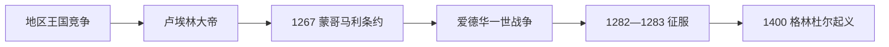

# 威尔士亲王与英格兰征服

## 时间

9世纪—1283年

## 演变图

## 概括

中世纪威尔士的政治整合不是直线统一，而是格温内斯、德赫巴思、波伊斯等王权反复竞争的过程。格鲁菲德·阿普·卢埃林曾在11世纪短暂统治几乎全威尔士；13世纪卢埃林大帝及其孙卢埃林·阿普·格鲁菲德以格温内斯为核心建立较稳定的亲王权，最终被英格兰国王爱德华一世以持续战争、城堡体系和行政接管摧毁。

## 整合过程

- **9—11世纪：短期霸权。** 罗德里大帝及其后裔通过婚姻与征服扩大势力。格鲁菲德·阿普·卢埃林在1055年前后控制主要诸国，却于1063年败亡，统一随之瓦解。
- **诺曼压力。** 1066年后，诺曼边区领主沿南部和东部建立领地与城堡；威尔士本土王权利用山地、亲族网络和诺曼内部冲突保持独立。
- **卢埃林大帝时期。** 卢埃林·阿普·约沃思（1195—1240）统一格温内斯并迫使多数威尔士领主承认其宗主地位，通过婚姻和外交周旋于英格兰王室。
- **亲王称号确立。** 卢埃林·阿普·格鲁菲德在1267年《蒙哥马利条约》中获亨利三世承认为“威尔士亲王”，但须向英王称臣并纳贡。
- **征服。** 1277年战争削弱卢埃林；1282年全面起义中卢埃林战死，其弟达菲德于1283年被俘处死，有组织的本土亲王权终结。

## 统治结构与主要亲王

| 统治者 | 主要时期 | 地位与作用 |
|---|---|---|
| 罗德里大帝 | 844—878 | 兼有格温内斯、波伊斯等地，奠定后世王统声望。 |
| 海维尔良王 | 约942—950 | 统合西南诸国，传统上与威尔士法律编纂相联系。 |
| 格鲁菲德·阿普·卢埃林 | 1039—1063 | 唯一曾实际控制几乎全威尔士的中世纪国王。 |
| 欧文·圭内斯 | 1137—1170 | 抵御诺曼与英王干预，巩固格温内斯。 |
| 卢埃林大帝 | 1195—1240 | 建立跨诸国霸权并形成亲王制基础。 |
| 达菲德·阿普·卢埃林 | 1240—1246 | 卢埃林大帝之子，继续抵抗英王宗主权。 |
| 卢埃林·阿普·格鲁菲德 | 1246—1282 | 1267年获正式承认为威尔士亲王。 |
| 达菲德·阿普·格鲁菲德 | 1282—1283 | 最后一位独立本土亲王，败亡后被处死。 |

## 征服得以成功的原因

英格兰拥有更大的财政与兵员，可从海上切断格温内斯粮源，并在康威、卡那封、哈勒赫等地修筑相互支援的石堡。威尔士内部的继承竞争和部分领主转向英王削弱了统一抵抗。直接触发因素则是1282年多地起义与爱德华一世全面动员；卢埃林意外战死使指挥体系迅速崩溃。

## 结果与影响

征服没有消灭威尔士语言和地方社会，却终结独立亲王权。英王之子爱德华于1301年获封威尔士亲王，此后该称号成为英格兰、后来英国王储的惯例。1400—1415年欧文·格林杜尔起义曾恢复本土亲王主张，但未能建立持久政权。

## 王统专表

完整王统、共治与争议年代见[威尔士主要王国与亲王世系表](/%E4%BA%BA%E6%96%87%E7%A7%91%E5%AD%A6/%E5%8E%86%E5%8F%B2/%E6%AC%A7%E6%B4%B2/%E4%B8%8D%E5%88%97%E9%A2%A0%E7%BE%A4%E5%B2%9B/%E5%A8%81%E5%B0%94%E5%A3%AB/%E5%A8%81%E5%B0%94%E5%A3%AB%E4%B8%BB%E8%A6%81%E7%8E%8B%E5%9B%BD%E4%B8%8E%E4%BA%B2%E7%8E%8B%E4%B8%96%E7%B3%BB%E8%A1%A8.md)。

## 演变关系

- 前一阶段：[罗马后威尔士诸国](/%E4%BA%BA%E6%96%87%E7%A7%91%E5%AD%A6/%E5%8E%86%E5%8F%B2/%E6%AC%A7%E6%B4%B2/%E4%B8%8D%E5%88%97%E9%A2%A0%E7%BE%A4%E5%B2%9B/%E5%A8%81%E5%B0%94%E5%A3%AB/%E7%BD%97%E9%A9%AC%E5%90%8E%E5%A8%81%E5%B0%94%E5%A3%AB%E8%AF%B8%E5%9B%BD.md)
- 后一阶段：[威尔士并入英格兰法制](/%E4%BA%BA%E6%96%87%E7%A7%91%E5%AD%A6/%E5%8E%86%E5%8F%B2/%E6%AC%A7%E6%B4%B2/%E4%B8%8D%E5%88%97%E9%A2%A0%E7%BE%A4%E5%B2%9B/%E5%A8%81%E5%B0%94%E5%A3%AB/%E5%A8%81%E5%B0%94%E5%A3%AB%E5%B9%B6%E5%85%A5%E8%8B%B1%E6%A0%BC%E5%85%B0%E6%B3%95%E5%88%B6.md)
- 所属总览：[威尔士](/%E4%BA%BA%E6%96%87%E7%A7%91%E5%AD%A6/%E5%8E%86%E5%8F%B2/%E6%AC%A7%E6%B4%B2/%E4%B8%8D%E5%88%97%E9%A2%A0%E7%BE%A4%E5%B2%9B/%E5%A8%81%E5%B0%94%E5%A3%AB/README.md)
