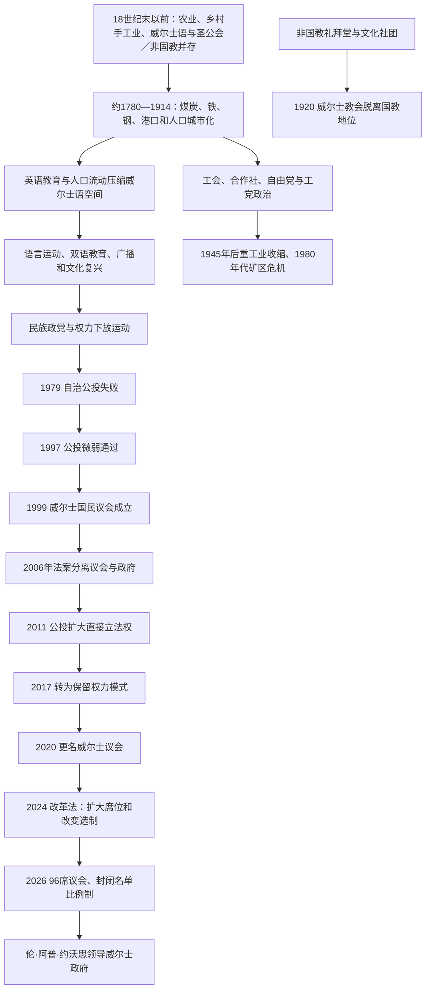

# 现代威尔士

## 时间

约1780年代工业革命加速至今；本笔记核验至2026年7月14日。

## 概括

现代威尔士是在工业化、工人政治、语言复兴和联合王国内权力下放的交汇中形成的。18世纪末至20世纪初，南威尔士煤炭、铁和钢铁工业把一个以乡村、农业和威尔士语为主的地区改造成英国工业核心之一；矿工社区、非国教礼拜堂、工会和工党由此成为公共生活支柱。20世纪后半叶重工业衰退，引发长期失业、人口与地区差距，也推动文化机构、民族政治和自治要求上升。

威尔士不是独立主权国家，而是大不列颠及北爱尔兰联合王国的构成国。1999年恢复民选全国性机构后，自治从行政权逐步发展为在卫生、教育、地方政府、环境、交通和部分税收领域拥有立法与执行权的制度。2026年议会扩大到96席并首次使用封闭名单比例代表制；威尔士党领袖伦·阿普·约沃思成为首位非工党籍首席大臣。这一变化不改变英国议会在宪制、外交、国防、移民和大量财政事务上的保留权。

## 现代演变图

## 工业化与社会重组

### 煤铁、港口和城市

18世纪末，梅瑟蒂德菲尔、道莱斯等地的大型铁厂依靠南威尔士煤田扩张；19世纪蒸汽动力、铁路和海运又使煤炭成为出口核心。卡迪夫、巴里、纽波特和斯旺西等港口迅速成长，人口从威尔士乡村、英格兰、爱尔兰及更远地区涌入。北部板岩矿、沿海铜炼和锡镀工业构成另一条工业线，农业地区则没有同步富裕。

工业化带来工资劳动和城市机会，也带来矿难、疾病、拥挤住房与周期性失业。1831年梅瑟蒂德菲尔起义源于减薪、债务和政治排斥；1839年宪章派纽波特起义遭军队镇压。工人友爱社、合作社和工会逐步把社区互助转化为集体谈判与议会政治。

### 非国教、教育与政党

循道宗、浸礼宗和公理宗礼拜堂既是宗教中心，也是威尔士语讲道、合唱、教育和公共辩论场所。19世纪后期，自由党通过反对圣公会特权、土地改革和威尔士自治诉求获得支持；20世纪煤矿工会和工党取代自由党成为南部工业区主要力量。

1847年英国政府委托的教育调查把威尔士语和非国教文化描述为社会落后来源，报告后来被称为“蓝皮书的背叛”。它推动英语学校扩张，也激起对文化贬抑的持久反弹。1889年中等教育制度、1893年威尔士大学成立，以及1907年国家图书馆和国家博物馆获得特许，使威尔士知识机构逐步全国化。

### 教会脱离国教

1914年《威尔士教会法》因第一次世界大战延后实施，1920年威尔士圣公会脱离英格兰国教体系，成为独立的“威尔士教会”。这不是宗教消失，而是取消圣公会在威尔士的法定国教与部分财产特权，反映非国教多数长期政治动员。

## 战争、福利国家与去工业化

两次世界大战造成征兵与伤亡，也使煤炭、钢铁和军工生产暂时扩大。1930年代大萧条重创矿区，失业促成人口外流和“饥饿进军”。1945年后，国有化煤矿、英国福利国家和国民保健服务改善保障；出生于特雷德加的阿纽林·贝文作为英国卫生大臣建立国民保健服务，成为威尔士劳工传统的象征。

煤炭长期需求下降、开采成本、能源转换、国际竞争和政府产业政策共同导致矿井关闭。1966年阿伯凡煤矿废料堆坍塌造成大量儿童与成人死亡，暴露监管和国家煤炭管理失灵。1984—1985年矿工罢工在南威尔士获得强烈支持，失败后关闭加速；钢铁等重工业也经历裁员和集中化。把衰退归结为单一政党或单一技术原因会忽略数十年的结构变化，但中央政策决定了转型速度与地区承受方式。

公共部门、旅游、创意产业、大学、航空与先进制造、金融和数字服务后来扩大，却未完全填补高薪工业岗位。加的夫湾改造象征服务业和政治中心兴起，山谷、农村与西部地区仍面对生产率、交通、住房和青年外流压力。

## 语言与民族文化复兴

### 语言地位

工业化人口流动、学校英语化和就业压力使威尔士语在19—20世纪总体退缩。1925年成立的威尔士党最初把语言文化放在中心；1962年成立的威尔士语言协会通过非暴力直接行动争取广播、道路标识和公共服务。1967年《威尔士语言法》允许法庭和部分行政使用威尔士语，1993年法案确立公共部门中英语与威尔士语平等对待原则，2011年措施确认威尔士语在威尔士具有官方地位。

1982年开播的威尔士语第四台、英国广播公司威尔士语服务、双语学校和威尔士语教育扩大语言使用。2021年人口普查显示能说威尔士语者比例较2011年略降，说明学校增长、家庭传承、住房市场和社区人口变化之间仍有张力。政府提出到2050年达到一百万使用者的目标，但语言复兴不能只靠法定地位，还取决于日常社区、就业和代际传承。

### 文化机构与认同

国家诗歌音乐节、橄榄球、足球、合唱、文学与广播共同塑造现代认同。1955年卡迪夫被正式承认为威尔士首都，国家博物馆、图书馆、大学和后来的议会提供全国性公共空间。威尔士身份可以同英国身份、欧洲身份和多族裔社区身份并存，并非人人对自治或独立持同一立场。

1957年英国议会授权淹没特里韦林河谷以向利物浦供水，几乎所有威尔士议员反对仍无法阻止，成为“中央多数可压倒威尔士意见”的象征。1966年格温福·埃文斯赢得卡马森补选，使威尔士党首次取得英国议会席位，也把语言与自治议题带入全国政治。

## 权力下放过程

### 两次公投

1979年自治公投在经济危机、方案权力有限、政党分裂和反对运动下以悬殊票数失败。1980年代去工业化、保守党长期执政而在威尔士支持较弱，以及语言运动和地方政府经验，使自治联盟重建。1997年工党政府再次举行公投，赞成方仅以极微弱优势获胜，显示地区、阶级和语言差异仍深。

1998年《威尔士政府法》建立60席威尔士国民议会，1999年首次选举。最初机构主要执行英国议会授予的二级立法和行政权，议会与“行政委员会”法律上没有完全分离，弱于同时建立的苏格兰议会。

### 从行政自治到立法自治

2006年《威尔士政府法》把立法机关与威尔士政府分开，并提供逐步取得立法权的机制。2011年公投批准议会在既有下放领域直接制定法案，不再逐项向伦敦申请权限。2014、2017年《威尔士法》扩大税收与借贷能力，并把权限框架转为“未明确保留者原则上可下放”的保留权力模式。

2020年，立法机关正式使用“威尔士议会／Senedd Cymru”名称，成员由AM改称MS。自治仍非主权：英国议会在法律上保有最高立法权，英国最高法院可裁定权限争议；司法体系仍为英格兰和威尔士共同法域。英国脱欧又造成原欧盟监管、农业和区域资金由伦敦还是加的夫承接的争执。

### 2024—2026年议会改革

2024年改革法把议员数从60增至96，并从2026年起以16个六席选区、政党封闭名单和德洪特法分配席位。支持者认为60席难以同时承担立法、委员会和政府职务；批评者质疑成本、封闭名单的候选人控制和选区联系。2026年5月7日首次按新制选举，投票率51.6%，为历届威尔士自治选举最高。新议会于5月12日提名威尔士党领袖伦·阿普·约沃思为首席大臣，结束工党自1999年以来持续领导威尔士政府的局面。

## 当前政治结构

| 层级 / 机构 | 产生方式 | 权力与责任 | 截至2026年7月14日 |
|---|---|---|---|
| 英国君主 | 联合王国世袭国家元首 | 依英国宪制履行任命和御准等形式职能 | 查尔斯三世；不是威尔士政府的日常决策者。 |
| 英国议会与政府 | 全英国选举及议会责任制 | 宪制、外交、国防、移民、社会保障主要部分和大量宏观财政；英国议会法律上可为威尔士立法 | 同[联合王国](/%E4%BA%BA%E6%96%87%E7%A7%91%E5%AD%A6/%E5%8E%86%E5%8F%B2/%E6%AC%A7%E6%B4%B2/%E4%B8%8D%E5%88%97%E9%A2%A0%E7%BE%A4%E5%B2%9B/%E8%81%94%E5%90%88%E7%8E%8B%E5%9B%BD/README.md)制度相连。 |
| 威尔士议会 | 2026年起96名民选议员；16个六席选区封闭名单比例制 | 在下放领域立法、同意部分税收、审议预算并监督政府 | 第七届议会；议长休·伊兰卡-戴维斯。 |
| 威尔士政府 | 首席大臣由议会提名、国王任命，再组阁 | 执行下放法律和政策，管理卫生、教育、地方政府、环境、文化、部分交通与经济事务 | 首席大臣伦·阿普·约沃思；2026年5月12日就任。 |
| 地方政府 | 地方选举 | 社会照护、学校实施、住房规划、垃圾处理、道路等 | 22个主要地方政府及社区议会。 |
| 英格兰和威尔士司法体系 | 英国法律与法院体系 | 多数民刑事司法尚未下放，威尔士法律在同一法域内增多 | 自治立法与共同法域并存。 |

## 威尔士政府首脑完整表

1999—2000年正式称“第一秘书”，2000年10月后采用“首席大臣”；表中按连续任期列全，不把政府首脑同英国首相或议会议长混列。

| 顺序 | 姓名 | 政党 | 在任 | 与前任关系 / 政府基础 | 关键事件 |
|---:|---|---|---|---|---|
| 1 | 阿伦·迈克尔 | 工党 | 1999年5月12日—2000年2月9日 | 首届自治选举后由少数政府执政；面对不信任动议前辞职 | 建立新机构，但欧盟农业资金争议削弱支持。 |
| 2 | **罗德里·摩根** | 工党 | 2000年2月9日—2009年12月9日 | 工党内部接替；先少数政府，后同自由民主党联合，再转单独执政 | 采用首席大臣称号；形成较有区别的威尔士公共政策；推动2006年制度改革。 |
| 3 | 卡文·琼斯 | 工党 | 2009年12月10日—2018年12月12日 | 党内接替；先同威尔士党联合，2011年后领导工党政府 | 2011年立法权公投；税收与保留权力改革；英国脱欧公投。 |
| 4 | **马克·德雷克福德** | 工党 | 2018年12月13日—2024年3月20日 | 工党党魁选举接替 | 新冠疫情期间实施威尔士规则；2021年工党获30席；同威尔士党达成合作协议。 |
| 5 | 沃恩·盖辛 | 工党 | 2024年3月20日—8月6日 | 党魁选举接替；首位领导欧洲国家或构成国政府的黑人首脑 | 政治捐款和内阁辞职危机后宣布辞职，任期不足五个月。 |
| 6 | **埃吕内德·摩根** | 工党 | 2024年8月6日—2026年5月12日 | 工党内部无竞争接替；首位女性首席大臣 | 领导第六届议会末期政府和2026年选举过渡。 |
| 7 | **伦·阿普·约沃思** | 威尔士党 | 2026年5月12日至今 | 2026年选举后以44票获议会提名；首位威尔士党籍首席大臣 | 组建首个非工党领导的威尔士政府，面对无单党多数的第七届议会。 |

## 议会议长完整表

议长（Llywydd）主持议会并保持职务中立，不领导政府；与首席大臣职责不同。

| 顺序 | 姓名 | 在任 | 覆盖届次 | 说明 |
|---:|---|---|---|---|
| 1 | 达菲德·埃利斯-托马斯 | 1999年5月—2011年5月 | 第一至第三届国民议会 | 首任议长，建立议事规则和机构惯例。 |
| 2 | 罗斯玛丽·巴特勒 | 2011年5月—2016年5月 | 第四届国民议会 | 推动青年参与和议会公共开放。 |
| 3 | **埃林·琼斯** | 2016年5月—2026年5月12日 | 第五、六届议会 | 主持议会更名、疫情时期程序和2026年扩员准备。 |
| 4 | **休·伊兰卡-戴维斯** | 2026年5月12日至今 | 第七届议会 | 由扩大后的96席议会选出；首席大臣提名投票时主持会议。 |

## 重要事件与长期影响

| 时间 | 事件 | 直接结果 | 长期影响 |
|---|---|---|---|
| 1831年 | 梅瑟蒂德菲尔起义 | 军队镇压，部分工人死亡 | 显示工业秩序、债务和政治排斥冲突。 |
| 1839年 | 纽波特宪章派起义 | 武装游行被镇压 | 成为英国工人普选运动最后一次大规模武装行动。 |
| 1847年 | 教育调查“蓝皮书” | 强化英语教育与文化污名 | 激发长期语言和民族文化反思。 |
| 1893年 | 威尔士大学成立 | 建立全国性大学体系 | 扩大本地高等教育与知识精英。 |
| 1914／1920年 | 威尔士教会法通过／生效 | 圣公会在威尔士脱离国教 | 非国教政治取得标志性成果。 |
| 1925年 | 威尔士党成立 | 民族政党组织化 | 把语言、自治和后来的独立议题带入选举政治。 |
| 1955年 | 卡迪夫获承认为首都 | 固定全国行政文化中心 | 为后来的自治机构选址奠定基础。 |
| 1957—1965年 | 特里韦林水库授权与淹没 | 卡佩尔凯林村被淹 | 强化对中央决策缺少威尔士同意的批评。 |
| 1962年 | 威尔士语言协会成立 | 直接行动扩大 | 推动广播、标识和公共服务双语化。 |
| 1966年 | 阿伯凡灾难；威尔士党赢得卡马森补选 | 监管危机；民族党首次进入英国议会 | 分别改变工业安全记忆与政党格局。 |
| 1967、1993、2011年 | 三阶段语言立法 | 公共、司法和官方地位扩大 | 从许可使用走向法定平等和官方地位。 |
| 1979年 | 首次自治公投 | 方案被大幅否决 | 自治运动进入长期重组。 |
| 1982年 | 威尔士语第四台开播 | 建立全国威尔士语电视服务 | 语言运动取得制度成果。 |
| 1984—1985年 | 矿工罢工 | 失败后矿井关闭加快 | 矿区经济、阶级政治和社区结构转折。 |
| 1997年 | 第二次自治公投 | 以微弱多数通过 | 为1999年议会成立授权。 |
| 1999年 | 威尔士国民议会开会 | 恢复全国民选机构 | 开启持续扩权的自治阶段。 |
| 2011年 | 立法权公投 | 下放领域可直接制定法案 | 自治由行政主导转向真正立法机关。 |
| 2016—2020年 | 英国脱欧与权力重分配 | 欧盟权限和资金回流 | 加剧加的夫—伦敦间共同框架和财政争议。 |
| 2020年 | 更名威尔士议会 | 名称反映立法地位 | 强化议会与政府区分。 |
| 2024年 | 议员与选举改革法 | 决定扩至96席并更换选制 | 重塑代表性、政党竞争和委员会能力。 |
| 2026年 | 首次新制选举、政府更替 | 威尔士党首次领导政府 | 终结工党连续执政，开启无多数议会新阶段。 |

## 自治的维持条件与主要争议

### 维持条件

- 公投授权、定期选举和独立政党竞争为自治提供民主基础。
- 威尔士法律、政府公务体系、议会委员会和税收工具形成制度积累。
- 双语公共文化、媒体、教育和全国文化机构维持区别性政治共同体。
- 同英国财政转移、共同市场和福利体系的连接支撑公共服务。
- 地方政府、工会、企业、大学和公民组织为政策提供执行网络。

### 结构制约

- 威尔士税基、工资和生产率低于英国部分地区，财政高度依赖英国拨款公式。
- 国防、外交、移民、主要福利和货币政策在伦敦，政策责任容易交叠。
- 英格兰和威尔士共同法域使日益增多的威尔士法律与统一法院体系产生协调问题。
- 南部城市、旧工业山谷、北部、乡村和威尔士语核心区的经济与政治偏好不同。
- 英语占优势、住房与旅游需求及青年迁移持续影响威尔士语社区。
- 英国议会法律上仍可改变下放制度；宪制惯例和政治成本而非联邦成文宪法限制其权力。

### 争论方向

自治派内部对扩大财政、司法和社会保障权限的速度有分歧；独立支持者主张主权能使政策更符合威尔士选民，反对者则强调财政缺口、英国共同机构和经济转换成本。另一些人主张强化英国统一或缩小自治。2026年政府更替说明议会制度已能产生真正政党轮替，但无多数政府也要求跨党预算和立法协商。

## 关键辨析

- 威尔士议会是立法机关，威尔士政府是行政机关，两者不能混称。
- 首席大臣是下放政府首脑，不是主权国家元首；英国君主仍是共同国家元首。
- 1999年并非恢复一个中世纪王国，而是在联合王国宪制内建立现代民选自治。
- 下放权不是一次完成：1999、2006、2011、2014、2017、2020和2024—2026构成连续扩展与重构。
- 2011年公投扩大的是既有领域的立法方式，不等同于独立或完整财政自主。
- “威尔士工业衰落”不是一日关闭或单一政策造成，而是需求、资源、资本、技术和政府选择共同作用。
- 威尔士语具有官方地位，但官方地位不表示全部居民都会说，也不保证所有社区使用率上升。
- 2026年威尔士党首席大臣上台是政党轮替，不改变英国保留权或君主地位。
- “威尔士亲王”是英国王储常用头衔，不是现代威尔士自治政府的领导职位。
- 现代威尔士认同包含多种语言、族裔和对联合王国的态度，不能缩减为单一民族主义立场。

## 演变关系

- 制度前史：[威尔士并入英格兰法制](/%E4%BA%BA%E6%96%87%E7%A7%91%E5%AD%A6/%E5%8E%86%E5%8F%B2/%E6%AC%A7%E6%B4%B2/%E4%B8%8D%E5%88%97%E9%A2%A0%E7%BE%A4%E5%B2%9B/%E5%A8%81%E5%B0%94%E5%A3%AB/%E5%A8%81%E5%B0%94%E5%A3%AB%E5%B9%B6%E5%85%A5%E8%8B%B1%E6%A0%BC%E5%85%B0%E6%B3%95%E5%88%B6.md)。
- 所属总览：[威尔士](/%E4%BA%BA%E6%96%87%E7%A7%91%E5%AD%A6/%E5%8E%86%E5%8F%B2/%E6%AC%A7%E6%B4%B2/%E4%B8%8D%E5%88%97%E9%A2%A0%E7%BE%A4%E5%B2%9B/%E5%A8%81%E5%B0%94%E5%A3%AB/README.md)。
- 联合国家主线：[联合王国](/%E4%BA%BA%E6%96%87%E7%A7%91%E5%AD%A6/%E5%8E%86%E5%8F%B2/%E6%AC%A7%E6%B4%B2/%E4%B8%8D%E5%88%97%E9%A2%A0%E7%BE%A4%E5%B2%9B/%E8%81%94%E5%90%88%E7%8E%8B%E5%9B%BD/README.md)。
- 群岛背景：[不列颠群岛](/%E4%BA%BA%E6%96%87%E7%A7%91%E5%AD%A6/%E5%8E%86%E5%8F%B2/%E6%AC%A7%E6%B4%B2/%E4%B8%8D%E5%88%97%E9%A2%A0%E7%BE%A4%E5%B2%9B/README.md)。
