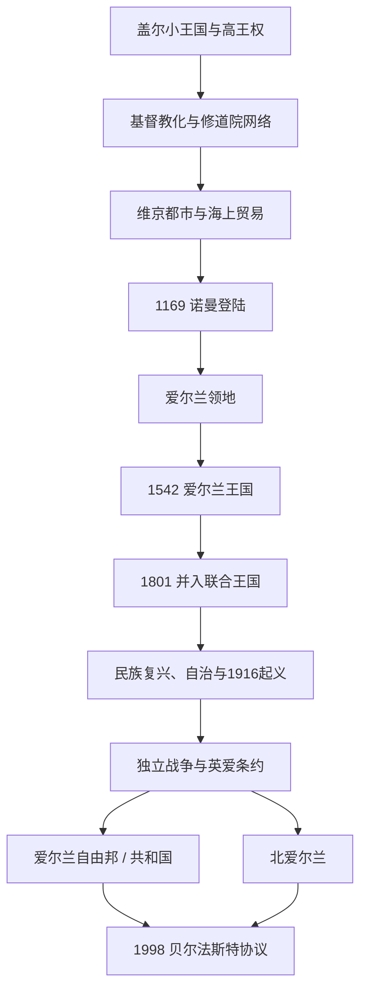

# 爱尔兰

[返回不列颠群岛](/%E4%BA%BA%E6%96%87%E7%A7%91%E5%AD%A6/%E5%8E%86%E5%8F%B2/%E6%AC%A7%E6%B4%B2/%E4%B8%8D%E5%88%97%E9%A2%A0%E7%BE%A4%E5%B2%9B/README.md)

## 历史主线

爱尔兰历史不能简化为英国的边缘支线。早期社会由亲族小王国、区域王权和名义高王构成，5世纪后基督教化与修道院网络把本地王族文化、拉丁书写和海外传教连接起来。维京都市成为贸易与王权竞争中心。1169年盎格鲁—诺曼贵族受伦斯特王邀请登陆，1171年英格兰国王介入，形成名义广阔、实际控制有限的爱尔兰领地。1542年爱尔兰王国建立，都铎再征服、土地没收、殖民与宗派战争重塑社会。1801年并入联合王国后，大饥荒、土地改革和自治运动逐步转向独立。1921—1922年分治形成爱尔兰自由邦与北爱尔兰两条现代国家主线。

## 演变图

## 时期导航

| 顺序 | 阶段 | 时间 | 入口 | 主线 |
|---:|---|---|---|---|
| 1 | 盖尔爱尔兰与早期王国 | 史前—12世纪 | [盖尔爱尔兰与早期王国](/%E4%BA%BA%E6%96%87%E7%A7%91%E5%AD%A6/%E5%8E%86%E5%8F%B2/%E6%AC%A7%E6%B4%B2/%E4%B8%8D%E5%88%97%E9%A2%A0%E7%BE%A4%E5%B2%9B/%E7%88%B1%E5%B0%94%E5%85%B0/%E7%9B%96%E5%B0%94%E7%88%B1%E5%B0%94%E5%85%B0%E4%B8%8E%E6%97%A9%E6%9C%9F%E7%8E%8B%E5%9B%BD.md) | 小王国、区域王权、高王主张、维京都市和1169年前的政治结构。 |
| 2 | 基督教化与修道院文化 | 5—12世纪 | [爱尔兰基督教化与修道院文化](/%E4%BA%BA%E6%96%87%E7%A7%91%E5%AD%A6/%E5%8E%86%E5%8F%B2/%E6%AC%A7%E6%B4%B2/%E4%B8%8D%E5%88%97%E9%A2%A0%E7%BE%A4%E5%B2%9B/%E7%88%B1%E5%B0%94%E5%85%B0/%E7%88%B1%E5%B0%94%E5%85%B0%E5%9F%BA%E7%9D%A3%E6%95%99%E5%8C%96%E4%B8%8E%E4%BF%AE%E9%81%93%E9%99%A2%E6%96%87%E5%8C%96.md) | 帕拉迪乌斯、帕特里克传统、修院、海外传教、维京冲击和教区改革。 |
| 3 | 诺曼入侵与爱尔兰领地 | 1169—1542年 | [诺曼入侵与爱尔兰领地](/%E4%BA%BA%E6%96%87%E7%A7%91%E5%AD%A6/%E5%8E%86%E5%8F%B2/%E6%AC%A7%E6%B4%B2/%E4%B8%8D%E5%88%97%E9%A2%A0%E7%BE%A4%E5%B2%9B/%E7%88%B1%E5%B0%94%E5%85%B0/%E8%AF%BA%E6%9B%BC%E5%85%A5%E4%BE%B5%E4%B8%8E%E7%88%B1%E5%B0%94%E5%85%B0%E9%A2%86%E5%9C%B0.md) | 地方求援、盎格鲁—诺曼扩张、英王宗主权、帕尔与盖尔复兴。 |
| 4 | 爱尔兰王国 | 1542—1801年 | [爱尔兰王国](/%E4%BA%BA%E6%96%87%E7%A7%91%E5%AD%A6/%E5%8E%86%E5%8F%B2/%E6%AC%A7%E6%B4%B2/%E4%B8%8D%E5%88%97%E9%A2%A0%E7%BE%A4%E5%B2%9B/%E7%88%B1%E5%B0%94%E5%85%B0/%E7%88%B1%E5%B0%94%E5%85%B0%E7%8E%8B%E5%9B%BD.md) | 再征服、殖民、三国战争、威廉战争、新教优势与1798年起义。 |
| 5 | 联合王国时期的爱尔兰 | 1801—1922年 | [联合王国时期的爱尔兰](/%E4%BA%BA%E6%96%87%E7%A7%91%E5%AD%A6/%E5%8E%86%E5%8F%B2/%E6%AC%A7%E6%B4%B2/%E4%B8%8D%E5%88%97%E9%A2%A0%E7%BE%A4%E5%B2%9B/%E7%88%B1%E5%B0%94%E5%85%B0/%E8%81%94%E5%90%88%E7%8E%8B%E5%9B%BD%E6%97%B6%E6%9C%9F%E7%9A%84%E7%88%B1%E5%B0%94%E5%85%B0.md) | 天主教解放、大饥荒、土地改革、文化复兴、自治和激进化。 |
| 6 | 爱尔兰独立与分治 | 1916—1922年 | [爱尔兰独立与分治](/%E4%BA%BA%E6%96%87%E7%A7%91%E5%AD%A6/%E5%8E%86%E5%8F%B2/%E6%AC%A7%E6%B4%B2/%E4%B8%8D%E5%88%97%E9%A2%A0%E7%BE%A4%E5%B2%9B/%E7%88%B1%E5%B0%94%E5%85%B0/%E7%88%B1%E5%B0%94%E5%85%B0%E7%8B%AC%E7%AB%8B%E4%B8%8E%E5%88%86%E6%B2%BB.md) | 起义、选举授权、游击战争、分治立法、条约与内战分裂。 |
| 7 | 爱尔兰共和国 | 1922年至今 | [爱尔兰共和国](/%E4%BA%BA%E6%96%87%E7%A7%91%E5%AD%A6/%E5%8E%86%E5%8F%B2/%E6%AC%A7%E6%B4%B2/%E4%B8%8D%E5%88%97%E9%A2%A0%E7%BE%A4%E5%B2%9B/%E7%88%B1%E5%B0%94%E5%85%B0/%E7%88%B1%E5%B0%94%E5%85%B0%E5%85%B1%E5%92%8C%E5%9B%BD.md) | 自由邦、内战、1937宪法、共和国、欧洲一体化和社会转型。 |
| 8 | 北爱尔兰 | 1921年至今 | [北爱尔兰](/%E4%BA%BA%E6%96%87%E7%A7%91%E5%AD%A6/%E5%8E%86%E5%8F%B2/%E6%AC%A7%E6%B4%B2/%E4%B8%8D%E5%88%97%E9%A2%A0%E7%BE%A4%E5%B2%9B/%E7%88%B1%E5%B0%94%E5%85%B0/%E5%8C%97%E7%88%B1%E5%B0%94%E5%85%B0.md) | 多数制自治、冲突、直接统治、和平协议和权力分享。 |

## 世系与政府首脑专表

| 专表 | 覆盖范围 | 说明 |
|---|---|---|
| [爱尔兰高王与主要王族世系表](/%E4%BA%BA%E6%96%87%E7%A7%91%E5%AD%A6/%E5%8E%86%E5%8F%B2/%E6%AC%A7%E6%B4%B2/%E4%B8%8D%E5%88%97%E9%A2%A0%E7%BE%A4%E5%B2%9B/%E7%88%B1%E5%B0%94%E5%85%B0/%E7%88%B1%E5%B0%94%E5%85%B0%E9%AB%98%E7%8E%8B%E4%B8%8E%E4%B8%BB%E8%A6%81%E7%8E%8B%E6%97%8F%E4%B8%96%E7%B3%BB%E8%A1%A8.md) | 约5世纪—1198年 | 按编年传统列高王、共治与有反对的霸主；不把高王误作统一国家君主。 |
| [北爱尔兰历任政府首脑表](/%E4%BA%BA%E6%96%87%E7%A7%91%E5%AD%A6/%E5%8E%86%E5%8F%B2/%E6%AC%A7%E6%B4%B2/%E4%B8%8D%E5%88%97%E9%A2%A0%E7%BE%A4%E5%B2%9B/%E7%88%B1%E5%B0%94%E5%85%B0/%E5%8C%97%E7%88%B1%E5%B0%94%E5%85%B0%E5%8E%86%E4%BB%BB%E6%94%BF%E5%BA%9C%E9%A6%96%E8%84%91%E8%A1%A8.md) | 1921年至今 | 完整列首相、1974年行政、直接统治期北爱事务大臣及权力分享首脑。 |

爱尔兰王国的全部共主君主直接列在[爱尔兰王国](/%E4%BA%BA%E6%96%87%E7%A7%91%E5%AD%A6/%E5%8E%86%E5%8F%B2/%E6%AC%A7%E6%B4%B2/%E4%B8%8D%E5%88%97%E9%A2%A0%E7%BE%A4%E5%B2%9B/%E7%88%B1%E5%B0%94%E5%85%B0/%E7%88%B1%E5%B0%94%E5%85%B0%E7%8E%8B%E5%9B%BD.md)；自由邦以来总统和总理直接列在[爱尔兰共和国](/%E4%BA%BA%E6%96%87%E7%A7%91%E5%AD%A6/%E5%8E%86%E5%8F%B2/%E6%AC%A7%E6%B4%B2/%E4%B8%8D%E5%88%97%E9%A2%A0%E7%BE%A4%E5%B2%9B/%E7%88%B1%E5%B0%94%E5%85%B0/%E7%88%B1%E5%B0%94%E5%85%B0%E5%85%B1%E5%92%8C%E5%9B%BD.md)。

## 重要转折

| 时间 | 转折 | 意义 |
|---|---|---|
| 431年 | 帕拉迪乌斯传教记载 | 表明帕特里克传统之前已有基督徒社群。 |
| 795年后 | 维京袭击与定居 | 修院受冲击，都柏林等港口王国兴起。 |
| 1002—1014年 | 布赖恩·博鲁高王期 | 打破乌尼尔长期优势，但未建立可世袭统一国家。 |
| 1169—1171年 | 诺曼登陆、亨利二世介入 | 地方继承战争转化为英王宗主权。 |
| 1366年 | 《基尔肯尼法令》 | 试图阻止殖民者本地化，反映文化融合。 |
| 1542年 | 爱尔兰王国 | 英王称号改变并推动全岛再征服。 |
| 1607年 | 伯爵出逃 | 阿尔斯特旧盖尔强权崩溃，殖民加速。 |
| 1641—1653年 | 起义、邦联战争与克伦威尔征服 | 大规模死亡、土地转移和宗派结构重组。 |
| 1689—1691年 | 威廉战争 | 新教优势集团的军事与政治基础确立。 |
| 1801年 | 联合法案 | 爱尔兰议会撤销，主权并入联合王国。 |
| 1845—1852年 | 大饥荒 | 疾病、贫困土地制与政策失效造成死亡和移民。 |
| 1916—1922年 | 起义、独立战争和条约 | 自由邦成立并形成六郡分治。 |
| 1937／1949年 | 新宪法／共和国法生效 | 民选总统体制与完全共和国地位确立。 |
| 1969—1998年 | 北爱冲突 | 准军事、国家力量和社群冲突持续。 |
| 1998年 | 《贝尔法斯特协议》 | 同意原则、权力分享、跨境合作和公投确认。 |

## 现代在任人物

截至2026年7月：

- 爱尔兰共和国国家元首为凯瑟琳·康诺利，总理为米歇尔·马丁。
- 北爱尔兰第一部长为米歇尔·奥尼尔，副第一部长为艾玛·利特尔—彭格利，两职权力相等。
- 英国北爱尔兰事务大臣为希拉里·本；正常下放期主要负责保留事项，而非取代北爱行政委员会。

## 范围辨析

- “爱尔兰”可指全岛、历史王国或现代爱尔兰共和国；北爱尔兰是联合王国构成地区。
- 高王称号不等于现代国家主权；1169年前不存在稳定统一的“爱尔兰王朝”。
- 1921年北爱自治、1922年自由邦成立、1937年宪法和1949年共和国法是不同转折。
- 北爱第一部长和副第一部长在法律上共同任职、权力平等，名称顺序不代表等级。
