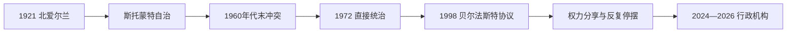

# 北爱尔兰

## 时间

1921年至今

## 演变图

## 概括

北爱尔兰由1920年《爱尔兰政府法》设立，包含阿尔斯特九郡中的六郡，并选择留在联合王国。其历史核心是联合派与爱尔兰民族派对国家归属、政治平等和安全的长期分歧。1960年代末冲突升级，1972年伦敦实施直接统治；1998年《贝尔法斯特协议》建立以同意原则、权力分享和跨境合作为基础的新框架。

## 政治阶段

| 阶段 | 权力结构 |
|---|---|
| 1921—1972年自治政府 | 英国君主为国家元首；北爱议会和首相执政，阿尔斯特统一党长期占优势。 |
| 1972—1998年直接统治为主 | 英国北爱事务大臣及威斯敏斯特掌握行政立法，期间多次尝试短期权力分享。 |
| 1998年至今权力分享 | 北爱议会按比例选举；第一部长与副第一部长共同领导，职位在法律上权力相等。 |

### 自治政府首脑

| 首相 / 第一部长 | 任期或阶段 |
|---|---|
| 詹姆斯·克雷格 | 1921—1940 |
| 约翰·米勒·安德鲁斯 | 1940—1943 |
| 巴兹尔·布鲁克 | 1943—1963 |
| 特伦斯·奥尼尔 | 1963—1969 |
| 詹姆斯·奇切斯特-克拉克 | 1969—1971 |
| 布赖恩·福克纳 | 1971—1972；1974年短期权力分享行政长官 |
| 戴维·特林布尔 | 1998—2002间主要任职 |
| 伊恩·佩斯利 | 2007—2008 |
| 彼得·罗宾逊 | 2008—2016 |
| 阿琳·福斯特 | 2016—2017、2020—2021 |
| 保罗·吉文 | 2021—2022 |
| **米歇尔·奥尼尔** | 2024年至今（2026年7月在任） |

2024年以来艾玛·利特尔-彭格利任副第一部长。两职必须联合履职，名称先后不表示等级高低。

完整首相、1974年权力分享行政、直接统治期北爱尔兰事务大臣及1998年后联合首脑见[北爱尔兰历任政府首脑表](/%E4%BA%BA%E6%96%87%E7%A7%91%E5%AD%A6/%E5%8E%86%E5%8F%B2/%E6%AC%A7%E6%B4%B2/%E4%B8%8D%E5%88%97%E9%A2%A0%E7%BE%A4%E5%B2%9B/%E7%88%B1%E5%B0%94%E5%85%B0/%E5%8C%97%E7%88%B1%E5%B0%94%E5%85%B0%E5%8E%86%E4%BB%BB%E6%94%BF%E5%BA%9C%E9%A6%96%E8%84%91%E8%A1%A8.md)。

## 冲突形成与发展

- 建国初期，选区、住房、就业和地方行政长期有利于联合派与新教人口；天主教民族派对国家合法性和歧视问题不满。
- 1960年代民权运动要求平等选举、住房和就业。游行遭暴力、警察失去信任，英国军队1969年进驻。
- 临时爱尔兰共和军、效忠派准军事组织和国家安全力量卷入持续暴力；1972年“血腥星期日”和议会被撤销成为关键转折。
- 1985年《英爱协议》给予爱尔兰政府协商角色；1994年主要组织停火，为多方谈判创造条件。
- 1998年协议确认：北爱归属只能经多数同意改变；建立权力分享议会、南北部长理事会及英爱合作机构。
- 警务改革、解除武装和司法安排逐步落实，但行政机构因党派争议多次暂停。
- 英国脱欧造成边境和贸易安排新争议；协议的开放边界与全岛经济联系仍是和平秩序的重要条件。

## 冲突缓和的条件与持续压力

和平并非单一军事胜负，而来自长期战争疲惫、英国与爱尔兰政府合作、美国斡旋、政党授权和“同意原则”结合。权力分享把两种国家认同同时纳入制度，却容易因否决机制和互不信任停摆。教育居住分隔、历史记忆、准军事残余与英国—欧盟关系仍构成压力。

## 演变关系

- 形成过程：[爱尔兰独立与分治](/%E4%BA%BA%E6%96%87%E7%A7%91%E5%AD%A6/%E5%8E%86%E5%8F%B2/%E6%AC%A7%E6%B4%B2/%E4%B8%8D%E5%88%97%E9%A2%A0%E7%BE%A4%E5%B2%9B/%E7%88%B1%E5%B0%94%E5%85%B0/%E7%88%B1%E5%B0%94%E5%85%B0%E7%8B%AC%E7%AB%8B%E4%B8%8E%E5%88%86%E6%B2%BB.md)
- 并行分支：[爱尔兰共和国](/%E4%BA%BA%E6%96%87%E7%A7%91%E5%AD%A6/%E5%8E%86%E5%8F%B2/%E6%AC%A7%E6%B4%B2/%E4%B8%8D%E5%88%97%E9%A2%A0%E7%BE%A4%E5%B2%9B/%E7%88%B1%E5%B0%94%E5%85%B0/%E7%88%B1%E5%B0%94%E5%85%B0%E5%85%B1%E5%92%8C%E5%9B%BD.md)
- 联合国家主线：[联合王国](/%E4%BA%BA%E6%96%87%E7%A7%91%E5%AD%A6/%E5%8E%86%E5%8F%B2/%E6%AC%A7%E6%B4%B2/%E4%B8%8D%E5%88%97%E9%A2%A0%E7%BE%A4%E5%B2%9B/%E8%81%94%E5%90%88%E7%8E%8B%E5%9B%BD/README.md)
- 所属总览：[爱尔兰](/%E4%BA%BA%E6%96%87%E7%A7%91%E5%AD%A6/%E5%8E%86%E5%8F%B2/%E6%AC%A7%E6%B4%B2/%E4%B8%8D%E5%88%97%E9%A2%A0%E7%BE%A4%E5%B2%9B/%E7%88%B1%E5%B0%94%E5%85%B0/README.md)
