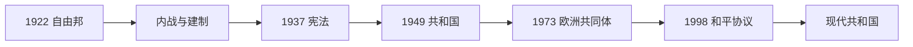

# 爱尔兰共和国

## 时间

1922年至今

## 演变图

## 概括

1922年成立的爱尔兰自由邦最初是英联邦自治领，经过1931年法理自主、1937年新宪法和1949年共和国法生效，逐步成为完全独立的议会共和国。国家从内战、保护主义和人口外流，转向欧洲一体化、出口经济和社会世俗化，同时继续以和平方式处理北爱尔兰与全岛关系。

## 国家形成与发展

- 1922—1923年内战以支持条约的自由邦政府获胜结束；政府建立军队、警察、法院和文官体系。
- 1932年德瓦莱拉执政后废除效忠誓言、削弱总督，并在1937年宪法中设立民选总统、总理和两院议会。
- 第二次世界大战期间保持中立，官方称“紧急状态”；战后1948年《爱尔兰共和国法》于1949年生效，结束与英王的剩余对外关系。
- 1950年代经济停滞和移民促使政策转向。莱马斯政府推动工业开放，1973年加入欧洲经济共同体。
- 1980年代财政与失业危机后，外资、教育、欧洲市场和社会伙伴关系推动“凯尔特之虎”；2008年金融危机暴露房地产和银行风险。
- 1998年《贝尔法斯特协议》经公投确认：宪法领土主张改为以北爱多数同意为统一前提。
- 21世纪公投使同性婚姻合法化并废除严格堕胎禁令，体现天主教会社会权威下降。

## 国家元首

### 自由邦与1936—1949年过渡

| 国家元首层面 | 任期 | 宪制位置 |
|---|---|---|
| 乔治五世 | 1922—1936 | 爱尔兰自由邦国王，通常由总督代表，权力依自由邦大臣建议行使。 |
| 爱德华八世 | 1936年1月—12月 | 退位需自由邦以法律确认，显示自治领王冠已具有本国宪制层面。 |
| 乔治六世 | 1936—1949年对外关系安排 | 1936年后王室主要保留外交认证功能；1937年宪法另设总统，1937—1949年国家元首法律性质曾有争论。 |

| 总督 | 任期 | 说明 |
|---|---|---|
| 蒂莫西·迈克尔·希利 | 1922—1928 | 首任爱尔兰自由邦总督。 |
| 詹姆斯·麦克尼尔 | 1928—1932 | 与德瓦莱拉政府冲突后提前离任。 |
| 多姆纳尔·乌阿·布阿哈拉 | 1932—1936 | 最后一任；职位被1936年立法取消。 |

### 1937年宪法后的总统

1937年宪法设民选总统；1949年共和国法生效后，王室剩余对外职能终止。历任总统如下：

| 顺序 | 总统 | 任期 |
|---:|---|---|
| 1 | 道格拉斯·海德 | 1938—1945 |
| 2 | 肖恩·奥凯利 | 1945—1959 |
| 3 | 埃蒙·德瓦莱拉 | 1959—1973 |
| 4 | 厄斯金·奇尔德斯 | 1973—1974 |
| 5 | 卡哈尔·奥道利 | 1974—1976 |
| 6 | 帕特里克·希勒里 | 1976—1990 |
| 7 | 玛丽·罗宾逊 | 1990—1997 |
| 8 | 玛丽·麦卡利斯 | 1997—2011 |
| 9 | 迈克尔·希金斯 | 2011—2025 |
| 10 | **凯瑟琳·康诺利** | 2025年至今（2026年7月在任） |

总统由全民直选，主要履行宪法和礼仪职能；在审查法案、任命总理等事项上按宪法行使有限但重要的权力。

## 政府首脑

| 总理 / 行政委员会主席 | 任期 |
|---|---|
| 威廉·托马斯·科斯格雷夫 | 1922—1932 |
| 埃蒙·德瓦莱拉 | 1932—1948、1951—1954、1957—1959 |
| 约翰·科斯特洛 | 1948—1951、1954—1957 |
| 肖恩·莱马斯 | 1959—1966 |
| 杰克·林奇 | 1966—1973、1977—1979 |
| 利亚姆·科斯格雷夫 | 1973—1977 |
| 查尔斯·豪伊 | 1979—1981、1982、1987—1992 |
| 加勒特·菲茨杰拉德 | 1981—1982、1982—1987 |
| 艾伯特·雷诺兹 | 1992—1994 |
| 约翰·布鲁顿 | 1994—1997 |
| 伯蒂·埃亨 | 1997—2008 |
| 布赖恩·考恩 | 2008—2011 |
| 恩达·肯尼 | 2011—2017 |
| 利奥·瓦拉德卡 | 2017—2020、2022—2024 |
| 米歇尔·马丁 | 2020—2022、2025年至今 |
| 西蒙·哈里斯 | 2024—2025 |

## 实际权力结构

众议院多数支持的总理领导内阁，是实际行政核心；参议院具有审议和延缓功能。比例代表制使联合政府常见，地方政府权限相对有限。法院依据成文宪法进行审查；欧盟法、欧洲共同货币和跨境机构也是现代治理的重要层面。

## 演变关系

- 建国过程：[爱尔兰独立与分治](/%E4%BA%BA%E6%96%87%E7%A7%91%E5%AD%A6/%E5%8E%86%E5%8F%B2/%E6%AC%A7%E6%B4%B2/%E4%B8%8D%E5%88%97%E9%A2%A0%E7%BE%A4%E5%B2%9B/%E7%88%B1%E5%B0%94%E5%85%B0/%E7%88%B1%E5%B0%94%E5%85%B0%E7%8B%AC%E7%AB%8B%E4%B8%8E%E5%88%86%E6%B2%BB.md)
- 并行分支：[北爱尔兰](/%E4%BA%BA%E6%96%87%E7%A7%91%E5%AD%A6/%E5%8E%86%E5%8F%B2/%E6%AC%A7%E6%B4%B2/%E4%B8%8D%E5%88%97%E9%A2%A0%E7%BE%A4%E5%B2%9B/%E7%88%B1%E5%B0%94%E5%85%B0/%E5%8C%97%E7%88%B1%E5%B0%94%E5%85%B0.md)
- 所属总览：[爱尔兰](/%E4%BA%BA%E6%96%87%E7%A7%91%E5%AD%A6/%E5%8E%86%E5%8F%B2/%E6%AC%A7%E6%B4%B2/%E4%B8%8D%E5%88%97%E9%A2%A0%E7%BE%A4%E5%B2%9B/%E7%88%B1%E5%B0%94%E5%85%B0/README.md)
