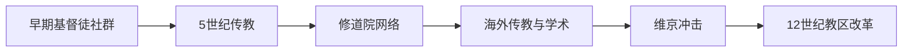

# 爱尔兰基督教化与修道院文化

## 时间

5世纪—12世纪

## 演变图

## 概括

爱尔兰基督教化是一个由外来传教士、本地王族支持和修道院网络共同推动的长期过程，并非由某一人在某一年一次完成。帕拉迪乌斯、帕特里克及许多地方圣徒传统反映5世纪已有基督徒社群；6世纪以后修道院成为宗教、教育、手工业与政治中心，爱尔兰教士又将拉丁学术和修道制度带往不列颠与欧洲大陆。

## 传播过程

- **早期社群。** 罗马不列颠、两地贸易和奴隶迁徙可能在正式传教前已将基督教带入爱尔兰。431年教宗策肋定一世派帕拉迪乌斯前往“信奉基督的爱尔兰人”，说明当地已有信徒。
- **帕特里克传统。** 帕特里克的活动一般置于5世纪；其自述强调传教、施洗和与地方权力交涉。后世阿马教会将他塑造成全岛主保圣人，但历史过程还包括布里吉德、科伦巴等众多人物。
- **修道院扩张。** 克朗麦克诺伊斯、克朗纳德、班戈、基尔代尔等中心依靠王族赞助、土地和附属教会形成联盟。院长有时比地域主教更具实际影响。
- **海外传教。** 科伦巴563年建立爱奥那修道院，推动苏格兰和诺森布里亚传教；哥伦巴努斯等人在高卢、意大利建立修院。
- **制度调整。** 7世纪关于复活节日期和剃发形式的分歧逐步消退；12世纪改革会议建立更明确的教区、总主教区和罗马式组织。

## 修道院的社会功能

| 功能 | 具体表现 |
|---|---|
| 学术与书写 | 抄写拉丁经典、圣经和本地语言材料，发展岛屿体书法与彩饰手抄本。 |
| 教育 | 培养教士、抄写员、诗人和部分世俗精英。 |
| 经济 | 管理土地、牲畜、工坊和市场，也是长途交通节点。 |
| 政治 | 接受王族保护，保存谱系与合法性叙事，并参与王族竞争。 |
| 艺术 | 高十字架、金属工艺和《凯尔经》等体现本地、基督教与跨海风格融合。 |

## 重要事件与冲击

- 563年爱奥那修道院建立，成为北大西洋传教中心。
- 664年惠特比宗教会议后，诺森布里亚采用罗马复活节计算，显示爱尔兰传统与西欧教会逐渐协调。
- 795年后维京人袭击富裕修院；部分修院衰落，另一些发展为设防聚落或与港口经济结合。
- 9—10世纪出现圆塔、圣物匣和更集中的修院领地管理，以应对战争和掠夺。
- 12世纪拉斯布雷赛尔、凯尔斯等会议重组教区；诺曼进入后，欧洲大陆修会和教会法进一步改变组织。

## 延续与转型

所谓“凯尔特教会”不应被理解成脱离罗马的独立教派；差异主要在组织习惯和礼仪计算。其活力来自亲族社会中的本地赞助、拉丁文化的稀缺价值及爱尔兰海交通网络。维京袭击、修院世俗化和12世纪教区改革改变了旧结构，但修道文化保存的语言、艺术与学术传统长期塑造爱尔兰身份。

## 演变关系

- 社会背景：[盖尔爱尔兰与早期王国](/%E4%BA%BA%E6%96%87%E7%A7%91%E5%AD%A6/%E5%8E%86%E5%8F%B2/%E6%AC%A7%E6%B4%B2/%E4%B8%8D%E5%88%97%E9%A2%A0%E7%BE%A4%E5%B2%9B/%E7%88%B1%E5%B0%94%E5%85%B0/%E7%9B%96%E5%B0%94%E7%88%B1%E5%B0%94%E5%85%B0%E4%B8%8E%E6%97%A9%E6%9C%9F%E7%8E%8B%E5%9B%BD.md)
- 后续政治阶段：[诺曼入侵与爱尔兰领地](/%E4%BA%BA%E6%96%87%E7%A7%91%E5%AD%A6/%E5%8E%86%E5%8F%B2/%E6%AC%A7%E6%B4%B2/%E4%B8%8D%E5%88%97%E9%A2%A0%E7%BE%A4%E5%B2%9B/%E7%88%B1%E5%B0%94%E5%85%B0/%E8%AF%BA%E6%9B%BC%E5%85%A5%E4%BE%B5%E4%B8%8E%E7%88%B1%E5%B0%94%E5%85%B0%E9%A2%86%E5%9C%B0.md)
- 所属总览：[爱尔兰](/%E4%BA%BA%E6%96%87%E7%A7%91%E5%AD%A6/%E5%8E%86%E5%8F%B2/%E6%AC%A7%E6%B4%B2/%E4%B8%8D%E5%88%97%E9%A2%A0%E7%BE%A4%E5%B2%9B/%E7%88%B1%E5%B0%94%E5%85%B0/README.md)
