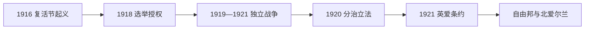

# 爱尔兰独立与分治

## 时间

1916年—1922年

## 演变图

## 概括

爱尔兰独立与分治不是单一条约的结果，而是复活节起义、选举授权、独立战争、英国分治立法、停火谈判和内战前夜连续作用的结果。南部26郡形成爱尔兰自由邦，东北6郡组成的北爱尔兰选择留在联合王国；条约中的王室效忠与自治领地位又使民族运动内部发生决裂。

## 主要参与者

| 阵营 / 机构 | 代表 | 目标与角色 |
|---|---|---|
| 爱尔兰共和国派 | 新芬党、爱尔兰志愿军 / 爱尔兰共和军 | 建立全岛独立共和国。 |
| 英国政府 | 首相劳合·乔治、驻爱行政和军警 | 维持主权，后寻求自治领和分治方案。 |
| 阿尔斯特联合派 | 詹姆斯·克雷格等 | 保持与联合王国联系并建立北爱自治政府。 |
| 条约支持派 | 迈克尔·柯林斯、阿瑟·格里菲思等 | 接受自治领作为可立即实现的国家框架。 |
| 条约反对派 | 埃蒙·德瓦莱拉、利亚姆·林奇等 | 反对效忠誓言、王室地位和分治安排。 |

## 过程与转折

1. **复活节起义。** 1916年起义者在都柏林宣布共和国，六天后投降。英国处决领导人和大规模拘捕使公众同情转向激进民族主义。
2. **选举与另组国家。** 1918年新芬党赢得爱尔兰大多数席位；当选议员于1919年成立第一届爱尔兰议会，宣布独立并组建平行法院和行政。
3. **独立战争。** 爱尔兰共和军游击队袭击警察与情报体系；英国增派“黑棕部队”等辅助力量。双方报复、暗杀和焚毁使冲突升级。
4. **分治成形。** 1920年《爱尔兰政府法》分别设立南、北两个自治议会。北爱尔兰议会于1921年运作，南爱机构缺乏民族主义者承认。
5. **停火与条约。** 1921年7月停火；12月《英爱条约》承认自由邦为帝国内自治领，议员须宣誓，英国保留若干港口；北爱可退出自由邦。
6. **批准与分裂。** 爱尔兰议会以64票对57票批准条约。北爱随即选择退出；自由邦临时政府建立，反条约力量占据部分军营，冲突在1922年演为内战。

## 为什么形成分治

阿尔斯特东北部的新教联合派拥有工业、组织和英国保守党支持，拒绝受天主教占多数的都柏林议会统治；全岛自治因此被英国政府拆分。独立战争迫使英国放弃直接统治大部分爱尔兰，却未击败北方联合派。边界委员会后来只作有限调整，临时六郡边界遂成为长期国界。

## 结果与长期影响

自由邦获得军队、财政和外交发展的制度基础，后逐步走向共和国；北爱形成联合派长期执政结构。条约争议引发1922—1923年内战，并塑造自由党与共和党两大政治传统。分治还把民族、宗教和国家认同问题留给北爱尔兰，成为20世纪后半叶冲突的历史根源。

## 演变关系

- 前一阶段：[联合王国时期的爱尔兰](/%E4%BA%BA%E6%96%87%E7%A7%91%E5%AD%A6/%E5%8E%86%E5%8F%B2/%E6%AC%A7%E6%B4%B2/%E4%B8%8D%E5%88%97%E9%A2%A0%E7%BE%A4%E5%B2%9B/%E7%88%B1%E5%B0%94%E5%85%B0/%E8%81%94%E5%90%88%E7%8E%8B%E5%9B%BD%E6%97%B6%E6%9C%9F%E7%9A%84%E7%88%B1%E5%B0%94%E5%85%B0.md)
- 后续分支：[爱尔兰共和国](/%E4%BA%BA%E6%96%87%E7%A7%91%E5%AD%A6/%E5%8E%86%E5%8F%B2/%E6%AC%A7%E6%B4%B2/%E4%B8%8D%E5%88%97%E9%A2%A0%E7%BE%A4%E5%B2%9B/%E7%88%B1%E5%B0%94%E5%85%B0/%E7%88%B1%E5%B0%94%E5%85%B0%E5%85%B1%E5%92%8C%E5%9B%BD.md)
- 后续分支：[北爱尔兰](/%E4%BA%BA%E6%96%87%E7%A7%91%E5%AD%A6/%E5%8E%86%E5%8F%B2/%E6%AC%A7%E6%B4%B2/%E4%B8%8D%E5%88%97%E9%A2%A0%E7%BE%A4%E5%B2%9B/%E7%88%B1%E5%B0%94%E5%85%B0/%E5%8C%97%E7%88%B1%E5%B0%94%E5%85%B0.md)
- 所属总览：[爱尔兰](/%E4%BA%BA%E6%96%87%E7%A7%91%E5%AD%A6/%E5%8E%86%E5%8F%B2/%E6%AC%A7%E6%B4%B2/%E4%B8%8D%E5%88%97%E9%A2%A0%E7%BE%A4%E5%B2%9B/%E7%88%B1%E5%B0%94%E5%85%B0/README.md)
