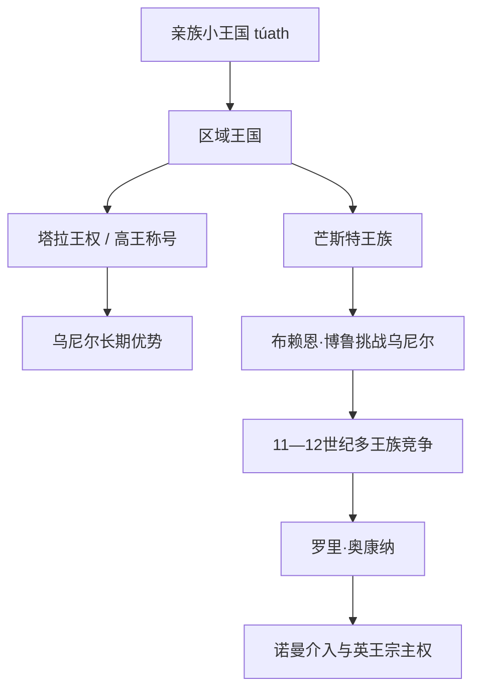

# 爱尔兰高王与主要王族世系表

## 口径说明

“爱尔兰高王”（Ard rí Érenn）在中世纪大多是宗主权主张，不是具有统一官僚、固定首都和稳定继承制度的全岛王位。早期名单由后世编年史与谱系学者整理，常把塔拉王、乌尼尔霸主和传说人物统一称为高王；实际可能同时有多个强王拒绝服从。因此本表列出编年传统中自5世纪后期至12世纪末的主要高王或有实质全岛宗主权主张者，并明确共治、反对者和争议，不把他们误写成现代意义的连续国家元首。

## 王权演变图

## 传统高王序列：约5世纪至846年

下表年代均为约数。5—7世纪人物的“高王”称号常为后见之明，不能据此推断他们实际统治全岛。

| 顺序 | 高王 / 塔拉王 | 约在位 | 王族 / 继承 | 备注 |
|---:|---|---|---|---|
| 1 | Niall Noígíallach（九人质尼尔） | 约5世纪中叶 | 乌尼尔传统祖先 | 历史人物与传说重叠，具体年代和征服事迹有争议。 |
| 2 | Lóegaire mac Néill | 约5世纪后半 | 尼尔之子 | 与圣帕特里克传说相连，宗教叙述晚出。 |
| 3 | Ailill Molt | 约482年前后 | 康诺特乌伊·菲亚赫拉赫 | 少数非乌尼尔早期塔拉王，年代不稳。 |
| 4 | Lugaid mac Lóegairi | 约482—507 | 洛加雷之子 | 史实与王表传统交织。 |
| 5 | Muirchertach mac Muiredaig | 约507—534 | 北乌尼尔 | 编年传统中的强王。 |
| 6 | Túathal Máelgarb | 约534—544 | 南乌尼尔 | 据称被继承人阵营刺杀。 |
| 7 | Diarmait mac Cerbaill | 约544—565 | 南乌尼尔 | 6世纪重要塔拉王，涉及教会和王权叙事。 |
| 8 | Domnall 与 Forggus mac Muirchertaig | 约565—566 | 北乌尼尔兄弟 | 共治，任期短。 |
| 9 | Ainmuire mac Sétnai | 约566—569 | 北乌尼尔 | 与达尔里阿达、教会网络相关。 |
| 10 | Báetán mac Ninneda | 约569—572 | 北乌尼尔 | 在位与共主关系存在争议。 |
| 11 | Báetán mac Muirchertaig 与 Eochaid mac Domnaill | 约572 | 北乌尼尔 | 可能短期共治；王表次序不一。 |
| 12 | Áed mac Ainmuirech | 约572—598 | 北乌尼尔 | 575年德鲁姆凯特会议传统与其相连。 |
| 13 | Áed Sláine 与 Colmán Rímid | 598—604 | 南、北乌尼尔 | 两支共治或并立，均死于暴力。 |
| 14 | Áed Uaridnach | 604—612 | 北乌尼尔 | 高王权仍以贡赋和联盟为主。 |
| 15 | Máel Coba mac Áedo | 612—615 | 北乌尼尔 | 战败身亡。 |
| 16 | Súibne Menn | 615—628 | 北乌尼尔 | 并非前王直系，显示王族内部择立。 |
| 17 | Domnall mac Áedo | 628—642 | 北乌尼尔 | 7世纪较强统治者。 |
| 18 | Cellach 与 Conall Cóel | 642—654 | 多姆纳尔之子 | 共治，先后死亡。 |
| 19 | Diarmait 与 Blathmac mac Áedo Sláine | 约658—665 | 南乌尼尔兄弟 | 共治；664—665年瘟疫冲击王族。 |
| 20 | Sechnassach | 665—671 | 布拉特马克之子 | 遇刺。 |
| 21 | Cenn Fáelad | 671—675 | 迪尔马特之子 | 被竞争者杀死。 |
| 22 | Fínsnechta Fledach | 675—695 | 南乌尼尔 | 一度退位入修院后复出，后遇害。 |
| 23 | Loingsech mac Óengusso | 695—704 | 北乌尼尔 | 进攻康诺特时战死。 |
| 24 | Congal Cennmagair | 704—710 | 北乌尼尔 | 王表承认为继承者。 |
| 25 | Fergal mac Máele Dúin | 710—722 | 北乌尼尔 | 722年阿伦战役战死。 |
| 26 | Fogartach mac Néill | 722—724 | 南乌尼尔 | 被基纳德击败身亡。 |
| 27 | Cináed mac Írgalaig | 724—728 | 南乌尼尔 | 杀前王夺位，后战死。 |
| 28 | Flaithbertach mac Loingsig | 728—734 | 北乌尼尔 | 退位进入修院；实际霸权受芒斯特挑战。 |
| 29 | Áed Allán | 734—743 | 北乌尼尔 | 743年战败身亡。 |
| 30 | Domnall Midi | 743—763 | 南乌尼尔 | 米德王权加强。 |
| 31 | Niall Frossach | 763—778 | 北乌尼尔 | 退位或失势，后死于爱奥那。 |
| 32 | Donnchad Midi | 778—797 | 南乌尼尔 | 扩大对伦斯特与教会的压力。 |
| 33 | Áed Oirdnide | 797—819 | 北乌尼尔 | 与康诺特、伦斯特战争。 |
| 34 | Conchobar mac Donnchada | 819—833 | 南乌尼尔 | 多恩哈德之子。 |
| 35 | Niall Caille | 833—846 | 北乌尼尔 | 抗击维京并与其他王国战争，溺亡。 |

## 较可考的高王与全岛霸主：846—1198年

9世纪中叶以后编年记录更密集，但“无反对的高王”仍很少。1002年以前北、南乌尼尔交替；布赖恩打破这一惯例，随后芒斯特、伦斯特、北乌尼尔和康诺特王族竞争。

| 顺序 | 统治者 | 高王 / 霸主期 | 王族与继承关系 | 权力范围与备注 |
|---:|---|---|---|---|
| 36 | **Máel Sechnaill mac Máele Ruanaid** | 846—862 | 南乌尼尔 | 858年迫使芒斯特服从；对维京都柏林作战。 |
| 37 | Áed Findliath | 862—879 | 北乌尼尔 | 与维京势力既战又盟，通过婚姻连接地区王权。 |
| 38 | Flann Sinna | 879—916 | 南乌尼尔，前王继子 | 长期统治，以教会纪念建筑与对地方王征战著称。 |
| 39 | Niall Glúndub | 916—919 | 北乌尼尔 | 919年对都柏林维京军作战身亡。 |
| 40 | Donnchad Donn | 919—944 | 南乌尼尔 | 控制力有限，多次处置竞争亲族。 |
| 41 | Congalach Cnogba | 944—956 | 南乌尼尔 / 锡尔纳埃多·斯莱内支 | 对都柏林作战时遇伏身亡。 |
| 42 | Domnall ua Néill | 956—980 | 北乌尼尔 | 退位入修院，乌尼尔交替传统延续。 |
| 43 | **Máel Sechnaill mac Domnaill** | 980—1002；1014—1022 | 南乌尼尔 | 980年塔拉战胜都柏林；1002年让位于布赖恩，后在布赖恩死后复位。 |
| 44 | **Brian Bóruma（布赖恩·博鲁）** | 1002—1014 | 达尔卡西 / 芒斯特 | 打破乌尼尔垄断；通过贡赋、舰队与联盟取得霸权，1014年克朗塔夫战后遇害。 |
| 45 | Donnchad mac Briain | 1022—1064间主张 | 布赖恩之子 | 控制芒斯特，未获全岛普遍承认；与兄弟、乌尼尔和伦斯特竞争。 |
| 46 | Diarmait mac Máel na mBó | 约1063—1072 | 伦斯特乌伊·肯塞拉赫 | 控制都柏林并影响海峡彼岸；常列“有反对的高王”。 |
| 47 | Toirdelbach Ua Briain | 1072—1086 | 达尔卡西，布赖恩孙 | 借伦斯特强王死亡扩张，分割对手王国以维持霸权。 |
| 并立 | Muirchertach Ua Briain | 1086—1119 | 达尔卡西 | 控制芒斯特和都柏林，国际联系广；与北方多姆纳尔长期争霸。 |
| 并立 | Domnall Ua Lochlainn | 1086—1121 | 北乌尼尔 | 北方强王，多次击退南方远征；两人都未统一全岛。 |
| 48 | **Toirdelbach Ua Conchobair** | 1119—1156 | 康诺特乌伊·布里乌因 | 通过修路、建桥、分割芒斯特与米德扩大权力，未建立稳定继承。 |
| 49 | Muirchertach Mac Lochlainn | 1156—1166 | 北乌尼尔 | 一度压服多国，因残酷对待盟友失去支持，被杀。 |
| 50 | **Ruaidrí Ua Conchobair（罗里·奥康纳）** | 1166—约1183；1198年去世 | 康诺特王、托尔德尔巴赫之子 | 常称最后一位本土高王；1175年《温莎条约》承认其在英王直接区外的宗主地位，实际迅速瓦解。 |

## 主要王族与区域王统

| 王族 / 政权 | 核心地区 | 世系作用 |
|---|---|---|
| 北乌尼尔 | 今多尼戈尔、阿尔斯特西部 | 主要支系包括塞内尔·科奈尔、塞内尔·尼尔；与南乌尼尔长期交替高王。 |
| 南乌尼尔 | 米德与布雷加 | 克兰·霍尔曼、锡尔纳埃多·斯莱内等支系控制塔拉周边和中部贡赋。 |
| 达尔卡西 / 奥布赖恩 | 托蒙德、芒斯特 | 布赖恩·博鲁打破埃奥加纳赫王族在芒斯特与乌尼尔在高王位的优势。 |
| 埃奥加纳赫 | 芒斯特 | 早期芒斯特主要王族，10世纪后被达尔卡西挑战，仍保有地方支系。 |
| 乌伊·肯塞拉赫 / 麦克默罗 | 伦斯特 | 迪尔马特·麦克穆罗被逐后求助盎格鲁—诺曼人，成为1169年介入的直接原因。 |
| 乌伊·布里乌因 / 奥康纳 | 康诺特 | 12世纪托尔德尔巴赫、罗里把康诺特王权推至全岛竞争中心。 |
| 都柏林诺斯—盖尔王国 | 都柏林及爱尔兰海 | 维京后裔王室参与贸易、战争与婚姻，不是单纯“外国占领区”。 |

## 高王权未转化为统一王朝的原因

- 王位在王族合资格成员间择立，兄弟、叔侄和堂支都有继承资格，强王死后联盟容易分裂。
- 高王权以人质、贡赋、军役和承认构成，没有覆盖全岛的常设官僚和统一司法。
- 区域王国拥有自己的合法谱系、教会网络和附属小国，不愿永久接受外来王朝。
- 维京都市带来财富和舰队，成为各王族争夺的资源，而非自动推动统一。
- 1166年伦斯特王迪尔穆德被逐后引入海外骑士，地方继承战遂与诺曼扩张及英格兰王权结合。1171年亨利二世介入后，罗里高王权与英王宗主权并存，原有竞争体系失去全岛整合机会。

## 相关笔记

- 社会与王国结构：[盖尔爱尔兰与早期王国](/%E4%BA%BA%E6%96%87%E7%A7%91%E5%AD%A6/%E5%8E%86%E5%8F%B2/%E6%AC%A7%E6%B4%B2/%E4%B8%8D%E5%88%97%E9%A2%A0%E7%BE%A4%E5%B2%9B/%E7%88%B1%E5%B0%94%E5%85%B0/%E7%9B%96%E5%B0%94%E7%88%B1%E5%B0%94%E5%85%B0%E4%B8%8E%E6%97%A9%E6%9C%9F%E7%8E%8B%E5%9B%BD.md)。
- 宗教与书写背景：[爱尔兰基督教化与修道院文化](/%E4%BA%BA%E6%96%87%E7%A7%91%E5%AD%A6/%E5%8E%86%E5%8F%B2/%E6%AC%A7%E6%B4%B2/%E4%B8%8D%E5%88%97%E9%A2%A0%E7%BE%A4%E5%B2%9B/%E7%88%B1%E5%B0%94%E5%85%B0/%E7%88%B1%E5%B0%94%E5%85%B0%E5%9F%BA%E7%9D%A3%E6%95%99%E5%8C%96%E4%B8%8E%E4%BF%AE%E9%81%93%E9%99%A2%E6%96%87%E5%8C%96.md)。
- 后续转折：[诺曼入侵与爱尔兰领地](/%E4%BA%BA%E6%96%87%E7%A7%91%E5%AD%A6/%E5%8E%86%E5%8F%B2/%E6%AC%A7%E6%B4%B2/%E4%B8%8D%E5%88%97%E9%A2%A0%E7%BE%A4%E5%B2%9B/%E7%88%B1%E5%B0%94%E5%85%B0/%E8%AF%BA%E6%9B%BC%E5%85%A5%E4%BE%B5%E4%B8%8E%E7%88%B1%E5%B0%94%E5%85%B0%E9%A2%86%E5%9C%B0.md)。
- 目录入口：[爱尔兰](/%E4%BA%BA%E6%96%87%E7%A7%91%E5%AD%A6/%E5%8E%86%E5%8F%B2/%E6%AC%A7%E6%B4%B2/%E4%B8%8D%E5%88%97%E9%A2%A0%E7%BE%A4%E5%B2%9B/%E7%88%B1%E5%B0%94%E5%85%B0/README.md)。
