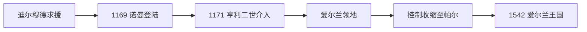

# 诺曼入侵与爱尔兰领地

## 时间

1169年—1542年

## 演变图

## 概括

1169年登陆爱尔兰的主要是来自威尔士边区的盎格鲁—诺曼贵族。他们最初受被逐的伦斯特国王迪尔穆德·麦克默罗邀请，随后建立自己的领地。英格兰国王亨利二世为防止其形成独立王国，于1171年亲征并确立宗主权，爱尔兰由此成为英王名下的“爱尔兰领地”。但实际控制长期局限于都柏林周围和若干城镇、领主区。

## 入侵与扩张

- 1169年罗伯特·菲茨斯蒂芬等人在韦克斯福德登陆；1170年“强弓”理查·德克莱尔到达并取得伦斯特继承地位。
- 1171—1172年亨利二世进入爱尔兰，接受多方效忠，并以王权压制边区贵族自行建国。
- 1177年牛津会议后，英王幼子约翰被指定为“爱尔兰领主”；约翰1199年成为英格兰国王后，该领地与英格兰王冠长期结合。
- 13世纪盎格鲁—诺曼领主、修会和城镇网络向南部、东部扩展，引入封建领地、郡制、英格兰普通法与大陆修会。
- 14—15世纪英王受英法战争和内战牵制，本地大贵族与盖尔王族复兴，王室直辖区收缩为都柏林周围的“帕尔”。

## 统治结构

| 层级 | 角色 |
|---|---|
| 英格兰国王 / 爱尔兰领主 | 名义最高领主，王权与英格兰王位相连。 |
| 总督或代理总督 | 代表英王主持行政、战争和议会。 |
| 盎格鲁—爱尔兰大贵族 | 基尔代尔、奥蒙德、德斯蒙德等伯爵家族掌握大片领地。 |
| 爱尔兰议会与法庭 | 主要服务英王控制区及殖民贵族，其适用范围随实际控制变化。 |
| 盖尔王国与诺曼化领主 | 在王室直辖区外保有本地法律、贡赋和军事体系。 |

## 重要事件

- 1315—1318年苏格兰的爱德华·布鲁斯入侵并自称爱尔兰高王，战败后英王名义得以维持，却加剧社会破坏。
- 1366年《基尔肯尼法令》试图禁止殖民者采用爱尔兰语言、服饰和婚姻，恰恰说明两种社会长期融合。
- 黑死病严重冲击港口和殖民城镇，使部分乡村领地收缩。
- 15世纪基尔代尔伯爵长期担任王室代理，体现“地方大贵族代治”。
- 1534—1535年“丝绸托马斯”叛乱失败后，亨利八世结束对基尔代尔家族的依赖，转向直接征服全岛。

## 扩张停滞与转型原因

王室财政投入有限、地形与交通困难、盖尔王权韧性以及盎格鲁—诺曼贵族本地化，使名义主权远大于实际管辖。宗教改革又使天主教多数与英格兰新教王权的矛盾加深。亨利八世为摆脱“领主”称号可能源自教宗授权的含义，并强化对全岛的主权主张，于1541年推动爱尔兰议会设立王国，1542年起使用“爱尔兰国王”。

## 演变关系

- 前一阶段：[盖尔爱尔兰与早期王国](/%E4%BA%BA%E6%96%87%E7%A7%91%E5%AD%A6/%E5%8E%86%E5%8F%B2/%E6%AC%A7%E6%B4%B2/%E4%B8%8D%E5%88%97%E9%A2%A0%E7%BE%A4%E5%B2%9B/%E7%88%B1%E5%B0%94%E5%85%B0/%E7%9B%96%E5%B0%94%E7%88%B1%E5%B0%94%E5%85%B0%E4%B8%8E%E6%97%A9%E6%9C%9F%E7%8E%8B%E5%9B%BD.md)
- 后一阶段：[爱尔兰王国](/%E4%BA%BA%E6%96%87%E7%A7%91%E5%AD%A6/%E5%8E%86%E5%8F%B2/%E6%AC%A7%E6%B4%B2/%E4%B8%8D%E5%88%97%E9%A2%A0%E7%BE%A4%E5%B2%9B/%E7%88%B1%E5%B0%94%E5%85%B0/%E7%88%B1%E5%B0%94%E5%85%B0%E7%8E%8B%E5%9B%BD.md)
- 所属总览：[爱尔兰](/%E4%BA%BA%E6%96%87%E7%A7%91%E5%AD%A6/%E5%8E%86%E5%8F%B2/%E6%AC%A7%E6%B4%B2/%E4%B8%8D%E5%88%97%E9%A2%A0%E7%BE%A4%E5%B2%9B/%E7%88%B1%E5%B0%94%E5%85%B0/README.md)
