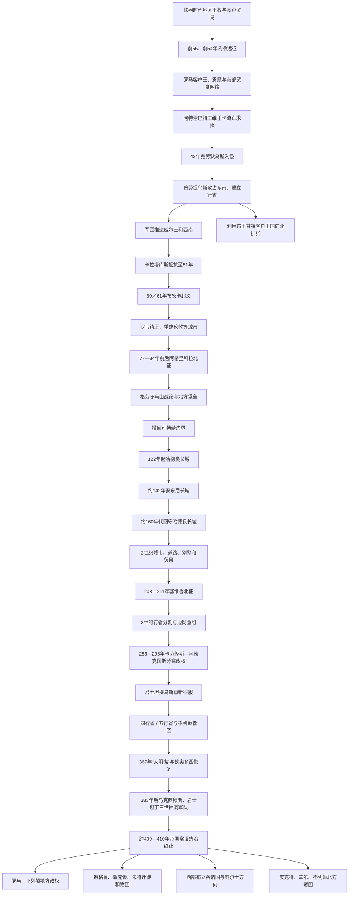

# 罗马帝国不列颠省

## 时间

公元43年克劳狄乌斯征服开始—约409／410年帝国常设军政统治终止；罗马对大不列颠北部的实际控制范围随时期变化，爱尔兰从未成为正式行省

## 对象性质与范围

“罗马不列颠”是罗马帝国在大不列颠岛上建立的行省、城市、军区和边防体系，不等同于现代英格兰，也不等同于整个不列颠群岛。最稳定的行政区覆盖今英格兰和威尔士，北界通常以哈德良长城为核心；军队曾推进至苏格兰高地并短期守卫安东尼长城，但未永久征服整个北部。爱尔兰同罗马不列颠有贸易、移民和袭掠联系，却没有被正式并省。

罗马化在城市、军营、别墅、法律和物质生活上影响深刻，却极不均衡。伦敦、科尔切斯特、圣奥尔本斯、约克、林肯、巴斯等中心高度接入帝国，西部、北部和乡村仍保留不列颠凯尔特语言和地方习惯。居民既有本地布立吞人，也有来自高卢、西班牙、日耳曼、巴尔干、叙利亚、北非和其他行省的士兵、商人、奴隶与官员。

## 概括

凯撒前55、前54年两次远征未建立统治，却把不列颠南部王权纳入罗马外交和贸易。43年，克劳狄乌斯以恢复流亡王维里卡等为借口，派奥卢斯·普劳提乌斯率军入侵，攻占卡穆洛杜努姆并建立行省。征服在数十年内向威尔士和北方推进，遇到卡拉塔库斯、布里甘特内战及爱西尼女王布狄卡60／61年大起义。阿格里科拉时期罗马军深入苏格兰，但多米提安和后继皇帝把战略转向可防守边界。

122年起修筑的哈德良长城成为帝国北界，约142年安东尼长城短期把防线推至克莱德—福斯地峡。2世纪相对稳定期，城市、道路、矿业、别墅和市场发展。3世纪帝国危机、军队拥立皇帝、北方战争和海上袭击导致行省多次重组；卡劳修斯、阿勒克图斯在286—296年建立分离政权。4世纪基督教扩展，防线和城市仍运作，却越来越依赖地方精英及机动军队。

383年后，多位篡位者从不列颠抽调军队。407年驻军拥立君士坦丁三世并渡海控制高卢，帝国再未恢复稳定常设统治；约409年当地城市和共同体自行驱逐或放弃帝国行政，410年霍诺留“复文”传统上被解释为要求不列颠人自卫。终结是数十年财政、军事和政治脱离过程，不是“最后一名罗马士兵在410年同一天离岛”。

## 统治演变图

## 征服前奏

### 凯撒远征

前55年凯撒率军渡海，登陆时遭不列颠战车和海岸部队阻击，骑兵运输与风暴使远征很快结束。前54年第二次行动规模更大，罗马军渡过泰晤士河，击败卡西维拉努斯协调的联盟，并恢复特里诺万特流亡首领曼杜布拉基乌斯地位。凯撒要求贡赋、人质和不得攻击盟友后撤回高卢，没有留下军团或省政府。

远征为凯撒积累政治声望，记述带有宣传色彩；其长期意义在于罗马承认、贸易和客户关系进入不列颠王权竞争。

### 客户王和贸易

奥古斯都、提比略时期没有入侵，却接受不列颠使节和流亡者。南部首领进口葡萄酒、陶器、玻璃和奢侈品，硬币使用拉丁字母及“王”称号。库诺贝利努斯统合卡图维劳尼、特里诺万特等区域，卡穆洛杜努姆成为主要中心。

其死后，卡拉塔库斯、托戈杜姆努斯扩张并驱逐阿特雷巴特王维里卡。维里卡向克劳狄乌斯求援，给皇帝提供恢复盟友和取得军事荣誉的借口。克劳狄乌斯本人刚即位，需要军功巩固禁卫军拥立后的合法性。

## 克劳狄乌斯征服（43—47）

### 入侵军

43年，奥卢斯·普劳提乌斯指挥第二奥古斯塔、第九西班牙、第十四双子和第二十瓦莱里亚胜利军团及辅助军，可能从多个港口登陆。维斯帕先指挥第二军团征服南部和西南多处山堡。罗马军在梅德韦河、泰晤士河等地击败卡拉塔库斯、托戈杜姆努斯，后者死亡。

克劳狄乌斯短暂亲临，带来禁卫军和可能的战象，接受多名首领投降，在卡穆洛杜努姆举行胜利仪式。当地被建为退伍军人殖民地和皇帝神庙中心。普劳提乌斯成为首任总督，负责军团、外交和行省组织。

### 客户统治

罗马没有立刻直接治理所有地区。阿特雷巴特王科吉杜布努斯控制南部部分土地并忠于罗马，布里甘特女王卡蒂曼杜娅在北方保持客户王国。客户王能缓冲边疆和提供情报，内部继承或反罗马派上升时，罗马才转为直接占领。

## 西部征服和卡拉塔库斯

普布利乌斯·奥斯托里乌斯·斯卡普拉总督继续向威尔士边区推进，解除部分群体武装并建立堡垒。卡拉塔库斯先后联合西卢尔人、奥陶维斯人抵抗，利用山地作战。51年战败后逃往布里甘特，被卡蒂曼杜娅交给罗马。

卡拉塔库斯在罗马受审演说的细节来自塔西佗文学塑造，克劳狄乌斯赦免其家族。西卢尔人继续抵抗，说明捕获领袖未立即结束战争。总督迪迪乌斯·加卢斯和昆图斯·维拉尼乌斯维持边防，苏埃托尼乌斯·保利努斯后来进攻安格尔西岛德鲁伊中心。

## 布狄卡起义（60／61年）

### 背景

爱西尼王普拉苏塔古斯以罗马皇帝和两名女儿共同继承遗产，希望保存客户王国。其死后，罗马官员把领地吞并，鞭打王后布狄卡并侵害其女儿；同时退伍军人殖民地侵占土地、贷款追索和行政傲慢激化东部不满。

### 起义过程

保利努斯率军远在安格尔西时，爱西尼同特里诺万特等起兵，摧毁卡穆洛杜努姆和未设防的皇帝神庙。第九军团分遣队救援失败。总督赶回伦迪尼乌姆，因兵力不足放弃城市，伦敦和维鲁拉米翁遭焚毁，大批罗马居民和亲罗马本地人死亡。

保利努斯集结约一万余名军团和辅助军，在狭窄地形以纪律、投枪和楔形冲锋击败人数远多的起义者。布狄卡不久死亡，方式不详。古代作者给出的双方死亡数字极可能夸张。

### 后果

罗马初期严厉报复，尼禄考虑是否撤出。新财政官和后继总督佩特罗尼乌斯·图尔皮利亚努斯采取较缓和政策，重建城市并调整征税。起义证明不列颠行省仍不稳，也促使帝国避免仅依靠剥夺性客户转省。

## 北方扩张

### 布里甘特和威尔士

卡蒂曼杜娅同丈夫维努提乌斯发生内战，罗马多次援助。69年帝国内战削弱驻军，维努提乌斯推翻她，迫使罗马在70年代直接征服布里甘特地区。佩蒂利乌斯·凯里亚利斯进军北方，尤利乌斯·弗龙蒂努斯最终击败威尔士西卢尔人并建立军道、要塞。

### 阿格里科拉

格奈乌斯·尤利乌斯·阿格里科拉约77／78—83／84年任总督，其女婿塔西佗写传记，是主要资料。阿格里科拉整顿军纪，完成威尔士控制，逐年向北建堡，舰队沿海侦察，并鼓励地方精英接受拉丁教育、城市和罗马服饰。

约83／84年，罗马军在“格劳庇乌山”击败卡尔加库斯领导的喀里多尼亚联盟，地点不确定。罗马随后在高地修建堡垒，却没有长期保有全部地区。阿格里科拉被召回可能与多米提安战略、军团调往多瑙及正常任期有关，不能只解释为皇帝嫉妒。

## 边界体系

### 哈德良长城

哈德良122年巡视不列颠，命令在泰恩河至索尔韦湾之间修筑约117公里防线。石墙、壕沟、里堡、军营和军道构成控制区，作用包括监视通行、征税、阻止小规模袭击、展示帝国权力和为野战军提供基地，不是完全不可穿越的“国界围墙”。

守军主要是来自各行省的辅助军，而非意大利军团。墙北仍有前沿堡垒、盟友和贸易，墙南的居民也受军事征用和市场影响。

### 安东尼长城

安东尼·庇护约142年命总督洛利乌斯·乌尔比库斯向北推进，在福斯湾—克莱德河地峡修筑草土长城。它把低地部分纳入约二十年，因补给、北方反抗和战略调整，约160年代主要驻军回到哈德良长城。罗马此后多次远征墙北，却未恢复长期安东尼防线。

### 塞维鲁远征

196—197年不列颠总督克洛狄乌斯·阿尔比努斯争夺帝位，带走军队进入高卢，战败后边防受损。塞普蒂米乌斯·塞维鲁约197年把行省分为南部“不列颠上省”和北部“不列颠下省”，降低单一总督控制多军团而篡位的风险。

208—211年塞维鲁与卡拉卡拉、盖塔亲赴不列颠，动员大军进攻喀里多尼亚，取得和约但伤亡、疾病和补给代价高。塞维鲁211年死于约克，军队撤回哈德良长城。

## 行政与总督

### 行省结构

早期不列颠由一名皇帝任命的元老级总督统辖军队和行政，财政由独立皇帝财务官管理，城市共同体负责地方税和公共建设。197年前后分为上、下两省；戴克里先改革后约有不列颠第一、不列颠第二、弗拉维亚凯撒里恩西斯、马克西玛凯撒里恩西斯等省，后可能另设瓦伦提亚，归不列颠管区代理官和高卢大区统辖。

晚期北方边防由“不列颠公爵”等军事长官负责，东南海岸堡垒由“撒克逊海岸伯爵”系统统辖，机动野战军另有司令。职位名录和省界并非都可精确复原。

### 可考主要总督与行政首脑

下表列征服、危机和重组中的可考关键总督；铭文和文献无法提供43—410年所有省份的完整无缺名单，行省分割后更不存在一条单一总督序列。

| 顺序 | 总督 / 行政首脑 | 任期约数 | 关键作用 |
|---:|---|---|---|
| 1 | **奥卢斯·普劳提乌斯** | 43—47年 | 指挥入侵并建立首批行省军政结构。 |
| 2 | 普布利乌斯·奥斯托里乌斯·斯卡普拉 | 47—52年 | 推进威尔士边区、击败卡拉塔库斯。 |
| 3 | 奥卢斯·迪迪乌斯·加卢斯 | 52—57年 | 稳定边境并干预布里甘特内战。 |
| 4 | 昆图斯·维拉尼乌斯 | 57—58年 | 准备扩大威尔士攻势，在任内去世。 |
| 5 | **盖乌斯·苏埃托尼乌斯·保利努斯** | 58—61年 | 进攻安格尔西并镇压布狄卡起义，后因报复政策被撤。 |
| 6 | 普布利乌斯·佩特罗尼乌斯·图尔皮利亚努斯 | 61—63年 | 采取缓和和重建政策。 |
| 7 | 马库斯·特雷贝利乌斯·马克西穆斯 | 63—69年 | 相对和平，因军队叛乱逃离。 |
| 8 | 马库斯·维蒂乌斯·博拉努斯 | 69—71年 | 四帝之年后恢复秩序，北方政策谨慎。 |
| 9 | **昆图斯·佩蒂利乌斯·凯里亚利斯** | 71—74年 | 直接打击布里甘特并向北扩张。 |
| 10 | 塞克斯图斯·尤利乌斯·弗龙蒂努斯 | 74—77年 | 征服西卢尔人，巩固威尔士。 |
| 11 | **格奈乌斯·尤利乌斯·阿格里科拉** | 约77／78—83／84年 | 远征喀里多尼亚、建立北方堡垒和舰队侦察。 |
| — | 昆图斯·洛利乌斯·乌尔比库斯 | 约139—142年以后 | 安东尼·庇护时期北征并修筑安东尼长城。 |
| — | 乌尔皮乌斯·马尔凯卢斯 | 2世纪后期，可能两任 | 在北方危机中整顿军纪，具体任期有争议。 |
| — | **普布利乌斯·赫尔维乌斯·佩蒂纳克斯** | 约185—187年 | 平定军队骚乱，后成为罗马皇帝。 |
| — | **克洛狄乌斯·阿尔比努斯** | 约191—197年 | 总督兼凯撒，带军争帝失败，导致行省随后分割。 |
| — | 维里乌斯·卢普斯 | 约197—200年 | 分省初期管理不列颠下省，以外交应对北方部族。 |
| — | **卡劳修斯** | 286—293年自立皇帝 | 原海军司令，在不列颠与高卢北部建立分离政权，不是合法行省总督。 |
| — | 阿勒克图斯 | 293—296年 | 杀卡劳修斯继位，296年被君士坦提乌斯军击败。 |
| — | 君士坦提乌斯·克洛鲁斯 | 296年征服；305—306年皇帝在不列颠 | 恢复帝国统治，306年死于约克。 |
| — | 老狄奥多西 | 368—369年军事统帅 | 镇压“大阴谋”、重建堡垒和行政；并非长期单一行省总督。 |
| — | 马格努斯·马克西穆斯 | 383—388年自立皇帝 | 从不列颠带兵进入高卢，掌握西部部分地区，最终被狄奥多西一世击败。 |
| — | 君士坦丁三世 | 407—411年自立皇帝 | 带走驻军控制高卢，促成不列颠同中央军政关系最终断裂。 |

## 城市、道路和经济

### 城市类型

卡穆洛杜努姆是退伍军人殖民地和早期省会象征；伦迪尼乌姆凭泰晤士港口、道路和商业迅速成为最大城市和行政金融中心。维鲁拉米翁、科里尼乌姆、林肯、格洛斯特等为殖民地或自治城市；阿奎苏利斯即巴斯围绕温泉神庙发展；埃博拉库姆即约克是北方军团和皇帝驻地。

城市议会由本地富裕精英承担税收和公共建筑，罗马公民权逐步扩大，212年卡拉卡拉敕令赋予帝国多数自由民公民权。城市以外仍有大量乡村聚落、农庄和本地共同体。

### 道路和军队

军队修建沃特林街、福斯道、埃尔明街等干道，连接港口、城市和军营。道路主要服务军队和行政，也便利市场、邮驿和人员流动。切斯特、卡尔利恩、约克等军团基地周围形成平民聚落，退伍兵在本地定居。

驻军可能占全行省人口相当比例，薪饷创造市场，却需要粮食、动物、金属和税收。士兵来自帝国各地，辅助军退役后可获公民权，带来多语和多宗教社会。

### 农业、别墅和矿业

谷物、牲畜、羊毛和皮革供应城市军队，也有出口。南部和中部别墅是农业地产、身份住宅和地方行政节点，规模从小农庄到带镶嵌地板、浴室的大庄园。别墅增长不等于所有农民生活富裕，租佃、奴隶和贫富差距并存。

威尔士金矿、门迪普铅银、铁、煤、盐和石材被开采。罗马国家直接控制部分矿区，私人承包和地方劳工共同参与。陶器、金属和玻璃形成区域生产，但高档商品仍来自大陆。

## 罗马化与地方连续性

“罗马化”不是本地人被动变成意大利人。地方精英通过拉丁语、城市职位、军队和消费参与帝国，普通居民则选择性接受钱币、陶器、建筑和法律。不列颠凯尔特语在乡村和西北长期使用，拉丁语主要见于行政、军队、铭文和城市；两者可能形成双语。

罗马城市和道路改变空间，却利用原有部落中心和客户王网络。地方神灵同罗马神合祀，墓葬和房屋也保留地区传统。北方边界两侧居民贸易、服役和通婚，因此“罗马人”与“蛮族”不是纯血缘二分。

## 宗教

### 多神信仰与融合

军人和居民崇拜朱庇特、密特拉、马尔斯、米涅瓦、皇帝神和来自叙利亚、埃及等地神祇。本地苏利斯女神在巴斯同罗马密涅瓦结合，科文蒂娜等边疆神也获铭文祭祀。诅咒片、祭坛和献祭显示普通人的疾病、盗窃和关系诉求。

罗马在征服威尔士期间打击德鲁伊聚集的安格尔西，但“德鲁伊被一次彻底灭绝”证据不足。本地仪式继续以新形式存在。

### 基督教

基督教可能2—3世纪经商人、士兵和奴隶传入。303年戴克里先迫害背景下出现圣阿尔班殉道传统，具体年代有争议。314年阿尔勒会议有伦敦、约克等不列颠主教参加，证明教会已经制度化。4世纪别墅马赛克、器皿和墓葬显示基督教扩展，同时传统信仰仍存。

不列颠出身神学家佩拉纠斯约4—5世纪活动于罗马，其自由意志思想引发教会争论。罗马撤离后，西部不列颠基督教社群延续，并同爱尔兰传教发生联系。

## 3世纪危机与分离政权

### 军队拥立与行省分割

不列颠拥有多个军团，距意大利遥远，军队可拥立总督争夺皇位。克洛狄乌斯·阿尔比努斯同塞普蒂米乌斯·塞维鲁先合作后战争，197年在高卢败亡。塞维鲁把行省分割，既提高行政效率，也防止一人控制全部军队。

3世纪帝国危机中，不列颠曾属于波斯图穆斯建立的“高卢帝国”，后被奥勒良重新统一。货币贬值、内战和海盗压力影响城市，军队和别墅仍在部分地区繁荣。

### 卡劳修斯和阿勒克图斯

卡劳修斯受命打击撒克逊、法兰克海盗，因被指侵吞战利品而于286年自立，控制不列颠和高卢部分海岸。他发行高质量货币、引用罗马合法性和“不列颠期待者”宣传，依靠舰队维持。293年君士坦提乌斯夺取其高卢基地，财政官阿勒克图斯杀卡劳修斯继位。

296年，君士坦提乌斯与阿斯克勒庇奥多图斯分路渡海，阿勒克图斯战败死亡。帝国宣传把重新征服描述为“恢复不列颠”，随后戴克里先式多省管理和海岸防御加强。

## 4世纪边防与政治

### 北方和海上威胁

罗马作者把墙北群体逐渐统称“皮克特人”，爱尔兰袭击者称“斯科提”，北海日耳曼海盗被称撒克逊人。名称可能是政治和军事分类，不代表单一民族。东南“撒克逊海岸”堡垒如里奇伯勒、波切斯特、佩文西用于舰队、驻军和海峡交通，其建设年代和主要针对海盗还是控制航运有争论。

367年，皮克特、斯科提、阿塔科蒂及撒克逊等同时袭击，边防叛逃或崩溃，后世称“大阴谋”。老狄奥多西率军恢复伦敦和堡垒，赦免逃兵、重组部队，并可能设瓦伦提亚省。

### 篡位与帝国中心

306年君士坦丁一世在约克获军队拥立，后来统一帝国；这显示不列颠仍能影响罗马最高政治。383年马格努斯·马克西穆斯带军赴高卢争位，传统认为削弱西部和北方驻军。402年前后斯提里科可能再抽调部队应对意大利危机，具体规模不详。

407年驻军在莱茵防线崩溃和蛮族进入高卢背景下连续拥立数人，最终选择君士坦丁三世。他带主要机动军渡海，试图控制高卢和西班牙，留下城市自卫。帝国中央因意大利受威胁，无力重新驻军。

## 统治终结过程

### 409—410年的地方脱离

约409年，佐西穆斯记述不列颠和高卢部分城市摆脱罗马行政、自行武装。410年霍诺留皇帝给“布里坦尼亚诸城”的复文传统上被解读为通知其自行防御；有学者怀疑抄本原指意大利的布鲁提乌姆，因此不能把复文作为唯一结束证据。

无论复文对象，铸币输入、军队薪饷和高级行政在5世纪初中断，帝国没有重建行省。地方城镇、庄园、教会和军阀仍继续使用罗马头衔、法律和建筑，居民自认“罗马人”可能延续数代。

### 不是一次撤军

罗马军队并非一支全由意大利人组成的外来占领军，许多士兵及家庭已在本地定居。部分单位被带往大陆，部分解散或转为地方武装。所谓“410年最后军团撤走”是教学简化，真实过程包括383、401／402、407等多次抽调，以及财政命令链崩溃。

### 后罗马权力真空

北方皮克特和爱尔兰斯科提袭击增加，地方不列颠精英可能雇佣撒克逊等日耳曼战士。5—6世纪盎格鲁、撒克逊、朱特移民建立聚落和诸国，数量、暴力与本地融合因地区不同。西部和北部布立吞政权继续，形成威尔士、康沃尔、斯特拉斯克莱德等方向；爱尔兰达尔里阿达移民影响苏格兰西部。

因此，罗马不列颠的后继是多方分支，不是直接单线变为“英格兰”。

## 重要事件

| 时间 | 事件 | 直接结果 | 长期意义 |
|---|---|---|---|
| 前55、前54年 | 凯撒远征 | 取得短期投降与贡赋，无驻军 | 罗马外交和贸易更深介入南部。 |
| 43年 | 克劳狄乌斯入侵 | 卡穆洛杜努姆被占、行省建立 | 罗马对南部近四世纪统治开始。 |
| 47—51年 | 奥斯托里乌斯进攻西部 | 卡拉塔库斯被俘 | 威尔士抵抗继续，客户统治局限显现。 |
| 60／61年 | 布狄卡起义 | 三座主要城市被毁，起义遭镇压 | 罗马调整治理并重建城市。 |
| 70年代 | 布里甘特和威尔士被直接征服 | 军事边界向北推进 | 结束主要客户王国阶段。 |
| 约83／84年 | 格劳庇乌山战役 | 罗马军击败北方联盟 | 高地征服未长期维持。 |
| 122年起 | 哈德良长城建设 | 北方边防制度化 | 成为罗马帝国边界象征。 |
| 约142—160年代 | 安东尼长城使用 | 边界短暂北推后回撤 | 展示战略范围随资源变化。 |
| 196—197年 | 阿尔比努斯争帝失败 | 不列颠军队遭损、行省分割 | 防止单一总督掌握全部军团。 |
| 208—211年 | 塞维鲁北征 | 暂时和约，皇帝死于约克 | 再次证明全面征服北方成本过高。 |
| 286—296年 | 卡劳修斯、阿勒克图斯政权 | 不列颠脱离中央十年 | 舰队和行省可支撑独立帝国竞争者。 |
| 367—369年 | “大阴谋”与恢复 | 边防一度崩溃后重建 | 晚期安全更依赖机动军和地方忠诚。 |
| 383年 | 马格努斯·马克西穆斯带兵赴大陆 | 驻军进一步削弱 | 后世威尔士传说把其视为王朝祖先。 |
| 407年 | 君士坦丁三世率军渡海 | 帝国常设军队和命令链断裂 | 罗马中央未再稳定控制。 |
| 约409—410年 | 地方自卫、霍诺留复文传统 | 行省行政终止 | 后罗马多政权时代开始。 |

## 统治维持条件

- 海峡舰队、军团基地和道路使罗马能快速部署。
- 客户王和地方精英为征税、治安和文化整合提供中介。
- 城市、矿业、农业和军费市场把行省经济同帝国连接。
- 哈德良长城等可防守边界降低全面占领苏格兰高地的成本。
- 公民权、军队服役和地方议会给部分本地人提供上升渠道。
- 帝国多省调兵和财政体系能在起义、边防危机后重建。
- 宗教和文化融合让居民可以同时保留地方与罗马身份。
- 大不列颠南部与高卢贸易密切，海峡不是绝对隔离。

## 衰落因素

### 结构因素

不列颠远离帝国中心，驻军昂贵且容易拥立篡位者。城市议员承担税收责任，3—4世纪经济和货币变化使地方公共建设减少。北方和海岸需要同时防守，机动部队却不断被大陆战争抽走。

### 外部压力

皮克特、斯科提和撒克逊等袭击增加，莱茵边界406年崩溃、哥特军威胁意大利迫使中央优先保卫高卢和本土。威胁不是规模统一的“蛮族总攻”，而是多个集团利用帝国政治危机。

### 内部政治

阿尔比努斯、卡劳修斯、马克西穆斯和君士坦丁三世说明地方军队更愿追随能发饷和争帝的将领。每次大陆争位都带走兵员和税收，失败后帝国需重新组织。5世纪初西罗马政府已无力同时恢复不列颠。

### 直接终结

407年君士坦丁三世渡海、409年前后地方脱离和410年中央无力援助构成直接过程。帝国没有签署“放弃不列颠条约”，地方罗马制度也没有立即消失；政治终结应定义为中央常设军政、税收和任命不再恢复。

## 长期影响

1. 道路、城市位置、矿区和农业地产影响后世聚落，即使许多建筑衰败。
2. 拉丁语留下地名和宗教词汇，但不列颠凯尔特语在西部北部延续，英语来自后续日耳曼迁徙。
3. 基督教社群在威尔士、康沃尔和西部保持，并向爱尔兰、苏格兰方向互动。
4. 哈德良长城不是现代英格兰—苏格兰国界，却成为北方边界的物质遗产。
5. 罗马军队的跨帝国人口使不列颠从一开始就是多族社会。
6. 行省终结产生罗马—不列颠、日耳曼移民、皮克特和盖尔多方国家，而非一个统一后继。
7. 中世纪与近代统治者反复借罗马遗产论证不列颠统一或帝国使命，但这种政治使用不等于直接制度连续。

## 关键辨析

- 罗马不列颠不是现代英格兰前身的全部历史，威尔士和苏格兰南部也曾深受行省统治。
- 爱尔兰没有成为罗马行省，罗马商品和基督教联系不等于征服。
- 卡拉塔库斯、布狄卡等抵抗者属于不同地区和时间，没有统一“英国民族军”。
- 布狄卡起义发生于60／61年，应置于罗马统治而非史前。
- 阿格里科拉到达北方不等于罗马永久征服全苏格兰。
- 哈德良长城用于控制和防务，不是完全封闭边界，也不沿现代国界。
- “罗马化”是地方社会参与、选择和强制并存，不是本地人口被意大利移民全部替换。
- 基督教在罗马撤离前已经制度化，盎格鲁-撒克逊时期并非第一次传入群岛。
- 卡劳修斯自称罗马皇帝而非现代民族独立领袖。
- 410年没有可确认的单一“最后军团撤离日”；统治在多次抽调和地方脱离中终止。
- 罗马撤离不是立即造成文明完全消失，地方精英、教会、农场和部分城市传统继续。
- 盎格鲁-撒克逊迁徙只是后继之一，西部布立吞与北方诸国同样承接罗马不列颠。

## 演变关系

- 前一节点：[史前不列颠时期](/%E4%BA%BA%E6%96%87%E7%A7%91%E5%AD%A6/%E5%8E%86%E5%8F%B2/%E6%AC%A7%E6%B4%B2/%E4%B8%8D%E5%88%97%E9%A2%A0%E7%BE%A4%E5%B2%9B/%E5%8F%B2%E5%89%8D%E4%B8%8D%E5%88%97%E9%A2%A0%E6%97%B6%E6%9C%9F.md)。
- 后续分支：[盎格鲁-撒克逊时期](/%E4%BA%BA%E6%96%87%E7%A7%91%E5%AD%A6/%E5%8E%86%E5%8F%B2/%E6%AC%A7%E6%B4%B2/%E4%B8%8D%E5%88%97%E9%A2%A0%E7%BE%A4%E5%B2%9B/%E8%8B%B1%E6%A0%BC%E5%85%B0/%E7%9B%8E%E6%A0%BC%E9%B2%81-%E6%92%92%E5%85%8B%E9%80%8A%E6%97%B6%E6%9C%9F.md)、[罗马后威尔士诸国](/%E4%BA%BA%E6%96%87%E7%A7%91%E5%AD%A6/%E5%8E%86%E5%8F%B2/%E6%AC%A7%E6%B4%B2/%E4%B8%8D%E5%88%97%E9%A2%A0%E7%BE%A4%E5%B2%9B/%E5%A8%81%E5%B0%94%E5%A3%AB/%E7%BD%97%E9%A9%AC%E5%90%8E%E5%A8%81%E5%B0%94%E5%A3%AB%E8%AF%B8%E5%9B%BD.md)、[皮克特人与达尔里阿达](/%E4%BA%BA%E6%96%87%E7%A7%91%E5%AD%A6/%E5%8E%86%E5%8F%B2/%E6%AC%A7%E6%B4%B2/%E4%B8%8D%E5%88%97%E9%A2%A0%E7%BE%A4%E5%B2%9B/%E8%8B%8F%E6%A0%BC%E5%85%B0/%E7%9A%AE%E5%85%8B%E7%89%B9%E4%BA%BA%E4%B8%8E%E8%BE%BE%E5%B0%94%E9%87%8C%E9%98%BF%E8%BE%BE.md)与[盖尔爱尔兰与早期王国](/%E4%BA%BA%E6%96%87%E7%A7%91%E5%AD%A6/%E5%8E%86%E5%8F%B2/%E6%AC%A7%E6%B4%B2/%E4%B8%8D%E5%88%97%E9%A2%A0%E7%BE%A4%E5%B2%9B/%E7%88%B1%E5%B0%94%E5%85%B0/%E7%9B%96%E5%B0%94%E7%88%B1%E5%B0%94%E5%85%B0%E4%B8%8E%E6%97%A9%E6%9C%9F%E7%8E%8B%E5%9B%BD.md)。
- 罗马背景：[古罗马](/%E4%BA%BA%E6%96%87%E7%A7%91%E5%AD%A6/%E5%8E%86%E5%8F%B2/%E6%AC%A7%E6%B4%B2/_%E9%80%9A%E5%8F%B2/%E5%8F%A4%E7%BD%97%E9%A9%AC/README.md)。
- 返回：[不列颠群岛](/%E4%BA%BA%E6%96%87%E7%A7%91%E5%AD%A6/%E5%8E%86%E5%8F%B2/%E6%AC%A7%E6%B4%B2/%E4%B8%8D%E5%88%97%E9%A2%A0%E7%BE%A4%E5%B2%9B/README.md)。
