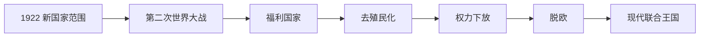

# 大不列颠及北爱尔兰联合王国

## 时间

1922年至今

## 演变图

## 概括

爱尔兰自由邦成立后，联合王国保留英格兰、苏格兰、威尔士与北爱尔兰。国家经历第二次世界大战、福利国家建立、帝国解体、去工业化、欧洲一体化与脱欧，并通过1990年代后的权力下放重塑内部联合。英国仍是议会君主制国家，君主为国家元首，首相和对下议院负责的内阁掌握实际行政权。

## 完整君主世系

| 顺序 | 君主 | 在位时间 | 关键事项 |
|---:|---|---|---|
| 1 | 乔治五世 | 1922—1936 | 爱尔兰自由邦成立，帝国向英联邦转型。 |
| 2 | 爱德华八世 | 1936 | 退位危机。 |
| 3 | 乔治六世 | 1936—1952 | 第二次世界大战、印度独立与战后改革。 |
| 4 | **伊丽莎白二世** | 1952—2022 | 去殖民化、英联邦发展、欧洲关系与权力下放。 |
| 5 | **查理三世** | 2022年至今（2026年7月在位） | 维持立宪君主职责。 |

## 发展阶段与重要事件

- 1920—1930年代扩大普选并应对经济萧条；工党成为主要执政竞争者。
- 1939—1945年第二次世界大战实行总体动员。1940年不列颠战役、帝国与盟国资源及美国援助共同支撑战争，胜利却留下债务和国力透支。
- 1945年工党政府建立国民保健制度、扩大社会保障并国有化关键产业，形成战后福利共识。
- 印度1947年独立后，亚洲、非洲和加勒比殖民地相继去殖民化；英联邦取代直接帝国作为主要联系框架。
- 1960—1970年代经济增长放缓、劳资冲突和北爱冲突加剧。1973年加入欧洲共同体。
- 1979年后撒切尔政府推进私有化、金融自由化和削弱工会，控制通胀但加速传统工业区衰退与地区差距。
- 1997年后苏格兰、威尔士和北爱分别建立下放机构；1998年《贝尔法斯特协议》重构北爱治理。
- 2016年脱欧公投中多数支持离开欧盟，2020年正式退出；贸易、北爱安排和联合内部认同受到持续影响。
- 新冠疫情、能源与生活成本压力再次考验中央—地方协调和公共财政。

## 国家结构

英国没有单一成文宪法，制度由法律、判例、议会规则和政治惯例构成。议会在法律上享有主权；下议院决定政府存续，上议院负责审议。最高法院审理法律和权力下放争议。苏格兰、威尔士、北爱拥有不对称自治，英格兰没有对应的全国性下放议会。

## 维持联合与面临的压力

国家依靠共同财政、内部市场、国防外交和议会民主维持；王室与公共机构提供象征连续性。结构压力包括帝国后经济转型、地区生产力差距、苏格兰独立运动、北爱身份分歧、脱欧后欧洲关系与中央集权争论。它不是“帝国衰亡后的残余”，而是不断经选举、法律与区域协商重谈的多民族国家。

## 完整统治表

1707年至今全部君主与1721年至今每届首相见[英国君主与政府首脑完整表](/%E4%BA%BA%E6%96%87%E7%A7%91%E5%AD%A6/%E5%8E%86%E5%8F%B2/%E6%AC%A7%E6%B4%B2/%E4%B8%8D%E5%88%97%E9%A2%A0%E7%BE%A4%E5%B2%9B/%E8%81%94%E5%90%88%E7%8E%8B%E5%9B%BD/%E8%8B%B1%E5%9B%BD%E5%90%9B%E4%B8%BB%E4%B8%8E%E6%94%BF%E5%BA%9C%E9%A6%96%E8%84%91%E5%AE%8C%E6%95%B4%E8%A1%A8.md)。

## 演变关系

- 前一阶段：[大不列颠及爱尔兰联合王国](/%E4%BA%BA%E6%96%87%E7%A7%91%E5%AD%A6/%E5%8E%86%E5%8F%B2/%E6%AC%A7%E6%B4%B2/%E4%B8%8D%E5%88%97%E9%A2%A0%E7%BE%A4%E5%B2%9B/%E8%81%94%E5%90%88%E7%8E%8B%E5%9B%BD/%E5%A4%A7%E4%B8%8D%E5%88%97%E9%A2%A0%E5%8F%8A%E7%88%B1%E5%B0%94%E5%85%B0%E8%81%94%E5%90%88%E7%8E%8B%E5%9B%BD.md)
- 制度专题：[现代英国政治](/%E4%BA%BA%E6%96%87%E7%A7%91%E5%AD%A6/%E5%8E%86%E5%8F%B2/%E6%AC%A7%E6%B4%B2/%E4%B8%8D%E5%88%97%E9%A2%A0%E7%BE%A4%E5%B2%9B/%E8%81%94%E5%90%88%E7%8E%8B%E5%9B%BD/%E7%8E%B0%E4%BB%A3%E8%8B%B1%E5%9B%BD%E6%94%BF%E6%B2%BB.md)
- 所属总览：[联合王国](/%E4%BA%BA%E6%96%87%E7%A7%91%E5%AD%A6/%E5%8E%86%E5%8F%B2/%E6%AC%A7%E6%B4%B2/%E4%B8%8D%E5%88%97%E9%A2%A0%E7%BE%A4%E5%B2%9B/%E8%81%94%E5%90%88%E7%8E%8B%E5%9B%BD/README.md)
