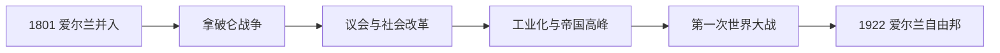

# 大不列颠及爱尔兰联合王国

## 时间

1801年—1922年

## 演变图

## 概括

1801年大不列颠与爱尔兰议会联合，成立大不列颠及爱尔兰联合王国。19世纪英国在工业、海军、金融和殖民扩张方面居世界前列，议会改革逐步扩大选举权；与此同时，爱尔兰大饥荒与自治危机、帝国竞争、工人问题和第一次世界大战不断改变国家结构。1922年爱尔兰自由邦成立后，国家转为大不列颠及北爱尔兰联合王国。

## 完整君主世系

| 顺序 | 君主 | 在位时间 | 关键事项 |
|---:|---|---|---|
| 1 | 乔治三世 | 1801—1820 | 联合建立；拿破仑战争，1811年后由摄政王代行权力。 |
| 2 | 乔治四世 | 1820—1830 | 摄政文化延续；天主教解放。 |
| 3 | 威廉四世 | 1830—1837 | 1832年议会改革法。 |
| 4 | **维多利亚** | 1837—1901 | 工业与帝国扩张高峰，君主政治权力进一步礼仪化。 |
| 5 | 爱德华七世 | 1901—1910 | 帝国外交重组与社会改革。 |
| 6 | 乔治五世 | 1910—1922 | 议会上院危机、第一次世界大战和爱尔兰分治。 |

## 发展过程

- **战争与工业。** 1805年特拉法加海战确保制海权，1815年滑铁卢后法国战争结束。煤炭、蒸汽、铁路、工厂和全球贸易使英国率先成为工业化社会。
- **议会改革。** 1832、1867、1884年改革法逐步扩大男性选举权并重划选区；1918年多数成年男性与部分女性获选举权，1928年才实现成年男女同等普选。
- **内阁责任制。** 君主任命大臣的空间缩小，政府须维持下议院信任。自由党、保守党竞争，20世纪初工党崛起。
- **社会治理。** 工厂法、公共卫生、教育与工会合法化逐步回应城市贫困；1906年后自由党改革为福利国家奠基。
- **帝国。** 1857年印度起义后王室直接统治印度；非洲和亚洲殖民扩张达到高峰。帝国提供市场与资源，也建立在征服、种族等级和强制劳动之上。
- **爱尔兰问题。** 天主教解放、土地改革未解决主权诉求；1840年代大饥荒和三次自治危机使民族主义深化。
- **世界大战。** 1914—1918年总体战动员军队、工业、殖民地与女性劳动力，造成巨额伤亡、债务和社会政治转型。

## 强盛条件与结构性压力

海岛安全、煤炭资源、金融信用、统一市场、海军和殖民网络共同支持英国强盛；并非仅靠技术发明。压力则来自阶级和地区不平等、殖民反抗、德国与美国工业竞争、战争债务以及爱尔兰民族自决。1916年复活节起义和1919—1921年独立战争是爱尔兰脱离的直接政治转折。

## 终结方式

1920年法律先把爱尔兰分为南北两个自治区域；1921年英爱条约使26郡自由邦获得自治领地位，北爱尔兰选择留英。1922年自由邦成立后，旧国名与领土现实不再相符，1927年法律正式调整王室与国家称号。

## 完整统治表

1707年至今全部君主与1721年至今每届首相见[英国君主与政府首脑完整表](/%E4%BA%BA%E6%96%87%E7%A7%91%E5%AD%A6/%E5%8E%86%E5%8F%B2/%E6%AC%A7%E6%B4%B2/%E4%B8%8D%E5%88%97%E9%A2%A0%E7%BE%A4%E5%B2%9B/%E8%81%94%E5%90%88%E7%8E%8B%E5%9B%BD/%E8%8B%B1%E5%9B%BD%E5%90%9B%E4%B8%BB%E4%B8%8E%E6%94%BF%E5%BA%9C%E9%A6%96%E8%84%91%E5%AE%8C%E6%95%B4%E8%A1%A8.md)。

## 演变关系

- 前一阶段：[大不列颠王国](/%E4%BA%BA%E6%96%87%E7%A7%91%E5%AD%A6/%E5%8E%86%E5%8F%B2/%E6%AC%A7%E6%B4%B2/%E4%B8%8D%E5%88%97%E9%A2%A0%E7%BE%A4%E5%B2%9B/%E8%81%94%E5%90%88%E7%8E%8B%E5%9B%BD/%E5%A4%A7%E4%B8%8D%E5%88%97%E9%A2%A0%E7%8E%8B%E5%9B%BD.md)
- 爱尔兰分离过程：[爱尔兰独立与分治](/%E4%BA%BA%E6%96%87%E7%A7%91%E5%AD%A6/%E5%8E%86%E5%8F%B2/%E6%AC%A7%E6%B4%B2/%E4%B8%8D%E5%88%97%E9%A2%A0%E7%BE%A4%E5%B2%9B/%E7%88%B1%E5%B0%94%E5%85%B0/%E7%88%B1%E5%B0%94%E5%85%B0%E7%8B%AC%E7%AB%8B%E4%B8%8E%E5%88%86%E6%B2%BB.md)
- 后一阶段：[大不列颠及北爱尔兰联合王国](/%E4%BA%BA%E6%96%87%E7%A7%91%E5%AD%A6/%E5%8E%86%E5%8F%B2/%E6%AC%A7%E6%B4%B2/%E4%B8%8D%E5%88%97%E9%A2%A0%E7%BE%A4%E5%B2%9B/%E8%81%94%E5%90%88%E7%8E%8B%E5%9B%BD/%E5%A4%A7%E4%B8%8D%E5%88%97%E9%A2%A0%E5%8F%8A%E5%8C%97%E7%88%B1%E5%B0%94%E5%85%B0%E8%81%94%E5%90%88%E7%8E%8B%E5%9B%BD.md)
- 所属总览：[联合王国](/%E4%BA%BA%E6%96%87%E7%A7%91%E5%AD%A6/%E5%8E%86%E5%8F%B2/%E6%AC%A7%E6%B4%B2/%E4%B8%8D%E5%88%97%E9%A2%A0%E7%BE%A4%E5%B2%9B/%E8%81%94%E5%90%88%E7%8E%8B%E5%9B%BD/README.md)
