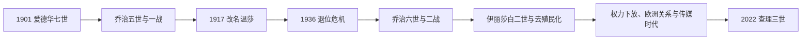

# 温莎王朝

## 时间

1901年至今；1901—1917年王朝名为萨克森—科堡—哥达，1917年起为温莎

## 概括

维多利亚女王之子爱德华七世于1901年继位，王室按父系进入萨克森—科堡—哥达家族。第一次世界大战中反德情绪使乔治五世于1917年把王朝名改为“温莎”，但不是更换君主或血统。王朝经历世界大战、1936年退位危机、帝国解体、英联邦形成、福利国家、欧洲一体化与脱欧。君主的日常政治权力继续收缩，王室以宪制连续性、国家礼仪和公共服务维持地位，同时不断面对战争、媒体、家庭和殖民记忆的压力。

## 演变图

## 王朝名称与家族结构

阿尔伯特亲王出自韦廷家族萨克森—科堡—哥达支系，爱德华七世继承母亲王位后，英国王室因此按父系改名。1917年枢密院公告把王室名称和在英国的男性后裔姓氏改为温莎，名称取自温莎堡。1960年规定伊丽莎白二世与菲利普亲王不使用“殿下”称号的部分后裔可用“蒙巴顿—温莎”姓氏；王朝名仍为温莎。

## 完整君主世系

| 顺序 | 君主 | 在位 | 王朝名 | 与前任关系 | 关键事件 |
|---:|---|---|---|---|---|
| 1 | 爱德华七世 | 1901—1910 | 萨克森—科堡—哥达 | 维多利亚长子 | 王室公共活动与非正式外交扩展；英法协约时代。 |
| 2 | **乔治五世** | 1910—1936 | 1917年前萨克森—科堡—哥达，后温莎 | 爱德华七世次子 | 一战、改名、议会上院危机、爱尔兰分治、自治领地位演变。 |
| 3 | 爱德华八世 | 1936年1月—12月 | 温莎 | 乔治五世长子 | 为与沃利斯·辛普森结婚退位；未举行加冕礼。 |
| 4 | **乔治六世** | 1936—1952 | 温莎 | 爱德华八世之弟 | 二战象征领导、印度独立、英联邦转型。 |
| 5 | **伊丽莎白二世** | 1952—2022 | 温莎 | 乔治六世长女 | 去殖民化、电视与数字传媒、权力下放、欧洲关系；在位70年。 |
| 6 | **查理三世** | 2022年至今 | 温莎 | 伊丽莎白二世长子 | 2023年加冕；至2026年7月在位，延续立宪中立。 |

完整历代君主和首相见[英国君主与政府首脑完整表](/%E4%BA%BA%E6%96%87%E7%A7%91%E5%AD%A6/%E5%8E%86%E5%8F%B2/%E6%AC%A7%E6%B4%B2/%E4%B8%8D%E5%88%97%E9%A2%A0%E7%BE%A4%E5%B2%9B/%E8%81%94%E5%90%88%E7%8E%8B%E5%9B%BD/%E8%8B%B1%E5%9B%BD%E5%90%9B%E4%B8%BB%E4%B8%8E%E6%94%BF%E5%BA%9C%E9%A6%96%E8%84%91%E5%AE%8C%E6%95%B4%E8%A1%A8.md)。

## 分阶段发展与重要事件

### 爱德华七世与乔治五世

- 爱德华七世在位时间短，个人社交网络有助于改善英法关系，但外交转向主要由政府、海军和欧洲力量格局决定。
- 1910—1911年上院否决预算引发宪制危机。乔治五世表示必要时可册封足够贵族，促使上院接受限制否决权的《议会法》。
- 一战使君主与俄、德皇室亲缘无法阻止国家战争。乔治五世访问军队、医院并接受配给形象，1917年改名以回应国内政治压力。
- 1917年俄国革命后，英国政府与王室没有为尼古拉二世一家提供最终避难；责任与决策过程复杂，不宜归于单一个人。
- 1921年乔治五世在北爱尔兰议会开幕演说中呼吁和解；1926年帝国会议及1931年《威斯敏斯特法令》承认自治领立法平等，王冠变成多个国家分别共享的制度。

### 1936年退位危机与乔治六世

- 爱德华八世希望迎娶两度离婚的美国人沃利斯·辛普森。英国政府和自治领政府反对君主违背大臣建议；“贵庶婚”等折中缺乏支持。
- 爱德华签署退位文书，议会立法确认，说明王位个人选择仍须通过宪法与多国法律。
- 乔治六世意外继位，通过语言训练与公共职责重建王室信任。1939—1945年王室留在伦敦、访问轰炸区和军队，成为战争象征。
- 战后印度、巴基斯坦等独立。乔治六世先是末代印度皇帝，后以英联邦元首身份适应非帝国联系。

### 伊丽莎白二世：去殖民化与大众传媒

- 1953年加冕经电视传播，使王室进入大众传媒时代。君主每周会见首相、签署法律和履行外交礼仪，但依法依大臣建议。
- 非洲、亚洲和加勒比大量殖民地独立。王室访问和英联邦元首职位为联系提供象征框架，却不能消除殖民暴力与赔偿争论。
- 1975年澳大利亚宪政危机显示总督在各王国的权力法律上独立于英国政府，不能把英联邦王国视为英国殖民地。
- 1992年多名王室婚姻破裂、温莎堡火灾和财政争议形成“灾难年”；1997年戴安娜去世后，王室因回应迟缓受批评并调整公共沟通。
- 1999年后苏格兰、威尔士和北爱权力下放，君主分别参与新机构礼仪，但不裁决政治争议。
- 2011年继承法改革原则取消男性优先，并取消与天主教徒结婚者自动丧失继承权；君主本人仍须与英格兰教会保持制度关系。
- 伊丽莎白二世2022年去世，长期在位跨越15位英国首相，象征稳定也引发对王室成本、代表性和帝国遗产的持续讨论。

### 查理三世

- 查理即位前长期就环境、建筑和慈善发声；即位后需把个人倡议与君主政治中立区分。
- 2023年加冕保留英格兰教会仪式，同时邀请多宗教代表，反映现代多元社会。
- 王室职责由国王、王后及其他在职成员分担；摄政与国务顾问制度为疾病或出访提供连续性。
- 截至2026年7月，查理三世为联合王国国家元首，基尔·斯塔默为政府首脑。

## 现代统治结构

| 角色 | 实际位置 |
|---|---|
| 国王 | 任命首相、批准法律、召开议会、接见大使，绝大多数权力依大臣建议行使。 |
| 首相与内阁 | 对下议院负责，决定国内外政策并对王室特权的政治使用承担责任。 |
| 各英联邦王国总督 | 在本国宪法下代表同一位君主，与英国政府不存在上下级行政关系。 |
| 王室机构 | 处理礼仪、财产、档案和公共活动；王室财产与君主私人财产需区分。 |
| 议会与公众 | 通过拨款、法律、媒体和政治辩论约束君主制的运作与合法性。 |

## 延续条件、争议与未来

温莎王朝的延续依靠严格政治中立、礼仪服务、可预测继承和适应传媒社会。两次大战和退位危机表明，君主若失去政府与各自治领支持便难以独立行动。现代压力包括王室规模和财政、家庭成员行为、殖民遗产、英联邦国家共和化以及联合王国内部民族政治。王朝是否延续不等于国家制度不变；君主制一直在议会立法、惯例和公众接受度中调整。

## 演变关系

- 前一王朝：[汉诺威王朝](/%E4%BA%BA%E6%96%87%E7%A7%91%E5%AD%A6/%E5%8E%86%E5%8F%B2/%E6%AC%A7%E6%B4%B2/%E4%B8%8D%E5%88%97%E9%A2%A0%E7%BE%A4%E5%B2%9B/%E8%81%94%E5%90%88%E7%8E%8B%E5%9B%BD/%E6%B1%89%E8%AF%BA%E5%A8%81%E7%8E%8B%E6%9C%9D.md)。
- 现代国家：[大不列颠及北爱尔兰联合王国](/%E4%BA%BA%E6%96%87%E7%A7%91%E5%AD%A6/%E5%8E%86%E5%8F%B2/%E6%AC%A7%E6%B4%B2/%E4%B8%8D%E5%88%97%E9%A2%A0%E7%BE%A4%E5%B2%9B/%E8%81%94%E5%90%88%E7%8E%8B%E5%9B%BD/%E5%A4%A7%E4%B8%8D%E5%88%97%E9%A2%A0%E5%8F%8A%E5%8C%97%E7%88%B1%E5%B0%94%E5%85%B0%E8%81%94%E5%90%88%E7%8E%8B%E5%9B%BD.md)。
- 制度背景：[现代英国政治](/%E4%BA%BA%E6%96%87%E7%A7%91%E5%AD%A6/%E5%8E%86%E5%8F%B2/%E6%AC%A7%E6%B4%B2/%E4%B8%8D%E5%88%97%E9%A2%A0%E7%BE%A4%E5%B2%9B/%E8%81%94%E5%90%88%E7%8E%8B%E5%9B%BD/%E7%8E%B0%E4%BB%A3%E8%8B%B1%E5%9B%BD%E6%94%BF%E6%B2%BB.md)。
- 完整统治表：[英国君主与政府首脑完整表](/%E4%BA%BA%E6%96%87%E7%A7%91%E5%AD%A6/%E5%8E%86%E5%8F%B2/%E6%AC%A7%E6%B4%B2/%E4%B8%8D%E5%88%97%E9%A2%A0%E7%BE%A4%E5%B2%9B/%E8%81%94%E5%90%88%E7%8E%8B%E5%9B%BD/%E8%8B%B1%E5%9B%BD%E5%90%9B%E4%B8%BB%E4%B8%8E%E6%94%BF%E5%BA%9C%E9%A6%96%E8%84%91%E5%AE%8C%E6%95%B4%E8%A1%A8.md)；所属总览：[联合王国](/%E4%BA%BA%E6%96%87%E7%A7%91%E5%AD%A6/%E5%8E%86%E5%8F%B2/%E6%AC%A7%E6%B4%B2/%E4%B8%8D%E5%88%97%E9%A2%A0%E7%BE%A4%E5%B2%9B/%E8%81%94%E5%90%88%E7%8E%8B%E5%9B%BD/README.md)。
