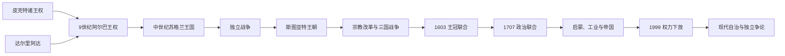

# 苏格兰

[返回不列颠群岛](/%E4%BA%BA%E6%96%87%E7%A7%91%E5%AD%A6/%E5%8E%86%E5%8F%B2/%E6%AC%A7%E6%B4%B2/%E4%B8%8D%E5%88%97%E9%A2%A0%E7%BE%A4%E5%B2%9B/README.md)

## 历史主线

苏格兰并非由单一民族或一次“皮克特被盖尔人征服”形成。罗马撤军后的北部不列颠存在皮克特诸王权、盖尔人的达尔里阿达、布立吞斯特拉斯克莱德、盎格鲁诺森布里亚和维京海域。9世纪肯尼思·麦克阿尔平取得皮克特王权后，政治称呼和宫廷文化逐步转向阿尔巴；11—13世纪王国吸收洛锡安、加洛韦和西部岛屿。1290年继承危机引发英格兰干预与独立战争，布鲁斯王朝确认独立。斯图亚特时期宗教改革、三国战争和王冠联合改变国家，1707年经条约与两国议会法案组成大不列颠。联合后苏格兰保留法律、长老会与教育，1999年恢复民选议会。

## 演变图

## 时期导航

| 顺序 | 阶段 | 时间 | 入口 | 主线 |
|---:|---|---|---|---|
| 1 | 皮克特人与达尔里阿达 | 5—9世纪 | [皮克特人与达尔里阿达](/%E4%BA%BA%E6%96%87%E7%A7%91%E5%AD%A6/%E5%8E%86%E5%8F%B2/%E6%AC%A7%E6%B4%B2/%E4%B8%8D%E5%88%97%E9%A2%A0%E7%BE%A4%E5%B2%9B/%E8%8B%8F%E6%A0%BC%E5%85%B0/%E7%9A%AE%E5%85%8B%E7%89%B9%E4%BA%BA%E4%B8%8E%E8%BE%BE%E5%B0%94%E9%87%8C%E9%98%BF%E8%BE%BE.md) | 多族群王权、爱奥那教会、诺森布里亚竞争和维京冲击。 |
| 2 | 阿尔巴王国 | 约843—1034年 | [阿尔巴王国](/%E4%BA%BA%E6%96%87%E7%A7%91%E5%AD%A6/%E5%8E%86%E5%8F%B2/%E6%AC%A7%E6%B4%B2/%E4%B8%8D%E5%88%97%E9%A2%A0%E7%BE%A4%E5%B2%9B/%E8%8B%8F%E6%A0%BC%E5%85%B0/%E9%98%BF%E5%B0%94%E5%B7%B4%E7%8E%8B%E5%9B%BD.md) | 皮克特王权王朝转换、盖尔文化上升、王族轮替和洛锡安扩张。 |
| 3 | 苏格兰王国 | 1034—1707年 | [苏格兰王国](/%E4%BA%BA%E6%96%87%E7%A7%91%E5%AD%A6/%E5%8E%86%E5%8F%B2/%E6%AC%A7%E6%B4%B2/%E4%B8%8D%E5%88%97%E9%A2%A0%E7%BE%A4%E5%B2%9B/%E8%8B%8F%E6%A0%BC%E5%85%B0/%E8%8B%8F%E6%A0%BC%E5%85%B0%E7%8E%8B%E5%9B%BD.md) | 大卫一世改革、边界形成、独立战争、布鲁斯与斯图亚特完整世系。 |
| 4 | 苏格兰宗教改革与斯图亚特时期 | 16世纪—1707年 | [苏格兰宗教改革与斯图亚特时期](/%E4%BA%BA%E6%96%87%E7%A7%91%E5%AD%A6/%E5%8E%86%E5%8F%B2/%E6%AC%A7%E6%B4%B2/%E4%B8%8D%E5%88%97%E9%A2%A0%E7%BE%A4%E5%B2%9B/%E8%8B%8F%E6%A0%BC%E5%85%B0/%E8%8B%8F%E6%A0%BC%E5%85%B0%E5%AE%97%E6%95%99%E6%94%B9%E9%9D%A9%E4%B8%8E%E6%96%AF%E5%9B%BE%E4%BA%9A%E7%89%B9%E6%97%B6%E6%9C%9F.md) | 长老会、盟约运动、三国战争、复辟与1689年革命安排。 |
| 5 | 联合法案后的苏格兰 | 1707年至今 | [联合法案后的苏格兰](/%E4%BA%BA%E6%96%87%E7%A7%91%E5%AD%A6/%E5%8E%86%E5%8F%B2/%E6%AC%A7%E6%B4%B2/%E4%B8%8D%E5%88%97%E9%A2%A0%E7%BE%A4%E5%B2%9B/%E8%8B%8F%E6%A0%BC%E5%85%B0/%E8%81%94%E5%90%88%E6%B3%95%E6%A1%88%E5%90%8E%E7%9A%84%E8%8B%8F%E6%A0%BC%E5%85%B0.md) | 联合、詹姆斯党战争、高地转型、工业和帝国、去工业化与自治。 |

## 世系说明

[阿尔巴王国](/%E4%BA%BA%E6%96%87%E7%A7%91%E5%AD%A6/%E5%8E%86%E5%8F%B2/%E6%AC%A7%E6%B4%B2/%E4%B8%8D%E5%88%97%E9%A2%A0%E7%BE%A4%E5%B2%9B/%E8%8B%8F%E6%A0%BC%E5%85%B0/%E9%98%BF%E5%B0%94%E5%B7%B4%E7%8E%8B%E5%9B%BD.md)内列肯尼思一世至马尔科姆二世的完整王序；[苏格兰王国](/%E4%BA%BA%E6%96%87%E7%A7%91%E5%AD%A6/%E5%8E%86%E5%8F%B2/%E6%AC%A7%E6%B4%B2/%E4%B8%8D%E5%88%97%E9%A2%A0%E7%BE%A4%E5%B2%9B/%E8%8B%8F%E6%A0%BC%E5%85%B0/%E8%8B%8F%E6%A0%BC%E5%85%B0%E7%8E%8B%E5%9B%BD.md)内列1034—1707年全部公认君主、共治、复位和共和国中断。早期吉里克与欧凯德的共治关系、挪威少女玛格丽特是否应计为正式女王、查理二世在苏格兰与英格兰不同的法理起点均保留争议说明。

## 重要转折

| 时间 | 转折 | 意义 |
|---|---|---|
| 685年 | 邓内克琴战役 | 皮克特击败诺森布里亚，结束其北方霸权。 |
| 约843年 | 肯尼思取得皮克特王权 | 阿尔巴王朝形成的传统起点，但非一次族群灭绝。 |
| 1018年 | 卡勒姆战役 | 阿尔巴对洛锡安控制加强。 |
| 1124—1153年 | 大卫一世改革 | 自治市、郡政、修院和大陆贵族制度扩展。 |
| 1237年 | 《约克条约》 | 英苏陆地边界大体确定。 |
| 1290—1296年 | 王位危机与英格兰干预 | 独立战争的直接背景。 |
| 1314年 | 班诺克本战役 | 布鲁斯王权取得决定性军事优势。 |
| 1328年 | 《爱丁堡—北安普顿条约》 | 英格兰承认苏格兰独立。 |
| 1560年 | 宗教改革议会 | 新教和长老会传统奠基。 |
| 1603年 | 王冠联合 | 共享君主但议会、法律与教会仍分立。 |
| 1638年 | 《民族盟约》 | 宗教争端转化为限制王权的全国政治运动。 |
| 1689—1690年 | 革命安排 | 废黜詹姆斯七世并恢复长老会制度。 |
| 1707年 | 联合法案 | 主权与议会合并，法律、教会和教育获保留。 |
| 1999年 | 苏格兰议会恢复 | 下放治理开始；第一部长制度建立。 |
| 2014年 | 独立公投 | 55%选择留在联合王国。 |

## 现代说明

截至2026年7月，联合王国国家元首为查理三世；苏格兰政府首脑为约翰·斯温尼，他在2026年议会选举后再次获议会提名。外交、国防、宪制、货币等由英国层级掌握；卫生、教育、司法、地方政府和部分税收由苏格兰议会与政府负责。

## 相关方向

- 王冠联合另一侧：[斯图亚特王朝](/%E4%BA%BA%E6%96%87%E7%A7%91%E5%AD%A6/%E5%8E%86%E5%8F%B2/%E6%AC%A7%E6%B4%B2/%E4%B8%8D%E5%88%97%E9%A2%A0%E7%BE%A4%E5%B2%9B/%E8%8B%B1%E6%A0%BC%E5%85%B0/%E6%96%AF%E5%9B%BE%E4%BA%9A%E7%89%B9%E7%8E%8B%E6%9C%9D.md)。
- 1707年后国家：[大不列颠王国](/%E4%BA%BA%E6%96%87%E7%A7%91%E5%AD%A6/%E5%8E%86%E5%8F%B2/%E6%AC%A7%E6%B4%B2/%E4%B8%8D%E5%88%97%E9%A2%A0%E7%BE%A4%E5%B2%9B/%E8%81%94%E5%90%88%E7%8E%8B%E5%9B%BD/%E5%A4%A7%E4%B8%8D%E5%88%97%E9%A2%A0%E7%8E%8B%E5%9B%BD.md)。
- 现代英国制度：[现代英国政治](/%E4%BA%BA%E6%96%87%E7%A7%91%E5%AD%A6/%E5%8E%86%E5%8F%B2/%E6%AC%A7%E6%B4%B2/%E4%B8%8D%E5%88%97%E9%A2%A0%E7%BE%A4%E5%B2%9B/%E8%81%94%E5%90%88%E7%8E%8B%E5%9B%BD/%E7%8E%B0%E4%BB%A3%E8%8B%B1%E5%9B%BD%E6%94%BF%E6%B2%BB.md)。
