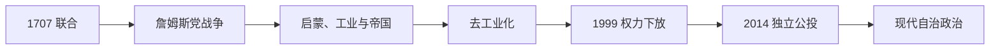

# 联合法案后的苏格兰

## 时间

1707年至今

## 演变图

## 概括

1707年苏格兰王国与英格兰王国合并为大不列颠王国。苏格兰失去独立议会与外交主权，却保留法律、长老会教会、教育和地方行政。此后它既深度参与英国的帝国、工业与福利国家建设，也经历高地社会瓦解、去工业化和民族政治复兴；1999年恢复民选议会，形成“共享主权与下放自治”并存的格局。

## 联合后的发展过程

- **联合与反对。** 联合为苏格兰商人开放英格兰殖民市场，并解决王位继承与安全问题；议会外仍有广泛反对，1715、1745年詹姆斯党起义试图恢复斯图亚特王位。
- **高地转型。** 1746年卡洛登战役后，政府解除氏族军事力量；18—19世纪地主商业化和高地清洗造成迁徙、移民与盖尔社会重组。
- **启蒙与工业化。** 爱丁堡启蒙运动、大学和法律医学专业兴盛。格拉斯哥烟草贸易、克莱德造船、煤铁和重工业使低地城市快速增长。
- **帝国参与。** 苏格兰军人、商人、传教士、工程师和移民广泛参与帝国扩张；收益与殖民暴力、奴隶经济遗产并存。
- **大众政治。** 19世纪选举改革、工会和地方政府发展；20世纪红色克莱德、工党政治、世界大战动员和福利国家塑造工业社区。
- **去工业化与自治。** 20世纪后期煤矿、钢铁和造船衰退，北海石油改变财政争论。1979年自治公投未达到法定门槛，1997年公投通过，1999年苏格兰议会开会。
- **宪制争论。** 2014年独立公投中55%反对独立；2016年苏格兰多数支持留欧而英国整体脱欧，进一步加剧主权争议。

## 现代权力结构

| 层级 | 权力 |
|---|---|
| 英国君主 | 联合王国国家元首。 |
| 英国议会与政府 | 宪法、外交、国防、移民、货币及多数社会保障等保留事项。 |
| 苏格兰议会 | 对卫生、教育、司法、地方政府、环境及部分税收立法。 |
| 苏格兰政府 | 由第一部长领导，执行下放事务；**约翰·斯温尼于2026年5月获连任，至2026年7月在任**。 |
| 苏格兰法院与检察体系 | 保持独立法律传统，是1707年制度连续性的核心。 |
| 地方政府 | 负责地方公共服务，但财政和权力受两级政府共同影响。 |

## 历任第一部长

| 第一部长 | 任期 |
|---|---|
| 唐纳德·杜瓦 | 1999—2000 |
| 亨利·麦克利什 | 2000—2001 |
| 杰克·麦康奈尔 | 2001—2007 |
| 亚历克斯·萨尔蒙德 | 2007—2014 |
| 妮古拉·斯特金 | 2014—2023 |
| 哈姆扎·优素福 | 2023—2024 |
| **约翰·斯温尼** | 2024年至今 |

## 联合得以延续与受到挑战的原因

联合提供单一市场、财政转移、共同国防和全球国家影响力；苏格兰制度又通过下放获得自主空间。挑战来自经济政策分歧、北海资源与财政归属、脱欧、身份政治和英国宪法缺乏成文权力边界。独立问题因此不是1707年的简单延续，而是现代民主授权、福利财政和欧洲关系的综合选择。

## 演变关系

- 前一阶段：[苏格兰王国](/%E4%BA%BA%E6%96%87%E7%A7%91%E5%AD%A6/%E5%8E%86%E5%8F%B2/%E6%AC%A7%E6%B4%B2/%E4%B8%8D%E5%88%97%E9%A2%A0%E7%BE%A4%E5%B2%9B/%E8%8B%8F%E6%A0%BC%E5%85%B0/%E8%8B%8F%E6%A0%BC%E5%85%B0%E7%8E%8B%E5%9B%BD.md)
- 联合国家阶段：[大不列颠王国](/%E4%BA%BA%E6%96%87%E7%A7%91%E5%AD%A6/%E5%8E%86%E5%8F%B2/%E6%AC%A7%E6%B4%B2/%E4%B8%8D%E5%88%97%E9%A2%A0%E7%BE%A4%E5%B2%9B/%E8%81%94%E5%90%88%E7%8E%8B%E5%9B%BD/%E5%A4%A7%E4%B8%8D%E5%88%97%E9%A2%A0%E7%8E%8B%E5%9B%BD.md)
- 所属总览：[苏格兰](/%E4%BA%BA%E6%96%87%E7%A7%91%E5%AD%A6/%E5%8E%86%E5%8F%B2/%E6%AC%A7%E6%B4%B2/%E4%B8%8D%E5%88%97%E9%A2%A0%E7%BE%A4%E5%B2%9B/%E8%8B%8F%E6%A0%BC%E5%85%B0/README.md)
- 群岛总览：[不列颠群岛](/%E4%BA%BA%E6%96%87%E7%A7%91%E5%AD%A6/%E5%8E%86%E5%8F%B2/%E6%AC%A7%E6%B4%B2/%E4%B8%8D%E5%88%97%E9%A2%A0%E7%BE%A4%E5%B2%9B/README.md)
