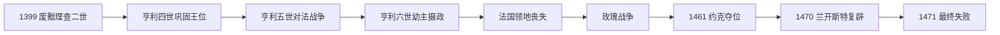

# 兰开斯特王朝

## 时间

1399年—1461年；1470年10月—1471年4月短暂复辟

## 概括

兰开斯特王朝是金雀花王朝中冈特的约翰后裔。亨利·博林布鲁克原以收回被理查二世没收的兰开斯特遗产为名返国，随后废王登基为亨利四世。夺位使王朝必须不断依赖议会确认、贵族联盟和军事胜利维持合法性。亨利五世以对法战争暂时凝聚精英并取得《特鲁瓦条约》，但其早逝使九个月大的亨利六世继位；幼主、法国失地、财政危机和国王精神疾病引发派系内战。1461年约克派夺位，1470年复辟仅维持约半年，1471年亨利六世死亡后王朝的直接统治结束。

## 演变图

## 建立背景与崛起机制

亨利四世是爱德华三世第三个成年儿子冈特的约翰之子。理查二世1398年放逐亨利，1399年冈特死后又没收其遗产，破坏贵族对继承权安全的信心。理查远征爱尔兰时，亨利登陆并迅速吸引北方与中部贵族支持。他先宣称只恢复公爵领，继而以王室血缘、治理能力和议会认可取得王位。王朝的“红玫瑰”主要在后世玫瑰战争叙事中成为统一象征，并非1399年即有完整党派组织。

## 完整君主世系

| 顺序 | 君主 | 在位 | 与前任关系 | 关键事件与备注 |
|---:|---|---|---|---|
| 1 | **亨利四世** | 1399—1413 | 理查二世堂兄、冈特的约翰之子，废王得位 | 议会确认继承；平定珀西叛乱，长期应对欧文·格林杜尔起义和王权财政困难。 |
| 2 | **亨利五世** | 1413—1422 | 亨利四世之子 | 镇压罗拉德派与南安普敦阴谋；阿金库尔胜利；《特鲁瓦条约》与法国凯瑟琳联姻。 |
| 3 | 亨利六世 | 1422—1461 | 亨利五世之子，九个月大继位 | 英法两国摄政；法国失地、精神疾病与宫廷派系冲突；1461年被约克派废黜。 |
| 复位 | 亨利六世 | 1470—1471 | 沃里克伯爵与克拉伦斯公爵扶持复辟 | 国王本人几无实权；爱德华四世返国后复位失败，亨利被囚并死亡。 |

完整前后世系见[英格兰君主完整世系表](/%E4%BA%BA%E6%96%87%E7%A7%91%E5%AD%A6/%E5%8E%86%E5%8F%B2/%E6%AC%A7%E6%B4%B2/%E4%B8%8D%E5%88%97%E9%A2%A0%E7%BE%A4%E5%B2%9B/%E8%8B%B1%E6%A0%BC%E5%85%B0/%E8%8B%B1%E6%A0%BC%E5%85%B0%E5%90%9B%E4%B8%BB%E5%AE%8C%E6%95%B4%E4%B8%96%E7%B3%BB%E8%A1%A8.md)。

## 分阶段发展与重要事件

### 亨利四世：夺位后的不安全王权

- 1400年理查二世死亡，消除复辟中心却加重篡位争议。
- 威尔士的欧文·格林杜尔自1400年起反抗，建立议会并寻求法国援助；英军经过多年堡垒战和资源封锁才逐步恢复控制。
- 珀西家族原支持亨利夺位，因奖赏、赎金与边防政策决裂。1403年什鲁斯伯里战役击败“热刺”亨利·珀西。
- 国王健康恶化，王储与议会大臣逐步承担政府。王朝依赖下院批准税收，强化“国王必须解释财政需求”的惯例。

### 亨利五世：战争型鼎盛

- 1415年远征诺曼底并在阿金库尔以步战阵地和长弓击败法军，胜利提升夺位王朝的合法性。
- 1417—1419年系统征服诺曼底，比一次会战更重要；海运、围城、税收和地方投降安排支撑占领。
- 1420年《特鲁瓦条约》承认亨利为法王查理六世女婿、摄政和继承人，排除王太子查理。
- 1422年亨利先于查理六世去世，条约构想由婴儿继承，失去亲自统帅和政治整合者。

### 亨利六世：摄政、失地与内战

- 贝德福德公爵维持法国战争；1429年奥尔良解围和贞德推动查理七世加冕，法方合法性复兴。
- 1435年勃艮第转向法国，英军财政和兵力逐渐不支。1450年诺曼底丧失，1453年卡斯蒂永后除加来外大陆领地几乎全失。
- 王后安茹的玛格丽特、萨默塞特公爵与约克公爵围绕人事、战争责任和摄政权对立。1453年国王精神崩溃且王子出生，使继承争议尖锐。
- 1455年第一次圣奥尔本斯战役通常作为玫瑰战争开端。冲突不是两个现代政党长期整齐对阵，而是贵族亲属、地方仇怨和王室职位不断重组。
- 1460年《调解法案》一度让约克公爵成为继承人；约克战死后其子爱德华于1461年陶顿大胜并即位。
- 1470年沃里克倒戈复辟亨利。1471年巴尼特、蒂克斯伯里战败，王储死亡；亨利不久死于伦敦塔。

## 统治结构、鼎盛与衰亡原因

兰开斯特王权沿用王室议会、郡政和议会税收，但夺位合法性使国王更依赖贵族亲兵和公共认可。亨利五世的军事胜利、严格宫廷纪律与占领财政构成鼎盛条件。衰落的结构因素包括幼主长期摄政、法国战争成本、贵族拥有私人扈从、王室债务以及约克支系血缘主张；外部压力是法国王权复兴和勃艮第倒戈；直接触发因素则是亨利六世失去执政能力、1450年代军事失败与1455年武装冲突。1471年王储战死和亨利死亡使直接王系终结，但兰开斯特血统经博福特家族进入都铎主张。

## 演变关系

- 前一阶段：[金雀花王朝](/%E4%BA%BA%E6%96%87%E7%A7%91%E5%AD%A6/%E5%8E%86%E5%8F%B2/%E6%AC%A7%E6%B4%B2/%E4%B8%8D%E5%88%97%E9%A2%A0%E7%BE%A4%E5%B2%9B/%E8%8B%B1%E6%A0%BC%E5%85%B0/%E9%87%91%E9%9B%80%E8%8A%B1%E7%8E%8B%E6%9C%9D.md)。
- 夺位与短暂中断：[约克王朝](/%E4%BA%BA%E6%96%87%E7%A7%91%E5%AD%A6/%E5%8E%86%E5%8F%B2/%E6%AC%A7%E6%B4%B2/%E4%B8%8D%E5%88%97%E9%A2%A0%E7%BE%A4%E5%B2%9B/%E8%8B%B1%E6%A0%BC%E5%85%B0/%E7%BA%A6%E5%85%8B%E7%8E%8B%E6%9C%9D.md)。
- 后续王朝：[都铎王朝](/%E4%BA%BA%E6%96%87%E7%A7%91%E5%AD%A6/%E5%8E%86%E5%8F%B2/%E6%AC%A7%E6%B4%B2/%E4%B8%8D%E5%88%97%E9%A2%A0%E7%BE%A4%E5%B2%9B/%E8%8B%B1%E6%A0%BC%E5%85%B0/%E9%83%BD%E9%93%8E%E7%8E%8B%E6%9C%9D.md)。
- 完整王位序列：[英格兰君主完整世系表](/%E4%BA%BA%E6%96%87%E7%A7%91%E5%AD%A6/%E5%8E%86%E5%8F%B2/%E6%AC%A7%E6%B4%B2/%E4%B8%8D%E5%88%97%E9%A2%A0%E7%BE%A4%E5%B2%9B/%E8%8B%B1%E6%A0%BC%E5%85%B0/%E8%8B%B1%E6%A0%BC%E5%85%B0%E5%90%9B%E4%B8%BB%E5%AE%8C%E6%95%B4%E4%B8%96%E7%B3%BB%E8%A1%A8.md)；所属总览：[英格兰](/%E4%BA%BA%E6%96%87%E7%A7%91%E5%AD%A6/%E5%8E%86%E5%8F%B2/%E6%AC%A7%E6%B4%B2/%E4%B8%8D%E5%88%97%E9%A2%A0%E7%BE%A4%E5%B2%9B/%E8%8B%B1%E6%A0%BC%E5%85%B0/README.md)。
