# 英格兰君主完整世系表

## 范围与口径

本表从927年埃塞尔斯坦控制诺森布里亚、通常被视为首位统治统一英格兰的国王开始，止于1707年英格兰王国与苏格兰王国组成大不列颠王国。表中按实际在位顺序列出公认君主；复位、共治、共和国中断和有实质政治意义的争议统治者分别注明。5—9世纪七国时代并不存在一条“英格兰君主世系”，其区域王统见[盎格鲁—撒克逊时期](/%E4%BA%BA%E6%96%87%E7%A7%91%E5%AD%A6/%E5%8E%86%E5%8F%B2/%E6%AC%A7%E6%B4%B2/%E4%B8%8D%E5%88%97%E9%A2%A0%E7%BE%A4%E5%B2%9B/%E8%8B%B1%E6%A0%BC%E5%85%B0/%E7%9B%8E%E6%A0%BC%E9%B2%81-%E6%92%92%E5%85%8B%E9%80%8A%E6%97%B6%E6%9C%9F.md)。

## 王位演变图

```mermaid
flowchart LR
    Wessex["威塞克斯王权"] --> England["927 统一英格兰"]
    England --> Danish["1013—1042 丹麦王朝插入"]
    Danish --> Restored["威塞克斯复辟"]
    Restored --> Norman["1066 诺曼王朝"]
    Norman --> Plantagenet["1154 金雀花王朝"]
    Plantagenet --> Lancaster["兰开斯特支系"]
    Lancaster --> York["约克支系"]
    York --> Tudor["1485 都铎王朝"]
    Tudor --> Stuart["1603 斯图亚特王朝"]
    Stuart --> Commonwealth["1649—1660 无君主"]
    Commonwealth --> Restoration["斯图亚特复辟"]
    Restoration --> GB["1707 大不列颠王国"]
```

## 统一王国与丹麦王朝插入

| 顺序 | 君主 | 王室 / 身份 | 在位 | 与前任关系 | 关键事件与备注 |
|---:|---|---|---|---|---|
| 1 | **埃塞尔斯坦** | 威塞克斯王室 | 927—939 | 长者爱德华之子 | 927年取得约克，首次稳定控制全英格兰；937年布鲁南伯战胜多国联盟。 |
| 2 | 埃德蒙一世 | 威塞克斯王室 | 939—946 | 埃塞尔斯坦异母弟 | 重新争夺北方，946年遇刺。 |
| 3 | 埃德雷德 | 威塞克斯王室 | 946—955 | 埃德蒙一世之弟 | 954年驱逐约克末代北欧王埃里克，英格兰统一趋于稳定。 |
| 4 | 埃德威格 | 威塞克斯王室 | 955—959 | 埃德蒙一世之子 | 957年起一度与弟埃德加分治；959年早逝。 |
| 5 | **埃德加** | 威塞克斯王室 | 959—975 | 埃德威格之弟 | 统一王权、教会改革与地方行政成熟；973年巴斯加冕强化礼仪。 |
| 6 | 殉教者爱德华 | 威塞克斯王室 | 975—978 | 埃德加长子 | 宫廷派系斗争中遇害。 |
| 7 | 埃塞尔雷德二世 | 威塞克斯王室 | 978—1013；1014—1016 | 殉教者爱德华异母弟 | 丹麦进攻、赎金与1002年屠杀令加剧危机；被斯韦恩逐出后复位。 |
| 8 | 斯韦恩·叉须 | 丹麦王朝 | 1013—1014 | 征服得位 | 获英格兰承认后不久去世；埃塞尔雷德复位。 |
| 9 | 埃德蒙二世“刚勇者” | 威塞克斯王室 | 1016 | 埃塞尔雷德二世之子 | 与克努特争位后按条约分治，去世后克努特统治全境。 |
| 10 | **克努特** | 丹麦王朝 | 1016—1035 | 征服与协议继承 | 建立英格兰、丹麦、挪威相连的北海帝国；保留英格兰地方制度。 |
| 11 | 哈罗德一世“兔足” | 丹麦王朝 | 1035/1037—1040 | 克努特之子 | 初以摄政掌权，后获承认为王；继承合法性与起始年份有争议。 |
| 12 | 哈德克努特 | 丹麦王朝 | 1040—1042 | 克努特之子、哈罗德异母弟 | 重税维持舰队；无嗣而死。 |
| 13 | 忏悔者爱德华 | 威塞克斯王室 | 1042—1066 | 埃塞尔雷德二世之子、哈德克努特异父兄 | 威塞克斯复辟；无明确直系继承人，戈德温家族与诺曼联系造成继承危机。 |
| 14 | 哈罗德二世 | 戈德温家族 | 1066年1月—10月 | 忏悔者爱德华妻兄；贤人会议推举 | 先败挪威军，后在黑斯廷斯战死。 |
| 争议 | 埃德加·显贵 | 威塞克斯王室 | 1066年10月—12月获推举 | 埃德蒙二世侄孙 | 伦敦方面推举但未加冕，随后向威廉投降；通常不计入正式君主序列。 |

## 诺曼王朝与继承内战

| 顺序 | 君主 | 王室 / 身份 | 在位 | 与前任关系 | 关键事件与备注 |
|---:|---|---|---|---|---|
| 15 | **威廉一世“征服者”** | 诺曼王朝 | 1066—1087 | 诺曼底公爵，以征服得位 | 黑斯廷斯、北方浩劫、土地重分配、城堡体系与《末日审判书》。 |
| 16 | 威廉二世 | 诺曼王朝 | 1087—1100 | 威廉一世第三子 | 继承英格兰而非诺曼底；与贵族、教会冲突，狩猎时身亡。 |
| 17 | **亨利一世** | 诺曼王朝 | 1100—1135 | 威廉一世第四子、威廉二世之弟 | 王室财政和巡回司法发展；白船事故使唯一婚生儿子死亡。 |
| 18 | 斯蒂芬 | 布卢瓦家族 / 诺曼外孙系 | 1135—1154 | 亨利一世外甥 | 抢先继位，与玛蒂尔达争位，造成“无政府时期”；1153年承认亨利为继承人。 |
| 争议 | 玛蒂尔达皇后 | 诺曼王朝 | 1141年短期称“英格兰人的女领主” | 亨利一世之女 | 控制伦敦前后未能加冕；是金雀花继承合法性的核心，不通常列为正式女王。 |

## 金雀花主系

| 顺序 | 君主 | 王室 / 身份 | 在位 | 与前任关系 | 关键事件与备注 |
|---:|---|---|---|---|---|
| 19 | **亨利二世** | 金雀花 / 安茹 | 1154—1189 | 玛蒂尔达之子 | 安茹领地集团、普通法与王室法庭发展；与贝克特冲突，晚年诸子叛乱。 |
| 共治 | 幼王亨利 | 金雀花 | 1170—1183 | 亨利二世长子 | 生前加冕为共王但无独立王国和实权；先于父王去世。 |
| 20 | 理查一世 | 金雀花 | 1189—1199 | 亨利二世第三子 | 第三次十字军、被俘赎金及法兰西战争；在英时间很短。 |
| 21 | 约翰 | 金雀花 | 1199—1216 | 理查一世之弟 | 失去诺曼底，大贵族叛乱与1215年《大宪章》；法王子路易一度控制伦敦但未被全境承认。 |
| 22 | **亨利三世** | 金雀花 | 1216—1272 | 约翰之子 | 幼年摄政恢复王权；西蒙·德·孟福尔战争与议会代表扩大。 |
| 23 | **爱德华一世** | 金雀花 | 1272—1307 | 亨利三世之子 | 法制改革、征服威尔士、干预苏格兰王位。 |
| 24 | 爱德华二世 | 金雀花 | 1307—1327 | 爱德华一世之子 | 班诺克本战败、宠臣政治；被妻伊莎贝拉与莫蒂默废黜。 |
| 25 | **爱德华三世** | 金雀花 | 1327—1377 | 爱德华二世之子 | 推翻莫蒂默摄政；百年战争、黑死病与议会财政权扩大。 |
| 26 | 理查二世 | 金雀花 | 1377—1399 | 爱德华三世之孙 | 1381年农民起义；强化个人王权后被博林布鲁克废黜。 |

## 兰开斯特、约克与都铎

| 顺序 | 君主 | 王室 / 身份 | 在位 | 与前任关系 | 关键事件与备注 |
|---:|---|---|---|---|---|
| 27 | 亨利四世 | 兰开斯特 | 1399—1413 | 理查二世堂兄 | 夺位后依赖议会确认，平定贵族与格林杜尔起义。 |
| 28 | **亨利五世** | 兰开斯特 | 1413—1422 | 亨利四世之子 | 阿金库尔取胜，《特鲁瓦条约》使其成为法国王位继承人，先于查理六世去世。 |
| 29 | 亨利六世 | 兰开斯特 | 1422—1461；1470—1471 | 亨利五世之子 | 幼主、法国失地与精神疾病；两度失位，复辟后遇害。 |
| 30 | **爱德华四世** | 约克 | 1461—1470；1471—1483 | 爱德华三世后裔，约克派领袖 | 陶顿胜利；被沃里克逐出后复位，恢复王室财政。 |
| 31 | 爱德华五世 | 约克 | 1483年4月—6月 | 爱德华四世长子 | 未加冕即被叔父废黜，后与弟弟失踪。 |
| 32 | 理查三世 | 约克 | 1483—1485 | 爱德华四世之弟 | 依据《王位权利书》继位；博斯沃思战败身亡。 |
| 33 | **亨利七世** | 都铎 | 1485—1509 | 兰开斯特远支继承人，征服得位 | 与约克的伊丽莎白联姻，压制觊觎者，改善王室财政。 |
| 34 | **亨利八世** | 都铎 | 1509—1547 | 亨利七世之子 | 与罗马决裂、建立英格兰教会、解散修道院、威尔士法制整合。 |
| 35 | 爱德华六世 | 都铎 | 1547—1553 | 亨利八世之子 | 摄政下推进新教改革；遗命排除两位异母姊。 |
| 争议 | 简·格雷 | 都铎旁支 | 1553年7月10—19日 | 亨利七世外曾孙女 | 枢密院按爱德华遗命拥立，九日后被玛丽推翻；是否列为女王有口径争议。 |
| 36 | 玛丽一世 | 都铎 | 1553—1558 | 亨利八世长女 | 恢复天主教；镇压怀亚特叛乱，与西班牙腓力结婚。 |
| 共治 | 腓力 | 哈布斯堡 | 1554—1558 | 玛丽一世夫君 | 依据婚姻法案使用英格兰国王称号，权力受条款限制，玛丽死后称号终止。 |
| 37 | **伊丽莎白一世** | 都铎 | 1558—1603 | 玛丽一世异母妹 | 宗教和解、对西班牙战争、海上扩展；无嗣导致斯图亚特继承。 |

## 斯图亚特、共和国中断与1707年联合

| 顺序 | 君主 / 政体 | 王室 / 身份 | 在位 | 与前任关系 | 关键事件与备注 |
|---:|---|---|---|---|---|
| 38 | 詹姆斯一世 | 斯图亚特 | 1603—1625 | 伊丽莎白一世表侄孙；兼苏格兰詹姆斯六世 | 王冠联合但国家机构分立；与议会财政和宗教矛盾扩大。 |
| 39 | 查理一世 | 斯图亚特 | 1625—1649 | 詹姆斯一世之子 | 个人统治、三国战争；经审判被处死，王国改为共和国。 |
| — | 英格兰共和国 | 无君主 | 1649—1653；1659—1660 | 议会政体 | 废除君主和上院；军队与残余议会争夺权力。 |
| — | 奥利弗·克伦威尔 | 护国公 | 1653—1658 | 军事—宪政政体首脑 | 统治英格兰、苏格兰、爱尔兰共和国；并非国王。 |
| — | 理查·克伦威尔 | 护国公 | 1658—1659 | 奥利弗之子 | 缺少军队支持而辞职，共和国短暂恢复。 |
| 40 | 查理二世 | 斯图亚特 | 1660—1685 | 查理一世之子 | 在苏格兰1649年已被承认为王；英格兰1660年复辟，法理纪年追溯至1649年。 |
| 41 | 詹姆斯二世 | 斯图亚特 | 1685—1688 | 查理二世之弟 | 天主教政策与常备军争议触发光荣革命；逃亡被视为弃位。 |
| 42 | 威廉三世与玛丽二世 | 奥兰治—斯图亚特共治 | 1689—1694 | 玛丽为詹姆斯二世长女；威廉为其夫兼外甥 | 议会授予共同王位，《权利法案》确立继承与政治限制。 |
| 43 | 威廉三世 | 奥兰治 | 1694—1702 | 玛丽死后单独统治 | 九年战争、西班牙王位继承战争前期及金融国家发展。 |
| 44 | **安妮** | 斯图亚特 | 1702—1707（英格兰）；1707—1714（大不列颠） | 玛丽二世之妹 | 1707年联合法案生效，英格兰王位并入大不列颠王位。 |

## 继承制度与王朝更迭

- 早期王位由王族资格、贤人会议推举、军事控制和血缘共同决定，严格长子继承并未始终适用。
- 1066年更迭由无嗣、多个承诺与候选人的军事胜负共同造成，不能只解释为“诺曼人拥有法定继承权”。
- 1135、1399、1461、1485、1553和1688年的危机都显示，血缘主张必须获得军队、贵族、教会或议会的政治承认。
- 1689年后议会通过法律决定王位条件，1701年《王位继承法》进一步排除天主教继承人。
- 1707年不是王室灭亡：安妮继续在位，只是英格兰与苏格兰两个王位、议会和主权合成为大不列颠国家。

## 相关笔记

- 分期详解：[盎格鲁—撒克逊时期](/%E4%BA%BA%E6%96%87%E7%A7%91%E5%AD%A6/%E5%8E%86%E5%8F%B2/%E6%AC%A7%E6%B4%B2/%E4%B8%8D%E5%88%97%E9%A2%A0%E7%BE%A4%E5%B2%9B/%E8%8B%B1%E6%A0%BC%E5%85%B0/%E7%9B%8E%E6%A0%BC%E9%B2%81-%E6%92%92%E5%85%8B%E9%80%8A%E6%97%B6%E6%9C%9F.md)、[威廉征服时期](/%E4%BA%BA%E6%96%87%E7%A7%91%E5%AD%A6/%E5%8E%86%E5%8F%B2/%E6%AC%A7%E6%B4%B2/%E4%B8%8D%E5%88%97%E9%A2%A0%E7%BE%A4%E5%B2%9B/%E8%8B%B1%E6%A0%BC%E5%85%B0/%E5%A8%81%E5%BB%89%E5%BE%81%E6%9C%8D%E6%97%B6%E6%9C%9F.md)、[金雀花王朝](/%E4%BA%BA%E6%96%87%E7%A7%91%E5%AD%A6/%E5%8E%86%E5%8F%B2/%E6%AC%A7%E6%B4%B2/%E4%B8%8D%E5%88%97%E9%A2%A0%E7%BE%A4%E5%B2%9B/%E8%8B%B1%E6%A0%BC%E5%85%B0/%E9%87%91%E9%9B%80%E8%8A%B1%E7%8E%8B%E6%9C%9D.md)、[兰开斯特王朝](/%E4%BA%BA%E6%96%87%E7%A7%91%E5%AD%A6/%E5%8E%86%E5%8F%B2/%E6%AC%A7%E6%B4%B2/%E4%B8%8D%E5%88%97%E9%A2%A0%E7%BE%A4%E5%B2%9B/%E8%8B%B1%E6%A0%BC%E5%85%B0/%E5%85%B0%E5%BC%80%E6%96%AF%E7%89%B9%E7%8E%8B%E6%9C%9D.md)、[约克王朝](/%E4%BA%BA%E6%96%87%E7%A7%91%E5%AD%A6/%E5%8E%86%E5%8F%B2/%E6%AC%A7%E6%B4%B2/%E4%B8%8D%E5%88%97%E9%A2%A0%E7%BE%A4%E5%B2%9B/%E8%8B%B1%E6%A0%BC%E5%85%B0/%E7%BA%A6%E5%85%8B%E7%8E%8B%E6%9C%9D.md)、[都铎王朝](/%E4%BA%BA%E6%96%87%E7%A7%91%E5%AD%A6/%E5%8E%86%E5%8F%B2/%E6%AC%A7%E6%B4%B2/%E4%B8%8D%E5%88%97%E9%A2%A0%E7%BE%A4%E5%B2%9B/%E8%8B%B1%E6%A0%BC%E5%85%B0/%E9%83%BD%E9%93%8E%E7%8E%8B%E6%9C%9D.md)、[斯图亚特王朝](/%E4%BA%BA%E6%96%87%E7%A7%91%E5%AD%A6/%E5%8E%86%E5%8F%B2/%E6%AC%A7%E6%B4%B2/%E4%B8%8D%E5%88%97%E9%A2%A0%E7%BE%A4%E5%B2%9B/%E8%8B%B1%E6%A0%BC%E5%85%B0/%E6%96%AF%E5%9B%BE%E4%BA%9A%E7%89%B9%E7%8E%8B%E6%9C%9D.md)。
- 1707年以后接续：[联合王国](/%E4%BA%BA%E6%96%87%E7%A7%91%E5%AD%A6/%E5%8E%86%E5%8F%B2/%E6%AC%A7%E6%B4%B2/%E4%B8%8D%E5%88%97%E9%A2%A0%E7%BE%A4%E5%B2%9B/%E8%81%94%E5%90%88%E7%8E%8B%E5%9B%BD/README.md)。
- 目录入口：[英格兰](/%E4%BA%BA%E6%96%87%E7%A7%91%E5%AD%A6/%E5%8E%86%E5%8F%B2/%E6%AC%A7%E6%B4%B2/%E4%B8%8D%E5%88%97%E9%A2%A0%E7%BE%A4%E5%B2%9B/%E8%8B%B1%E6%A0%BC%E5%85%B0/README.md)。
