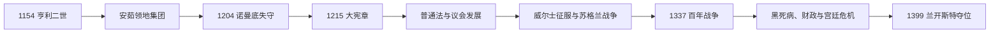

# 金雀花王朝

## 时间

1154年—1399年；“安茹帝国”主要指12世纪后半叶的领地组合

## 别称

安茹王朝、金雀花主系

## 概括

金雀花王朝由玛蒂尔达皇后与安茹伯爵若弗鲁瓦之子亨利二世建立。早期王室控制英格兰、诺曼底、安茹以及通过婚姻取得的阿基坦等地，但这是一组由同一君主统治、法律制度各异的领地，不是统一民族国家。约翰失去大部分法国北部领地后，王室以英格兰税收、司法和议会为重心；《大宪章》、普通法、议会代表制及对威尔士和苏格兰的战争都在此期发展。百年战争、黑死病、财政压力和王族支系竞争，最终使亨利四世于1399年废黜理查二世。

## 演变图

## 建立背景与崛起机制

1153年斯蒂芬承认玛蒂尔达之子亨利为继承人，翌年亨利二世即位。亨利已从父亲继承安茹、曼恩和图赖讷，从母亲主张诺曼底与英格兰，又通过与阿基坦的埃莉诺婚姻取得法国西南广大权利。其优势来自继承和婚姻，而非一次征服。王室依赖巡行、地方总管、法庭和各地贵族契约维系统治；领地广阔同时造成诸子继承、法王宗主权和交通距离的长期压力。

## 完整君主世系

| 顺序 | 君主 | 在位 | 与前任关系 | 关键事件 |
|---:|---|---|---|---|
| 1 | **亨利二世** | 1154—1189 | 玛蒂尔达之子 | 司法和财政改革；征服爱尔兰的宗主介入；与托马斯·贝克特冲突；诸子叛乱。 |
| 共治 | 幼王亨利 | 1170—1183 | 亨利二世长子 | 生前加冕但没有独立统治，先于父王去世。 |
| 2 | 理查一世 | 1189—1199 | 亨利二世第三子 | 第三次十字军、被俘赎金、对法战争；在英时间短但行政仍运转。 |
| 3 | 约翰 | 1199—1216 | 理查一世之弟 | 1204年失去诺曼底；与教宗、贵族战争；《大宪章》及第一次男爵战争。 |
| 4 | **亨利三世** | 1216—1272 | 约翰之子 | 幼年摄政恢复秩序；西西里计划失败；第二次男爵战争与1265年议会。 |
| 5 | **爱德华一世** | 1272—1307 | 亨利三世之子 | 法制立法、1295年模范议会、征服威尔士、苏格兰战争。 |
| 6 | 爱德华二世 | 1307—1327 | 爱德华一世之子 | 宠臣与贵族冲突、班诺克本败战；被伊莎贝拉与莫蒂默废黜。 |
| 7 | **爱德华三世** | 1327—1377 | 爱德华二世之子 | 推翻摄政；百年战争早期胜利；黑死病与议会财政权发展。 |
| 8 | 理查二世 | 1377—1399 | 爱德华三世之孙 | 1381年起义、上诉贵族危机、强化个人统治；被亨利·博林布鲁克废黜。 |

完整英格兰前后世系与争议共治者见[英格兰君主完整世系表](/%E4%BA%BA%E6%96%87%E7%A7%91%E5%AD%A6/%E5%8E%86%E5%8F%B2/%E6%AC%A7%E6%B4%B2/%E4%B8%8D%E5%88%97%E9%A2%A0%E7%BE%A4%E5%B2%9B/%E8%8B%B1%E6%A0%BC%E5%85%B0/%E8%8B%B1%E6%A0%BC%E5%85%B0%E5%90%9B%E4%B8%BB%E5%AE%8C%E6%95%B4%E4%B8%96%E7%B3%BB%E8%A1%A8.md)。

## 统治结构与制度演变

- **王室司法。** 亨利二世通过巡回法官、王室令状和陪审调查扩大普通法范围，地方习惯并未消失，但更多案件进入国王法庭。
- **财政。** 财政署、土地收入、封建权利、关税和议会补助支撑战争。失去大陆领地后，君主更依赖英格兰纳税群体，交换条件是接受请愿与议会监督。
- **大宪章。** 1215年文本首先是内战和解，后经摄政政府重颁。它保护教会自由、封建权利与依法审判，后世才成为普遍法治象征。
- **议会。** 大议会、王室法庭和税收协商逐渐结合。1265年孟福尔议会邀请郡骑士和城市代表，1295年形成更稳定代表模式；14世纪上下两院分化。
- **地方治理。** 郡长、治安法官、郡骑士与城市自治共同构成中央—地方网络，王权强弱取决于地方精英合作。
- **复合领地。** 英王在法国仍以公爵身份向法王效忠，王位与封臣身份重叠，是百年战争的制度根源之一。

## 重要事件与分阶段过程

### 安茹领地集团的扩张与收缩

- 1160—1170年代亨利二世介入威尔士、爱尔兰和布列塔尼；1173—1174年诸子在法王与苏格兰支持下叛乱，显示领地继承矛盾。
- 1170年坎特伯雷大主教托马斯·贝克特被骑士杀害，迫使国王公开赎罪，并限制对教会司法的部分主张。
- 理查一世远征与被俘产生巨额财政负担；约翰与法王腓力二世竞争失利，1204年诺曼底沦陷。
- 1214年布汶战败破坏约翰重夺大陆领地的计划，男爵于1215年迫使其接受《大宪章》。

### 议会国家与领土战争

- 1258年《牛津条例》试图以贵族委员会限制亨利三世；第二次男爵战争中孟福尔一度掌权，1265年被爱德华击败。
- 爱德华一世1277、1282—1283年征服威尔士，1284年以法令重组；1290年苏格兰继承危机使其介入，随后引发长期独立战争。
- 爱德华二世1314年在班诺克本惨败。宫廷宠臣、贵族派系和军事失误导致1327年被迫退位。
- 爱德华三世1337年提出法国王位主张。克雷西、普瓦捷等胜利带来威望，但战争依赖议会税收，并未一次决定法国归属。
- 1348—1350年黑死病造成严重人口死亡，劳动力短缺、工资和土地关系改变；1351年劳工法试图冻结工资。
- 1381年人头税、战争与劳工管制造成大起义。理查二世先谈判后镇压，随后与贵族斗争日益激烈。

## 鼎盛、衰落与直接终结

王朝的强盛来自跨海继承资源、英格兰成熟财政司法、贵族军事服务和法国领地收入；爱德华三世时期长弓、契约军队及金融安排支持远征。结构性压力包括领地分散、法王的封建宗主权、战争成本、瘟疫后的社会变化和王族拥有庞大封地。理查二世没收兰开斯特遗产、放逐博林布鲁克并远征爱尔兰，给对手直接机会。1399年博林布鲁克返国、获得贵族支持并迫使理查退位，金雀花主系结束；但兰开斯特和约克都是金雀花支系，王朝血统并未消失。

## 演变关系

- 前一阶段：[威廉征服时期](/%E4%BA%BA%E6%96%87%E7%A7%91%E5%AD%A6/%E5%8E%86%E5%8F%B2/%E6%AC%A7%E6%B4%B2/%E4%B8%8D%E5%88%97%E9%A2%A0%E7%BE%A4%E5%B2%9B/%E8%8B%B1%E6%A0%BC%E5%85%B0/%E5%A8%81%E5%BB%89%E5%BE%81%E6%9C%8D%E6%97%B6%E6%9C%9F.md)。
- 后一阶段：[兰开斯特王朝](/%E4%BA%BA%E6%96%87%E7%A7%91%E5%AD%A6/%E5%8E%86%E5%8F%B2/%E6%AC%A7%E6%B4%B2/%E4%B8%8D%E5%88%97%E9%A2%A0%E7%BE%A4%E5%B2%9B/%E8%8B%B1%E6%A0%BC%E5%85%B0/%E5%85%B0%E5%BC%80%E6%96%AF%E7%89%B9%E7%8E%8B%E6%9C%9D.md)；并行竞争支系见[约克王朝](/%E4%BA%BA%E6%96%87%E7%A7%91%E5%AD%A6/%E5%8E%86%E5%8F%B2/%E6%AC%A7%E6%B4%B2/%E4%B8%8D%E5%88%97%E9%A2%A0%E7%BE%A4%E5%B2%9B/%E8%8B%B1%E6%A0%BC%E5%85%B0/%E7%BA%A6%E5%85%8B%E7%8E%8B%E6%9C%9D.md)。
- 完整王位序列：[英格兰君主完整世系表](/%E4%BA%BA%E6%96%87%E7%A7%91%E5%AD%A6/%E5%8E%86%E5%8F%B2/%E6%AC%A7%E6%B4%B2/%E4%B8%8D%E5%88%97%E9%A2%A0%E7%BE%A4%E5%B2%9B/%E8%8B%B1%E6%A0%BC%E5%85%B0/%E8%8B%B1%E6%A0%BC%E5%85%B0%E5%90%9B%E4%B8%BB%E5%AE%8C%E6%95%B4%E4%B8%96%E7%B3%BB%E8%A1%A8.md)。
- 所属总览：[英格兰](/%E4%BA%BA%E6%96%87%E7%A7%91%E5%AD%A6/%E5%8E%86%E5%8F%B2/%E6%AC%A7%E6%B4%B2/%E4%B8%8D%E5%88%97%E9%A2%A0%E7%BE%A4%E5%B2%9B/%E8%8B%B1%E6%A0%BC%E5%85%B0/README.md)。
