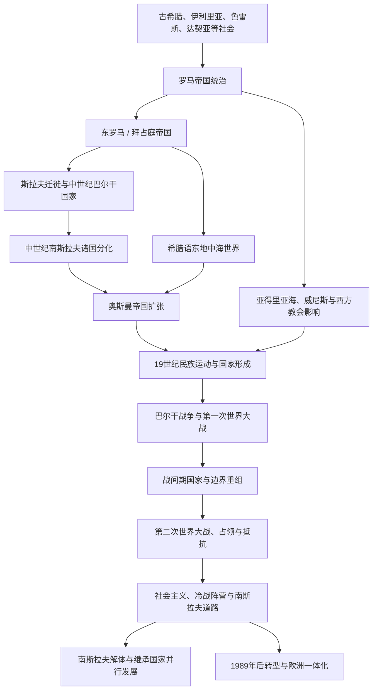

# 东南欧与巴尔干历史

## 范围与概括

东南欧与巴尔干连接亚得里亚海、爱琴海、黑海和多瑙河下游，是希腊、罗马、拜占庭、斯拉夫、奥斯曼、哈布斯堡与威尼斯等政治文化传统交错的地区。本目录以区域共同线和国家连续史并行组织：南斯拉夫历史保留跨国演进节点，保加利亚、塞尔维亚、克罗地亚、斯洛文尼亚、波斯尼亚和黑塞哥维那、黑山、北马其顿、希腊、阿尔巴尼亚和罗马尼亚分别维护国家线。

## 演进图

## 入口

| 国家 / 区域 | 入口 | 主线 |
|---|---|---|
| 希腊 | [希腊](/%E4%BA%BA%E6%96%87%E7%A7%91%E5%AD%A6/%E5%8E%86%E5%8F%B2/%E6%AC%A7%E6%B4%B2/%E4%B8%9C%E5%8D%97%E6%AC%A7%E4%B8%8E%E5%B7%B4%E5%B0%94%E5%B9%B2/%E5%B8%8C%E8%85%8A.md) | 古希腊遗产、拜占庭与奥斯曼时期、独立王国、战争与共和国。 |
| 阿尔巴尼亚 | [阿尔巴尼亚](/%E4%BA%BA%E6%96%87%E7%A7%91%E5%AD%A6/%E5%8E%86%E5%8F%B2/%E6%AC%A7%E6%B4%B2/%E4%B8%9C%E5%8D%97%E6%AC%A7%E4%B8%8E%E5%B7%B4%E5%B0%94%E5%B9%B2/%E9%98%BF%E5%B0%94%E5%B7%B4%E5%B0%BC%E4%BA%9A.md) | 古代西巴尔干、中世纪诸公国、奥斯曼统治、独立、社会主义与转型。 |
| 罗马尼亚 | [罗马尼亚](/%E4%BA%BA%E6%96%87%E7%A7%91%E5%AD%A6/%E5%8E%86%E5%8F%B2/%E6%AC%A7%E6%B4%B2/%E4%B8%9C%E5%8D%97%E6%AC%A7%E4%B8%8E%E5%B7%B4%E5%B0%94%E5%B9%B2/%E7%BD%97%E9%A9%AC%E5%B0%BC%E4%BA%9A.md) | 达契亚与罗马遗产、瓦拉几亚和摩尔达维亚、统一王国、社会主义与共和国。 |
| 南斯拉夫共同线 | [南斯拉夫历史](/%E4%BA%BA%E6%96%87%E7%A7%91%E5%AD%A6/%E5%8E%86%E5%8F%B2/%E6%AC%A7%E6%B4%B2/%E4%B8%9C%E5%8D%97%E6%AC%A7%E4%B8%8E%E5%B7%B4%E5%B0%94%E5%B9%B2/%E5%8D%97%E6%96%AF%E6%8B%89%E5%A4%AB%E5%8E%86%E5%8F%B2/README.md) | 南斯拉夫人南迁、帝国分治、两代南斯拉夫国家、二战与联邦解体。 |
| 保加利亚 | [保加利亚历史](/%E4%BA%BA%E6%96%87%E7%A7%91%E5%AD%A6/%E5%8E%86%E5%8F%B2/%E6%AC%A7%E6%B4%B2/%E4%B8%9C%E5%8D%97%E6%AC%A7%E4%B8%8E%E5%B7%B4%E5%B0%94%E5%B9%B2/%E4%BF%9D%E5%8A%A0%E5%88%A9%E4%BA%9A/README.md) | 两个中世纪帝国、奥斯曼统治、近代王国、社会主义与共和国。 |
| 塞尔维亚 | [塞尔维亚历史](/%E4%BA%BA%E6%96%87%E7%A7%91%E5%AD%A6/%E5%8E%86%E5%8F%B2/%E6%AC%A7%E6%B4%B2/%E4%B8%9C%E5%8D%97%E6%AC%A7%E4%B8%8E%E5%B7%B4%E5%B0%94%E5%B9%B2/%E5%A1%9E%E5%B0%94%E7%BB%B4%E4%BA%9A/README.md) | 中世纪国家、塞尔维亚革命、南斯拉夫国家、塞黑联盟与当代共和国。 |
| 克罗地亚 | [克罗地亚历史](/%E4%BA%BA%E6%96%87%E7%A7%91%E5%AD%A6/%E5%8E%86%E5%8F%B2/%E6%AC%A7%E6%B4%B2/%E4%B8%9C%E5%8D%97%E6%AC%A7%E4%B8%8E%E5%B7%B4%E5%B0%94%E5%B9%B2/%E5%85%8B%E7%BD%97%E5%9C%B0%E4%BA%9A/README.md) | 中世纪王国、匈牙利与哈布斯堡体系、南斯拉夫时期、独立战争与共和国。 |
| 斯洛文尼亚 | [斯洛文尼亚历史](/%E4%BA%BA%E6%96%87%E7%A7%91%E5%AD%A6/%E5%8E%86%E5%8F%B2/%E6%AC%A7%E6%B4%B2/%E4%B8%9C%E5%8D%97%E6%AC%A7%E4%B8%8E%E5%B7%B4%E5%B0%94%E5%B9%B2/%E6%96%AF%E6%B4%9B%E6%96%87%E5%B0%BC%E4%BA%9A/README.md) | 卡兰塔尼亚、哈布斯堡统治、南斯拉夫时期、独立与欧洲整合。 |
| 波斯尼亚和黑塞哥维那 | [波斯尼亚和黑塞哥维那历史](/%E4%BA%BA%E6%96%87%E7%A7%91%E5%AD%A6/%E5%8E%86%E5%8F%B2/%E6%AC%A7%E6%B4%B2/%E4%B8%9C%E5%8D%97%E6%AC%A7%E4%B8%8E%E5%B7%B4%E5%B0%94%E5%B9%B2/%E6%B3%A2%E6%96%AF%E5%B0%BC%E4%BA%9A%E5%92%8C%E9%BB%91%E5%A1%9E%E5%93%A5%E7%BB%B4%E9%82%A3/README.md) | 中世纪国家、奥斯曼与奥匈统治、南斯拉夫时期、战争与代顿体系。 |
| 黑山 | [黑山历史](/%E4%BA%BA%E6%96%87%E7%A7%91%E5%AD%A6/%E5%8E%86%E5%8F%B2/%E6%AC%A7%E6%B4%B2/%E4%B8%9C%E5%8D%97%E6%AC%A7%E4%B8%8E%E5%B7%B4%E5%B0%94%E5%B9%B2/%E9%BB%91%E5%B1%B1/README.md) | 杜克利亚与泽塔、主教公国、王国、南斯拉夫与2006年独立。 |
| 北马其顿 | [北马其顿历史](/%E4%BA%BA%E6%96%87%E7%A7%91%E5%AD%A6/%E5%8E%86%E5%8F%B2/%E6%AC%A7%E6%B4%B2/%E4%B8%9C%E5%8D%97%E6%AC%A7%E4%B8%8E%E5%B7%B4%E5%B0%94%E5%B9%B2/%E5%8C%97%E9%A9%AC%E5%85%B6%E9%A1%BF/README.md) | 马其顿地区史、南斯拉夫共和国建制、独立与国名争议。 |
| 匈牙利 | [匈牙利](/%E4%BA%BA%E6%96%87%E7%A7%91%E5%AD%A6/%E5%8E%86%E5%8F%B2/%E6%AC%A7%E6%B4%B2/%E5%8C%88%E7%89%99%E5%88%A9/README.md) | 喀尔巴阡盆地、奥斯曼—哈布斯堡竞争与奥匈帝国；国家通史在欧洲一级维护。 |
| 拜占庭 | [东罗马帝国与拜占庭帝国](/%E4%BA%BA%E6%96%87%E7%A7%91%E5%AD%A6/%E5%8E%86%E5%8F%B2/%E6%AC%A7%E6%B4%B2/_%E9%80%9A%E5%8F%B2/%E5%8F%A4%E7%BD%97%E9%A9%AC/%E4%B8%9C%E7%BD%97%E9%A9%AC%E5%B8%9D%E5%9B%BD%E4%B8%8E%E6%8B%9C%E5%8D%A0%E5%BA%AD%E5%B8%9D%E5%9B%BD.md) | 中世纪东地中海与东南欧帝国秩序。 |
| 奥斯曼 | [奥斯曼帝国](/%E4%BA%BA%E6%96%87%E7%A7%91%E5%AD%A6/%E5%8E%86%E5%8F%B2/%E8%A5%BF%E4%BA%9A/%E5%9C%9F%E8%80%B3%E5%85%B6/%E5%A5%A5%E6%96%AF%E6%9B%BC%E5%B8%9D%E5%9B%BD/README.md) | 征服、行省、宗教社群、改革与帝国解体。 |

## 关键辨析

- “巴尔干”带有历史地理和政治含义，范围并无唯一标准；罗马尼亚、斯洛文尼亚等地的归属会因问题而变化。
- 东南欧不是奥斯曼与欧洲之间的被动边缘，而是具有城市、王国、教会、商贸和地方政治传统的区域。
- 现代民族国家形成较晚，古代伊利里亚人、达契亚人、色雷斯人等不能直接等同于单一现代民族。
- 宗教、语言和国家边界不重合，东正教、天主教、伊斯兰教及其他传统长期并存。
- 保加利亚属于南斯拉夫语言文化方向，但不是20世纪南斯拉夫国家或其解体后的继承国。
- 古代马其顿王国、马其顿地理区域和现代北马其顿是不同层次的概念，不能用现代国界建立简单直系继承。
