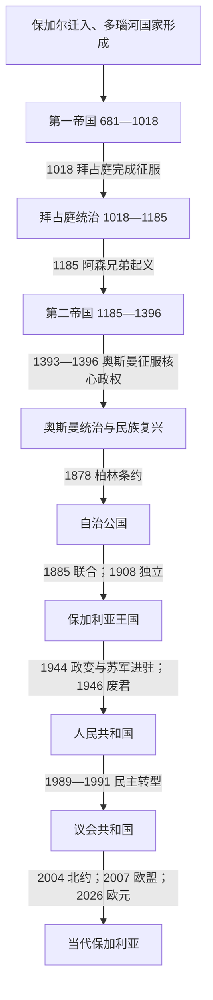

# 保加利亚历史

[返回东南欧与巴尔干历史](/%E4%BA%BA%E6%96%87%E7%A7%91%E5%AD%A6/%E5%8E%86%E5%8F%B2/%E6%AC%A7%E6%B4%B2/%E4%B8%9C%E5%8D%97%E6%AC%A7%E4%B8%8E%E5%B7%B4%E5%B0%94%E5%B9%B2/README.md)

## 概括

保加利亚历史的主轴，是多瑙河下游一个由保加尔政治集团、斯拉夫人口和既有巴尔干社会共同塑成的中世纪国家，先后经历两次帝国建构、拜占庭与奥斯曼统治，再在19世纪民族复兴和列强竞争中形成现代国家。其语言与教会文化属于南斯拉夫—东正教世界，但国家发展始终有独立脉络，并未成为近现代南斯拉夫的一部分。

## 历史主线

- **国家形成与制度整合**：阿斯巴鲁赫集团在多瑙河以南立足，681年获得东罗马帝国承认；8—9世纪的军事扩张、中央集权与族群融合，使“保加利亚”从征服集团的政权名转化为共同政治身份。
- **基督教化与文字文化**：鲍里斯一世受洗、普雷斯拉夫会议采用斯拉夫语礼仪，以及普雷斯拉夫和奥赫里德文学中心的发展，使国家进入东正教文明圈，并成为古教会斯拉夫语和西里尔文字传播的重要枢纽。
- **两次帝国与两次断裂**：第一帝国在西美昂一世时达到军事和文化高峰，却在罗斯入侵、东西地域分割和拜占庭持续战争中灭亡；第二帝国由阿森家族复国，伊凡·阿森二世时再度强盛，后因继承危机、地方割据和外部压力而被奥斯曼逐步征服。
- **奥斯曼框架下的社会延续**：中世纪国家机构消失，但村社、城市行会、修道院与东正教教区维持社会生活。18—19世纪教育、出版、教会自主和革命网络逐渐把宗教文化共同体转化为现代民族政治运动。
- **现代国家的边界竞争**：1878年的安排没有实现圣斯特凡诺条约设想的大保加利亚；1885年联合东鲁米利亚、巴尔干战争和两次世界大战中的选择，都围绕马其顿、色雷斯与多布罗加等问题展开。
- **社会制度转型**：1944年后共产党在苏联支持下掌权，完成国有化、集体化与工业化；1989年后转向多党民主和市场经济，并逐步加入欧洲—大西洋制度体系。

## 历史阶段导航

| 顺序 | 阶段 | 时间 | 简要概括 |
|---:|---|---|---|
| 1 | [保加利亚第一帝国](/%E4%BA%BA%E6%96%87%E7%A7%91%E5%AD%A6/%E5%8E%86%E5%8F%B2/%E6%AC%A7%E6%B4%B2/%E4%B8%9C%E5%8D%97%E6%AC%A7%E4%B8%8E%E5%B7%B4%E5%B0%94%E5%B9%B2/%E4%BF%9D%E5%8A%A0%E5%88%A9%E4%BA%9A/%E4%BF%9D%E5%8A%A0%E5%88%A9%E4%BA%9A%E7%AC%AC%E4%B8%80%E5%B8%9D%E5%9B%BD.md) | 681年—1018年 | 国家建立、基督教化、帝国竞争及斯拉夫文字文化兴盛。 |
| 2 | [拜占庭统治与保加利亚复国运动](/%E4%BA%BA%E6%96%87%E7%A7%91%E5%AD%A6/%E5%8E%86%E5%8F%B2/%E6%AC%A7%E6%B4%B2/%E4%B8%9C%E5%8D%97%E6%AC%A7%E4%B8%8E%E5%B7%B4%E5%B0%94%E5%B9%B2/%E4%BF%9D%E5%8A%A0%E5%88%A9%E4%BA%9A/%E6%8B%9C%E5%8D%A0%E5%BA%AD%E7%BB%9F%E6%B2%BB%E4%B8%8E%E4%BF%9D%E5%8A%A0%E5%88%A9%E4%BA%9A%E5%A4%8D%E5%9B%BD%E8%BF%90%E5%8A%A8.md) | 1018年—1185年 | 纳入拜占庭军政和教会体系，多次起义失败后由阿森兄弟复国。 |
| 3 | [保加利亚第二帝国](/%E4%BA%BA%E6%96%87%E7%A7%91%E5%AD%A6/%E5%8E%86%E5%8F%B2/%E6%AC%A7%E6%B4%B2/%E4%B8%9C%E5%8D%97%E6%AC%A7%E4%B8%8E%E5%B7%B4%E5%B0%94%E5%B9%B2/%E4%BF%9D%E5%8A%A0%E5%88%A9%E4%BA%9A/%E4%BF%9D%E5%8A%A0%E5%88%A9%E4%BA%9A%E7%AC%AC%E4%BA%8C%E5%B8%9D%E5%9B%BD.md) | 1185年—1396年；部分王统主张延至1422年 | 特尔诺沃国家复兴、13世纪扩张，后分裂并遭奥斯曼征服。 |
| 4 | [奥斯曼统治与民族复兴](/%E4%BA%BA%E6%96%87%E7%A7%91%E5%AD%A6/%E5%8E%86%E5%8F%B2/%E6%AC%A7%E6%B4%B2/%E4%B8%9C%E5%8D%97%E6%AC%A7%E4%B8%8E%E5%B7%B4%E5%B0%94%E5%B9%B2/%E4%BF%9D%E5%8A%A0%E5%88%A9%E4%BA%9A/%E5%A5%A5%E6%96%AF%E6%9B%BC%E7%BB%9F%E6%B2%BB%E4%B8%8E%E6%B0%91%E6%97%8F%E5%A4%8D%E5%85%B4.md) | 14世纪末—1878年 | 帝国治理、社会经济变迁、民族复兴和解放运动。 |
| 5 | [保加利亚公国与王国](/%E4%BA%BA%E6%96%87%E7%A7%91%E5%AD%A6/%E5%8E%86%E5%8F%B2/%E6%AC%A7%E6%B4%B2/%E4%B8%9C%E5%8D%97%E6%AC%A7%E4%B8%8E%E5%B7%B4%E5%B0%94%E5%B9%B2/%E4%BF%9D%E5%8A%A0%E5%88%A9%E4%BA%9A/%E4%BF%9D%E5%8A%A0%E5%88%A9%E4%BA%9A%E5%85%AC%E5%9B%BD%E4%B8%8E%E7%8E%8B%E5%9B%BD.md) | 1878年—1946年 | 自治公国、1885年联合、1908年独立，以及战争与威权化。 |
| 6 | [保加利亚人民共和国](/%E4%BA%BA%E6%96%87%E7%A7%91%E5%AD%A6/%E5%8E%86%E5%8F%B2/%E6%AC%A7%E6%B4%B2/%E4%B8%9C%E5%8D%97%E6%AC%A7%E4%B8%8E%E5%B7%B4%E5%B0%94%E5%B9%B2/%E4%BF%9D%E5%8A%A0%E5%88%A9%E4%BA%9A/%E4%BF%9D%E5%8A%A0%E5%88%A9%E4%BA%9A%E4%BA%BA%E6%B0%91%E5%85%B1%E5%92%8C%E5%9B%BD.md) | 1946年—1990年 | 共产党一党体制、计划经济与苏联阵营。 |
| 7 | [保加利亚共和国](/%E4%BA%BA%E6%96%87%E7%A7%91%E5%AD%A6/%E5%8E%86%E5%8F%B2/%E6%AC%A7%E6%B4%B2/%E4%B8%9C%E5%8D%97%E6%AC%A7%E4%B8%8E%E5%B7%B4%E5%B0%94%E5%B9%B2/%E4%BF%9D%E5%8A%A0%E5%88%A9%E4%BA%9A/%E4%BF%9D%E5%8A%A0%E5%88%A9%E4%BA%9A%E5%85%B1%E5%92%8C%E5%9B%BD.md) | 1990年至今 | 民主与市场转型、加入北约和欧盟，2026年采用欧元。 |

## 世系与领导表

| 专表 | 覆盖范围 | 使用说明 |
|---|---|---|
| [保加利亚中世纪统治者世系表](/%E4%BA%BA%E6%96%87%E7%A7%91%E5%AD%A6/%E5%8E%86%E5%8F%B2/%E6%AC%A7%E6%B4%B2/%E4%B8%9C%E5%8D%97%E6%AC%A7%E4%B8%8E%E5%B7%B4%E5%B0%94%E5%B9%B2/%E4%BF%9D%E5%8A%A0%E5%88%A9%E4%BA%9A/%E4%BF%9D%E5%8A%A0%E5%88%A9%E4%BA%9A%E4%B8%AD%E4%B8%96%E7%BA%AA%E7%BB%9F%E6%B2%BB%E8%80%85%E4%B8%96%E7%B3%BB%E8%A1%A8.md) | 681—1018年、1185—1396年，并列政权与争议继承人 | 按在位顺序列出早期年代争议、共治、废立、僭位和末期并立。 |
| [保加利亚现代国家元首与政府首脑表](/%E4%BA%BA%E6%96%87%E7%A7%91%E5%AD%A6/%E5%8E%86%E5%8F%B2/%E6%AC%A7%E6%B4%B2/%E4%B8%9C%E5%8D%97%E6%AC%A7%E4%B8%8E%E5%B7%B4%E5%B0%94%E5%B9%B2/%E4%BF%9D%E5%8A%A0%E5%88%A9%E4%BA%9A/%E4%BF%9D%E5%8A%A0%E5%88%A9%E4%BA%9A%E7%8E%B0%E4%BB%A3%E5%9B%BD%E5%AE%B6%E5%85%83%E9%A6%96%E4%B8%8E%E6%94%BF%E5%BA%9C%E9%A6%96%E8%84%91%E8%A1%A8.md) | 1879年至2026年7月14日 | 区分君主、摄政、国家元首、政府首脑与共产党实际最高领导。 |

## 重要转折与时间节点

| 时间 | 事件 | 长期意义 |
|---|---|---|
| 680—681年 | 翁加尔之战及和约 | 东罗马承认多瑙河以南的保加利亚政权，形成传统建国纪年。 |
| 864—870年 | 鲍里斯一世受洗及教会安排 | 统一统治精英与人口的宗教框架，并为独立教会奠基。 |
| 886—893年 | 西里尔、麦托迪门徒入境及普雷斯拉夫会议 | 斯拉夫语成为教会和国家文化语言，形成文字传播中心。 |
| 917年 | 阿赫洛伊战役 | 第一帝国军事实力和西美昂的帝国主张达到高峰。 |
| 971—1018年 | 东部失守与西部抵抗 | 国家重心转向奥赫里德，最终被巴西尔二世征服。 |
| 1185年 | 阿森兄弟起义 | 拜占庭统治终结，第二帝国形成。 |
| 1205年 | 亚德里安堡战役 | 卡洛扬击败拉丁帝国，保加利亚重回巴尔干强权之列。 |
| 1230年 | 克洛科特尼察战役 | 伊凡·阿森二世建立第二帝国的最大势力范围。 |
| 1393—1396年 | 特尔诺沃、维丁失陷 | 中世纪核心政权终结；残余王统与反抗仍延续一段时间。 |
| 1762—1870年 | 民族史书写、学校与督主教区运动 | 现代民族认同由文化复兴转向独立制度诉求。 |
| 1876—1878年 | 四月起义、俄土战争与柏林条约 | 自治公国建立，但疆界问题成为后续冲突根源。 |
| 1885年 | 与东鲁米利亚联合 | 现代保加利亚领土和政治自主显著扩大。 |
| 1908年 | 宣布完全独立 | 结束名义上的奥斯曼宗主权，亲王改称沙皇。 |
| 1913年 | 第二次巴尔干战争失败 | “民族统一”战略受挫，并影响两次世界大战选边。 |
| 1944—1946年 | 祖国阵线掌权与废除君主制 | 苏联影响下的一党社会主义国家形成。 |
| 1989—1991年 | 日夫科夫下台、圆桌会议和新宪法 | 多党议会共和国与市场转型启动。 |
| 2004、2007年 | 加入北约、欧洲联盟 | 安全与经济制度重心转入欧洲—大西洋体系。 |
| 2026年 | 采用欧元 | 完成加入欧元区这一长期欧洲一体化步骤。 |

## 关键辨析

- “第一帝国”“第二帝国”是现代史学常用分期；中世纪统治者使用过“保加利亚人的君主”“沙皇”等称号，具体称号及其获承认程度会随时期变化。
- 1018—1185年并非人口或文化消失，而是独立王权中断；奥赫里德总主教区、地方精英和多次起义保存了政治记忆。
- 1396年适合标记维丁政权覆亡，却不能抹去康斯坦丁二世、弗鲁任等人在15世纪初的王统主张与反奥斯曼行动。
- 1878年的保加利亚公国在国际法上仍承认奥斯曼宗主权；1908年才宣布完全独立。
- 1946年后的名义国家元首、部长会议主席和共产党第一书记并非同一角色；判断实际权力须结合一党体制。
- 截至2026年7月14日，保加利亚是议会共和国；总统是伊利亚娜·约托娃，政府由总理鲁门·拉德夫领导。
