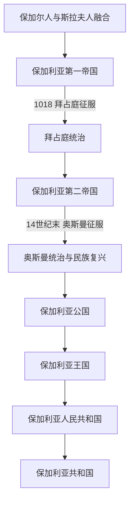

# 保加利亚历史

[返回东南欧与巴尔干历史](/%E4%BA%BA%E6%96%87%E7%A7%91%E5%AD%A6/%E5%8E%86%E5%8F%B2/%E6%AC%A7%E6%B4%B2/%E4%B8%9C%E5%8D%97%E6%AC%A7%E4%B8%8E%E5%B7%B4%E5%B0%94%E5%B9%B2/README.md)

## 概括

保加利亚历史可按“保加尔人与斯拉夫人融合形成中世纪国家 → 两个保加利亚帝国 → 奥斯曼统治与民族复兴 → 自治公国和独立王国 → 社会主义人民共和国 → 议会共和国”来理解。它属于南斯拉夫语言文化方向，却始终是一条独立国家线，从未加入20世纪的南斯拉夫国家。

## 历史阶段导航

| 顺序 | 阶段 | 时间 | 历史走向 |
|---:|---|---|---|
| 1 | [保加利亚第一帝国](/%E4%BA%BA%E6%96%87%E7%A7%91%E5%AD%A6/%E5%8E%86%E5%8F%B2/%E6%AC%A7%E6%B4%B2/%E4%B8%9C%E5%8D%97%E6%AC%A7%E4%B8%8E%E5%B7%B4%E5%B0%94%E5%B9%B2/%E4%BF%9D%E5%8A%A0%E5%88%A9%E4%BA%9A/%E4%BF%9D%E5%8A%A0%E5%88%A9%E4%BA%9A%E7%AC%AC%E4%B8%80%E5%B8%9D%E5%9B%BD.md) | 681年—1018年 | 国家形成、基督教化及斯拉夫文字文化传播。 |
| 2 | [保加利亚第二帝国](/%E4%BA%BA%E6%96%87%E7%A7%91%E5%AD%A6/%E5%8E%86%E5%8F%B2/%E6%AC%A7%E6%B4%B2/%E4%B8%9C%E5%8D%97%E6%AC%A7%E4%B8%8E%E5%B7%B4%E5%B0%94%E5%B9%B2/%E4%BF%9D%E5%8A%A0%E5%88%A9%E4%BA%9A/%E4%BF%9D%E5%8A%A0%E5%88%A9%E4%BA%9A%E7%AC%AC%E4%BA%8C%E5%B8%9D%E5%9B%BD.md) | 1185年—14世纪末 | 摆脱拜占庭统治后复国，后因分裂和奥斯曼扩张衰落。 |
| 3 | [奥斯曼统治与民族复兴](/%E4%BA%BA%E6%96%87%E7%A7%91%E5%AD%A6/%E5%8E%86%E5%8F%B2/%E6%AC%A7%E6%B4%B2/%E4%B8%9C%E5%8D%97%E6%AC%A7%E4%B8%8E%E5%B7%B4%E5%B0%94%E5%B9%B2/%E4%BF%9D%E5%8A%A0%E5%88%A9%E4%BA%9A/%E5%A5%A5%E6%96%AF%E6%9B%BC%E7%BB%9F%E6%B2%BB%E4%B8%8E%E6%B0%91%E6%97%8F%E5%A4%8D%E5%85%B4.md) | 14世纪末—1878年 | 帝国统治、教会和教育运动及自治诉求发展。 |
| 4 | [保加利亚公国与王国](/%E4%BA%BA%E6%96%87%E7%A7%91%E5%AD%A6/%E5%8E%86%E5%8F%B2/%E6%AC%A7%E6%B4%B2/%E4%B8%9C%E5%8D%97%E6%AC%A7%E4%B8%8E%E5%B7%B4%E5%B0%94%E5%B9%B2/%E4%BF%9D%E5%8A%A0%E5%88%A9%E4%BA%9A/%E4%BF%9D%E5%8A%A0%E5%88%A9%E4%BA%9A%E5%85%AC%E5%9B%BD%E4%B8%8E%E7%8E%8B%E5%9B%BD.md) | 1878年—1946年 | 自治、统一、独立及两次世界大战中的边界竞争。 |
| 5 | [保加利亚人民共和国](/%E4%BA%BA%E6%96%87%E7%A7%91%E5%AD%A6/%E5%8E%86%E5%8F%B2/%E6%AC%A7%E6%B4%B2/%E4%B8%9C%E5%8D%97%E6%AC%A7%E4%B8%8E%E5%B7%B4%E5%B0%94%E5%B9%B2/%E4%BF%9D%E5%8A%A0%E5%88%A9%E4%BA%9A/%E4%BF%9D%E5%8A%A0%E5%88%A9%E4%BA%9A%E4%BA%BA%E6%B0%91%E5%85%B1%E5%92%8C%E5%9B%BD.md) | 1946年—1990年 | 共产党主导的社会主义国家，处于苏联阵营。 |
| 6 | [保加利亚共和国](/%E4%BA%BA%E6%96%87%E7%A7%91%E5%AD%A6/%E5%8E%86%E5%8F%B2/%E6%AC%A7%E6%B4%B2/%E4%B8%9C%E5%8D%97%E6%AC%A7%E4%B8%8E%E5%B7%B4%E5%B0%94%E5%B9%B2/%E4%BF%9D%E5%8A%A0%E5%88%A9%E4%BA%9A/%E4%BF%9D%E5%8A%A0%E5%88%A9%E4%BA%9A%E5%85%B1%E5%92%8C%E5%9B%BD.md) | 1990年至今 | 民主转型、市场化及欧洲—大西洋体系整合。 |

## 重要转折

| 时间 | 事件 | 意义 |
|---|---|---|
| 864年前后 | 基督教化 | 保加利亚进入东正教文化圈。 |
| 1018年 | 拜占庭征服第一帝国 | 保加利亚国家线暂时中断。 |
| 1185年 | 阿森兄弟起义 | 第二帝国建立。 |
| 1878年 | 柏林会议 | 保加利亚公国建立，东鲁米利亚另行自治。 |
| 1908年 | 宣布完全独立 | 保加利亚王国形成。 |
| 1946年 | 废除君主制 | 人民共和国成立。 |
| 1990—1991年 | 政治转型与新宪法 | 当代议会共和国制度形成。 |

## 关键辨析

- 中世纪保加利亚并非单纯“斯拉夫国家”：其形成包含保加尔政治集团与斯拉夫人口融合，并吸收拜占庭制度和基督教文化。
- 现代国家不能被画成第一帝国的无间断直系延续，中间经历拜占庭与奥斯曼统治及近代民族国家建构。
- 保加利亚属于南斯拉夫语族和巴尔干历史，却不是南斯拉夫王国或社会主义南斯拉夫的组成部分。
