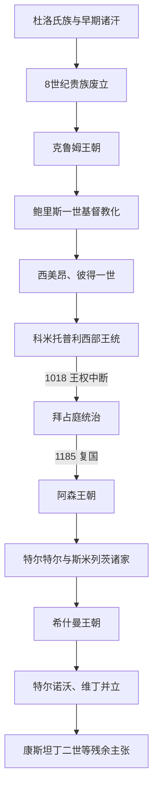

# 保加利亚中世纪统治者世系表

[保加利亚历史](/%E4%BA%BA%E6%96%87%E7%A7%91%E5%AD%A6/%E5%8E%86%E5%8F%B2/%E6%AC%A7%E6%B4%B2/%E4%B8%9C%E5%8D%97%E6%AC%A7%E4%B8%8E%E5%B7%B4%E5%B0%94%E5%B9%B2/%E4%BF%9D%E5%8A%A0%E5%88%A9%E4%BA%9A/README.md)

## 范围与口径

本表覆盖保加利亚第一帝国与第二帝国的公认统治者，并将共治、并立、拜占庭扶植者、起义称帝者和末期争议继承人分开标明。早期8世纪年代主要依据《保加利亚诸汗名录》和拜占庭叙事重建，姓名、氏族、亲属关系与准确在位年均存在不同学术方案；表中“约”不应理解为精确日期。

## 第一帝国主序列

| 顺序 | 统治者 | 氏族或王朝 | 在位 | 与前任关系 | 关键事件与争议说明 |
|---:|---|---|---|---|---|
| 1 | **阿斯巴鲁赫（Asparuh）** | 杜洛氏族 | 约680/681—约701年 | 旧大保加利亚统治者库布拉特之子 | 翁加尔击败东罗马，681年和约确认多瑙河国家；卒年有700、701等说。 |
| 2 | **特尔维尔（Tervel）** | 通常归杜洛氏族 | 约701—约721年 | 多认为阿斯巴鲁赫之子或近亲 | 705年助查士丁尼二世复位，获凯撒称号；参与717—718年反围城战争。 |
| 3 | 科尔梅西（Kormesiy） | 不详 | 约721—738年 | 关系不详 | 主要由名录、铭文和后世编年重建；有方案缩短、移动或不单列其统治。 |
| 4 | 塞瓦尔（Sevar） | 杜洛氏族 | 约738—753年 | 关系不详 | 常被视为杜洛氏族末代君主；确切起止年有争议。 |
| 5 | 科尔米索什（Kormisosh） | 沃基尔氏族 | 约753—756年 | 非杜洛氏族，或经贵族政变即位 | 与拜占庭战争加剧，后被废或死亡。 |
| 6 | 维涅赫（Vinekh） | 沃基尔氏族 | 约756—762年 | 同氏族或贵族推立 | 取得马尔凯拉战役胜利后未追击，被贵族杀死。 |
| 7 | 特列茨（Telets） | 乌盖因氏族 | 762—765年 | 政变即位 | 安基阿卢斯战败后被贵族杀死。 |
| 8 | 萨宾（Sabin） | 可能沃基尔氏族 | 765—766年 | 通过婚姻与科尔米索什家族相连 | 主张议和，遭反对后逃往拜占庭。 |
| 9 | 乌莫尔（Umor） | 沃基尔氏族 | 766年，约四十日 | 萨宾指定继承人 | 被托克图支持者推翻；在位极短。 |
| 10 | 托克图（Toktu） | 不详 | 766—767年 | 政变即位 | 遭反对派和拜占庭压力，逃亡途中被杀。 |
| 11 | 帕甘（Pagan） | 不详 | 约767—768年 | 贵族推立 | 与拜占庭谈判后仍遭入侵，后被部下杀害。 |
| 12 | 特列里格（Telerig） | 不详 | 768—777年 | 关系不详 | 以反间清除拜占庭情报网；退位或逃往君士坦丁堡并受洗。 |
| 13 | 卡尔达姆（Kardam） | 不详 | 777—约803年 | 关系不详 | 结束长期废立，恢复对拜占庭的军事主动。 |
| 14 | **克鲁姆（Krum）** | 克鲁姆王朝 | 约803—814年 | 与卡尔达姆关系不确定 | 吸收阿瓦遗产，809年取塞尔迪卡，811年歼灭尼基弗鲁斯一世。 |
| 15 | **奥穆尔塔格（Omurtag）** | 克鲁姆王朝 | 814—831年 | 克鲁姆之子 | 与拜占庭缔结长期和平，强化中央、建筑和边疆行政。 |
| 16 | 马拉米尔（Malamir） | 克鲁姆王朝 | 831—836年 | 奥穆尔塔格幼子 | 由卡夫汗伊斯布尔辅政，继续向色雷斯扩张。 |
| 17 | 普列西安一世（Presian I） | 克鲁姆王朝 | 836—852年 | 多认为奥穆尔塔格之孙、兹维尼察之子 | 势力扩至马其顿；亲属重建仍有细节争议。 |
| 18 | **鲍里斯一世—米哈伊尔（Boris I）** | 克鲁姆王朝 | 852—889年 | 普列西安一世之子 | 864—865年受洗，870年取得自治教会；889年入修道院，893年短暂出山废长子。 |
| 19 | 弗拉基米尔—拉萨特（Vladimir-Rasate） | 克鲁姆王朝 | 889—893年 | 鲍里斯一世长子 | 试图改变父亲宗教与外交政策，被鲍里斯废黜并刺瞎。 |
| 20 | **西美昂一世（Simeon I）** | 克鲁姆王朝 | 893—927年 | 鲍里斯一世第三子，弗拉基米尔之弟 | 阿赫洛伊大胜，采用沙皇称号；军事扩张与文化黄金时代。 |
| 21 | **彼得一世（Peter I）** | 克鲁姆王朝 | 927—969年 | 西美昂一世之子 | 927年和约获帝号与教会地位承认；晚期遭马扎尔、罗斯压力。 |
| 22 | 鲍里斯二世（Boris II） | 克鲁姆王朝 | 969—971年实际在位；名义权利延至977年 | 彼得一世之子 | 971年普雷斯拉夫失陷，被带往君士坦丁堡并公开褫夺王权；977年逃归时误遭杀害。 |
| 23 | 罗曼（Roman） | 克鲁姆王朝 | 977—991年实际或名义在位；997年卒 | 鲍里斯二世之弟 | 名义沙皇，军政主要由萨穆伊尔掌握；991年被俘，997年死于拜占庭。 |
| 24 | **萨穆伊尔（Samuel）** | 科米托普利王朝 | 976年起为实际统帅，997—1014年为沙皇 | 科米托普利四兄弟之一；罗曼死后承位 | 以奥赫里德为中心抗拜占庭；986年图拉真关大胜，1014年克雷迪翁战败后去世。 |
| 25 | 加夫里尔·拉多米尔（Gavril Radomir） | 科米托普利王朝 | 1014—1015年 | 萨穆伊尔之子 | 继续战争，被堂弟伊凡·弗拉迪斯拉夫杀害。 |
| 26 | **伊凡·弗拉迪斯拉夫（Ivan Vladislav）** | 科米托普利王朝 | 1015—1018年 | 萨穆伊尔之侄、阿龙之子 | 杀前任夺位；围攻都拉齐翁时阵亡，各地随后归降。 |
| 27 | 普列西安二世（Presian II） | 科米托普利王朝 | 1018年短暂主张 | 伊凡·弗拉迪斯拉夫之子 | 在山地继续抵抗后投降；是否计作正式沙皇存在争议。 |

### 第一帝国的短暂、共同与争议领导

| 人物 | 时间 | 性质 | 说明 |
|---|---|---|---|
| 杜库姆（Dukum） | 814年 | 争议过渡统治者 | 少数重建把他列为克鲁姆死后的短期继承人；主流简表常直接由奥穆尔塔格继位。 |
| 迪岑格（Ditseng） | 814—815年前后 | 争议过渡统治者 | 史料零碎，是否独立在位、与宗教迫害记载如何对应均不确定。 |
| 大卫、摩西、阿龙、萨穆伊尔 | 976年前后 | 科米托普利共同领导集团 | 鲍里斯二世和罗曼仍拥有王统名义时，四兄弟领导西部抵抗；大卫、摩西早亡，阿龙被萨穆伊尔处决。 |
| 鲍里斯一世复出 | 893年 | 退位君主临时干预 | 从修道院出山废黜弗拉基米尔并主持秩序重建，通常不另算第二段正式在位。 |

## 拜占庭时期的复国称帝者

| 人物 | 主张时间 | 继承或合法性主张 | 结果 |
|---|---|---|---|
| 彼得·德梁（Peter Delyan） | 1040—1041年 | 自称加夫里尔·拉多米尔之子，被拥立为沙皇 | 被阿卢西安刺瞎，起义遭拜占庭镇压；出身真伪存在争议。 |
| 蒂霍米尔（Tihomir） | 1040年 | 都拉齐翁军区叛军另立的领袖 | 与德梁合流后在集会上被除掉，不构成稳定独立王统。 |
| 阿卢西安（Alusian） | 1041年 | 伊凡·弗拉迪斯拉夫之子，以王族身份争权 | 进攻失败后背叛德梁，投降拜占庭。 |
| 康斯坦丁·博丁“彼得三世” | 1072年 | 泽塔王子，受格奥尔基·沃伊泰赫等拥立 | 起义失败被俘；后来成为杜克利亚统治者，并未恢复保加利亚国家。 |

## 第二帝国主序列

| 顺序 | 统治者 | 王朝或政治基础 | 在位 | 与前任关系 | 关键事件与备注 |
|---:|---|---|---|---|---|
| 1 | **彼得四世（Peter IV，原名托多尔）** | 阿森王朝 | 1185—1197年 | 复国领袖 | 与弟弟伊凡·阿森一世共治；1196年后短暂单独执政，1197年遇刺。 |
| 2 | **伊凡·阿森一世（Ivan Asen I）** | 阿森王朝 | 1187—1196年，与彼得四世共治 | 彼得四世之弟 | 主要军事领袖，1190年击败伊萨克二世；被贵族伊万科刺杀。 |
| 3 | **卡洛扬（Kaloyan）** | 阿森王朝 | 1197—1207年 | 彼得、阿森之弟 | 获教廷承认，1205年亚德里安堡俘拉丁皇帝；围塞萨洛尼基时死亡。 |
| 4 | 博里尔（Boril） | 阿森王朝旁支 | 1207—1218年 | 卡洛扬外甥或姐妹之子，夺位 | 对抗拉丁、伊庇鲁斯及内部反叛；被归国的伊凡·阿森二世废黜。 |
| 5 | **伊凡·阿森二世（Ivan Asen II）** | 阿森王朝 | 1218—1241年 | 伊凡·阿森一世之子 | 1230年克洛科特尼察大胜，1235年恢复宗主教区，第二帝国达高峰。 |
| 6 | 卡利曼·阿森一世（Kaliman I Asen） | 阿森王朝 | 1241—1246年 | 伊凡·阿森二世之子，幼主 | 在蒙古压力和宫廷摄政下统治，早逝或遭毒杀。 |
| 7 | 米哈伊尔·阿森二世（Michael II Asen） | 阿森王朝 | 1246—1256年 | 伊凡·阿森二世之子、前任异母弟 | 幼年即位，领土遭尼西亚夺取；后被堂亲卡利曼二世杀害。 |
| 8 | 卡利曼·阿森二世（Kaliman II Asen） | 阿森王朝旁支 | 1256年 | 伊凡·阿森二世之侄或堂亲 | 弑君即位，数月后被杀。 |
| 9 | 米措·阿森（Mitso Asen） | 阿森姻亲 | 1256—1257/1258年，主要控制东部 | 伊凡·阿森二世女婿 | 与康斯坦丁·蒂赫争位，败后把沿海据点交拜占庭换取领地。 |
| 10 | 康斯坦丁·蒂赫·阿森（Constantine Tikh Asen） | 蒂赫家族，借阿森名号 | 1257—1277年 | 贵族推举，娶阿森王族后裔 | 长期受拜占庭、匈牙利和蒙古压力；被伊瓦伊洛军击败身亡。 |
| 11 | 伊瓦伊洛（Ivaylo） | 起义军与部分特尔诺沃集团 | 1277/1278—1280年 | 起义击败前任，娶遗后玛丽亚 | 抗蒙古并抵御拜占庭扶植者；失去贵族支持后流亡，遭金帐汗处死。 |
| 12 | 伊凡·阿森三世（Ivan Asen III） | 阿森女系、拜占庭扶植 | 1279—1280年，与伊瓦伊洛争位 | 伊凡·阿森二世之外孙 | 拜占庭军护送入特尔诺沃；局势不利时携国库逃亡。 |
| 13 | 格奥尔基·特尔特尔一世（George I Terter） | 特尔特尔王朝 | 1280—1292年 | 贵族拥立 | 受金帐汗国支配，后退位流亡拜占庭。 |
| 14 | 斯米列茨（Smilets） | 斯米列茨家族、金帐支持 | 1292—1298年 | 金帐汗国影响下取代前任 | 中央依赖诺盖汗，死因不详。 |
| 15 | 伊凡二世（Ivan II） | 斯米列茨家族 | 1298—1299年 | 斯米列茨幼子 | 由母亲斯米尔采娜摄政，恰卡入境后失位。 |
| 16 | 恰卡（Chaka） | 成吉思汗系诺盖之子 | 1299—1300年 | 借托多尔·斯韦托斯拉夫支持夺取特尔诺沃 | 遭昔日盟友推翻并杀死，首级送交金帐汗脱脱。 |
| 17 | **托多尔·斯韦托斯拉夫（Theodore Svetoslav）** | 特尔特尔王朝 | 1300—1321/1322年 | 格奥尔基一世之子 | 结束直接蒙古控制、镇压反对派并收复黑海沿岸；卒年有1321、1322两说。 |
| 18 | 格奥尔基·特尔特尔二世（George II Terter） | 特尔特尔王朝 | 1321/1322—1323年 | 前任之子 | 乘拜占庭内战扩张色雷斯，早逝且无嗣。 |
| 19 | **米哈伊尔·希什曼（Michael III Shishman）** | 希什曼王朝、维丁地方势力 | 1323—1330年 | 贵族推举，维丁专制君主 | 试图重建地区霸权，韦尔布日德战败重伤而死。 |
| 20 | 伊凡·斯特凡（Ivan Stephen） | 希什曼王朝 | 1330—1331年 | 米哈伊尔·希什曼之子，获塞尔维亚支持 | 宫廷政变后逃亡，在位约八个月。 |
| 21 | **伊凡·亚历山大（Ivan Alexander）** | 希什曼旁支 | 1331—1371年 | 米哈伊尔·希什曼外甥或姐妹之子 | 恢复部分领土并推动文化繁荣；将维丁和特尔诺沃继承分别安排给两支儿子。 |
| 22 | **伊凡·希什曼（Ivan Shishman）** | 希什曼王朝特尔诺沃支 | 1371—1395年 | 伊凡·亚历山大次婚之子 | 控制特尔诺沃及中部，曾向奥斯曼称臣；1393失都，1395被处死。 |
| 23 | **伊凡·斯拉齐米尔（Ivan Sratsimir）** | 希什曼王朝维丁支 | 约1356—1396年，与父亲及弟弟并立 | 伊凡·亚历山大长子 | 以维丁为中心，曾受匈牙利占领；1396年尼科波尔战后被奥斯曼俘虏。 |

## 第二帝国共治、并立与地方政权

| 人物或政权 | 时间 | 与主王统关系 | 说明 |
|---|---|---|---|
| 米哈伊尔·阿森四世 | 约1332—1355年 | 伊凡·亚历山大长子、共治沙皇 | 先于父亲死亡，未单独继位；在与奥斯曼人的战斗中阵亡之说存在年代差异。 |
| 伊凡·阿森四世 | 约1337—1349年 | 伊凡·亚历山大之子、共治者 | 年轻去世，通常不列为独立君主。 |
| 伊凡·阿森五世 | 约1359—1380年代 | 伊凡·亚历山大次婚之子、共治者 | 铭文与后世材料有限，任期和死亡年份存在争议。 |
| 巴利克 | 约1340年代—约1347年 | 多布罗加地方统治者 | 在东北形成事实独立政权，不使用全保加利亚沙皇地位。 |
| 多布罗蒂察 | 约1350年代—1385年 | 多布罗加专制君主 | 控制黑海沿岸并有独立外交、舰队；名义关系随时期变化。 |
| 伊万科 | 1385—约1388/1389年 | 多布罗蒂察之子 | 与热那亚、奥斯曼和特尔诺沃分别交涉；政权后被奥斯曼吞并。 |
| **康斯坦丁二世（Constantine II）** | 1396年后—1422年 | 伊凡·斯拉齐米尔之子、维丁王统继承人 | 邻国文书仍称其为保加利亚皇帝；实际领土控制范围与连续性有争议。 |
| 弗鲁任（Fruzhin） | 15世纪初—约1460年 | 伊凡·希什曼之子、王位主张者 | 与康斯坦丁二世、匈牙利和瓦拉几亚合作发动反奥斯曼行动，未恢复国家。 |

## 世系连续性说明

- 第一帝国在971年失去东部都城和被拜占庭废黜的君主，但西部抵抗及王统仍存在，故终年为1018年而非971年。
- 罗曼在位期间萨穆伊尔是实际军事领导；997年罗曼去世后，萨穆伊尔才正式取得沙皇名义。
- 第二帝国早期的彼得四世与伊凡·阿森一世共治，不能按不重叠单线表理解。
- 1277—1280年伊瓦伊洛、伊凡·阿森三世及特尔诺沃贵族集团并争，合法性和实际控制不断变化。
- 伊凡·斯拉齐米尔自14世纪中叶即在维丁并立，不是伊凡·希什曼死后的简单继位者。
- 把第二帝国结束时间写成1393、1396或1422，分别强调特尔诺沃陷落、维丁核心政权灭亡或末代王统主张终结；本库以1396年为政权终点，同时保留1422年争议。

## 相关阶段

- [保加利亚第一帝国](/%E4%BA%BA%E6%96%87%E7%A7%91%E5%AD%A6/%E5%8E%86%E5%8F%B2/%E6%AC%A7%E6%B4%B2/%E4%B8%9C%E5%8D%97%E6%AC%A7%E4%B8%8E%E5%B7%B4%E5%B0%94%E5%B9%B2/%E4%BF%9D%E5%8A%A0%E5%88%A9%E4%BA%9A/%E4%BF%9D%E5%8A%A0%E5%88%A9%E4%BA%9A%E7%AC%AC%E4%B8%80%E5%B8%9D%E5%9B%BD.md)
- [拜占庭统治与保加利亚复国运动](/%E4%BA%BA%E6%96%87%E7%A7%91%E5%AD%A6/%E5%8E%86%E5%8F%B2/%E6%AC%A7%E6%B4%B2/%E4%B8%9C%E5%8D%97%E6%AC%A7%E4%B8%8E%E5%B7%B4%E5%B0%94%E5%B9%B2/%E4%BF%9D%E5%8A%A0%E5%88%A9%E4%BA%9A/%E6%8B%9C%E5%8D%A0%E5%BA%AD%E7%BB%9F%E6%B2%BB%E4%B8%8E%E4%BF%9D%E5%8A%A0%E5%88%A9%E4%BA%9A%E5%A4%8D%E5%9B%BD%E8%BF%90%E5%8A%A8.md)
- [保加利亚第二帝国](/%E4%BA%BA%E6%96%87%E7%A7%91%E5%AD%A6/%E5%8E%86%E5%8F%B2/%E6%AC%A7%E6%B4%B2/%E4%B8%9C%E5%8D%97%E6%AC%A7%E4%B8%8E%E5%B7%B4%E5%B0%94%E5%B9%B2/%E4%BF%9D%E5%8A%A0%E5%88%A9%E4%BA%9A/%E4%BF%9D%E5%8A%A0%E5%88%A9%E4%BA%9A%E7%AC%AC%E4%BA%8C%E5%B8%9D%E5%9B%BD.md)
