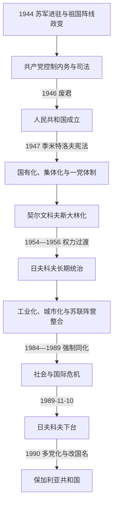

# 保加利亚人民共和国

[保加利亚历史](/%E4%BA%BA%E6%96%87%E7%A7%91%E5%AD%A6/%E5%8E%86%E5%8F%B2/%E6%AC%A7%E6%B4%B2/%E4%B8%9C%E5%8D%97%E6%AC%A7%E4%B8%8E%E5%B7%B4%E5%B0%94%E5%B9%B2/%E4%BF%9D%E5%8A%A0%E5%88%A9%E4%BA%9A/README.md)

## 时间

1946年9月15日—1990年11月15日。实际制度转型始于1989年11月日夫科夫下台；1990年1—2月共产党放弃权力垄断，4月设总统职位，11月国名改为“保加利亚共和国”。

## 概括

保加利亚人民共和国是在第二次世界大战末期苏军进驻和祖国阵线掌权的基础上建立的社会主义国家。共产党通过内务机构、人民法庭、选举控制和清除反对派取得一党统治，随后按苏联模式实行国有化、农业集体化和计划工业化。教育、医疗、女性就业、城市化和工业能力显著扩张，但政治镇压、审查、秘密警察和对苏联市场的依赖构成制度代价。托多尔·日夫科夫长期执政，1980年代经济停滞、债务、精英分裂及对土耳其族的强制同化共同削弱政权，最终在东欧剧变中和平转型。

## 建立背景与夺权过程

### 1944年权力转移

1944年9月5日苏联向仍试图退出轴心阵营的保加利亚宣战。9月9日，祖国阵线在军官、共产党地下组织和游击队配合下夺取索菲亚关键机构，基蒙·格奥尔基耶夫出任首相。新政府对德宣战并派军参加南斯拉夫、匈牙利方向作战。

祖国阵线最初包括共产党、农业联盟“广场派”、“环节”集团和社会民主派，但权力并不均衡。共产党控制内务部、民兵和政治组织，苏联盟国管制委员会具有决定性外部影响。人民法庭审判前摄政、部长、议员、军官及其他人员，处决和监禁规模远超一般战后问责，也为摧毁旧政治精英服务。

### 从联合政府到一党体制

1945年反对派抵制或质疑选举环境。格奥尔基·季米特洛夫回国后成为最高政治人物；1946年9月公投废君，11月由其组阁。1947年反对派农业联盟领袖尼古拉·佩特科夫被捕、审判和处决，同年“季米特洛夫宪法”确立人民民主国家框架。社会民主党被迫合并，农业联盟保留为服从共产党的卫星党。

1947年末大规模国有化后，银行、工业、运输和批发贸易转入国家控制；随后农业集体化以征购、行政压力和惩罚推进。1948年苏南决裂使政府停止此前在皮林马其顿推动的马其顿民族政策，并清洗被指“铁托主义”的特拉伊乔·科斯托夫等干部。

## 分阶段发展

### 季米特洛夫与契尔文科夫时期

季米特洛夫试图在巴尔干联邦设想、苏联路线和国内改造之间协调，1949年去世。维尔科·契尔文科夫随后集党政权力于一身，仿照斯大林模式推行重工业优先、农业集体化、干部清洗和个人崇拜。劳改营与强制迁移被用来压制政治反对者、宗教人士及被定为“不可靠”的群体，贝莱内营成为镇压象征。

工业投资和扫盲带来工厂、能源、技术教育和城市人口增长，但消费品、住房和农业供给不足。过高指标、强制交售和行政命令也使生产数据与实际效率脱节。

### 日夫科夫的权力巩固

托多尔·日夫科夫1954年任党第一书记，但最初两年仍与总理契尔文科夫分享权力；1956年去斯大林化后才成为无争议的实际最高领导。此后他通过轮换干部、控制党组织和保持对莫斯科忠诚，连续执政至1989年。

1962年日夫科夫兼任总理，1971年新宪法明确共产党领导地位并设国务委员会，他转任其主席。国家元首、政府首脑与党总书记在不同时段由不同人担任，但党内第一书记或总书记才是权力判断的核心。完整角色序列见[保加利亚现代国家元首与政府首脑表](/%E4%BA%BA%E6%96%87%E7%A7%91%E5%AD%A6/%E5%8E%86%E5%8F%B2/%E6%AC%A7%E6%B4%B2/%E4%B8%9C%E5%8D%97%E6%AC%A7%E4%B8%8E%E5%B7%B4%E5%B0%94%E5%B9%B2/%E4%BF%9D%E5%8A%A0%E5%88%A9%E4%BA%9A/%E4%BF%9D%E5%8A%A0%E5%88%A9%E4%BA%9A%E7%8E%B0%E4%BB%A3%E5%9B%BD%E5%AE%B6%E5%85%83%E9%A6%96%E4%B8%8E%E6%94%BF%E5%BA%9C%E9%A6%96%E8%84%91%E8%A1%A8.md)。

### 社会经济现代化

| 领域 | 主要变化 | 成效与代价 |
|---|---|---|
| 工业 | 建设机械、化工、电子、军工和能源部门 | 从农业国转为工业化社会，但技术和市场高度依赖经互会，能耗与污染高。 |
| 农业 | 合作农庄进一步合并为大型农工综合体 | 机械化和专业化提高部分产出，行政定价、规模过大和人口外流削弱效率。 |
| 城市与住房 | 大量人口进入索菲亚、普罗夫迪夫、瓦尔纳等城市，兴建板式住宅 | 改善基础住房覆盖，也造成单调规划、拥挤和城乡差距。 |
| 教育与医疗 | 普及中等教育、技术培训和公共医疗 | 识字、寿命与女性职业参与提高；课程、研究和文化受意识形态审查。 |
| 社会保障 | 低价公共服务、就业保障和退休制度扩展 | 提供稳定预期，但隐性失业和财政补贴掩盖生产率问题。 |
| 文化与宗教 | 国家资助艺术、体育和遗产，同时控制出版与教会 | 文化普及与审查、秘密警察监控并存。 |

### 对外关系

保加利亚1949年加入经济互助委员会，1955年加入华沙条约组织，是苏联最可靠的欧洲盟友之一。政府曾讨论与苏联更深的一体化，但未形成正式加盟。1968年保军参与华沙条约组织入侵捷克斯洛伐克。对希腊、土耳其和南斯拉夫关系则受北约边界、马其顿问题和少数族群政策影响。

对外经济依赖苏联能源、原料和经互会市场。1970—1980年代政府尝试电子、化工、旅游和西方贷款，以提高出口；但质量、硬通货收入和债务之间越来越不平衡。

## 少数族群与“复兴进程”

保加利亚有土耳其族、罗姆人、波马克等群体。早期政权曾提供土耳其语学校和出版，后逐步限制宗教、语言和跨境联系。1984—1985年国家以“复兴进程”为名强迫土耳其族改用斯拉夫名字，禁止或压缩土耳其语、服饰和宗教习俗，并以警察和军队镇压反抗。

1989年政府开放边境并逼迫、鼓励大批土耳其族前往土耳其，形成所谓“大旅行”，约数十万人在短期内离境，部分后来返回。政策造成劳动力损失、国际谴责和国内道德危机，是政权晚期合法性崩塌的重要因素。

## 重要事件

| 时间 | 事件 | 结果与影响 |
|---|---|---|
| 1944年9月 | 祖国阵线政变 | 保加利亚转向对德作战，共产党凭内务机构和苏联支持占据优势。 |
| 1944—1945年 | 人民法庭与政治清洗 | 前政权精英大量被处决、监禁，正常政治竞争基础被破坏。 |
| 1946年 | 废除君主制 | 西美昂二世流亡，人民共和国成立。 |
| 1947年 | 佩特科夫被处决与新宪法 | 主要反对派被消灭，一党制度和计划经济法律化。 |
| 1947—1958年 | 国有化与农业集体化 | 国家控制生产资料，农村遭强制征购和组织重组。 |
| 1949年 | 科斯托夫审判 | 苏南决裂背景下清洗党内异议，斯大林化达到高峰。 |
| 1954—1956年 | 日夫科夫接任并巩固 | 从契尔文科夫过渡到长期个人化党统治。 |
| 1968年 | 参加入侵捷克斯洛伐克 | 显示保加利亚对苏联安全路线的高度服从。 |
| 1971年 | 新宪法与国务委员会 | 明文确认共产党领导地位，日夫科夫整合党政权力。 |
| 1981年 | 建国1300周年纪念 | 国家以中世纪遗产和社会主义现代化结合塑造民族合法性。 |
| 1984—1985年 | 强制改名运动 | 对土耳其族系统同化，造成死亡、监禁和长期社会创伤。 |
| 1989年夏 | “大旅行” | 大规模人口外流加剧经济、外交和政权危机。 |
| 1989年11月10日 | 日夫科夫被党内罢黜 | 姆拉德诺夫接任，制度转型从精英内部启动。 |
| 1990年1—6月 | 取消一党垄断、圆桌会议和选举 | 反对派合法化，共产党改名社会党，但仍赢得首次多党选举。 |
| 1990年11月15日 | 改国名 | “人民共和国”终结，国家正式称保加利亚共和国。 |

## 维持统治的条件

- 苏联军事存在和早期联盟管制给共产党夺取强制机关提供外部保障。
- 党组织深入工厂、军队、学校与地方行政，人事任命形成层级控制。
- 工业化、教育、公共医疗与社会保障确实改善大批人口生活，为制度提供绩效合法性。
- 国家控制就业、住房、媒体和社会组织，公开反对的个人成本高。
- 日夫科夫在莫斯科历次权力更替中保持忠诚，又用干部轮换防止国内形成替代中心。

## 衰落与制度终结

### 结构因素

- 计划指标奖励数量而非质量，企业缺乏成本与创新约束；对经互会价格和苏联原料过度依赖。
- 人口老化、农村空心化和低生育开始显现，社会保障承诺的成本上升。
- 党政精英封闭、秘密警察监控和腐败削弱早期现代化带来的合法性。
- 西方贷款和硬通货缺口使1980年代经济调整空间缩小。

### 外部压力

- 戈尔巴乔夫改革削弱莫斯科对东欧强硬路线的支持，日夫科夫与苏联新领导关系恶化。
- 经互会市场前景、能源结算和外债压力动摇旧增长模式。
- 对土耳其族政策遭土耳其、欧洲国家和国际组织持续批评。
- 1989年波兰、匈牙利、东德和捷克斯洛伐克的转型打破“无替代方案”的预期。

### 直接触发与转型

1989年秋，党内领导层判断日夫科夫已成为经济改革和外交关系的负担，11月10日将其罢黜。新领导先撤销强制改名政策，随后在社会抗议和反对派联合下接受圆桌会议。1990年宪法中的共产党领导条款被取消，党改名并参与竞争性选举。这个过程是党内政变、社会动员和东欧国际环境共同作用的渐进制度转换，而非一次武装革命。

## 演变关系

- 前一节点：[保加利亚公国与王国](/%E4%BA%BA%E6%96%87%E7%A7%91%E5%AD%A6/%E5%8E%86%E5%8F%B2/%E6%AC%A7%E6%B4%B2/%E4%B8%9C%E5%8D%97%E6%AC%A7%E4%B8%8E%E5%B7%B4%E5%B0%94%E5%B9%B2/%E4%BF%9D%E5%8A%A0%E5%88%A9%E4%BA%9A/%E4%BF%9D%E5%8A%A0%E5%88%A9%E4%BA%9A%E5%85%AC%E5%9B%BD%E4%B8%8E%E7%8E%8B%E5%9B%BD.md)。
- 后一节点：[保加利亚共和国](/%E4%BA%BA%E6%96%87%E7%A7%91%E5%AD%A6/%E5%8E%86%E5%8F%B2/%E6%AC%A7%E6%B4%B2/%E4%B8%9C%E5%8D%97%E6%AC%A7%E4%B8%8E%E5%B7%B4%E5%B0%94%E5%B9%B2/%E4%BF%9D%E5%8A%A0%E5%88%A9%E4%BA%9A/%E4%BF%9D%E5%8A%A0%E5%88%A9%E4%BA%9A%E5%85%B1%E5%92%8C%E5%9B%BD.md)。
- 1944年是实际权力转移，1946年是法定君主制终结，1989—1991年则是从一党国家到议会共和国的连续过渡。
