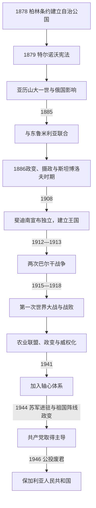

# 保加利亚公国与王国

[保加利亚历史](/%E4%BA%BA%E6%96%87%E7%A7%91%E5%AD%A6/%E5%8E%86%E5%8F%B2/%E6%AC%A7%E6%B4%B2/%E4%B8%9C%E5%8D%97%E6%AC%A7%E4%B8%8E%E5%B7%B4%E5%B0%94%E5%B9%B2/%E4%BF%9D%E5%8A%A0%E5%88%A9%E4%BA%9A/README.md)

## 时间

1878年—1946年。1878—1908年为承认奥斯曼宗主权的自治公国；1885年与东鲁米利亚联合；1908—1946年为完全独立的保加利亚王国。

## 概括

现代保加利亚国家建立于俄土战争与柏林条约形成的国际框架。自由主义的特尔诺沃宪法、列强对君主的选择和俄国军事—官僚影响共同塑造公国。1885年联合东鲁米利亚证明本地政治主动性，1908年则利用国际危机宣布独立。国家随后为马其顿、色雷斯和多布罗加卷入巴尔干战争及两次世界大战；战争失败、社会分化和政变使议会制度反复中断。1944年苏军进驻与祖国阵线政变改变实际权力，1946年君主制被废。

## 建立背景与国际安排

1878年圣斯特凡诺条约设想一个包括马其顿和色雷斯大片地区的保加利亚自治体，但这只是俄奥战争结束后的初步条约。柏林会议为限制俄国影响，把其拆分为：

| 地区 | 1878年安排 | 实际权力 |
|---|---|---|
| 保加利亚公国 | 多瑙河至巴尔干山脉及索菲亚地区的自治世袭公国 | 有本国宪法、议会、政府和军队，国际法上仍承认奥斯曼宗主权。 |
| 东鲁米利亚 | 巴尔干山脉以南的奥斯曼自治省 | 由基督徒总督管理，有地方议会与民兵，苏丹保留主权。 |
| 马其顿与色雷斯大部 | 归还奥斯曼直接统治 | 改革承诺未能解决民族和教会竞争。 |
| 北多布罗加 | 归罗马尼亚 | 成为后来保罗领土争议的一部分。 |

俄国临时政府先组织行政、军队和制宪准备；1879年制宪会议通过特尔诺沃宪法，规定一院制国民议会、部长责任、较广男性选举权与公民自由。大国依据柏林条约限制，从欧洲王族中选出亚历山大·巴滕贝格为亲王。

## 分阶段发展

### 亚历山大一世与宪政冲突

自由派主张议会主权，保守派和亲王担心行政薄弱；俄国军官又掌握早期军队。1881年亚历山大暂停宪法，以“权力体制”强化君权和俄国顾问地位；政治反弹及俄国政策矛盾迫使他在1883年恢复宪法。

东鲁米利亚的保加利亚秘密中央革命委员会于1885年9月发动政变，宣布与公国联合。亚历山大接受联合并南下，俄国却撤回军官。塞尔维亚担忧地区均势而进攻，保加利亚军在斯利夫尼察等战役获胜。1886年《托普哈内协定》以亚历山大兼任东鲁米利亚总督的形式承认既成事实。

### 1886年危机与斯坦博洛夫时期

亲俄军官1886年8月迫使亚历山大退位，斯特凡·斯坦博洛夫等发动反政变，但亚历山大在俄国敌意下最终离国。摄政团在大国压力中维持政府，1887年选斐迪南·萨克森—科堡—哥达为亲王。

斯坦博洛夫任首相期间压制亲俄政变和反对派，发展铁路、教育和对西欧贸易，以较强行政国家摆脱俄国控制；政治警察、选举操控和暴力也使宪政受损。1894年他失势，次年遇刺。斐迪南在长子鲍里斯改宗东正教后与俄国恢复关系，逐步掌握外交与军队。

### 独立与巴尔干战争

1908年青年土耳其革命、奥匈吞并波黑等危机打乱柏林体系。斐迪南在特尔诺沃宣布完全独立并称沙皇，政府经赔偿与外交谈判取得奥斯曼和列强承认。

1912年保加利亚与塞尔维亚、希腊、黑山组成巴尔干同盟，第一次巴尔干战争把奥斯曼军逼退至君士坦丁堡近郊，保军在洛曾格勒、吕莱布尔加兹和亚德里安堡战事中付出巨大伤亡。胜利后，马其顿划分、塞尔维亚未获亚得里亚海出口及希腊占领塞萨洛尼基等问题引发同盟破裂。1913年保军攻击塞希阵地，罗马尼亚和奥斯曼趁机参战。第二次巴尔干战争使保加利亚失去大部分马其顿、南多布罗加和部分色雷斯，形成“第一次国家灾难”的政治记忆。

### 第一次世界大战

政府以收复马其顿为核心，在协约国和同盟国之间谈判，1915年加入同盟国并参与击败塞尔维亚。保军控制瓦尔达尔马其顿并在萨洛尼卡战线长期作战，也参与对罗马尼亚战争。海上封锁、军需短缺、通货膨胀和农村劳力损失造成厌战；1918年多布罗波列防线崩溃，士兵发动弗拉代亚起义。9月《萨洛尼卡停战协定》使保加利亚率先退出大战，斐迪南退位。1919年《讷伊条约》规定割地、赔款和裁军，难民与复仇政治加深。

### 战间期的改革、政变与王权强化

亚历山大·斯坦博利斯基领导农业联盟，以农民为基础推行累进税、土地和教育改革，并与南斯拉夫和解、打击马其顿内部革命组织。城市精英、军官、旧党和革命组织结成反对联盟，1923年六月政变推翻并杀害他。共产党同年九月起义失败；1925年圣周日教堂爆炸造成大量死伤，政府实施严厉镇压。

1934年“环节”集团与军事联盟政变，解散政党、限制地方自治并推动国家统制。鲍里斯三世1935年清除政变领导人，建立无政党但保留议会形式的王室威权体制。它不同于法西斯一党国家，却压制有组织反对派并把外交和军队集中于君主。

### 第二次世界大战与君主制终结

保加利亚初期中立，1940年在轴心国压力和苏联默认的地区环境下，经《克拉约瓦条约》从罗马尼亚收回南多布罗加。1941年3月加入三国同盟，允许德军由境内进攻希腊和南斯拉夫，并管理瓦尔达尔马其顿、爱琴海色雷斯等占领区。保加利亚没有向苏联宣战，却在德国压力下对英国、美国宣战，遭盟军轰炸。

政府实施反犹法律、财产限制和强迫劳动。1943年，来自占领的马其顿和色雷斯约一万一千余名犹太人被保加利亚当局交给纳粹体系并遭杀害；对战前保加利亚疆内犹太人的驱逐，则因议员迪米塔尔·佩舍夫、东正教高级教士、社会抗议和政府政治计算而暂停。两者必须同时记述，不能用战前疆域内约五万名犹太人幸存来抹去当局参与驱逐占领区犹太人的责任。

鲍里斯三世1943年8月突然去世，幼子西美昂二世继位，由摄政团掌权。1944年轴心国败局迫近，政府试图中立和求和。苏联9月5日宣战并越过边境，祖国阵线于9月9日政变夺权，保军转而对德作战。共产党凭苏军存在、内务机构和组织优势逐步压倒盟友；人民法庭大规模审判并处决前摄政、部长和议员。1946年公投在反对派受压和共产党控制国家机器的环境下废除君主制，西美昂流亡。

## 统治结构

| 时期 | 国家元首 | 政府与议会 | 实际权力特征 |
|---|---|---|---|
| 1878—1908年公国 | 亲王 | 依特尔诺沃宪法由部长会议和国民议会运作 | 亲王、议会党派、俄国军官与列强影响相互竞争。 |
| 1908—1934年王国 | 沙皇 | 多党议会内阁，战争期与危机期权力集中 | 君主主导外交军务，首相和议会仍有真实但不稳定的作用。 |
| 1934—1944年威权阶段 | 鲍里斯三世；1943年后幼主和摄政 | 政党被禁或失去正常竞争，内阁由王室和官僚集团控制 | 1935年后鲍里斯三世是实际权力中心；幼主期由摄政与政府分掌。 |
| 1944—1946年过渡 | 西美昂二世及1944年后新摄政 | 祖国阵线政府，议会和行政迅速共产党化 | 苏联军事存在、共产党和内务系统决定权力转移。 |

## 君主与摄政

| 顺序 | 君主 | 王室 | 在位 | 与前任关系 | 关键事件 |
|---:|---|---|---|---|---|
| 1 | **亚历山大一世** | 巴滕贝格家族 | 1879—1886年 | 制宪会议选举 | 宪法暂停与恢复；接受1885年联合，塞保战争获胜；亲俄政变后退位。 |
| 2 | **斐迪南一世** | 萨克森—科堡—哥达王朝 | 1887—1918年 | 大国僵局中由国民议会选举 | 1908年由亲王改称沙皇；两次巴尔干战争及一战失败后退位。 |
| 3 | **鲍里斯三世** | 萨克森—科堡—哥达王朝 | 1918—1943年 | 斐迪南一世长子 | 战间期由宪政转向王室威权；1941年加入三国同盟，1943年去世。 |
| 4 | **西美昂二世** | 萨克森—科堡—哥达王朝 | 1943—1946年 | 鲍里斯三世之子，幼年继位 | 由两届摄政团代行王权；1946年废君后流亡，2001—2005年以民选总理身份执政但未复辟。 |

摄政团、1879—1946年全部政府首脑及1944年后实际权力更替，见[保加利亚现代国家元首与政府首脑表](/%E4%BA%BA%E6%96%87%E7%A7%91%E5%AD%A6/%E5%8E%86%E5%8F%B2/%E6%AC%A7%E6%B4%B2/%E4%B8%9C%E5%8D%97%E6%AC%A7%E4%B8%8E%E5%B7%B4%E5%B0%94%E5%B9%B2/%E4%BF%9D%E5%8A%A0%E5%88%A9%E4%BA%9A/%E4%BF%9D%E5%8A%A0%E5%88%A9%E4%BA%9A%E7%8E%B0%E4%BB%A3%E5%9B%BD%E5%AE%B6%E5%85%83%E9%A6%96%E4%B8%8E%E6%94%BF%E5%BA%9C%E9%A6%96%E8%84%91%E8%A1%A8.md)。

## 重要事件

| 时间 | 事件 | 结果与长期影响 |
|---|---|---|
| 1879年 | 特尔诺沃宪法与亚历山大一世当选 | 奠定现代议会君主制，但君权与党争冲突持续。 |
| 1881—1883年 | “权力体制” | 亲王暂停宪法后复原，显示俄国影响与本地宪政的矛盾。 |
| 1885—1886年 | 联合、塞保战争与外交承认 | 东鲁米利亚事实上并入，现代国家领土基础形成。 |
| 1886年 | 亲俄政变和反政变 | 亚历山大退位，摄政与斯坦博洛夫建立更独立于俄国的路线。 |
| 1908年 | 宣布独立 | 终结奥斯曼名义宗主权，斐迪南称沙皇。 |
| 1912—1913年 | 两次巴尔干战争 | 第一次扩张、第二次惨败，马其顿问题转为复仇政治。 |
| 1915—1918年 | 参加第一次世界大战 | 初期占领目标地区，经济社会崩溃后战败退场。 |
| 1919年 | 讷伊条约 | 赔款、裁军、割地和难民问题长期激化政治。 |
| 1923年 | 六月政变与九月起义 | 农业联盟被摧毁，暴力政治和左右对抗升级。 |
| 1934—1935年 | 军事政变与王室反制 | 正常政党竞争结束，鲍里斯三世成为权力中心。 |
| 1940年 | 收回南多布罗加 | 通过外交修约取得领土，是战间领土政策少数成功。 |
| 1941年 | 加入三国同盟 | 获占领区管理权，也承担反犹迫害、战争和轰炸后果。 |
| 1943年 | 鲍里斯三世去世 | 幼主摄政削弱决策中心，战争退场更困难。 |
| 1944年9月 | 苏联宣战与祖国阵线政变 | 国家转向反德作战，共产党在苏联支持下掌握强制机构。 |
| 1946年 | 公投废除君主制 | 王室流亡，共和国和社会主义改造开始。 |

## 崛起条件与制度成就

- 俄土战争摧毁奥斯曼直接统治，欧洲列强又接受有限自治国家作为均势安排。
- 特尔诺沃宪法提供议会、政府责任和政治动员框架，学校、军队和官僚迅速本地化。
- 1885年地方革命组织、公国军队和社会支持结合，在俄国反对下仍完成联合。
- 铁路、黑海与多瑙贸易、教育普及和难民安置扩大国家能力。
- 在列强竞争中灵活利用危机，使1908年独立与1940年南多布罗加回归得以实现。

## 衰落与灭亡原因

### 结构因素

- “民族统一”目标超出现有疆界，与塞尔维亚、希腊、罗马尼亚和奥斯曼诉求重叠，使外交容易转为高风险战争。
- 农民占人口多数，土地、税负与战争动员问题使城市旧党、农业联盟、军官和共产党长期对立。
- 王室主导外交、军队政治化和政变传统削弱议会制度；1934年后合法竞争渠道进一步收缩。
- 两次大战和赔款造成财政、人口与难民压力，强化修约主义。

### 外部压力

- 俄国、奥匈、德国、英国和法国把保加利亚置于巴尔干均势和交通战略中，本国目标常依赖大国承诺。
- 1913年遭原盟友、罗马尼亚和奥斯曼多面夹击；1918年同盟国整体失败；1944年德国败退与苏军进入均压倒国内选择。
- 1941年领土扩张依赖德国军事胜利，因而缺乏可持续国际承认。

### 直接终结过程

1944年苏军宣战使原政府的停战策略失效，祖国阵线政变控制首都和行政，摄政团随后被更换。共产党凭内务和司法机构清除旧精英并削弱农业联盟等伙伴。1946年公投废君并非王朝自然绝嗣，而是战争失败、苏联占领性影响和共产党夺权共同导致的制度断裂。

## 演变关系

- 前一节点：[保加利亚的奥斯曼统治与民族复兴](/%E4%BA%BA%E6%96%87%E7%A7%91%E5%AD%A6/%E5%8E%86%E5%8F%B2/%E6%AC%A7%E6%B4%B2/%E4%B8%9C%E5%8D%97%E6%AC%A7%E4%B8%8E%E5%B7%B4%E5%B0%94%E5%B9%B2/%E4%BF%9D%E5%8A%A0%E5%88%A9%E4%BA%9A/%E5%A5%A5%E6%96%AF%E6%9B%BC%E7%BB%9F%E6%B2%BB%E4%B8%8E%E6%B0%91%E6%97%8F%E5%A4%8D%E5%85%B4.md)。
- 后一节点：[保加利亚人民共和国](/%E4%BA%BA%E6%96%87%E7%A7%91%E5%AD%A6/%E5%8E%86%E5%8F%B2/%E6%AC%A7%E6%B4%B2/%E4%B8%9C%E5%8D%97%E6%AC%A7%E4%B8%8E%E5%B7%B4%E5%B0%94%E5%B9%B2/%E4%BF%9D%E5%8A%A0%E5%88%A9%E4%BA%9A/%E4%BF%9D%E5%8A%A0%E5%88%A9%E4%BA%9A%E4%BA%BA%E6%B0%91%E5%85%B1%E5%92%8C%E5%9B%BD.md)。
- 国家在1944年9月已发生实际权力转移，法定君主制则到1946年9月才终结。
