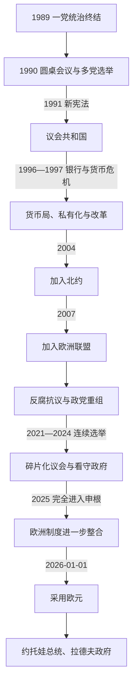

# 保加利亚共和国

[保加利亚历史](/%E4%BA%BA%E6%96%87%E7%A7%91%E5%AD%A6/%E5%8E%86%E5%8F%B2/%E6%AC%A7%E6%B4%B2/%E4%B8%9C%E5%8D%97%E6%AC%A7%E4%B8%8E%E5%B7%B4%E5%B0%94%E5%B9%B2/%E4%BF%9D%E5%8A%A0%E5%88%A9%E4%BA%9A/README.md)

## 时间

1990年11月15日至今。1991年7月12日新宪法确立现行议会共和国框架。本文现实人物与制度状态核验至2026年7月14日。

## 概括

当代保加利亚在一党体制瓦解后建立多党议会民主、私有制市场经济和直接民选总统制度。转型经历失业、贫富分化、银行危机和国家资产私有化，也建立货币稳定、自由选举和欧洲制度嵌入。2004年加入北约，2007年加入欧洲联盟，2025年完全进入申根区，2026年采用欧元。腐败、司法问责、人口下降和政党碎片化持续造成提前选举与看守政府；2026年1—5月又发生总统继任、看守内阁和议会政府连续更替。

## 宪制建立与权力结构

1990年大国民议会由改名后的保加利亚社会党赢得多数，但反对派民主力量联盟进入制度。7月，因公开抗议和“坦克言论”录像争议，佩塔尔·姆拉德诺夫辞去总统；反对派哲学家热柳·热列夫由议会选为总统。跨党派的迪米塔尔·波波夫政府负责价格改革和制宪过渡。

1991年宪法确立：

| 机构 | 产生方式 | 主要权力 | 制衡关系 |
|---|---|---|---|
| 国民议会 | 比例代表制直选，通常240席 | 立法、预算、选举总理和内阁、监督政府 | 可通过不信任案罢免政府；提前解散时触发选举。 |
| 总理与部长会议 | 由议会多数支持并表决产生 | 国内外政策、行政、预算执行和安全协调 | 保加利亚是议会制，总统不是日常行政最高领导。 |
| 总统 | 直选，任期五年，最多连任一次 | 国家代表、否决后退回法律、任命看守政府等宪法职权 | 否决可由议会推翻；正常时期不能指挥内阁。 |
| 宪法法院 | 依宪法由不同机关产生法官 | 审查法律、选举和国家机关争议 | 在总统辞职、政党合宪性等问题上作最终宪法判断。 |
| 司法与检察体系 | 具有制度独立和专门治理机构 | 审判、调查和公诉 | 总检察长问责、司法委员会组成长期是欧盟法治争议核心。 |

总统职位虽重要，但政府首脑才掌握日常行政。议会无法形成政府时，总统依程序任命看守内阁；2021—2024年的连续选举使看守政府远超原本短期过渡功能。完整总统、代行总统、正式与看守总理序列见[保加利亚现代国家元首与政府首脑表](/%E4%BA%BA%E6%96%87%E7%A7%91%E5%AD%A6/%E5%8E%86%E5%8F%B2/%E6%AC%A7%E6%B4%B2/%E4%B8%9C%E5%8D%97%E6%AC%A7%E4%B8%8E%E5%B7%B4%E5%B0%94%E5%B9%B2/%E4%BF%9D%E5%8A%A0%E5%88%A9%E4%BA%9A/%E4%BF%9D%E5%8A%A0%E5%88%A9%E4%BA%9A%E7%8E%B0%E4%BB%A3%E5%9B%BD%E5%AE%B6%E5%85%83%E9%A6%96%E4%B8%8E%E6%94%BF%E5%BA%9C%E9%A6%96%E8%84%91%E8%A1%A8.md)。

## 分阶段发展

### 1990—1997年：制度与经济震荡

1991年民主力量联盟政府推动归还财产和市场改革，却因议会支持破裂下台。柳本·贝罗夫专家政府依赖不稳定联盟，私有化缓慢、金融与有组织犯罪网络增长。1995年社会党政府在国有企业亏损、银行监管失败、粮食短缺和外债压力下陷入危机。

1996—1997年多家银行倒闭，列弗贬值与恶性通货膨胀吞噬储蓄。全国抗议和议会冲突迫使社会党放弃组阁，斯特凡·索菲扬斯基看守政府稳定供给。伊万·科斯托夫政府1997年建立与德国马克挂钩的货币局，关闭或私有化亏损企业、改革银行和争取欧盟谈判。宏观稳定恢复，但失业、资产低价转移和地区不平等造成长期争议。

### 2001—2009年：前国王执政与欧洲一体化

流亡回国的前国王西美昂二世以公民运动参加选举，2001年用本名西美昂·萨克森—科堡—哥达出任总理；这不是君主复辟，而是共和宪法下的议会执政。政府继续私有化、税制和北约—欧盟谈判。保加利亚2004年加入北约。

2005年谢尔盖·斯塔尼舍夫领导三党联盟，2007年完成加入欧盟。成员资格带来人员流动、市场、基础设施和农业资金，也使司法改革、公共采购和欧盟资金管理接受更强监督。人口外迁在开放劳动力市场后更加显著。

### 2009—2020年：鲍里索夫时代与抗议周期

博伊科·鲍里索夫领导的“保加利亚欧洲发展公民党”以治安、基建和亲欧路线崛起，先后三次任总理。其政府建设高速公路、吸收欧盟资金并保持货币财政稳定，但权力个人化、媒体集中、公共采购和检察体系问责问题持续受批评。

2013年能源价格抗议导致第一届鲍里索夫政府辞职；奥雷沙尔斯基政府因任命争议引发长期示威。2014年银行挤兑与政治危机后鲍里索夫再执政。2020年，总统府搜查、黑海海岸事件和长期反腐不满触发全国抗议，诉求指向政府辞职、总检察长问责和司法改革。

### 2021—2025年：政党碎片化与连续选举

2021年后，传统左右分野被反建制、改革派、民族主义和个人化政党打散。斯拉维·特里福诺夫的“有这样一个民族”、基里尔·佩特科夫和阿森·瓦西列夫的“我们继续变革”等新力量相继崛起。多次选举难以形成多数，总统鲁门·拉德夫连续任命看守政府。

佩特科夫2021年组建反腐和改革联盟，因预算、北马其顿政策和执政伙伴退出，2022年在不信任案中下台。2023年改革联盟与公民党达成轮换安排，由尼古拉·登科夫先任总理、玛丽亚·加布里埃尔拟接任；双方在任命和改革上破裂，2024年再由迪米塔尔·格拉夫切夫两次领导看守内阁。2025年罗森·热利亚兹科夫组成议会政府，结束一段看守期，但联盟仍不稳定，并于同年12月辞职，依宪法留任至2026年2月交接。

## 2026年的制度与政治转折

### 采用欧元

2026年1月1日，保加利亚以不可撤销汇率 **1欧元＝1.95583列弗** 成为欧元区第21个成员。列弗与欧元双重流通至1月31日，2月1日起欧元成为唯一法定流通货币；双重标价安排延续至2026年8月。采用欧元建立在1997年货币局和长期固定汇率基础上，减少兑换风险，但价格转换、低收入家庭感受及财政纪律仍是政治议题。

### 总统继任与政府更替

鲁门·拉德夫在第二届总统任内辞职，宪法程序于2026年1月23日终止其职务；副总统伊利亚娜·约托娃直接继任总统，拥有完整总统职权，并非“代总统”。热利亚兹科夫政府辞职后，约托娃任命安德烈·久罗夫看守内阁，2月19日接管行政。

提前选举后，国民议会于5月8日以124票赞成、70票反对、36票弃权选举前总统鲁门·拉德夫为总理，久罗夫同日交权。截至2026年7月14日，国家元首为约托娃，政府首脑为拉德夫。这一角色转换再次说明总统、看守总理和议会总理必须分表记录。

## 欧洲—大西洋整合

| 进程 | 时间 | 意义 |
|---|---|---|
| 货币局 | 1997年 | 以固定汇率约束货币发行，稳定通胀；后来固定于欧元。 |
| 北约成员 | 2004年3月29日 | 安全政策制度化转向北约，并参与联盟行动与能力建设。 |
| 欧盟成员 | 2007年1月1日 | 进入单一市场、欧盟预算与法治监督框架。 |
| 申根空海边境 | 2024年3月31日 | 取消内部空中与海上边境检查。 |
| 完全进入申根 | 2025年1月1日 | 陆路内部边境检查取消。 |
| 欧元区成员 | 2026年1月1日 | 采用欧元并进入欧洲中央银行货币政策体系。 |

## 社会经济与人口变化

- **增长与差距**：私营经济、信息技术、外包、旅游和制造业扩大，人均收入趋近欧盟平均水平，但索菲亚与西北部、城市与农村差距明显。
- **人口下降**：低生育、老龄化和长期外迁使人口自1990年以来大幅减少，劳动力、医疗、养老金和地方公共服务承压。
- **罗姆人处境**：教育隔离、住房、就业和反歧视问题长期存在，地方政策差异大。
- **能源转型**：国家长期依赖俄罗斯油气与核技术；俄乌战争后加快天然气来源、互联管线和电力市场多元化，同时煤炭地区转型引发就业担忧。
- **法治与腐败**：欧盟监督推动司法与反腐机构改革，但总检察长问责、政治—商业网络、买票和公共采购仍削弱信任。
- **媒体与公民社会**：媒体所有权集中和政治压力与活跃调查记者、公益组织、抗议运动并存。

## 重要事件

| 时间 | 事件 | 结果与影响 |
|---|---|---|
| 1990年 | 圆桌会议、多党选举和总统更替 | 一党体制和平拆解，旧执政党仍以社会党身份保持重要力量。 |
| 1991年 | 新宪法 | 建立议会共和国、直接民选总统和基本权利框架。 |
| 1996—1997年 | 银行与恶性通胀危机 | 社会党政府失去执政能力，抗议促成提前选举。 |
| 1997年 | 建立货币局 | 稳定列弗和价格，代价是独立货币政策空间受限。 |
| 2001年 | 西美昂出任总理 | 前国王通过选举重返政治，确认共和制度下身份转换。 |
| 2004年 | 加入北约 | 国家安全体系完成战略转向。 |
| 2007年 | 加入欧盟 | 法律、经济和人员流动嵌入欧洲制度。 |
| 2013—2014年 | 反政府抗议与银行危机 | 政府更替加快，反腐与机构信任成为长期主轴。 |
| 2020年 | 全国反腐抗议 | 鲍里索夫政府与总检察长成为批评焦点，催化新政党崛起。 |
| 2021—2024年 | 七次议会选举周期 | 碎片化导致多届看守内阁，行政连续性和议会合法性受考验。 |
| 2022年 | 佩特科夫政府不信任案 | 改革联盟瓦解，俄乌战争与北马其顿议题加深分裂。 |
| 2023—2024年 | 轮换政府失败 | 大党合作未能形成稳定制度，宪法中看守政府安排成为争议。 |
| 2025年 | 完全进入申根 | 欧洲自由流动整合完成重要一步。 |
| 2026年1月 | 采用欧元、约托娃继任总统 | 货币一体化与国家元首更替在同月发生。 |
| 2026年2—5月 | 久罗夫看守政府、拉德夫议会政府 | 选举后恢复正式内阁，前总统转任总理。 |

## 民主制度的韧性与脆弱性

### 稳定条件

- 1991年宪法、竞争性选举、权力交接和宪法法院提供共同程序。
- 北约、欧盟、申根和欧元区把国家置于多层规则、资金和安全承诺中。
- 货币局、中央银行与审慎财政减少1990年代式宏观崩溃风险。
- 公民抗议、调查媒体和总统否决等渠道能公开表达制度冲突。

### 持续压力

- 政党寿命短、领袖个人化和低投票率削弱代表性，频繁选举使长期政策难以执行。
- 看守内阁长期化模糊总统与议会政府之间的责任边界。
- 司法改革反复受阻，反腐案件容易被视为政治选择性执法。
- 人口和地区收缩减少税基，放大医疗、教育、国防与养老金支出矛盾。
- 对俄历史联系、能源利益和乌克兰战争使外交安全议题高度极化。

## 演变关系

- 前一节点：[保加利亚人民共和国](/%E4%BA%BA%E6%96%87%E7%A7%91%E5%AD%A6/%E5%8E%86%E5%8F%B2/%E6%AC%A7%E6%B4%B2/%E4%B8%9C%E5%8D%97%E6%AC%A7%E4%B8%8E%E5%B7%B4%E5%B0%94%E5%B9%B2/%E4%BF%9D%E5%8A%A0%E5%88%A9%E4%BA%9A/%E4%BF%9D%E5%8A%A0%E5%88%A9%E4%BA%9A%E4%BA%BA%E6%B0%91%E5%85%B1%E5%92%8C%E5%9B%BD.md)。
- 后一节点：当代保加利亚仍在本阶段内。
- 现代全部领导任期及角色辨析见[保加利亚现代国家元首与政府首脑表](/%E4%BA%BA%E6%96%87%E7%A7%91%E5%AD%A6/%E5%8E%86%E5%8F%B2/%E6%AC%A7%E6%B4%B2/%E4%B8%9C%E5%8D%97%E6%AC%A7%E4%B8%8E%E5%B7%B4%E5%B0%94%E5%B9%B2/%E4%BF%9D%E5%8A%A0%E5%88%A9%E4%BA%9A/%E4%BF%9D%E5%8A%A0%E5%88%A9%E4%BA%9A%E7%8E%B0%E4%BB%A3%E5%9B%BD%E5%AE%B6%E5%85%83%E9%A6%96%E4%B8%8E%E6%94%BF%E5%BA%9C%E9%A6%96%E8%84%91%E8%A1%A8.md)。
