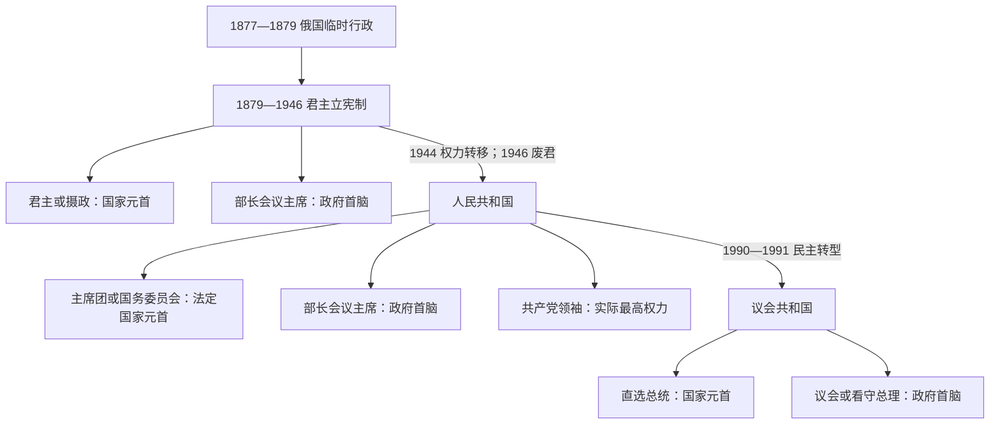

# 保加利亚现代国家元首与政府首脑表

[保加利亚历史](/%E4%BA%BA%E6%96%87%E7%A7%91%E5%AD%A6/%E5%8E%86%E5%8F%B2/%E6%AC%A7%E6%B4%B2/%E4%B8%9C%E5%8D%97%E6%AC%A7%E4%B8%8E%E5%B7%B4%E5%B0%94%E5%B9%B2/%E4%BF%9D%E5%8A%A0%E5%88%A9%E4%BA%9A/README.md)

## 范围与口径

本表自1877—1879年俄国临时行政起，完整列出1879年以来的君主、摄政、法定国家元首、政府首脑和共产党一党时期的实际最高领导。不同角色分表，不能把国民议会主席团主席、国务委员会主席、总统、总理或党第一书记统称为同一种职位。

1879年至1916年改历前的精确日月，沿用保加利亚当时官方历法的常见任期表口径；若与采用公历的外文资料对照，1900年前通常相差12日，1900—1916年相差13日。个别内阁存在“总理本人受命”“完整内阁获批”“看守留任至交接”三个日期，备注中说明而不制造虚假的权力空档。现实状态核验至2026年7月14日。

## 俄国临时行政

| 负责人 | 时间 | 身份与实际作用 |
|---|---|---|
| 弗拉基米尔·切尔卡斯基亲王（Vladimir Cherkassky） | 1876年末—1878年3月3日 | 俄军总司令部“多瑙河外解放地区民政办公室”负责人；战争推进中组织地方行政，1878年去世。 |
| 亚历山大·东杜科夫—科尔萨科夫亲王（Alexander Dondukov-Korsakov） | 1878—1879年 | 俄国皇帝专员，主持七部门行政委员会、制宪与交接；柏林条约把临时制度限定为过渡安排。 |

这里是战争占领与建国过渡行政，不属于保加利亚本国总理世系。

## 1879—1946年君主

| 顺序 | 君主 | 王室 | 在位 | 称号变化 | 继承与终结 |
|---:|---|---|---|---|---|
| 1 | **亚历山大一世** | 巴滕贝格家族 | 1879—1886年 | 保加利亚亲王 | 由制宪会议选举；1886年亲俄政变、反政变后最终退位。 |
| 2 | **斐迪南一世** | 萨克森—科堡—哥达王朝 | 1887—1918年 | 1908年前为亲王，此后称保加利亚沙皇 | 由国民议会选举；第一次世界大战失败后让位长子。 |
| 3 | **鲍里斯三世** | 萨克森—科堡—哥达王朝 | 1918—1943年 | 沙皇 | 斐迪南一世长子；1943年突然去世。 |
| 4 | **西美昂二世** | 萨克森—科堡—哥达王朝 | 1943—1946年 | 沙皇，幼主 | 鲍里斯三世之子；全程由摄政代行王权，1946年公投后流亡。 |

## 摄政与特殊过渡机构

| 时期 | 机构或成员 | 性质与变化 |
|---|---|---|
| 1886年8月13/25日—8月17/29日 | 斯特凡·斯坦博洛夫、佩特科·斯拉维伊科夫、格奥尔基·斯特兰斯基；迪米塔尔·纳乔维奇被列名但未实际到任 | 反政变后的“代治机构”，发生在亚历山大一世正式退位前，不宜与后续摄政团合并。双日期分别反映旧历与公历。 |
| 1886年8月26日/9月7日—1887年8月2日/14日 | 斯坦博洛夫、萨瓦·穆特库罗夫全程；佩特科·卡拉维洛夫任至1886年11月1/13日，后由格奥尔基·日夫科夫接替 | 亚历山大一世退位至斐迪南即位的正式摄政团。 |
| 1943年8月28日—9月11日 | 部长会议集体行使摄政权，博格丹·菲洛夫内阁居主导 | 鲍里斯三世去世至国民议会选出摄政团的临时安排。 |
| 1943年9月11日—1944年9月9日 | 基里尔亲王、博格丹·菲洛夫、尼古拉·米霍夫 | 西美昂二世第一届摄政团；祖国阵线政变后被罢免，随后遭人民法庭处决。 |
| 1944年9月9日—1946年9月15日 | 韦内林·加涅夫、茨维亚特科·博博舍夫斯基、托多尔·帕夫洛夫 | 祖国阵线掌权后的第二届摄政团；实际权力受政府、共产党与苏联盟国管制委员会制约，废君时终止。 |

## 1879—1946年政府首脑

| 顺序 | 政府首脑 | 任期 | 政治阶段与备注 |
|---:|---|---|---|
| 1 | 托多尔·布尔莫夫（Todor Burmov） | 1879-07-05—1879-11-24 | 首任部长会议主席。 |
| 2 | 特尔诺沃都主教克利门特／瓦西尔·德鲁梅夫（Kliment／Vasil Drumev） | 1879-11-24—1880-03-26 | 首次；个别资料终止日作3月24日。 |
| 3 | 德拉甘·赞科夫（Dragan Tsankov） | 1880-03-26—1880-11-28 | 第一次。 |
| 4 | 佩特科·卡拉维洛夫（Petko Karavelov） | 1880-11-28—1881-04-27 | 第一次。 |
| 5 | 约翰·卡齐米尔·埃恩罗特（Johan Casimir Ehrnrooth） | 1881-04-27—1881-07-01 | 俄国将领；随后亲王暂停宪法。 |
| — | 亚历山大一世亲政 | 1881-07-01—1882-06-23 | 暂停宪法期间不设总理，不另虚构政府首脑。 |
| 6 | 列昂尼德·索博列夫（Leonid Sobolev） | 1882-06-23—1883-09-07 | 俄国将领。 |
| 7 | 德拉甘·赞科夫 | 1883-09-07—1884-06-29 | 第二次；宪法恢复。 |
| 8 | 佩特科·卡拉维洛夫 | 1884-06-29—1886-08-09 | 第二次；任内完成联合与塞保战争。 |
| 9 | 都主教克利门特 | 1886-08-09—1886-08-12 | 亲俄政变后的临时政府。 |
| 10 | 佩特科·卡拉维洛夫 | 1886-08-12—1886-08-16 | 第三次；反政变过渡。 |
| 11 | 瓦西尔·拉多斯拉沃夫（Vasil Radoslavov） | 1886-08-16—1887-06-28 | 第一次。 |
| 12 | 康斯坦丁·斯托伊洛夫（Konstantin Stoilov） | 1887-06-28—1887-08-20 | 第一次。 |
| 13 | **斯特凡·斯坦博洛夫（Stefan Stambolov）** | 1887-08-20—1894-05-19 | 由摄政强人转任长期总理，采取独立于俄国的路线。 |
| 14 | 康斯坦丁·斯托伊洛夫 | 1894-05-19—1899-01-18 | 第二次。 |
| 15 | 迪米塔尔·格雷科夫（Dimitar Grekov） | 1899-01-18—1899-10-01 |  |
| 16 | 托多尔·伊万乔夫（Todor Ivanchov） | 1899-10-01—1901-01-12 |  |
| 17 | 拉乔·彼得罗夫（Racho Petrov） | 1901-01-12—1901-02-20 | 第一次。 |
| 18 | 佩特科·卡拉维洛夫 | 1901-02-20—1901-12-21 | 第四次；部分资料终止日作12月22日。 |
| 19 | 斯托扬·达涅夫（Stoyan Danev） | 1901-12-21—1903-05-06 | 第一次。 |
| 20 | 拉乔·彼得罗夫 | 1903-05-06—1906-10-23 | 第二次。 |
| 21 | 迪米塔尔·佩特科夫（Dimitar Petkov） | 1906-10-23—1907-02-26 | 遇刺身亡。 |
| 22 | 迪米塔尔·斯坦乔夫（Dimitar Stanchov） | 1907-02-26/27—1907-03-03 | 代理总理；交接日有一天差异。 |
| 23 | 佩塔尔·古德夫（Petar Gudev） | 1907-03-03—1908-01-16 |  |
| 24 | **亚历山大·马利诺夫（Aleksandar Malinov）** | 1908-01-16—1911-03-16 | 第一次；任内宣布完全独立。 |
| 25 | 伊万·格绍夫（Ivan Evstratiev Geshov） | 1911-03-16—1913-06-01 | 巴尔干同盟与第一次巴尔干战争时期。 |
| 26 | 斯托扬·达涅夫 | 1913-06-01—1913-07-04 | 第二次；第二次巴尔干战争开战后辞职。 |
| 27 | 瓦西尔·拉多斯拉沃夫 | 1913-07-04—1918-06-21 | 第二次；任内参加第一次世界大战。 |
| 28 | 亚历山大·马利诺夫 | 1918-06-21—1918-11-28 | 第二次；停战和斐迪南退位时期。 |
| 29 | 特奥多尔·特奥多罗夫（Teodor Teodorov） | 1918-11-28—1919-10-06 | 战后和约过渡。 |
| 30 | **亚历山大·斯坦博利斯基（Aleksandar Stamboliyski）** | 1919-10-06—1923-06-09 | 农业联盟政府，被军事—右翼政变推翻并杀害。 |
| 31 | 亚历山大·赞科夫（Aleksandar Tsankov） | 1923-06-09—1926-01-04 | 九月起义、圣周日爆炸案与“白色恐怖”时期。 |
| 32 | 安德烈·利亚普切夫（Andrey Lyapchev） | 1926-01-04—1931-06-29 | 逐步缓和政治镇压。 |
| 33 | 亚历山大·马利诺夫 | 1931-06-29—1931-10-12 | 第三次。 |
| 34 | 尼古拉·穆沙诺夫（Nikola Mushanov） | 1931-10-12—1934-05-19 | 被“环节”集团和军事联盟政变推翻。 |
| 35 | 基蒙·格奥尔基耶夫（Kimon Georgiev） | 1934-05-19—1935-01-22 | 第一次；解散政党并实行国家统制。 |
| 36 | 彭乔·兹拉特夫（Pencho Zlatev） | 1935-01-22—1935-04-21 | 军人过渡内阁。 |
| 37 | 安德烈·托舍夫（Andrey Toshev） | 1935-04-21—1935-11-23 | 过渡到鲍里斯三世个人权力；个别二手表误作9月23日结束。 |
| 38 | 格奥尔基·乔塞伊万诺夫（Georgi Kyoseivanov） | 1935-11-23—1940-02-16 | 王室威权阶段。 |
| 39 | 博格丹·菲洛夫（Bogdan Filov） | 1940-02-16—1943-09-09 | 加入三国同盟并实施反犹政策，后任摄政。 |
| 40 | 佩塔尔·加布罗夫斯基（Petar Gabrovski） | 1943-09-09—1943-09-14 | 代理总理。 |
| 41 | 多布里·博日洛夫（Dobri Bozhilov） | 1943-09-14—1944-06-01 | 盟军轰炸和退出战争压力下执政。 |
| 42 | 伊万·巴格里亚诺夫（Ivan Bagryanov） | 1944-06-01—1944-09-02 | 试图退出轴心阵营。 |
| 43 | 康斯坦丁·穆拉维耶夫（Konstantin Muraviev） | 1944-09-02—1944-09-09 | 任期一周；苏联宣战与祖国阵线政变终结内阁。 |
| 44 | **基蒙·格奥尔基耶夫** | 1944-09-09—1946-11-22/23 | 第二次；祖国阵线政府，跨越1946年废君。 |

## 1946—1990年法定国家元首

| 顺序 | 人物或机构 | 任期 | 法定职务 | 实际权力说明 |
|---:|---|---|---|---|
| 1 | 瓦西尔·科拉罗夫（Vasil Kolarov） | 1946-09-15—1947-12-09 | 临时共和国主席团主席 | 共产党高级领导，但日常党政核心逐渐转向季米特洛夫。 |
| 2 | 明乔·内伊切夫（Mincho Neychev） | 1947-12-09—1950-05-27 | 国民议会主席团主席 | 礼仪与集体国家元首代表职能。 |
| 3 | 格奥尔基·达米扬诺夫（Georgi Damyanov） | 1950-05-27—1958-11-27 | 国民议会主席团主席 | 实际最高权力先后在契尔文科夫、日夫科夫的党领导。 |
| 4 | 格奥尔基·库利舍夫、尼古拉·格奥尔基耶夫 | 1958-11-27—1958-11-30 | 主席团副主席集体代理 | 三日过渡。 |
| 5 | 迪米塔尔·加涅夫（Dimitar Ganev） | 1958-11-30—1964-04-20 | 国民议会主席团主席 |  |
| 6 | 库利舍夫、尼古拉·格奥尔基耶夫 | 1964-04-20—1964-04-23 | 主席团副主席集体代理 | 三日过渡。 |
| 7 | 格奥尔基·特拉伊科夫（Georgi Traykov） | 1964-04-23—1971-07-07 | 国民议会主席团主席 | 农业联盟领导人，在共产党主导体制中任礼仪国家元首。 |
| 8 | **托多尔·日夫科夫（Todor Zhivkov）** | 1971-07-07—1989-11-17 | 国务委员会主席 | 同时为党最高领导，法定与实际权力集中。 |
| 9 | 佩塔尔·姆拉德诺夫（Petar Mladenov） | 1989-11-17—1990-04-03 | 国务委员会主席 | 日夫科夫下台后的党国转型领导。 |
| 10 | 佩塔尔·姆拉德诺夫 | 1990-04-03—1990-07-06 | 共和国总统 | 总统职位建立后的首任；争议录像和抗议后辞职。 |
| 11 | 斯坦科·托多罗夫（Stanko Todorov） | 1990-07-06—1990-07-17 | 国民议会议长代行国家元首 | 宪制过渡。 |
| 12 | 尼古拉·托多罗夫（Nikolai Todorov） | 1990-07-17—1990-08-01 | 国民议会议长代行国家元首 | 宪制过渡，至热列夫当选。 |

## 1944—1990年政府首脑

| 顺序 | 政府首脑 | 正式政府任期 | 说明 |
|---:|---|---|---|
| 1 | 基蒙·格奥尔基耶夫 | 1944-09-09—1946-11-22/23 | 祖国阵线政府，跨越君主制与共和国。 |
| 2 | **格奥尔基·季米特洛夫（Georgi Dimitrov）** | 1946-11-22/23—1949-07-02 | 11月22日为部分档案口径，23日为完整内阁口径。 |
| 3 | 瓦西尔·科拉罗夫 | 1949-07-02—1950-01-23 | 7月2日起代行，7月20日正式组成政府。 |
| 4 | **维尔科·契尔文科夫（Valko Chervenkov）** | 1950-01-23—1956-04-18 | 1月23日起代行，2月3日正式就任；斯大林化高峰。 |
| 5 | 安东·于戈夫（Anton Yugov） | 1956-04-18—1962-11-27 | 通行个人任期表有11月19日结束口径。 |
| 6 | 托多尔·日夫科夫 | 1962-11-27—1971-07-09 | 后转任国务委员会主席；部分表以11月19日、7月7日为个人获选日期。 |
| 7 | 斯坦科·托多罗夫 | 1971-07-09—1981-06-18 | 部分表按个人获选日作7月7日—6月16日。 |
| 8 | 格里沙·菲利波夫（Grisha Filipov） | 1981-06-18—1986-03-24 | 部分表作6月16日—3月21日。 |
| 9 | 格奥尔基·阿塔纳索夫（Georgi Atanasov） | 1986-03-24—1990-02-08 | 部分表按总理选举日作2月3日结束。 |
| 10 | 安德烈·卢卡诺夫（Andrey Lukanov） | 1990-02-08—1990-12-20 | 两届内阁，跨越人民共和国改名；个人辞职和继任总理获选发生在正式内阁交接前。 |

## 共产党时期实际最高领导

| 时期 | 实际权力中心 | 党内或国家身份 | 权力性质与备注 |
|---|---|---|---|
| 1944年9月—1945年11月 | 祖国阵线政府、共产党机关与苏联盟国管制委员会 | 基蒙·格奥尔基耶夫为公开总理；特拉伊乔·科斯托夫1945年2月起任党第一书记 | 尚不是单一个人完全统治，苏联影响和共产党控制强制机关最关键。 |
| 1945年11月—1949年7月 | **格奥尔基·季米特洛夫** | 共产党最高领导，1946年起任总理，1948年底正式任总书记 | 清除反对派、建立人民共和国和计划经济。 |
| 1949年7月—1954年3月 | **维尔科·契尔文科夫** | 1950—1954年任总书记，1950—1956年任总理 | 党政集中、清洗和个人崇拜的斯大林化阶段。 |
| 1954年3月—1956年4月 | 契尔文科夫与日夫科夫权力过渡 | 日夫科夫1954年3月4日任第一书记，契尔文科夫仍任总理 | 不能把这两年简单写为日夫科夫已单独掌权。 |
| 1956年4月—1989年11月10日 | **托多尔·日夫科夫** | 第一书记或总书记；曾任总理和国务委员会主席 | 去斯大林化后排除契尔文科夫，成为无争议最高领导。 |
| 1989年11月10日—1990年1月30日 | 佩塔尔·姆拉德诺夫 | 党总书记兼国家元首 | 推动撤销日夫科夫路线；共产党放弃宪法领导地位后，不再续列“党国最高统治者”。 |

## 1990年至今的总统与代行国家元首

| 顺序 | 人物 | 任期 | 产生与终止方式 | 关键说明 |
|---:|---|---|---|---|
| 1 | 佩塔尔·姆拉德诺夫 | 1990-04-03—1990-07-06 | 原国务委员会主席转任，由大国民议会制度确认；辞职 | 共和国首任总统。 |
| 2 | 斯坦科·托多罗夫 | 1990-07-06—1990-07-17 | 国民议会议长依法代行 | 不计为民选总统。 |
| 3 | 尼古拉·托多罗夫 | 1990-07-17—1990-08-01 | 新任国民议会议长依法代行 | 不计为民选总统。 |
| 4 | **热柳·热列夫（Zhelyu Zhelev）** | 1990-08-01—1997-01-22 | 先由大国民议会选出，1992年直接民选 | 民主转型代表人物。 |
| 5 | 佩塔尔·斯托亚诺夫（Petar Stoyanov） | 1997-01-22—2002-01-22 | 直接民选 | 1997年危机中支持提前选举和改革。 |
| 6 | 格奥尔基·珀尔瓦诺夫（Georgi Parvanov） | 2002-01-22—2012-01-22 | 直接民选，两届 | 任内加入北约和欧盟。 |
| 7 | 罗森·普列夫内利耶夫（Rosen Plevneliev） | 2012-01-22—2017-01-22 | 直接民选 | 任内多次任命看守政府。 |
| 8 | **鲁门·拉德夫（Rumen Radev）** | 2017-01-22—2026-01-23 | 直接民选，两届；第二届中辞职并经宪法程序终止职务 | 2026年5月转任议会选举产生的总理。 |
| 9 | **伊利亚娜·约托娃（Iliana Iotova）** | 2026-01-23—至今 | 原副总统依宪法直接继任 | 拥有完整总统职权，不是“代总统”；本文截止2026-07-14仍在任。 |

## 1990年至今的政府首脑

| 顺序 | 政府首脑 | 任期 | 性质与关键说明 |
|---:|---|---|---|
| 1 | 安德烈·卢卡诺夫 | 1990-02-03/08—1990-12-07/20 | 两届政府；2月3日为本人获选、8日为正式内阁口径；12月7日继任总理获选，20日完整内阁交接。 |
| 2 | 迪米塔尔·波波夫（Dimitar Popov） | 1990-12-07—1991-11-08 | 跨党派专家政府；12月20日完整内阁获批。 |
| 3 | 菲利普·迪米特洛夫（Philip Dimitrov） | 1991-11-08—1992-12-30 | 民主力量联盟政府。 |
| 4 | 柳本·贝罗夫（Lyuben Berov） | 1992-12-30—1994-10-17 | 专家政府，依赖不稳定议会支持。 |
| 5 | 雷内塔·因焦娃（Reneta Indzhova） | 1994-10-17—1995-01-25 | 看守总理；首位女性总理。 |
| 6 | 然·维德诺夫（Zhan Videnov） | 1995-01-25—1997-02-12/13 | 社会党政府；银行和恶性通胀危机中下台。 |
| 7 | 斯特凡·索菲扬斯基（Stefan Sofiyanski） | 1997-02-12/13—1997-05-21 | 看守总理，稳定供给并准备选举。 |
| 8 | **伊万·科斯托夫（Ivan Kostov）** | 1997-05-21—2001-07-24 | 建立货币局、推进私有化与欧盟改革。 |
| 9 | **西美昂·萨克森—科堡—哥达（Simeon Sakskoburggotski）** | 2001-07-24—2005-08-17 | 前国王西美昂二世以民选总理身份执政，不是君主复辟。 |
| 10 | 谢尔盖·斯塔尼舍夫（Sergey Stanishev） | 2005-08-17—2009-07-27 | 三党联盟；任内加入欧盟。 |
| 11 | **博伊科·鲍里索夫（Boyko Borisov）**，第一次 | 2009-07-27—2013-03-13 | 抗议后辞职。 |
| 12 | 马林·拉伊科夫（Marin Raykov） | 2013-03-13—2013-05-29 | 看守总理。 |
| 13 | 普拉门·奥雷沙尔斯基（Plamen Oresharski） | 2013-05-29—2014-08-06 | 专家内阁，任命争议引发长期抗议。 |
| 14 | 格奥尔基·布利兹纳什基（Georgi Bliznashki） | 2014-08-06—2014-11-07 | 看守总理。 |
| 15 | **博伊科·鲍里索夫**，第二次 | 2014-11-07—2017-01-27 | 联合政府。 |
| 16 | 奥格尼扬·格尔吉科夫（Ognyan Gerdzhikov） | 2017-01-27—2017-05-04 | 看守总理。 |
| 17 | **博伊科·鲍里索夫**，第三次 | 2017-05-04—2021-05-12 | 2020年反腐抗议后完成任期。 |
| 18 | 斯特凡·亚涅夫（Stefan Yanev），第一次 | 2021-05-12—2021-09-16 | 看守总理。 |
| 19 | 斯特凡·亚涅夫，第二次 | 2021-09-16—2021-12-13 | 第二届看守内阁，重新列一任以反映总统任命。 |
| 20 | 基里尔·佩特科夫（Kiril Petkov） | 2021-12-13—2022-08-02 | 联盟政府，在不信任案后交权。 |
| 21 | 格勒布·多涅夫（Galab Donev），第一次 | 2022-08-02—2023-02-03 | 看守总理。 |
| 22 | 格勒布·多涅夫，第二次 | 2023-02-03—2023-06-06 | 第二届看守内阁。 |
| 23 | 尼古拉·登科夫（Nikolai Denkov） | 2023-06-06—2024-04-09 | 公民党—改革联盟轮换协议首阶段；交班谈判失败。 |
| 24 | 迪米塔尔·格拉夫切夫（Dimitar Glavchev），第一次 | 2024-04-09—2024-08-27 | 看守总理。 |
| 25 | 迪米塔尔·格拉夫切夫，第二次 | 2024-08-27—2025-01-16 | 第二届看守内阁。 |
| 26 | 罗森·热利亚兹科夫（Rosen Zhelyazkov） | 2025-01-16—2026-02-19 | 议会政府；2025年12月辞职后依宪法继续履职，至继任政府接管。 |
| 27 | 安德烈·久罗夫（Andrey Gyurov） | 2026-02-19—2026-05-08 | 约托娃总统任命的看守总理。 |
| 28 | **鲁门·拉德夫** | 2026-05-08—至今 | 国民议会以124票赞成、70票反对、36票弃权选出；本文截止2026-07-14仍在任。 |

## 角色连续性与争议说明

- 1879—1946年总理的频繁更替不能等同于每次国家元首变化；君主和摄政另有连续序列。
- 1881—1882年暂停宪法期间，亚历山大一世直接主持行政，没有总理，表中保留空档而不把其他部长倒称总理。
- 1944年9月祖国阵线已改变实际权力，君主制法定外壳仍延续到1946年9月。
- 一党时期必须同时看三张表：法定国家元首代表国家，部长会议主席负责行政，党第一书记或总书记通常掌握最终人事和政策权。
- 1954—1956年是契尔文科夫向日夫科夫过渡，不应把日夫科夫任第一书记的第一天机械视为已完全控制党国。
- 1990年4月以前不存在“保加利亚总统”；主席团主席和国务委员会主席不能倒称总统。
- 看守总理是宪法规定的过渡政府首脑，不等于代总统，也不属于普通议会多数政府。
- 约托娃在拉德夫辞职后由副总统直接继任总统，任职性质是总统而非代行。
- 2026年拉德夫由国家元首转任政府首脑，两个任期不连续且角色完全不同。

## 相关阶段

- [保加利亚公国与王国](/%E4%BA%BA%E6%96%87%E7%A7%91%E5%AD%A6/%E5%8E%86%E5%8F%B2/%E6%AC%A7%E6%B4%B2/%E4%B8%9C%E5%8D%97%E6%AC%A7%E4%B8%8E%E5%B7%B4%E5%B0%94%E5%B9%B2/%E4%BF%9D%E5%8A%A0%E5%88%A9%E4%BA%9A/%E4%BF%9D%E5%8A%A0%E5%88%A9%E4%BA%9A%E5%85%AC%E5%9B%BD%E4%B8%8E%E7%8E%8B%E5%9B%BD.md)
- [保加利亚人民共和国](/%E4%BA%BA%E6%96%87%E7%A7%91%E5%AD%A6/%E5%8E%86%E5%8F%B2/%E6%AC%A7%E6%B4%B2/%E4%B8%9C%E5%8D%97%E6%AC%A7%E4%B8%8E%E5%B7%B4%E5%B0%94%E5%B9%B2/%E4%BF%9D%E5%8A%A0%E5%88%A9%E4%BA%9A/%E4%BF%9D%E5%8A%A0%E5%88%A9%E4%BA%9A%E4%BA%BA%E6%B0%91%E5%85%B1%E5%92%8C%E5%9B%BD.md)
- [保加利亚共和国](/%E4%BA%BA%E6%96%87%E7%A7%91%E5%AD%A6/%E5%8E%86%E5%8F%B2/%E6%AC%A7%E6%B4%B2/%E4%B8%9C%E5%8D%97%E6%AC%A7%E4%B8%8E%E5%B7%B4%E5%B0%94%E5%B9%B2/%E4%BF%9D%E5%8A%A0%E5%88%A9%E4%BA%9A/%E4%BF%9D%E5%8A%A0%E5%88%A9%E4%BA%9A%E5%85%B1%E5%92%8C%E5%9B%BD.md)
