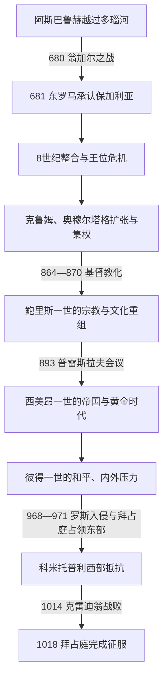

# 保加利亚第一帝国

[保加利亚历史](/%E4%BA%BA%E6%96%87%E7%A7%91%E5%AD%A6/%E5%8E%86%E5%8F%B2/%E6%AC%A7%E6%B4%B2/%E4%B8%9C%E5%8D%97%E6%AC%A7%E4%B8%8E%E5%B7%B4%E5%B0%94%E5%B9%B2/%E4%BF%9D%E5%8A%A0%E5%88%A9%E4%BA%9A/README.md)

## 时间

681年—1018年。680年的翁加尔之战是建国前提；971年以后东部核心区被拜占庭占领，西部政权继续抵抗至1018年。

## 概括

保加利亚第一帝国由阿斯巴鲁赫率领的保加尔政治—军事集团在多瑙河下游建立，并与当地斯拉夫部落及原有巴尔干人口逐渐整合。它的强盛不只来自骑兵与边疆扩张，也来自对多族群的组织、都城和行政建设、基督教化，以及斯拉夫语文字文化的制度化。西美昂一世时期国家达到军事与文化高峰；10世纪后期，连续入侵、区域分割和拜占庭长期战争使国家由东向西收缩，最终于1018年灭亡。

## 建立背景与崛起机制

- **草原政治遗产**：7世纪中叶“旧大保加利亚”解体后，阿斯巴鲁赫集团向多瑙河三角洲迁移，以机动军力、氏族贵族和防御营地组织为核心。
- **地理与联盟条件**：多瑙河、巴尔干山脉和黑海构成可守可攻的空间；新政权通过控制交通节点、征收贡赋并与斯拉夫部落结盟，弥补保加尔人口较少的局限。
- **拜占庭承认**：680年阿斯巴鲁赫在翁加尔击败君士坦丁四世军队，次年和约迫使东罗马纳贡并承认新政治实体。681年因而成为传统建国年。
- **吸收与重组**：保加尔统治集团、斯拉夫人口和既有罗马—色雷斯传统并非瞬间“融合”，而是在军役、税赋、婚姻、语言和宗教制度中经历数代整合。
- **外部权力真空**：阿瓦汗国在8—9世纪衰落，拜占庭又需应对阿拉伯战争，使保加利亚得以向西北和西南扩张。

## 分阶段发展

### 建国与8世纪的制度磨合

特尔维尔援助被废的拜占庭皇帝查士丁尼二世复位，获得“凯撒”称号和扎戈拉地区；717—718年君士坦丁堡遭阿拉伯军围攻时，保加利亚军队参与打击围城者。此后拜占庭皇帝君士坦丁五世多次北伐，杜洛氏族终结后的贵族集团又频繁废立君主，753—768年前后形成明显王位危机。特列里格通过反间手段清除拜占庭在宫廷中的情报网络，卡尔达姆则恢复军事稳定。

### 克鲁姆与奥穆尔塔格的强国建设

克鲁姆利用阿瓦汗国瓦解，扩展到多瑙河中游，809年夺取塞尔迪卡。811年拜占庭皇帝尼基弗鲁斯一世攻陷普利斯卡后撤退，在瓦尔比察山口遭歼，皇帝战死；813年保加利亚军抵近君士坦丁堡。克鲁姆死后，奥穆尔塔格于815年前后与拜占庭缔结约三十年和平，以都城建筑、边界铭文、官僚和军事辖区强化中央权威，同时镇压部分斯拉夫部落离心和基督徒社群。9世纪中叶普列西安一世时期，势力深入马其顿。

### 鲍里斯一世的基督教化与文化转型

鲍里斯一世在864—865年前后受洗，取教名米哈伊尔。选择基督教既是信仰转变，也是削弱氏族贵族、统一多族群并进入欧洲外交秩序的国家工程。部分贵族反叛被镇压后，他在罗马与君士坦丁堡之间谈判，870年取得由君士坦丁堡体系承认、具有较大自治权的保加利亚总主教区。

886年，西里尔和麦托迪的门徒克莱门特、瑙姆等被接纳，在普雷斯拉夫和奥赫里德建立教育与翻译中心。格拉哥里字母传统在此延续，西里尔字母则在保加利亚文化环境中形成并推广。893年普雷斯拉夫会议废黜试图恢复旧宗教和亲德政策的弗拉基米尔—拉萨特，推举西美昂，迁都普雷斯拉夫，并确立斯拉夫语在礼仪与国家文化中的地位。

### 西美昂一世的高峰

西美昂一世先因贸易市场迁移问题与拜占庭交战，在896年取得有利和约；913年以后又围绕皇位、摄政和巴尔干霸权持续战争。917年阿赫洛伊战役重创拜占庭主力，保加利亚影响扩至塞尔维亚、马其顿、阿尔巴尼亚与希腊北部。西美昂采用沙皇称号并谋求与拜占庭皇帝平等，但始终未能夺取君士坦丁堡。

政治扩张与普雷斯拉夫、奥赫里德的翻译、神学、编年和建筑活动共同构成所谓“黄金时代”。这种繁荣依赖强大宫廷、战争动员和教会文化网络，也给财政与边疆控制带来高成本。

### 彼得一世的和平与结构压力

927年，彼得一世与拜占庭缔结长期和平，皇帝承认其沙皇称号和保加利亚教会的宗主教地位，并通过皇室婚姻确认秩序。长期和平使经济文化得以恢复，但马扎尔人越境、塞尔维亚脱离、贵族和地方势力增强。博戈米勒派在此期传播，反映社会、教会与国家权力之间的紧张，却不能被单独解释为国家衰亡原因。

## 统治结构

| 层面 | 机制 | 历史变化 |
|---|---|---|
| 君主 | 早期常称汗或坎纳苏比吉，基督教化后称大公，10世纪采用沙皇称号 | 从氏族联盟首领转为基督教君主和帝国竞争者。 |
| 贵族与军政 | 保加尔氏族贵族、宫廷官员、地方军事长官和斯拉夫首领共同参与 | 8世纪废立频繁；9世纪中央集权加强；末期西部地方将领重新重要。 |
| 地方治理 | 核心区、边疆军区和纳贡部落并存，逐步形成更统一的行政体系 | 克鲁姆—奥穆尔塔格时期强化官僚和边界控制。 |
| 教会 | 870年后自治总主教区，927年后宗主教地位获承认 | 教区、学校和礼仪语言成为整合人口与合法化王权的工具。 |
| 都城 | 普利斯卡；893年后普雷斯拉夫；末期政治中心转向斯科普里、奥赫里德等 | 都城迁移反映宗教文化转型和东部失守后的战略西移。 |

## 重要事件

| 时间 | 事件 | 过程与结果 |
|---|---|---|
| 680—681年 | 翁加尔之战与和约 | 阿斯巴鲁赫击败东罗马远征军，取得多瑙河以南立足点和国际承认。 |
| 705年 | 特尔维尔助查士丁尼二世复位 | 以军援换取头衔、土地与外交地位，显示保加利亚已能介入帝国政治。 |
| 717—718年 | 君士坦丁堡围城战 | 保加利亚从陆上攻击阿拉伯军，参与解除围城；具体战果数字在史料中有夸张。 |
| 811年 | 普利斯卡战役 | 尼基弗鲁斯一世焚毁都城后在撤退途中被克鲁姆歼灭，拜占庭皇帝战死。 |
| 815年前后 | 三十年和平 | 奥穆尔塔格稳定南部边界，把资源转向行政、建筑和北西边疆。 |
| 864—870年 | 受洗与教会建制 | 鲍里斯一世镇压贵族反叛，并借罗马—君士坦丁堡竞争争取教会自治。 |
| 886—893年 | 文学中心与普雷斯拉夫会议 | 接纳传教士门徒，确立斯拉夫语礼仪和新的国家文化秩序。 |
| 917年 | 阿赫洛伊战役 | 西美昂击败拜占庭主力，保加利亚霸权与帝国主张达到顶点。 |
| 927年 | 保拜和约 | 沙皇称号、教会地位和皇室婚姻获承认，战争转入长期和平。 |
| 968—971年 | 罗斯入侵与普雷斯拉夫失陷 | 拜占庭先引入基辅罗斯攻击保加利亚，随后击败罗斯并占领东部，掳走鲍里斯二世。 |
| 986年 | 图拉真关战役 | 萨穆伊尔集团击败巴西尔二世，西部保加利亚获得反攻空间。 |
| 1014年 | 克雷迪翁战役 | 巴西尔二世突破防线并俘获大批士兵；萨穆伊尔不久去世，继承危机加深。 |
| 1018年 | 最后堡垒归顺 | 伊凡·弗拉迪斯拉夫阵亡后，贵族和城堡陆续向拜占庭投降，独立王权终结。 |

## 鼎盛条件

- 克鲁姆以来的中央建设提高了军役、税赋和边疆动员能力。
- 基督教化缓和保加尔—斯拉夫政治身份差异，并给君主提供跨地区的教会网络。
- 拜占庭内乱、阿拉伯压力及阿瓦瓦解为扩张创造窗口。
- 西美昂受过君士坦丁堡教育，能同时运用拜占庭外交、帝国象征和战争资源。
- 斯拉夫语礼仪和本土教育减少对希腊语教士的依赖，使文化影响超出疆界。

## 衰落与灭亡

### 结构因素

- 西美昂时期的长期战争消耗人口、财政与边疆控制；其大范围势力并非都能稳定行政化。
- 中央与贵族、东部核心区与西部军事区之间存在张力，王位继承和地方自主在危机中加剧。
- 对马扎尔、佩切涅格等北方力量和多条边界同时防御，超出国家持续动员能力。

### 外部压力

- 拜占庭在10世纪后期恢复财政和军力，并能综合运用外交、婚姻、收编贵族和围城战。
- 968—971年基辅罗斯与拜占庭的连续进攻摧毁东部都城和王权象征，把国家切割为拜占庭控制区与西部抵抗区。
- 巴西尔二世在结束本国内战后，以多年逐堡推进切断萨穆伊尔的机动空间。

### 直接触发过程

971年普雷斯拉夫陷落并未立刻灭亡整个国家。科米托普利兄弟在西部组织抵抗，罗曼名义上承继王位，萨穆伊尔掌握军事权并在997年称帝。1014年克雷迪翁战败、萨穆伊尔死亡后，加夫里尔·拉多米尔和伊凡·弗拉迪斯拉夫相继在宫廷政变与战争中覆亡。1018年伊凡·弗拉迪斯拉夫围攻都拉齐翁时战死，各地贵族选择投降；拜占庭承认部分贵族身份并保留奥赫里德教会框架，降低了继续抵抗的收益。

因此，灭亡不是“某一位君主无能”或单一宗教矛盾造成，而是东部国家中心先被摧毁、继承斗争、长期资源差距与拜占庭系统性征服叠加的结果。

## 王朝世系

完整顺序、早期年代争议、科米托普利共同领导和末期继承见[保加利亚中世纪统治者世系表](/%E4%BA%BA%E6%96%87%E7%A7%91%E5%AD%A6/%E5%8E%86%E5%8F%B2/%E6%AC%A7%E6%B4%B2/%E4%B8%9C%E5%8D%97%E6%AC%A7%E4%B8%8E%E5%B7%B4%E5%B0%94%E5%B9%B2/%E4%BF%9D%E5%8A%A0%E5%88%A9%E4%BA%9A/%E4%BF%9D%E5%8A%A0%E5%88%A9%E4%BA%9A%E4%B8%AD%E4%B8%96%E7%BA%AA%E7%BB%9F%E6%B2%BB%E8%80%85%E4%B8%96%E7%B3%BB%E8%A1%A8.md)。早期8世纪史料稀少，多位君主的准确年份、氏族和亲属关系只能标为“约”或“存在争议”。

## 演变关系

- 前置背景：旧大保加利亚解体、保加尔集团迁徙与巴尔干斯拉夫社会形成。
- 后一节点：[拜占庭统治与保加利亚复国运动](/%E4%BA%BA%E6%96%87%E7%A7%91%E5%AD%A6/%E5%8E%86%E5%8F%B2/%E6%AC%A7%E6%B4%B2/%E4%B8%9C%E5%8D%97%E6%AC%A7%E4%B8%8E%E5%B7%B4%E5%B0%94%E5%B9%B2/%E4%BF%9D%E5%8A%A0%E5%88%A9%E4%BA%9A/%E6%8B%9C%E5%8D%A0%E5%BA%AD%E7%BB%9F%E6%B2%BB%E4%B8%8E%E4%BF%9D%E5%8A%A0%E5%88%A9%E4%BA%9A%E5%A4%8D%E5%9B%BD%E8%BF%90%E5%8A%A8.md)。
- 第一帝国的教会和文化遗产成为1185年复国合法性的重要资源，但两个帝国之间不存在连续在位的独立王权。
